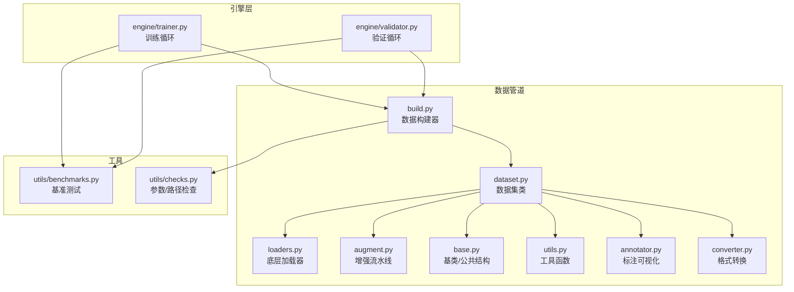
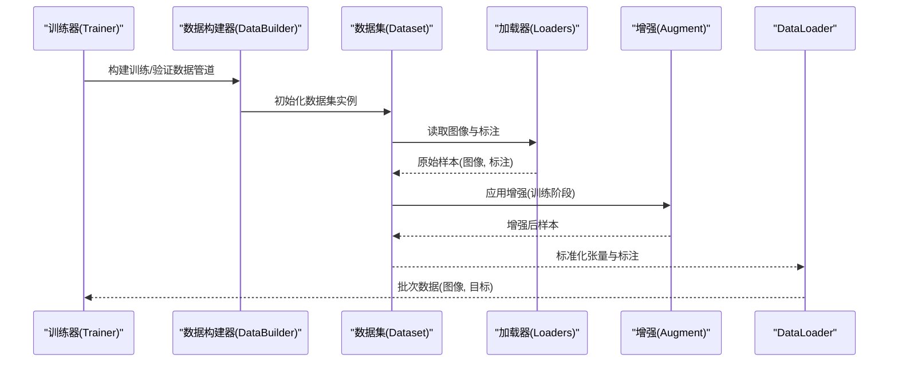
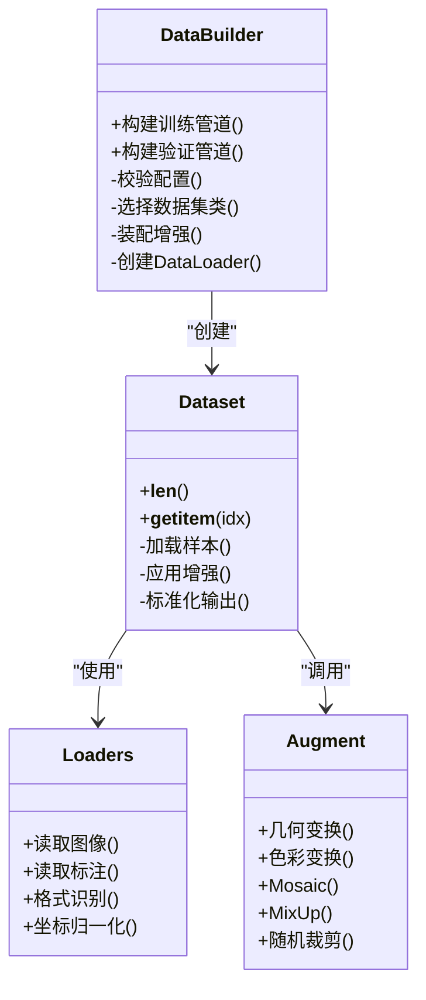
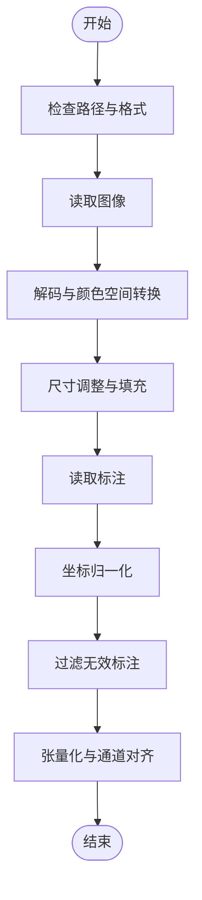
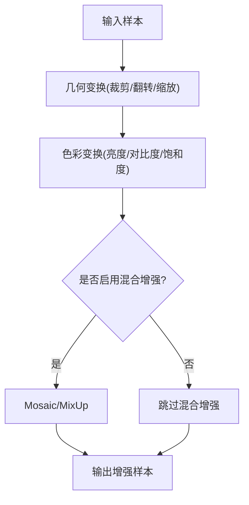
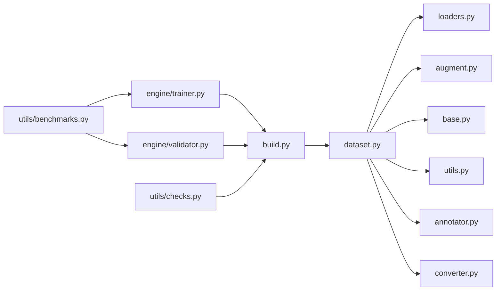

# 数据管道系统

<cite>
**本文引用的文件**
- [ultralytics/data/build.py](file://ultralytics/data/build.py)
- [ultralytics/data/dataset.py](file://ultralytics/data/dataset.py)
- [ultralytics/data/loaders.py](file://ultralytics/data/loaders.py)
- [ultralytics/data/augment.py](file://ultralytics/data/augment.py)
- [ultralytics/data/base.py](file://ultralytics/data/base.py)
- [ultralytics/data/utils.py](file://ultralytics/data/utils.py)
- [ultralytics/data/annotator.py](file://ultralytics/data/annotator.py)
- [ultralytics/data/converter.py](file://ultralytics/data/converter.py)
- [ultralytics/engine/trainer.py](file://ultralytics/engine/trainer.py)
- [ultralytics/engine/validator.py](file://ultralytics/engine/validator.py)
- [ultralytics/utils/benchmarks.py](file://ultralytics/utils/benchmarks.py)
- [ultralytics/utils/checks.py](file://ultralytics/utils/checks.py)
</cite>

## 目录
1. [简介](#简介)
2. [项目结构](#项目结构)
3. [核心组件](#核心组件)
4. [架构总览](#架构总览)
5. [详细组件分析](#详细组件分析)
6. [依赖关系分析](#依赖关系分析)
7. [性能考虑](#性能考虑)
8. [故障排查指南](#故障排查指南)
9. [结论](#结论)
10. [附录](#附录)

## 简介
本文件面向YOLO-Master的数据管道系统，聚焦于训练与验证阶段的数据加载、预处理与增强流程。文档覆盖以下主题：
- 数据集格式支持（COCO、YOLO、VOC等）的解析与统一抽象
- 数据增强技术（Mosaic、MixUp、随机裁剪等）的实现原理与组合策略
- 数据构建器（DataBuilder）的设计模式：数据校验、缓存机制与内存管理
- 批处理策略与数据并行优化（多进程、预取、锁步/非锁步）
- 自定义数据加载器的开发指南（接口规范与最佳实践）
- 数据管道性能调优方法与工具
- 常见问题诊断与解决方案

## 项目结构
数据管道相关代码集中在 ultralytics/data 子包中，并与引擎层（trainer/validator）紧密协作。关键模块职责如下：
- build.py：数据构建器入口，负责配置解析、数据集注册、构建与返回 DataLoader
- dataset.py：数据集类实现，封装图像与标注读取、索引、切片、迭代逻辑
- loaders.py：底层图像与标注加载器，提供多种格式的统一读取能力
- augment.py：数据增强算子与流水线编排（含Mosaic、MixUp、几何变换、色彩变换等）
- base.py：通用基类与共享数据结构定义
- utils.py：辅助函数（路径解析、IO、尺寸归一化、边界框操作等）
- annotator.py：标注可视化与调试工具
- converter.py：格式转换工具（如COCO/YOLO/VOC互转）
- engine/trainer.py 与 engine/validator.py：训练/验证循环中调用数据构建器并消费批次数据
- utils/benchmarks.py：数据管道基准测试工具
- utils/checks.py：输入参数与路径合法性检查

图表来源
- [ultralytics/data/build.py](file://ultralytics/data/build.py)
- [ultralytics/data/dataset.py](file://ultralytics/data/dataset.py)
- [ultralytics/data/loaders.py](file://ultralytics/data/loaders.py)
- [ultralytics/data/augment.py](file://ultralytics/data/augment.py)
- [ultralytics/data/base.py](file://ultralytics/data/base.py)
- [ultralytics/data/utils.py](file://ultralytics/data/utils.py)
- [ultralytics/data/annotator.py](file://ultralytics/data/annotator.py)
- [ultralytics/data/converter.py](file://ultralytics/data/converter.py)
- [ultralytics/engine/trainer.py](file://ultralytics/engine/trainer.py)
- [ultralytics/engine/validator.py](file://ultralytics/engine/validator.py)
- [ultralytics/utils/benchmarks.py](file://ultralytics/utils/benchmarks.py)
- [ultralytics/utils/checks.py](file://ultralytics/utils/checks.py)

章节来源
- [ultralytics/data/build.py](file://ultralytics/data/build.py)
- [ultralytics/data/dataset.py](file://ultralytics/data/dataset.py)
- [ultralytics/data/loaders.py](file://ultralytics/data/loaders.py)
- [ultralytics/data/augment.py](file://ultralytics/data/augment.py)
- [ultralytics/data/base.py](file://ultralytics/data/base.py)
- [ultralytics/data/utils.py](file://ultralytics/data/utils.py)
- [ultralytics/data/annotator.py](file://ultralytics/data/annotator.py)
- [ultralytics/data/converter.py](file://ultralytics/data/converter.py)
- [ultralytics/engine/trainer.py](file://ultralytics/engine/trainer.py)
- [ultralytics/engine/validator.py](file://ultralytics/engine/validator.py)
- [ultralytics/utils/benchmarks.py](file://ultralytics/utils/benchmarks.py)
- [ultralytics/utils/checks.py](file://ultralytics/utils/checks.py)

## 核心组件
- 数据构建器（DataBuilder）
  - 职责：解析任务类型与数据集配置，选择对应数据集类，组装增强流水线，创建 DataLoader，并注入必要的校验与缓存策略。
  - 关键点：
    - 配置驱动：根据任务（检测/分割/姿态等）与数据集路径自动推断格式
    - 增强装配：按训练/验证阶段分别装配增强策略
    - 批处理与并行：控制 workers、prefetch_factor、pin_memory 等
    - 校验与容错：在构建前进行路径与标签一致性检查
- 数据集类（Dataset）
  - 职责：维护样本索引、实现 __getitem__ 与 __len__，协调加载器与增强器，输出标准化张量与标注
  - 关键点：
    - 统一数据契约：图像、边界框、类别、掩码等字段规范化
    - 懒加载与缓存：按需读取图像，可选缓存元数据或增强结果
    - 切片与采样：支持按比例划分、重采样、过滤无效样本
- 底层加载器（Loaders）
  - 职责：从磁盘/网络读取图像与标注，支持多种格式（COCO JSON、YOLO txt、VOC XML等）
  - 关键点：
    - 格式识别：基于扩展名与内容特征判断格式
    - 坐标归一化：将像素坐标转换为相对坐标
    - 异常恢复：缺失文件、损坏标注时的降级策略
- 增强流水线（Augment）
  - 职责：组合几何与色彩增强、高级混合增强（Mosaic/MixUp）、随机裁剪/翻转/缩放等
  - 关键点：
    - 可插拔算子：每个增强为独立单元，支持概率与强度参数
    - 顺序敏感：不同顺序对最终分布影响显著
    - 任务适配：检测/分割/姿态任务的增强需保持标注一致性
- 工具与校验（Utils/Checks）
  - 职责：路径解析、IO优化、尺寸与边界框操作、参数校验
  - 关键点：
    - 批量I/O：使用高效读取与预取
    - 数值稳定：避免除零、越界、NaN传播

章节来源
- [ultralytics/data/build.py](file://ultralytics/data/build.py)
- [ultralytics/data/dataset.py](file://ultralytics/data/dataset.py)
- [ultralytics/data/loaders.py](file://ultralytics/data/loaders.py)
- [ultralytics/data/augment.py](file://ultralytics/data/augment.py)
- [ultralytics/data/base.py](file://ultralytics/data/base.py)
- [ultralytics/data/utils.py](file://ultralytics/data/utils.py)
- [ultralytics/data/annotator.py](file://ultralytics/data/annotator.py)
- [ultralytics/data/converter.py](file://ultralytics/data/converter.py)
- [ultralytics/utils/checks.py](file://ultralytics/utils/checks.py)

## 架构总览
下图展示训练/验证过程中数据管道的端到端调用链与数据流向。

图表来源
- [ultralytics/engine/trainer.py](file://ultralytics/engine/trainer.py)
- [ultralytics/data/build.py](file://ultralytics/data/build.py)
- [ultralytics/data/dataset.py](file://ultralytics/data/dataset.py)
- [ultralytics/data/loaders.py](file://ultralytics/data/loaders.py)
- [ultralytics/data/augment.py](file://ultralytics/data/augment.py)

## 详细组件分析

### 数据构建器（DataBuilder）设计模式
- 设计要点
  - 工厂模式：根据任务类型与配置返回对应的数据集与 DataLoader
  - 模板方法：统一的构建流程（校验→解析→装配→返回），子类可覆盖特定步骤
  - 策略模式：增强策略与批处理策略可替换
- 关键流程
  - 参数校验：路径存在性、格式一致性、类别映射完整性
  - 数据集选择：依据任务与数据根目录自动匹配数据集类
  - 增强装配：训练阶段启用混合增强与几何/色彩变换；验证阶段仅做必要归一化
  - DataLoader配置：workers、prefetch_factor、pin_memory、drop_last 等
- 缓存与内存管理
  - 元数据缓存：索引、类别映射、尺寸统计可持久化到本地缓存目录
  - 图像缓存：可选开启小图缓存以降低重复IO开销
  - 垃圾回收：及时释放中间张量，避免峰值内存膨胀

图表来源
- [ultralytics/data/build.py](file://ultralytics/data/build.py)
- [ultralytics/data/dataset.py](file://ultralytics/data/dataset.py)
- [ultralytics/data/loaders.py](file://ultralytics/data/loaders.py)
- [ultralytics/data/augment.py](file://ultralytics/data/augment.py)

章节来源
- [ultralytics/data/build.py](file://ultralytics/data/build.py)
- [ultralytics/data/dataset.py](file://ultralytics/data/dataset.py)
- [ultralytics/data/loaders.py](file://ultralytics/data/loaders.py)
- [ultralytics/data/augment.py](file://ultralytics/data/augment.py)

### 数据加载与预处理流程
- 格式支持
  - COCO：JSON结构，包含 images、annotations、categories
  - YOLO：txt每行一个目标，格式为 class x_center y_center width height（相对坐标）
  - VOC：XML标注，包含 bounding box 与类别
  - 其他：通过 converter.py 进行互转与清洗
- 预处理步骤
  - 路径解析与存在性检查
  - 图像解码与颜色空间转换（BGR→RGB）
  - 尺寸调整与填充（保持纵横比）
  - 标注坐标归一化与有效性过滤
  - 张量化与通道维度对齐
- 数据验证
  - 类别ID连续性检查
  - 边界框范围与面积阈值过滤
  - 缺失图像/标注文件的回退策略

图表来源
- [ultralytics/data/loaders.py](file://ultralytics/data/loaders.py)
- [ultralytics/data/utils.py](file://ultralytics/data/utils.py)
- [ultralytics/data/converter.py](file://ultralytics/data/converter.py)

章节来源
- [ultralytics/data/loaders.py](file://ultralytics/data/loaders.py)
- [ultralytics/data/utils.py](file://ultralytics/data/utils.py)
- [ultralytics/data/converter.py](file://ultralytics/data/converter.py)

### 数据增强技术实现原理
- Mosaic
  - 原理：拼接四张图像为一个批次，提升小目标检测鲁棒性与上下文多样性
  - 标注融合：跨图像边界框合并与类别映射
  - 适用场景：检测任务，尤其对小目标密集场景
- MixUp
  - 原理：线性插值两张图像的像素与标注权重，平滑决策边界
  - 注意事项：类别权重按比例分配，边界框需重新计算
- 随机裁剪/翻转/缩放
  - 几何变换：保持标注与图像同步变化
  - 色彩变换：亮度、对比度、饱和度抖动，提升泛化
- 增强流水线编排
  - 顺序敏感：先几何后色彩，再混合增强
  - 概率控制：每种增强可设置启用概率与强度参数
  - 任务适配：分割/姿态需在掩码/关键点层面保持一致性

图表来源
- [ultralytics/data/augment.py](file://ultralytics/data/augment.py)

章节来源
- [ultralytics/data/augment.py](file://ultralytics/data/augment.py)

### 批处理策略与数据并行优化
- 批处理策略
  - 动态批大小：按图像尺寸分组以减少填充浪费
  - Drop last：丢弃最后一个不完整批次以稳定训练
  - 锁步与非锁步：锁步保证各进程进度一致，非锁步提高吞吐但可能引入偏差
- 数据并行优化
  - 多进程 workers：平衡CPU与GPU利用率
  - Prefetch：预取下一批次减少GPU空闲时间
  - Pin memory：加速主机到设备传输
  - 缓存元数据：降低重复IO与解析开销
- 监控与调参
  - 使用 benchmarks.py 评估不同 workers/prefetch 组合的吞吐
  - 观察GPU利用率曲线与数据等待时间占比

章节来源
- [ultralytics/data/build.py](file://ultralytics/data/build.py)
- [ultralytics/utils/benchmarks.py](file://ultralytics/utils/benchmarks.py)

### 自定义数据加载器开发指南
- 接口规范
  - 继承基础数据集类，实现 __len__ 与 __getitem__
  - 遵循统一输出契约：图像张量、标注字典（类别、边界框、掩码/关键点等）
  - 支持切片与索引映射，便于数据划分与重采样
- 最佳实践
  - 懒加载：仅在需要时读取图像与标注
  - 异常隔离：单个样本错误不影响整体迭代
  - 可复现：固定随机种子与确定性增强顺序
  - 单元测试：覆盖边界条件与极端样本
- 集成方式
  - 通过构建器注册自定义数据集类
  - 在配置中指定任务类型与自定义类路径
  - 使用 annotator.py 进行可视化验证

章节来源
- [ultralytics/data/dataset.py](file://ultralytics/data/dataset.py)
- [ultralytics/data/base.py](file://ultralytics/data/base.py)
- [ultralytics/data/annotator.py](file://ultralytics/data/annotator.py)

## 依赖关系分析
数据管道内部模块之间的依赖关系如下：

图表来源
- [ultralytics/data/build.py](file://ultralytics/data/build.py)
- [ultralytics/data/dataset.py](file://ultralytics/data/dataset.py)
- [ultralytics/data/loaders.py](file://ultralytics/data/loaders.py)
- [ultralytics/data/augment.py](file://ultralytics/data/augment.py)
- [ultralytics/data/base.py](file://ultralytics/data/base.py)
- [ultralytics/data/utils.py](file://ultralytics/data/utils.py)
- [ultralytics/data/annotator.py](file://ultralytics/data/annotator.py)
- [ultralytics/data/converter.py](file://ultralytics/data/converter.py)
- [ultralytics/engine/trainer.py](file://ultralytics/engine/trainer.py)
- [ultralytics/engine/validator.py](file://ultralytics/engine/validator.py)
- [ultralytics/utils/benchmarks.py](file://ultralytics/utils/benchmarks.py)
- [ultralytics/utils/checks.py](file://ultralytics/utils/checks.py)

章节来源
- [ultralytics/data/build.py](file://ultralytics/data/build.py)
- [ultralytics/data/dataset.py](file://ultralytics/data/dataset.py)
- [ultralytics/data/loaders.py](file://ultralytics/data/loaders.py)
- [ultralytics/data/augment.py](file://ultralytics/data/augment.py)
- [ultralytics/data/base.py](file://ultralytics/data/base.py)
- [ultralytics/data/utils.py](file://ultralytics/data/utils.py)
- [ultralytics/data/annotator.py](file://ultralytics/data/annotator.py)
- [ultralytics/data/converter.py](file://ultralytics/data/converter.py)
- [ultralytics/engine/trainer.py](file://ultralytics/engine/trainer.py)
- [ultralytics/engine/validator.py](file://ultralytics/engine/validator.py)
- [ultralytics/utils/benchmarks.py](file://ultralytics/utils/benchmarks.py)
- [ultralytics/utils/checks.py](file://ultralytics/utils/checks.py)

## 性能考虑
- I/O瓶颈定位
  - 使用 benchmarks.py 测量不同 workers 与 prefetch_factor 下的吞吐
  - 监控磁盘带宽与GPU利用率，识别数据等待热点
- 内存管理
  - 合理设置缓存大小，避免OOM
  - 及时释放中间张量，减少峰值内存
- 并行策略
  - 多进程 workers 数建议为CPU核心数的1~2倍
  - 大图像场景下优先使用锁步模式以保证稳定性
- 增强开销
  - 复杂增强（Mosaic/MixUp）会显著增加CPU负载，需权衡精度与速度
  - 验证阶段关闭非必要增强以提升吞吐

[本节为通用指导，不直接分析具体文件]

## 故障排查指南
- 常见错误
  - 路径不存在或权限不足：检查路径解析与文件系统权限
  - 标注格式不一致：使用 converter.py 进行格式清洗与转换
  - 类别ID不连续或缺失：运行 checks.py 进行一致性校验
  - 内存溢出：减小 batch size、workers 或关闭图像缓存
  - GPU利用率低：增大 prefetch_factor 或 workers，启用 pin_memory
- 诊断步骤
  - 使用 annotator.py 可视化少量样本，确认标注正确
  - 逐步禁用增强，定位问题增强算子
  - 使用 benchmarks.py 对比不同配置的性能差异
- 恢复策略
  - 启用异常隔离，跳过坏样本继续训练
  - 使用缓存目录恢复已处理的元数据，避免重复计算

章节来源
- [ultralytics/data/utils.py](file://ultralytics/data/utils.py)
- [ultralytics/data/converter.py](file://ultralytics/data/converter.py)
- [ultralytics/utils/checks.py](file://ultralytics/utils/checks.py)
- [ultralytics/data/annotator.py](file://ultralytics/data/annotator.py)
- [ultralytics/utils/benchmarks.py](file://ultralytics/utils/benchmarks.py)

## 结论
YOLO-Master的数据管道系统以构建器为核心，结合灵活的数据集抽象、强大的增强流水线与高效的批处理策略，提供了可扩展、高性能的训练与验证数据流。通过合理的缓存与并行优化，以及完善的校验与诊断工具，用户可以在多样化数据集与任务上获得稳定且高效的训练体验。

[本节为总结性内容，不直接分析具体文件]

## 附录
- 术语表
  - 数据构建器：负责组装数据集与DataLoader的组件
  - 锁步模式：多进程严格同步的迭代方式
  - 非锁步模式：允许进程异步迭代的模式
- 参考链接
  - 数据增强文档：docs/en/guides/yolo-data-augmentation.md
  - 数据集格式说明：docs/en/datasets/detect/index.md

[本节为补充信息，不直接分析具体文件]