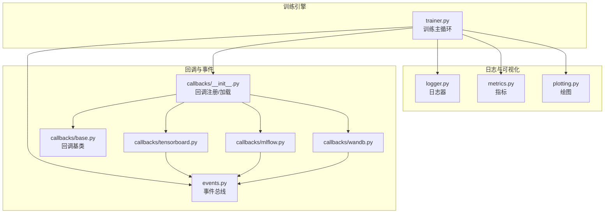
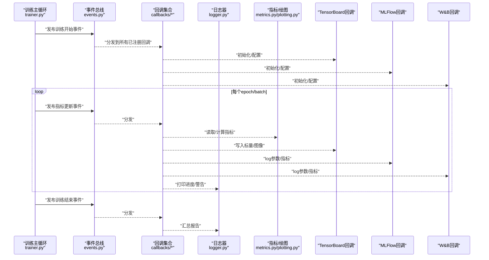
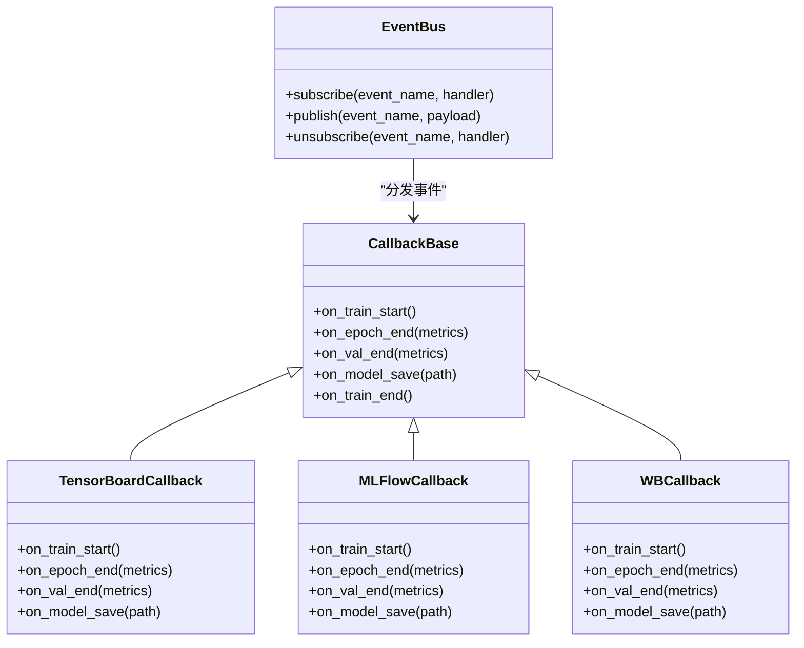
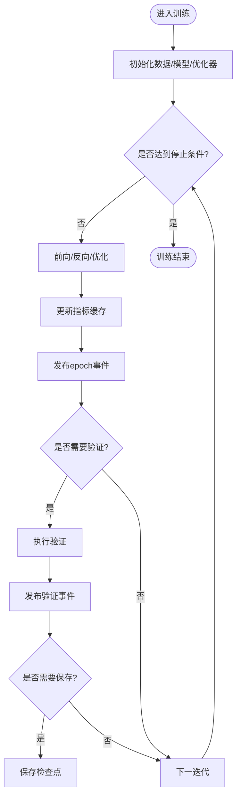
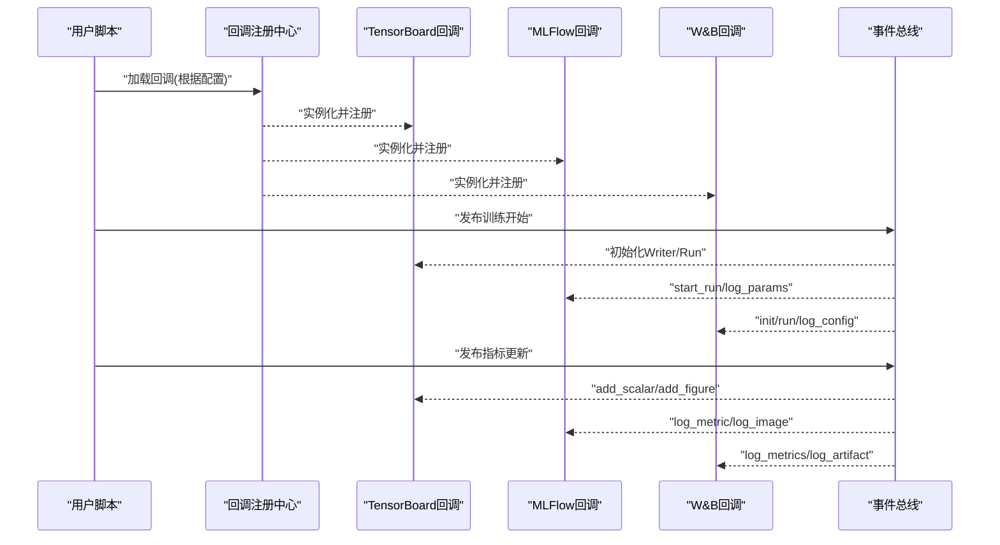
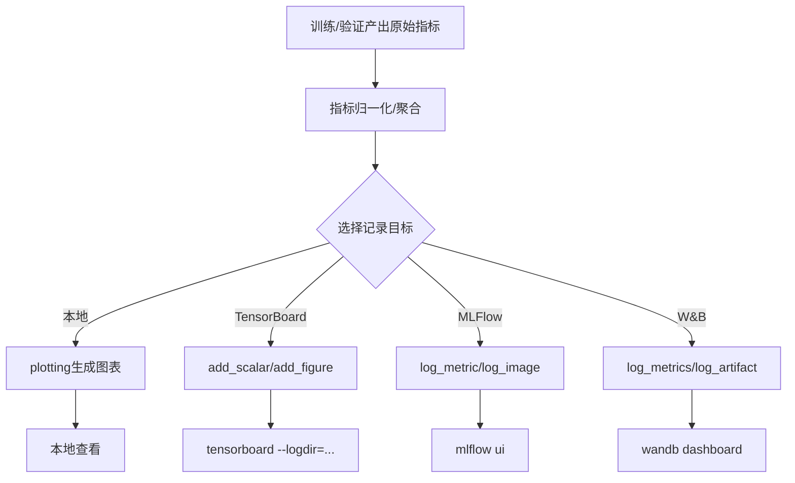
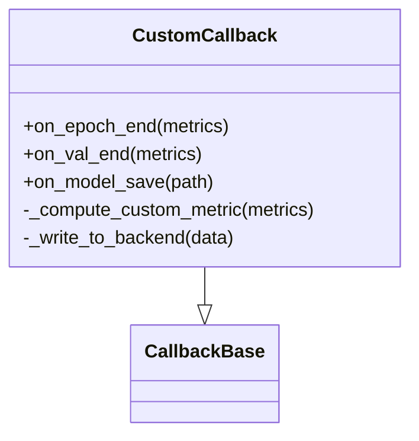
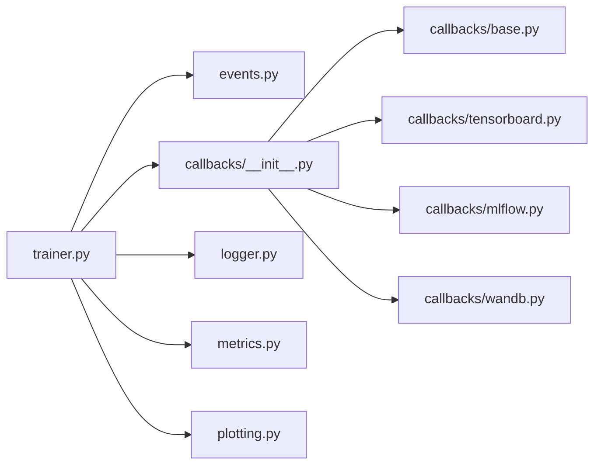

# 训练监控与日志

<cite>
**本文引用的文件**
- [ultralytics/utils/callbacks/__init__.py](file://ultralytics/utils/callbacks/__init__.py)
- [ultralytics/utils/callbacks/base.py](file://ultralytics/utils/callbacks/base.py)
- [ultralytics/utils/callbacks/tensorboard.py](file://ultralytics/utils/callbacks/tensorboard.py)
- [ultralytics/utils/callbacks/mlflow.py](file://ultralytics/utils/callbacks/mlflow.py)
- [ultralytics/utils/callbacks/wandb.py](file://ultralytics/utils/callbacks/wandb.py)
- [ultralytics/utils/logger.py](file://ultralytics/utils/logger.py)
- [ultralytics/utils/events.py](file://ultralytics/utils/events.py)
- [ultralytics/engine/trainer.py](file://ultralytics/engine/trainer.py)
- [ultralytics/utils/plotting.py](file://ultralytics/utils/plotting.py)
- [ultralytics/utils/metrics.py](file://ultralytics/utils/metrics.py)
- [docs/en/integrations/tensorboard.md](file://docs/en/integrations/tensorboard.md)
- [docs/en/integrations/mlflow.md](file://docs/en/integrations/mlflow.md)
- [docs/en/integrations/weights-biases.md](file://docs/en/integrations/weights-biases.md)
</cite>

## 目录
1. [简介](#简介)
2. [项目结构](#项目结构)
3. [核心组件](#核心组件)
4. [架构总览](#架构总览)
5. [详细组件分析](#详细组件分析)
6. [依赖关系分析](#依赖关系分析)
7. [性能考量](#性能考量)
8. [故障排查指南](#故障排查指南)
9. [结论](#结论)
10. [附录](#附录)

## 简介
本文件面向YOLO-Master的训练监控与日志系统，系统性阐述回调机制、事件总线、实验跟踪集成（TensorBoard、MLFlow、Weights & Biases）、指标记录与可视化、日志结构与解析方法、自定义监控指标开发、调试与诊断工具使用，以及大规模训练项目的监控最佳实践。文档以代码级实现为依据，提供可追溯的源码路径与图示，帮助读者快速定位并扩展监控能力。

## 项目结构
训练监控与日志相关代码主要分布在以下模块：
- 回调框架与内置回调：ultralytics/utils/callbacks/*
- 事件总线与通用事件：ultralytics/utils/events.py
- 训练主循环与回调调度：ultralytics/engine/trainer.py
- 日志器与输出：ultralytics/utils/logger.py
- 指标计算与绘图：ultralytics/utils/metrics.py、ultralytics/utils/plotting.py
- 集成文档：docs/en/integrations/*

图表来源
- [ultralytics/engine/trainer.py](file://ultralytics/engine/trainer.py)
- [ultralytics/utils/events.py](file://ultralytics/utils/events.py)
- [ultralytics/utils/callbacks/__init__.py](file://ultralytics/utils/callbacks/__init__.py)
- [ultralytics/utils/callbacks/base.py](file://ultralytics/utils/callbacks/base.py)
- [ultralytics/utils/callbacks/tensorboard.py](file://ultralytics/utils/callbacks/tensorboard.py)
- [ultralytics/utils/callbacks/mlflow.py](file://ultralytics/utils/callbacks/mlflow.py)
- [ultralytics/utils/callbacks/wandb.py](file://ultralytics/utils/callbacks/wandb.py)
- [ultralytics/utils/logger.py](file://ultralytics/utils/logger.py)
- [ultralytics/utils/metrics.py](file://ultralytics/utils/metrics.py)
- [ultralytics/utils/plotting.py](file://ultralytics/utils/plotting.py)

章节来源
- [ultralytics/utils/callbacks/__init__.py](file://ultralytics/utils/callbacks/__init__.py)
- [ultralytics/utils/callbacks/base.py](file://ultralytics/utils/callbacks/base.py)
- [ultralytics/utils/callbacks/tensorboard.py](file://ultralytics/utils/callbacks/tensorboard.py)
- [ultralytics/utils/callbacks/mlflow.py](file://ultralytics/utils/callbacks/mlflow.py)
- [ultralytics/utils/callbacks/wandb.py](file://ultralytics/utils/callbacks/wandb.py)
- [ultralytics/utils/events.py](file://ultralytics/utils/events.py)
- [ultralytics/engine/trainer.py](file://ultralytics/engine/trainer.py)
- [ultralytics/utils/logger.py](file://ultralytics/utils/logger.py)
- [ultralytics/utils/metrics.py](file://ultralytics/utils/metrics.py)
- [ultralytics/utils/plotting.py](file://ultralytics/utils/plotting.py)

## 核心组件
- 事件总线（events）：定义训练生命周期事件名称与发布/订阅接口，供回调统一监听。
- 回调基类（callbacks/base）：提供统一的回调接口与默认空实现，便于继承扩展。
- 回调注册中心（callbacks/__init__）：集中加载内置回调（如TensorBoard、MLFlow、W&B），并提供用户自定义回调的注册入口。
- 训练主循环（engine/trainer）：在关键阶段触发事件，驱动回调执行；负责指标聚合、模型保存、日志落盘等。
- 日志器（utils/logger）：统一控制台/文件日志输出，支持级别控制与格式化。
- 指标与绘图（utils/metrics, utils/plotting）：计算训练/验证指标，生成曲线图与统计图。
- 集成文档（docs/en/integrations/*）：说明各实验跟踪工具的启用方式与配置项。

章节来源
- [ultralytics/utils/events.py](file://ultralytics/utils/events.py)
- [ultralytics/utils/callbacks/base.py](file://ultralytics/utils/callbacks/base.py)
- [ultralytics/utils/callbacks/__init__.py](file://ultralytics/utils/callbacks/__init__.py)
- [ultralytics/engine/trainer.py](file://ultralytics/engine/trainer.py)
- [ultralytics/utils/logger.py](file://ultralytics/utils/logger.py)
- [ultralytics/utils/metrics.py](file://ultralytics/utils/metrics.py)
- [ultralytics/utils/plotting.py](file://ultralytics/utils/plotting.py)

## 架构总览
训练监控与日志的整体流程如下：训练主循环在关键节点发布事件，回调通过事件总线订阅事件并执行相应逻辑（记录指标、写入实验跟踪平台、绘制图表、持久化日志）。

图表来源
- [ultralytics/engine/trainer.py](file://ultralytics/engine/trainer.py)
- [ultralytics/utils/events.py](file://ultralytics/utils/events.py)
- [ultralytics/utils/callbacks/tensorboard.py](file://ultralytics/utils/callbacks/tensorboard.py)
- [ultralytics/utils/callbacks/mlflow.py](file://ultralytics/utils/callbacks/mlflow.py)
- [ultralytics/utils/callbacks/wandb.py](file://ultralytics/utils/callbacks/wandb.py)
- [ultralytics/utils/logger.py](file://ultralytics/utils/logger.py)
- [ultralytics/utils/metrics.py](file://ultralytics/utils/metrics.py)
- [ultralytics/utils/plotting.py](file://ultralytics/utils/plotting.py)

## 详细组件分析

### 事件总线与回调机制
- 事件命名与生命周期：训练开始、每步/每轮指标更新、验证完成、模型保存、训练结束等。
- 回调接口：基于基类提供统一方法约定，按事件名分派到对应钩子函数。
- 注册与加载：集中式注册中心负责发现并实例化内置回调，同时允许外部注入自定义回调。

图表来源
- [ultralytics/utils/events.py](file://ultralytics/utils/events.py)
- [ultralytics/utils/callbacks/base.py](file://ultralytics/utils/callbacks/base.py)
- [ultralytics/utils/callbacks/tensorboard.py](file://ultralytics/utils/callbacks/tensorboard.py)
- [ultralytics/utils/callbacks/mlflow.py](file://ultralytics/utils/callbacks/mlflow.py)
- [ultralytics/utils/callbacks/wandb.py](file://ultralytics/utils/callbacks/wandb.py)

章节来源
- [ultralytics/utils/events.py](file://ultralytics/utils/events.py)
- [ultralytics/utils/callbacks/base.py](file://ultralytics/utils/callbacks/base.py)
- [ultralytics/utils/callbacks/__init__.py](file://ultralytics/utils/callbacks/__init__.py)

### 训练主循环与回调调度
- 训练主循环在关键阶段调用事件总线发布事件，确保回调解耦且可扩展。
- 指标聚合与保存：主循环维护当前指标状态，并在验证/保存时触发回调。
- 错误处理：异常被捕获后通过日志器输出，并可选择中断或继续策略。

图表来源
- [ultralytics/engine/trainer.py](file://ultralytics/engine/trainer.py)
- [ultralytics/utils/events.py](file://ultralytics/utils/events.py)

章节来源
- [ultralytics/engine/trainer.py](file://ultralytics/engine/trainer.py)

### 实验跟踪集成（TensorBoard、MLFlow、Weights & Biases）
- 启用方式：通过回调注册中心加载对应回调，或在训练参数中指定启用开关。
- 配置项：工作区/项目名、运行名、日志目录、采样频率、是否记录权重/图像等。
- 记录内容：超参、损失/精度等标量、混淆矩阵/PR曲线、预测可视化图像、模型权重快照。

图表来源
- [ultralytics/utils/callbacks/__init__.py](file://ultralytics/utils/callbacks/__init__.py)
- [ultralytics/utils/callbacks/tensorboard.py](file://ultralytics/utils/callbacks/tensorboard.py)
- [ultralytics/utils/callbacks/mlflow.py](file://ultralytics/utils/callbacks/mlflow.py)
- [ultralytics/utils/callbacks/wandb.py](file://ultralytics/utils/callbacks/wandb.py)
- [ultralytics/utils/events.py](file://ultralytics/utils/events.py)

章节来源
- [docs/en/integrations/tensorboard.md](file://docs/en/integrations/tensorboard.md)
- [docs/en/integrations/mlflow.md](file://docs/en/integrations/mlflow.md)
- [docs/en/integrations/weights-biases.md](file://docs/en/integrations/weights-biases.md)
- [ultralytics/utils/callbacks/tensorboard.py](file://ultralytics/utils/callbacks/tensorboard.py)
- [ultralytics/utils/callbacks/mlflow.py](file://ultralytics/utils/callbacks/mlflow.py)
- [ultralytics/utils/callbacks/wandb.py](file://ultralytics/utils/callbacks/wandb.py)

### 训练指标的实时记录与可视化
- 指标来源：训练损失、验证mAP/P/R/F1、混淆矩阵、PR/AUC曲线、学习率、梯度范数等。
- 记录时机：每步/每轮/验证后，由回调订阅事件并写入不同后端。
- 可视化：本地图表（plotting）与远程平台（TensorBoard/MLFlow/W&B）双通道呈现。

图表来源
- [ultralytics/utils/metrics.py](file://ultralytics/utils/metrics.py)
- [ultralytics/utils/plotting.py](file://ultralytics/utils/plotting.py)
- [ultralytics/utils/callbacks/tensorboard.py](file://ultralytics/utils/callbacks/tensorboard.py)
- [ultralytics/utils/callbacks/mlflow.py](file://ultralytics/utils/callbacks/mlflow.py)
- [ultralytics/utils/callbacks/wandb.py](file://ultralytics/utils/callbacks/wandb.py)

章节来源
- [ultralytics/utils/metrics.py](file://ultralytics/utils/metrics.py)
- [ultralytics/utils/plotting.py](file://ultralytics/utils/plotting.py)

### 日志文件结构与解析方法
- 控制台与文件日志：统一由日志器输出，包含时间戳、级别、模块、消息体。
- 训练历史：通常保存在runs目录下，包含CSV/JSON形式的指标历史与图表。
- 错误信息：异常堆栈、断言失败、资源不足提示等，便于回溯。
- 解析建议：
  - 使用正则或结构化日志库提取关键字段（时间、级别、模块、消息）。
  - 对训练历史CSV进行列名映射，按epoch/step对齐指标序列。
  - 对错误日志进行分级过滤，结合上下文行号定位问题。

章节来源
- [ultralytics/utils/logger.py](file://ultralytics/utils/logger.py)

### 自定义监控指标的开发与集成
- 步骤概览：
  1) 在回调基类基础上实现新回调，覆盖所需事件钩子。
  2) 在回调注册中心注册新回调，或通过配置动态加载。
  3) 在事件中携带必要上下文（指标字典、模型句柄、路径等）。
  4) 在回调内访问指标并写入目标后端（本地/远程）。
- 注意事项：
  - 避免阻塞训练主循环，必要时异步或批量化写入。
  - 合理设置采样频率，降低IO开销。
  - 保证跨进程/分布式环境下的幂等性与一致性。

图表来源
- [ultralytics/utils/callbacks/base.py](file://ultralytics/utils/callbacks/base.py)
- [ultralytics/utils/callbacks/__init__.py](file://ultralytics/utils/callbacks/__init__.py)

章节来源
- [ultralytics/utils/callbacks/base.py](file://ultralytics/utils/callbacks/base.py)
- [ultralytics/utils/callbacks/__init__.py](file://ultralytics/utils/callbacks/__init__.py)

### 训练过程调试与问题诊断
- 日志级别：将日志器设置为DEBUG以便获取更详细的中间状态。
- 关键断点：在训练主循环的事件发布前后插入断点，观察指标变化与回调行为。
- 常见症状与定位：
  - 指标不更新：检查事件发布与回调订阅是否正确。
  - 平台无数据：确认回调初始化成功与网络/权限配置。
  - 内存泄漏：关注大对象在回调中的引用释放。
  - 分布式不一致：核对多进程下事件分发与指标聚合逻辑。

章节来源
- [ultralytics/utils/logger.py](file://ultralytics/utils/logger.py)
- [ultralytics/engine/trainer.py](file://ultralytics/engine/trainer.py)

## 依赖关系分析
- 耦合度：
  - 训练主循环仅依赖事件总线与回调接口，保持低耦合。
  - 回调之间相互独立，通过事件总线通信。
- 外部依赖：
  - TensorBoard/MLFlow/W&B SDK按需引入，未启用时不影响核心训练。
- 潜在环依赖：
  - 回调不应反向依赖训练主循环内部实现，避免循环导入。

图表来源
- [ultralytics/engine/trainer.py](file://ultralytics/engine/trainer.py)
- [ultralytics/utils/events.py](file://ultralytics/utils/events.py)
- [ultralytics/utils/callbacks/__init__.py](file://ultralytics/utils/callbacks/__init__.py)
- [ultralytics/utils/callbacks/base.py](file://ultralytics/utils/callbacks/base.py)
- [ultralytics/utils/callbacks/tensorboard.py](file://ultralytics/utils/callbacks/tensorboard.py)
- [ultralytics/utils/callbacks/mlflow.py](file://ultralytics/utils/callbacks/mlflow.py)
- [ultralytics/utils/callbacks/wandb.py](file://ultralytics/utils/callbacks/wandb.py)
- [ultralytics/utils/logger.py](file://ultralytics/utils/logger.py)
- [ultralytics/utils/metrics.py](file://ultralytics/utils/metrics.py)
- [ultralytics/utils/plotting.py](file://ultralytics/utils/plotting.py)

章节来源
- [ultralytics/engine/trainer.py](file://ultralytics/engine/trainer.py)
- [ultralytics/utils/events.py](file://ultralytics/utils/events.py)
- [ultralytics/utils/callbacks/__init__.py](file://ultralytics/utils/callbacks/__init__.py)

## 性能考量
- 采样频率：按步/轮采样，避免高频IO导致训练瓶颈。
- 批量写入：合并多次指标更新为一次写入，减少平台API调用次数。
- 异步记录：对非关键路径的可视化与上传采用异步队列。
- 资源隔离：将大对象（如图表、权重）延迟序列化，仅在需要时生成。
- 分布式注意：在多进程环境下，确保事件分发与指标聚合的正确性，避免重复记录。

[本节为通用指导，无需源码引用]

## 故障排查指南
- 日志级别调整：提升日志级别以获取更多上下文信息。
- 回调初始化失败：检查第三方库安装与环境变量（如W&B API Key、MLFlow服务器地址）。
- 指标缺失或不一致：核对事件发布位置与回调订阅方法名是否匹配。
- 磁盘空间不足：清理旧runs目录或限制保留周期。
- 网络超时：重试策略与离线模式切换，优先本地落盘再同步。

章节来源
- [ultralytics/utils/logger.py](file://ultralytics/utils/logger.py)
- [ultralytics/utils/callbacks/tensorboard.py](file://ultralytics/utils/callbacks/tensorboard.py)
- [ultralytics/utils/callbacks/mlflow.py](file://ultralytics/utils/callbacks/mlflow.py)
- [ultralytics/utils/callbacks/wandb.py](file://ultralytics/utils/callbacks/wandb.py)

## 结论
YOLO-Master的训练监控与日志系统通过事件总线与回调机制实现了高度解耦与可扩展的监控能力。内置回调覆盖主流实验跟踪平台，配合统一的日志器与指标/绘图工具，形成从本地到远端的完整观测链路。通过合理的采样策略与异步写入，可在大规模训练中保持良好性能。开发者可基于回调基类轻松扩展自定义监控逻辑，满足多样化业务需求。

[本节为总结，无需源码引用]

## 附录
- 常用命令参考：
  - TensorBoard：启动本地服务并指向runs目录。
  - MLFlow：启动UI并查看实验对比。
  - W&B：登录账户并查看在线仪表板。
- 最佳实践清单：
  - 明确记录粒度与保留策略。
  - 为关键指标设置告警阈值。
  - 定期归档与清理历史数据。
  - 在分布式环境中校验指标一致性。

[本节为补充信息，无需源码引用]