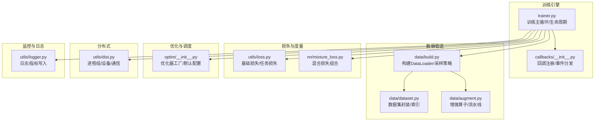
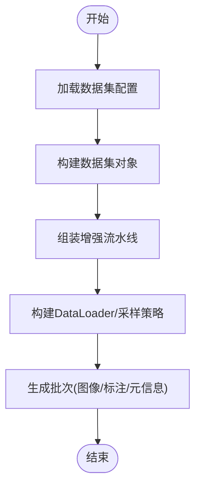
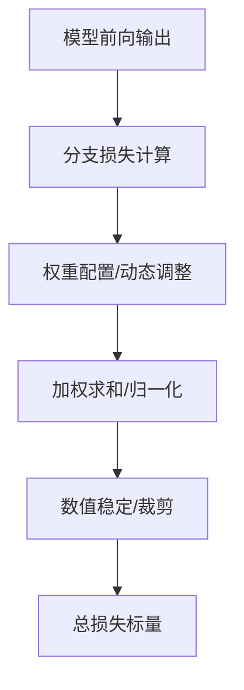
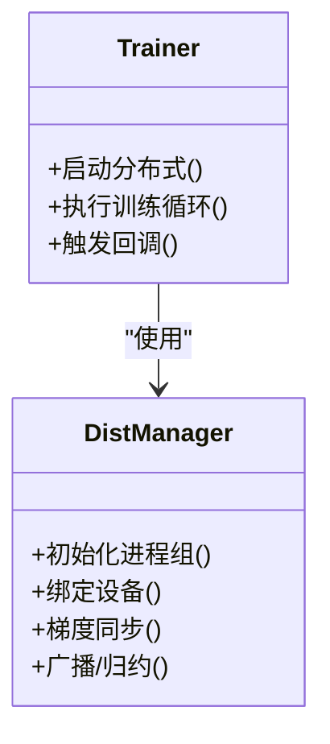
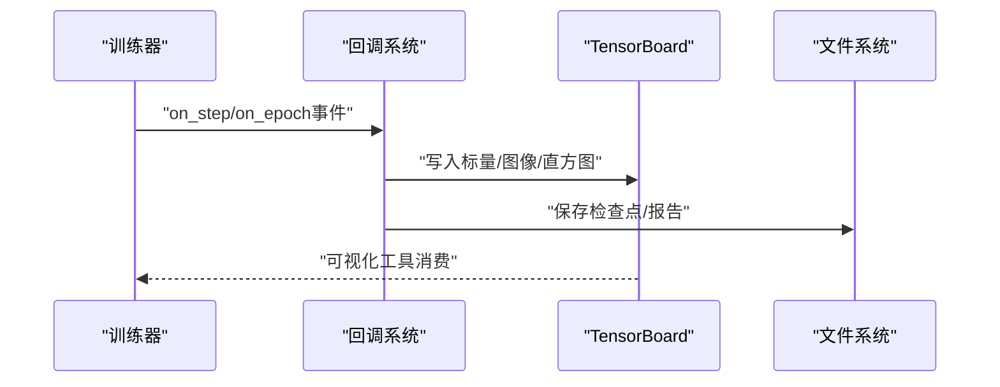
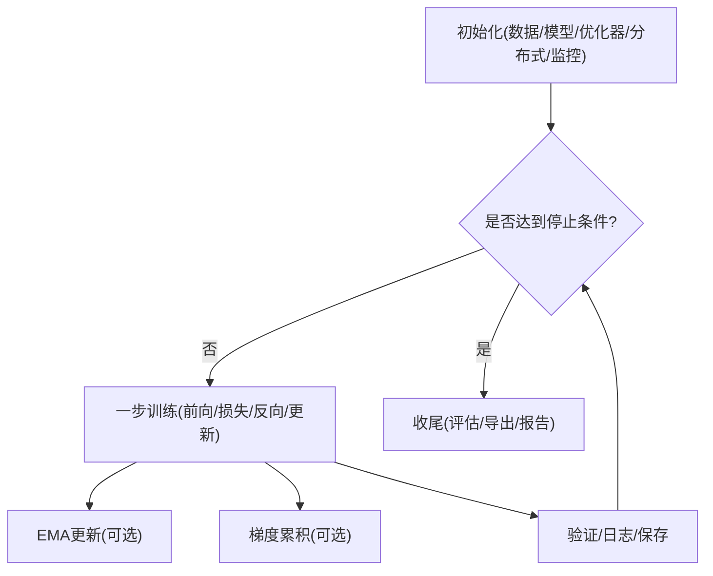
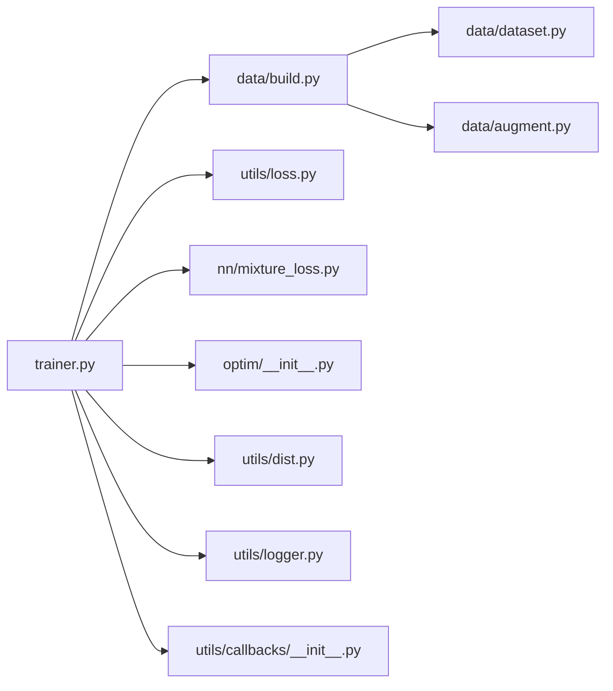

# 训练系统

<cite>
**本文引用的文件**
- [ultralytics/engine/trainer.py](file://ultralytics/engine/trainer.py)
- [ultralytics/data/build.py](file://ultralytics/data/build.py)
- [ultralytics/data/dataset.py](file://ultralytics/data/dataset.py)
- [ultralytics/data/augment.py](file://ultralytics/data/augment.py)
- [ultralytics/utils/loss.py](file://ultralytics/utils/loss.py)
- [ultralytics/nn/mixture_loss.py](file://ultralytics/nn/mixture_loss.py)
- [ultralytics/optim/__init__.py](file://ultralytics/optim/__init__.py)
- [ultralytics/utils/dist.py](file://ultralytics/utils/dist.py)
- [ultralytics/utils/logger.py](file://ultralytics/utils/logger.py)
- [ultralytics/utils/callbacks/__init__.py](file://ultralytics/utils/callbacks/__init__.py)
- [ultralytics/cfg/default.yaml](file://ultralytics/cfg/default.yaml)
- [examples/lora_examples/yolo_master_lora_README.md](file://examples/lora_examples/yolo_master_lora_README.md)
- [scripts/smoke_test_coco2017.py](file://scripts/smoke_test_coco2017.py)
</cite>

## 目录
1. [简介](#简介)
2. [项目结构](#项目结构)
3. [核心组件](#核心组件)
4. [架构总览](#架构总览)
5. [详细组件分析](#详细组件分析)
6. [依赖关系分析](#依赖关系分析)
7. [性能考量](#性能考量)
8. [故障排查指南](#故障排查指南)
9. [结论](#结论)
10. [附录](#附录)

## 简介
本技术文档面向YOLO-Master的训练系统，系统性阐述从数据准备到模型收敛的完整生命周期。重点覆盖：
- 数据加载管道设计（数据集格式、增强策略、批处理）
- 损失函数体系（含混合损失设计与计算逻辑）
- 优化器配置与学习率调度
- 分布式训练机制（DDP、DeepSpeed等后端支持）
- 训练监控与日志记录（TensorBoard集成与自定义回调）
- 训练配置文件参考（参数含义与推荐值）
- 训练调优最佳实践与常见问题解决方案
- EMA与梯度累积等高级技巧

## 项目结构
训练系统围绕“引擎-数据-损失-优化-分布式-监控”分层组织，关键路径如下：
- 训练主循环与生命周期管理位于引擎层
- 数据构建与增强位于数据层
- 损失计算位于工具与网络模块
- 优化器与调度在优化层
- 分布式通信在工具层
- 日志与回调在工具层



图表来源
- [ultralytics/engine/trainer.py](file://ultralytics/engine/trainer.py)
- [ultralytics/data/build.py](file://ultralytics/data/build.py)
- [ultralytics/data/dataset.py](file://ultralytics/data/dataset.py)
- [ultralytics/data/augment.py](file://ultralytics/data/augment.py)
- [ultralytics/utils/loss.py](file://ultralytics/utils/loss.py)
- [ultralytics/nn/mixture_loss.py](file://ultralytics/nn/mixture_loss.py)
- [ultralytics/optim/__init__.py](file://ultralytics/optim/__init__.py)
- [ultralytics/utils/dist.py](file://ultralytics/utils/dist.py)
- [ultralytics/utils/logger.py](file://ultralytics/utils/logger.py)
- [ultralytics/utils/callbacks/__init__.py](file://ultralytics/utils/callbacks/__init__.py)

章节来源
- [ultralytics/engine/trainer.py](file://ultralytics/engine/trainer.py)
- [ultralytics/data/build.py](file://ultralytics/data/build.py)
- [ultralytics/data/dataset.py](file://ultralytics/data/dataset.py)
- [ultralytics/data/augment.py](file://ultralytics/data/augment.py)
- [ultralytics/utils/loss.py](file://ultralytics/utils/loss.py)
- [ultralytics/nn/mixture_loss.py](file://ultralytics/nn/mixture_loss.py)
- [ultralytics/optim/__init__.py](file://ultralytics/optim/__init__.py)
- [ultralytics/utils/dist.py](file://ultralytics/utils/dist.py)
- [ultralytics/utils/logger.py](file://ultralytics/utils/logger.py)
- [ultralytics/utils/callbacks/__init__.py](file://ultralytics/utils/callbacks/__init__.py)

## 核心组件
- 训练主循环与生命周期
  - 负责初始化数据、模型、优化器、分布式环境；执行epoch/step循环；触发验证、保存、日志与回调；处理EMA与梯度累积。
- 数据构建与增强
  - 负责解析数据集配置、构建Dataset与DataLoader、应用增强流水线、实现多尺度/随机裁剪/MixUp/Mosaic等策略。
- 损失函数体系
  - 提供检测/分割/姿态等任务的基础损失，并支持通过混合损失进行多目标加权组合。
- 优化器与学习率调度
  - 提供常用优化器与默认超参，结合训练阶段动态调整学习率。
- 分布式训练
  - 封装进程组创建、设备分配、梯度同步、广播/归约等通信原语，兼容DDP与扩展后端。
- 监控与日志
  - 统一日志接口、指标记录、TensorBoard集成点、回调钩子（如每步/每轮保存、早停、可视化）。

章节来源
- [ultralytics/engine/trainer.py](file://ultralytics/engine/trainer.py)
- [ultralytics/data/build.py](file://ultralytics/data/build.py)
- [ultralytics/data/dataset.py](file://ultralytics/data/dataset.py)
- [ultralytics/data/augment.py](file://ultralytics/data/augment.py)
- [ultralytics/utils/loss.py](file://ultralytics/utils/loss.py)
- [ultralytics/nn/mixture_loss.py](file://ultralytics/nn/mixture_loss.py)
- [ultralytics/optim/__init__.py](file://ultralytics/optim/__init__.py)
- [ultralytics/utils/dist.py](file://ultralytics/utils/dist.py)
- [ultralytics/utils/logger.py](file://ultralytics/utils/logger.py)
- [ultralytics/utils/callbacks/__init__.py](file://ultralytics/utils/callbacks/__init__.py)

## 架构总览
下图展示一次训练迭代的关键调用链：数据读取→前向→损失计算→反向→优化更新→监控与保存。

```mermaid
sequenceDiagram
participant Main as "训练主循环"
participant Data as "数据构建/增强"
participant Model as "模型前向"
participant Loss as "损失计算(含混合)"
participant Opt as "优化器/调度"
participant Dist as "分布式通信"
participant Log as "日志/回调"
Main->>Data : "获取批次数据"
Data-->>Main : "图像/标注/元信息"
Main->>Model : "前向推理"
Model-->>Main : "预测结果"
Main->>Loss : "计算任务损失/混合损失"
Loss-->>Main : "标量损失/分项损失"
Main->>Dist : "梯度同步(可选)"
Main->>Opt : "反向传播与参数更新"
Opt-->>Main : "优化状态/学习率"
Main->>Log : "记录指标/触发回调"
Log-->>Main : "完成一步"
```

图表来源
- [ultralytics/engine/trainer.py](file://ultralytics/engine/trainer.py)
- [ultralytics/data/build.py](file://ultralytics/data/build.py)
- [ultralytics/utils/loss.py](file://ultralytics/utils/loss.py)
- [ultralytics/nn/mixture_loss.py](file://ultralytics/nn/mixture_loss.py)
- [ultralytics/optim/__init__.py](file://ultralytics/optim/__init__.py)
- [ultralytics/utils/dist.py](file://ultralytics/utils/dist.py)
- [ultralytics/utils/logger.py](file://ultralytics/utils/logger.py)
- [ultralytics/utils/callbacks/__init__.py](file://ultralytics/utils/callbacks/__init__.py)

## 详细组件分析

### 数据加载管道
- 数据集格式与索引
  - 数据集对象负责解析标注、建立样本索引、提供按索引访问能力，并与增强流水线对接。
- 数据构建与批处理
  - 构建器根据配置选择采样策略、设置批大小、并行数、缓存与内存映射，生成可迭代的批数据。
- 数据增强
  - 增强模块提供几何变换、色彩扰动、随机裁剪、Mosaic/MixUp等复合策略，支持按训练阶段开关或概率控制。
- 多尺度与自适应批处理
  - 支持多尺度输入与动态批大小策略，提升吞吐与显存利用率。



图表来源
- [ultralytics/data/build.py](file://ultralytics/data/build.py)
- [ultralytics/data/dataset.py](file://ultralytics/data/dataset.py)
- [ultralytics/data/augment.py](file://ultralytics/data/augment.py)

章节来源
- [ultralytics/data/build.py](file://ultralytics/data/build.py)
- [ultralytics/data/dataset.py](file://ultralytics/data/dataset.py)
- [ultralytics/data/augment.py](file://ultralytics/data/augment.py)

### 损失函数体系与混合损失
- 基础损失
  - 提供分类、回归、分割、关键点等任务的损失实现，包含边界框定位、类别置信度、掩码/关键点等分支。
- 混合损失
  - 将多个任务损失按权重组合，支持动态权重、归一化与数值稳定策略，便于多任务联合训练。
- 计算流程
  - 前向输出→逐项损失→加权求和→标量总损失；支持对异常项进行裁剪或屏蔽以保证稳定性。



图表来源
- [ultralytics/utils/loss.py](file://ultralytics/utils/loss.py)
- [ultralytics/nn/mixture_loss.py](file://ultralytics/nn/mixture_loss.py)

章节来源
- [ultralytics/utils/loss.py](file://ultralytics/utils/loss.py)
- [ultralytics/nn/mixture_loss.py](file://ultralytics/nn/mixture_loss.py)

### 优化器配置与学习率调度
- 优化器
  - 提供常用优化器及默认超参，支持分组学习率、权重衰减、动量等选项。
- 学习率调度
  - 基于训练阶段或步数的调度策略，支持余弦退火、线性预热、阶梯下降等。
- 与训练循环集成
  - 在每步更新后执行调度，并在回调中记录学习率曲线。

章节来源
- [ultralytics/optim/__init__.py](file://ultralytics/optim/__init__.py)
- [ultralytics/engine/trainer.py](file://ultralytics/engine/trainer.py)

### 分布式训练机制
- 进程组与设备
  - 封装进程组初始化、本地/远程节点发现、GPU/CPU设备绑定。
- 梯度同步与通信
  - 提供allreduce/allgather等通信原语，确保多卡/多机一致性。
- 后端支持
  - 原生DDP路径清晰，同时预留扩展点以接入DeepSpeed等第三方后端。



图表来源
- [ultralytics/utils/dist.py](file://ultralytics/utils/dist.py)
- [ultralytics/engine/trainer.py](file://ultralytics/engine/trainer.py)

章节来源
- [ultralytics/utils/dist.py](file://ultralytics/utils/dist.py)
- [ultralytics/engine/trainer.py](file://ultralytics/engine/trainer.py)

### 训练监控与日志记录
- 日志系统
  - 统一日志接口，支持控制台输出、文件落盘、结构化指标记录。
- TensorBoard集成
  - 在关键节点写入标量、直方图、图像等，便于可视化训练过程。
- 自定义回调
  - 提供训练各阶段的钩子（如每步/每轮/验证/保存），允许注入自定义行为（如早停、断点续训、报告生成）。



图表来源
- [ultralytics/utils/logger.py](file://ultralytics/utils/logger.py)
- [ultralytics/utils/callbacks/__init__.py](file://ultralytics/utils/callbacks/__init__.py)
- [ultralytics/engine/trainer.py](file://ultralytics/engine/trainer.py)

章节来源
- [ultralytics/utils/logger.py](file://ultralytics/utils/logger.py)
- [ultralytics/utils/callbacks/__init__.py](file://ultralytics/utils/callbacks/__init__.py)
- [ultralytics/engine/trainer.py](file://ultralytics/engine/trainer.py)

### 训练主循环与生命周期
- 初始化阶段
  - 解析配置、构建数据管道、实例化模型与损失、初始化优化器与调度、设置分布式环境与监控。
- 训练阶段
  - epoch/step循环、前向/损失/反向/更新、EMA更新、梯度累积、验证与保存。
- 收尾阶段
  - 最终评估、导出、清理资源、汇总报告。



图表来源
- [ultralytics/engine/trainer.py](file://ultralytics/engine/trainer.py)

章节来源
- [ultralytics/engine/trainer.py](file://ultralytics/engine/trainer.py)

### 训练配置参考
- 默认配置
  - 提供通用训练超参（如批大小、学习率、权重衰减、增强开关、保存间隔等）作为基线。
- LoRA微调示例
  - 提供LoRA相关配置说明与示例脚本，便于快速上手参数微调。
- 端到端验证脚本
  - 提供最小可复现脚本用于快速验证训练链路。

章节来源
- [ultralytics/cfg/default.yaml](file://ultralytics/cfg/default.yaml)
- [examples/lora_examples/yolo_master_lora_README.md](file://examples/lora_examples/yolo_master_lora_README.md)
- [scripts/smoke_test_coco2017.py](file://scripts/smoke_test_coco2017.py)

## 依赖关系分析
训练系统内部模块耦合清晰，低内聚高内聚原则贯穿：
- trainer依赖data、loss、optim、dist、logger、callbacks
- data模块内部dataset与augment解耦，build负责装配
- loss与mixture_loss职责分离，前者为任务级，后者为组合级
- dist独立于具体训练逻辑，仅暴露通信接口



图表来源
- [ultralytics/engine/trainer.py](file://ultralytics/engine/trainer.py)
- [ultralytics/data/build.py](file://ultralytics/data/build.py)
- [ultralytics/data/dataset.py](file://ultralytics/data/dataset.py)
- [ultralytics/data/augment.py](file://ultralytics/data/augment.py)
- [ultralytics/utils/loss.py](file://ultralytics/utils/loss.py)
- [ultralytics/nn/mixture_loss.py](file://ultralytics/nn/mixture_loss.py)
- [ultralytics/optim/__init__.py](file://ultralytics/optim/__init__.py)
- [ultralytics/utils/dist.py](file://ultralytics/utils/dist.py)
- [ultralytics/utils/logger.py](file://ultralytics/utils/logger.py)
- [ultralytics/utils/callbacks/__init__.py](file://ultralytics/utils/callbacks/__init__.py)

章节来源
- [ultralytics/engine/trainer.py](file://ultralytics/engine/trainer.py)
- [ultralytics/data/build.py](file://ultralytics/data/build.py)
- [ultralytics/data/dataset.py](file://ultralytics/data/dataset.py)
- [ultralytics/data/augment.py](file://ultralytics/data/augment.py)
- [ultralytics/utils/loss.py](file://ultralytics/utils/loss.py)
- [ultralytics/nn/mixture_loss.py](file://ultralytics/nn/mixture_loss.py)
- [ultralytics/optim/__init__.py](file://ultralytics/optim/__init__.py)
- [ultralytics/utils/dist.py](file://ultralytics/utils/dist.py)
- [ultralytics/utils/logger.py](file://ultralytics/utils/logger.py)
- [ultralytics/utils/callbacks/__init__.py](file://ultralytics/utils/callbacks/__init__.py)

## 性能考量
- 数据I/O与增强
  - 合理设置并行数与缓存策略，避免CPU瓶颈；按需启用昂贵增强，平衡泛化与速度。
- 批大小与多尺度
  - 在显存允许范围内增大批大小以提升吞吐；多尺度需权衡精度与延迟。
- 混合精度与编译
  - 开启混合精度减少显存占用与加速；必要时结合编译优化提升内核效率。
- 分布式通信
  - 选择合适的通信后端与拓扑，减少跨节点开销；注意梯度同步频率与累积步数。
- 监控与诊断
  - 利用日志与回调定期输出关键指标，及时识别瓶颈与异常。

[本节为通用指导，不直接分析具体文件]

## 故障排查指南
- 常见错误定位
  - 数据维度不匹配：检查数据集索引与增强输出的形状一致性。
  - 损失发散：检查混合损失权重、数值稳定策略与学习率设置。
  - 分布式死锁：确认allreduce调用位置与屏障语义，避免非根进程缺失通信。
  - 显存溢出：降低批大小、关闭部分增强或使用梯度累积。
- 调试建议
  - 使用最小可复现脚本逐步验证链路；开启详细日志与回调输出；在关键节点插入断点或打印。
- 回滚与恢复
  - 利用检查点与回调机制恢复训练；对比不同配置的指标曲线定位问题。

章节来源
- [ultralytics/engine/trainer.py](file://ultralytics/engine/trainer.py)
- [ultralytics/utils/logger.py](file://ultralytics/utils/logger.py)
- [ultralytics/utils/callbacks/__init__.py](file://ultralytics/utils/callbacks/__init__.py)

## 结论
YOLO-Master训练系统以清晰的模块化设计支撑从数据到收敛的全链路训练。通过灵活的数据管道、可扩展的损失组合、稳健的分布式通信与完善的监控回调，用户可在不同规模与场景下高效训练。配合合理的超参与调优策略，可实现稳定收敛与良好泛化。

[本节为总结性内容，不直接分析具体文件]

## 附录
- 术语
  - EMA：指数移动平均，用于平滑模型参数，提升验证期稳定性。
  - 梯度累积：在多步累积后再更新参数，模拟更大有效批大小。
  - DDP：分布式数据并行，多进程同步梯度。
  - DeepSpeed：高性能分布式训练框架，可与现有接口集成。
- 参考示例
  - LoRA微调示例与README说明
  - 最小可复现训练脚本

章节来源
- [examples/lora_examples/yolo_master_lora_README.md](file://examples/lora_examples/yolo_master_lora_README.md)
- [scripts/smoke_test_coco2017.py](file://scripts/smoke_test_coco2017.py)