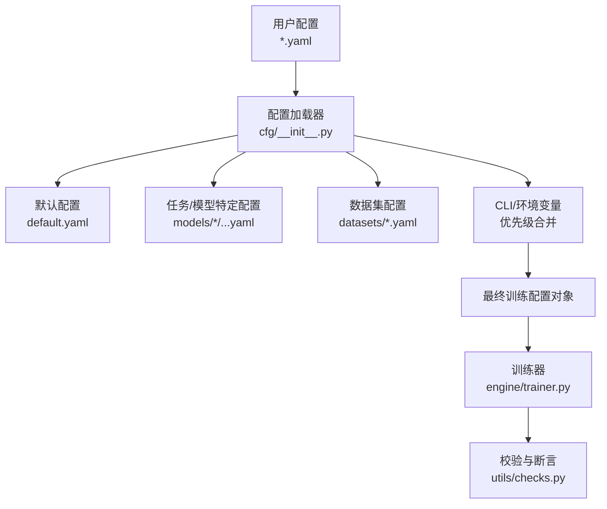
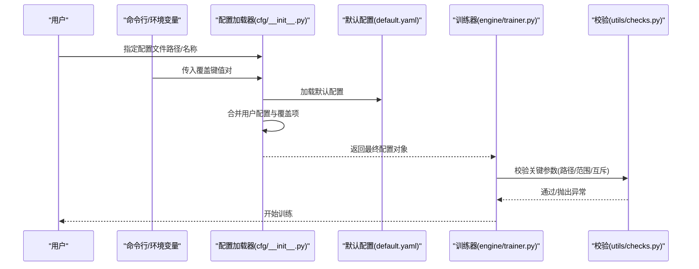
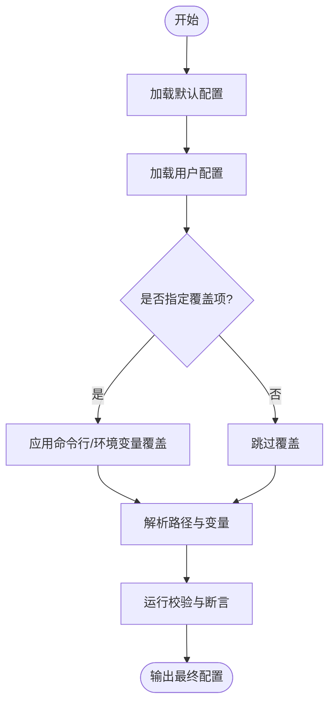
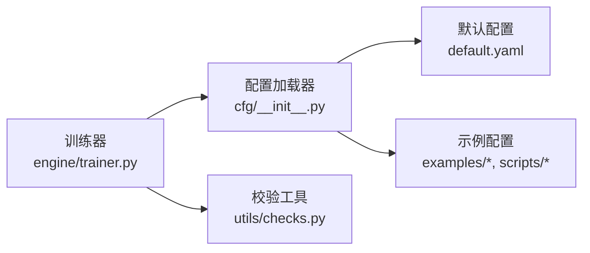

# 训练配置管理

<cite>
**本文引用的文件**
- [ultralytics/cfg/default.yaml](file://ultralytics/cfg/default.yaml)
- [ultralytics/cfg/__init__.py](file://ultralytics/cfg/__init__.py)
- [ultralytics/engine/trainer.py](file://ultralytics/engine/trainer.py)
- [ultralytics/utils/checks.py](file://ultralytics/utils/checks.py)
- [examples/mini-detect/mini_detect.yaml](file://examples/mini-detect/mini_detect.yaml)
- [scripts/coco2017.yaml](file://scripts/coco2017.yaml)
- [scripts/_voc_local.yaml](file://scripts/_voc_local.yaml)
- [scripts/VOC_sub.yaml](file://scripts/VOC_sub.yaml)
- [tests/test_default_config_integrity.py](file://tests/test_default_config_integrity.py)
- [tests/test_mixture_config_resolution.py](file://tests/test_mixture_config_resolution.py)
- [tests/test_master_model_configs.py](file://tests/test_master_model_configs.py)
</cite>

## 目录
1. [简介](#简介)
2. [项目结构](#项目结构)
3. [核心组件](#核心组件)
4. [架构总览](#架构总览)
5. [详细组件分析](#详细组件分析)
6. [依赖关系分析](#依赖关系分析)
7. [性能考量](#性能考量)
8. [故障排查指南](#故障排查指南)
9. [结论](#结论)
10. [附录](#附录)

## 简介
本文件面向YOLO-Master的训练配置管理系统，系统性说明YAML配置文件的结构与语法、训练参数含义与默认值范围、继承与覆盖机制、不同任务类型的专用选项、环境变量与命令行参数的优先级规则、模板与最佳实践、配置验证与错误检查机制，以及迁移与版本兼容性管理建议。目标是帮助读者快速上手并安全地扩展配置体系。

## 项目结构
训练配置相关的关键位置：
- 默认配置与导出能力矩阵：ultralytics/cfg/default.yaml、ultralytics/cfg/export-capability-matrix.yaml
- 配置加载与解析入口：ultralytics/cfg/__init__.py
- 训练流程对配置的读取与合并：ultralytics/engine/trainer.py
- 配置校验与通用检查工具：ultralytics/utils/checks.py
- 示例数据集配置（检测）：examples/mini-detect/mini_detect.yaml
- 示例数据集配置（COCO/VOC等）：scripts/coco2017.yaml、scripts/_voc_local.yaml、scripts/VOC_sub.yaml
- 配置完整性与解析测试：tests/test_default_config_integrity.py、tests/test_mixture_config_resolution.py、tests/test_master_model_configs.py

图表来源
- [ultralytics/cfg/__init__.py](file://ultralytics/cfg/__init__.py)
- [ultralytics/cfg/default.yaml](file://ultralytics/cfg/default.yaml)
- [ultralytics/engine/trainer.py](file://ultralytics/engine/trainer.py)
- [ultralytics/utils/checks.py](file://ultralytics/utils/checks.py)

章节来源
- [ultralytics/cfg/default.yaml](file://ultralytics/cfg/default.yaml)
- [ultralytics/cfg/__init__.py](file://ultralytics/cfg/__init__.py)
- [ultralytics/engine/trainer.py](file://ultralytics/engine/trainer.py)
- [ultralytics/utils/checks.py](file://ultralytics/utils/checks.py)
- [examples/mini-detect/mini_detect.yaml](file://examples/mini-detect/mini_detect.yaml)
- [scripts/coco2017.yaml](file://scripts/coco2017.yaml)
- [scripts/_voc_local.yaml](file://scripts/_voc_local.yaml)
- [scripts/VOC_sub.yaml](file://scripts/VOC_sub.yaml)

## 核心组件
- 配置加载器（cfg/__init__.py）
  - 负责读取YAML、合并默认配置、处理继承与覆盖、解析路径与环境变量、返回统一配置对象供训练器使用。
- 默认配置（default.yaml）
  - 提供全局默认超参、数据路径占位符、日志与导出开关等基础项。
- 训练器（engine/trainer.py）
  - 在初始化时消费配置对象，构建数据加载器、优化器、损失函数、回调等；对关键参数进行二次校验与适配。
- 校验工具（utils/checks.py）
  - 提供类型、范围、互斥性、存在性等通用校验逻辑，被训练器或配置层调用以尽早报错。
- 示例数据集配置
  - mini_detect.yaml、coco2017.yaml、_voc_local.yaml、VOC_sub.yaml 展示了不同任务/数据集的组织方式与字段约定。

章节来源
- [ultralytics/cfg/__init__.py](file://ultralytics/cfg/__init__.py)
- [ultralytics/cfg/default.yaml](file://ultralytics/cfg/default.yaml)
- [ultralytics/engine/trainer.py](file://ultralytics/engine/trainer.py)
- [ultralytics/utils/checks.py](file://ultralytics/utils/checks.py)
- [examples/mini-detect/mini_detect.yaml](file://examples/mini-detect/mini_detect.yaml)
- [scripts/coco2017.yaml](file://scripts/coco2017.yaml)
- [scripts/_voc_local.yaml](file://scripts/_voc_local.yaml)
- [scripts/VOC_sub.yaml](file://scripts/VOC_sub.yaml)

## 架构总览
下图展示从“用户配置”到“训练执行”的端到端流程，包括继承、覆盖、校验与最终配置对象的生成。

图表来源
- [ultralytics/cfg/__init__.py](file://ultralytics/cfg/__init__.py)
- [ultralytics/cfg/default.yaml](file://ultralytics/cfg/default.yaml)
- [ultralytics/engine/trainer.py](file://ultralytics/engine/trainer.py)
- [ultralytics/utils/checks.py](file://ultralytics/utils/checks.py)

## 详细组件分析

### YAML配置结构与语法规范
- 基本语法
  - 采用标准YAML键值对与嵌套字典；支持列表、布尔、数值、字符串与路径引用。
  - 支持相对路径与绝对路径；路径可包含环境变量占位符（由加载器解析）。
- 常见顶层键（示例）
  - 数据相关：数据集根路径、训练/验证集划分、类别名映射等（参考示例数据集配置）。
  - 训练相关：学习率、批次大小、轮数、优化器、调度器、增强策略、保存策略等（参考默认配置与训练器消费逻辑）。
  - 任务相关：检测/分割/姿态估计等任务的头配置、损失权重、后处理阈值等（随任务类型变化）。
- 推荐组织方式
  - 将“数据定义”与“训练超参”分离为独立YAML，便于复用与组合。
  - 使用“基线配置 + 覆盖配置”的方式管理多实验。

章节来源
- [ultralytics/cfg/default.yaml](file://ultralytics/cfg/default.yaml)
- [examples/mini-detect/mini_detect.yaml](file://examples/mini-detect/mini_detect.yaml)
- [scripts/coco2017.yaml](file://scripts/coco2017.yaml)
- [scripts/_voc_local.yaml](file://scripts/_voc_local.yaml)
- [scripts/VOC_sub.yaml](file://scripts/VOC_sub.yaml)

### 训练参数含义、默认值与推荐范围
- 数据来源
  - 默认值与可用键集合来源于默认配置与训练器初始化时的参数表。
  - 推荐范围需结合硬件资源、数据集规模与任务复杂度综合评估。
- 典型参数类别
  - 数据与预处理：图像尺寸、归一化、增强强度、缓存策略等。
  - 优化与训练：学习率、权重衰减、动量、批次大小、梯度累积、混合精度等。
  - 输出与监控：保存间隔、可视化开关、日志后端、指标记录等。
  - 任务特定：检测NMS阈值、分割掩码阈值、姿态关键点数量与置信度等。
- 注意事项
  - 某些参数在不同任务下语义不同，需按任务选择对应键。
  - 部分参数存在互斥或依赖关系（如优化器与调度器的搭配），由校验逻辑保证一致性。

章节来源
- [ultralytics/cfg/default.yaml](file://ultralytics/cfg/default.yaml)
- [ultralytics/engine/trainer.py](file://ultralytics/engine/trainer.py)
- [ultralytics/utils/checks.py](file://ultralytics/utils/checks.py)

### 配置继承与覆盖机制
- 继承链
  - 默认配置 → 用户指定配置 → 任务/模型特定配置 → 数据集配置。
- 覆盖顺序
  - 命令行参数 > 环境变量 > 用户配置文件 > 任务/模型默认 > 系统默认。
- 合并策略
  - 深度合并：同层字典递归合并，列表通常整体替换而非拼接。
  - 空值处理：显式设置为null/None表示删除或禁用某项（取决于具体实现）。
- 路径解析
  - 支持相对路径与绝对路径；若含环境变量，会在加载阶段展开。

图表来源
- [ultralytics/cfg/__init__.py](file://ultralytics/cfg/__init__.py)
- [ultralytics/utils/checks.py](file://ultralytics/utils/checks.py)

章节来源
- [ultralytics/cfg/__init__.py](file://ultralytics/cfg/__init__.py)
- [ultralytics/utils/checks.py](file://ultralytics/utils/checks.py)

### 不同任务类型的专用配置选项
- 目标检测
  - 关注边界框回归损失权重、NMS阈值、正负样本匹配策略等。
- 实例分割
  - 增加掩码分支相关超参、IoU阈值、掩码缩放等。
- 姿态估计
  - 关键点数量、热力图分辨率、关键点损失权重、可见性阈值等。
- 其他任务（如分类、跟踪、开放世界等）
  - 根据任务头与损失函数定制相应键。

提示：具体键名与行为以各任务对应的模型/训练器实现为准，建议在示例配置中对照查看。

章节来源
- [examples/mini-detect/mini_detect.yaml](file://examples/mini-detect/mini_detect.yaml)
- [scripts/coco2017.yaml](file://scripts/coco2017.yaml)
- [scripts/_voc_local.yaml](file://scripts/_voc_local.yaml)
- [scripts/VOC_sub.yaml](file://scripts/VOC_sub.yaml)

### 环境变量与命令行参数的优先级规则
- 优先级从高到低
  - 命令行参数（最高）
  - 环境变量
  - 用户配置文件
  - 任务/模型默认配置
  - 系统默认配置（最低）
- 覆盖粒度
  - 支持点号分隔的深层键覆盖（例如 data.batch_size）。
- 冲突处理
  - 高优先级直接覆盖低优先级同名键；未出现的键沿用低优先级值。

章节来源
- [ultralytics/cfg/__init__.py](file://ultralytics/cfg/__init__.py)

### 配置文件模板与最佳实践
- 模板建议
  - 基线模板：包含常用默认值与注释说明，便于团队共享。
  - 任务模板：针对检测/分割/姿态等提供最小可用配置。
  - 数据集模板：仅包含数据路径与类别信息，供多个训练任务复用。
- 最佳实践
  - 使用“基线 + 覆盖”的管理模式，避免重复定义。
  - 将敏感路径与密钥放入环境变量，不在仓库中硬编码。
  - 为每个实验保留独立覆盖文件，便于复现与回溯。
  - 在提交前运行配置完整性测试，确保键名与类型正确。

章节来源
- [examples/mini-detect/mini_detect.yaml](file://examples/mini-detect/mini_detect.yaml)
- [scripts/coco2017.yaml](file://scripts/coco2017.yaml)
- [scripts/_voc_local.yaml](file://scripts/_voc_local.yaml)
- [scripts/VOC_sub.yaml](file://scripts/VOC_sub.yaml)

### 配置验证与错误检查机制
- 校验维度
  - 存在性：必需键是否存在。
  - 类型与范围：数值范围、枚举取值、布尔标志等。
  - 互斥与依赖：如优化器与调度器搭配、设备与批大小约束等。
  - 路径有效性：数据路径、权重路径、输出目录等。
- 触发时机
  - 配置加载后立即进行初步校验；训练器初始化时进行二次校验。
- 错误反馈
  - 明确提示缺失键、越界值、冲突项及修复建议。

章节来源
- [ultralytics/utils/checks.py](file://ultralytics/utils/checks.py)
- [ultralytics/engine/trainer.py](file://ultralytics/engine/trainer.py)

### 配置迁移与版本兼容性管理
- 兼容策略
  - 新增键保持向后兼容，旧键保留别名或弃用警告。
  - 破坏性变更通过迁移脚本或文档指引过渡。
- 迁移建议
  - 使用差异对比工具定位废弃键与新键映射。
  - 在CI中加入配置漂移检测与回归测试。
  - 维护“迁移清单”，记录每版本的键变更与影响面。

章节来源
- [tests/test_default_config_integrity.py](file://tests/test_default_config_integrity.py)
- [tests/test_mixture_config_resolution.py](file://tests/test_mixture_config_resolution.py)
- [tests/test_master_model_configs.py](file://tests/test_master_model_configs.py)

## 依赖关系分析
- 模块耦合
  - 配置加载器依赖默认配置与示例配置；训练器依赖配置对象；校验工具被多处复用。
- 外部依赖
  - YAML解析库、路径与文件系统操作、可选的环境变量解析。
- 潜在循环依赖
  - 应避免在配置加载过程中反向导入训练器；当前设计遵循单向依赖。

图表来源
- [ultralytics/cfg/__init__.py](file://ultralytics/cfg/__init__.py)
- [ultralytics/cfg/default.yaml](file://ultralytics/cfg/default.yaml)
- [ultralytics/engine/trainer.py](file://ultralytics/engine/trainer.py)
- [ultralytics/utils/checks.py](file://ultralytics/utils/checks.py)

章节来源
- [ultralytics/cfg/__init__.py](file://ultralytics/cfg/__init__.py)
- [ultralytics/cfg/default.yaml](file://ultralytics/cfg/default.yaml)
- [ultralytics/engine/trainer.py](file://ultralytics/engine/trainer.py)
- [ultralytics/utils/checks.py](file://ultralytics/utils/checks.py)

## 性能考量
- 批大小与内存
  - 增大批大小可提升吞吐但增加显存占用；需结合GPU容量与梯度累积策略调整。
- 数据I/O
  - 启用数据缓存与预取可减少I/O瓶颈；注意磁盘空间与缓存失效策略。
- 混合精度与编译
  - 开启混合精度可加速训练；在某些平台可结合编译优化进一步提速。
- 日志与可视化
  - 高频日志与可视化会拖慢训练，可按步长或轮次采样输出。

[本节为通用指导，不直接分析具体文件]

## 故障排查指南
- 常见问题
  - 路径无效：检查数据/权重/输出路径是否正确且可访问。
  - 键名拼写错误：依据校验错误提示修正。
  - 参数越界：核对默认范围与硬件限制。
  - 任务不匹配：确认任务类型与配置键一致。
- 定位步骤
  - 先运行配置完整性测试，再逐步缩小覆盖范围定位问题。
  - 打印最终配置对象，核对关键键值是否符合预期。
  - 查看训练器初始化阶段的断言与日志。

章节来源
- [ultralytics/utils/checks.py](file://ultralytics/utils/checks.py)
- [ultralytics/engine/trainer.py](file://ultralytics/engine/trainer.py)
- [tests/test_default_config_integrity.py](file://tests/test_default_config_integrity.py)

## 结论
YOLO-Master的配置管理体系以“默认配置 + 用户覆盖 + 严格校验”为核心，兼顾易用性与健壮性。通过合理的继承与覆盖策略、清晰的优先级规则与完善的校验机制，用户可以高效地为不同任务与数据集定制训练配置，并在团队协作中保持一致性与可复现性。

## 附录
- 快速上手清单
  - 准备数据集配置（参考示例）。
  - 复制默认配置并按需覆盖。
  - 使用命令行或环境变量微调关键超参。
  - 运行配置完整性测试与一次小规模训练验证。
- 参考示例
  - 检测任务：examples/mini-detect/mini_detect.yaml
  - COCO数据集：scripts/coco2017.yaml
  - VOC数据集：scripts/_voc_local.yaml、scripts/VOC_sub.yaml

章节来源
- [examples/mini-detect/mini_detect.yaml](file://examples/mini-detect/mini_detect.yaml)
- [scripts/coco2017.yaml](file://scripts/coco2017.yaml)
- [scripts/_voc_local.yaml](file://scripts/_voc_local.yaml)
- [scripts/VOC_sub.yaml](file://scripts/VOC_sub.yaml)