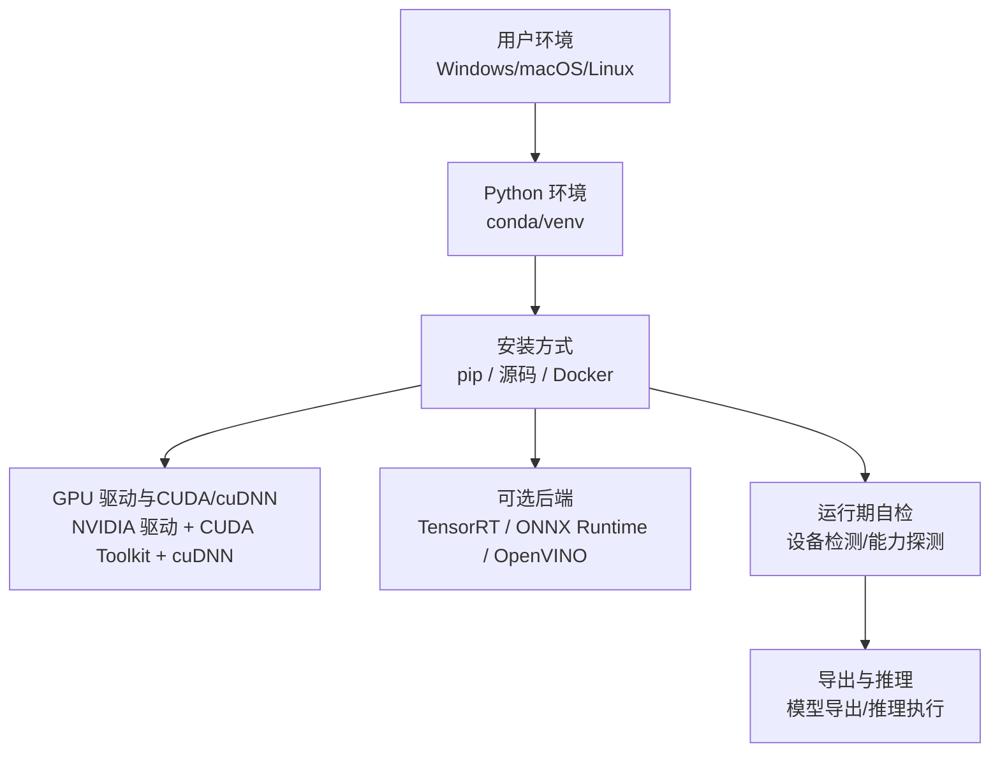
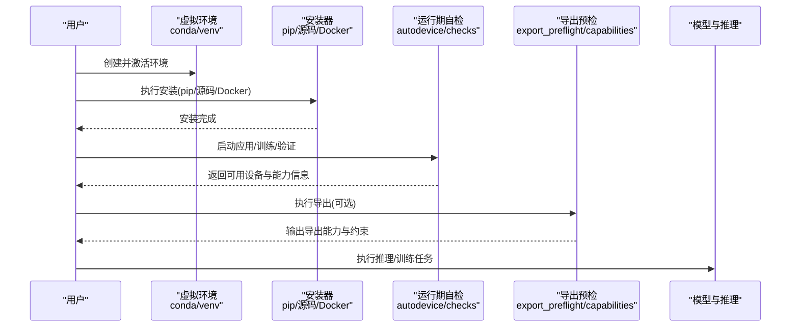
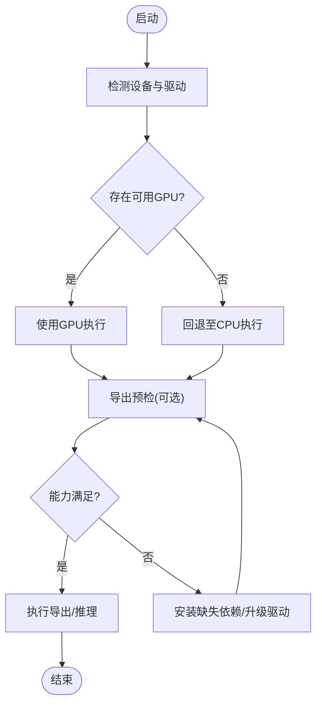
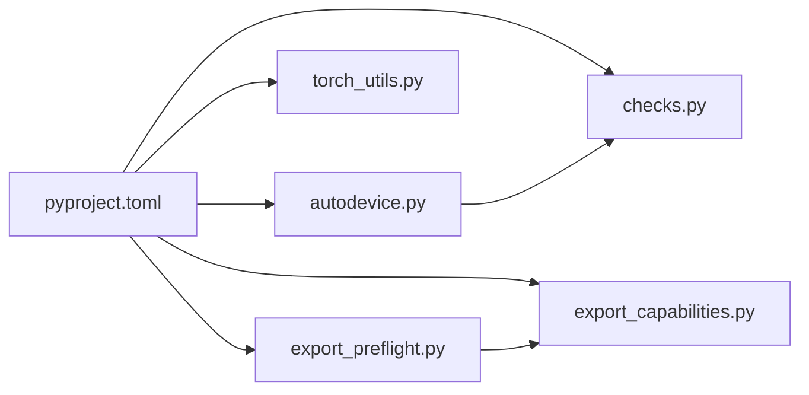

# 安装与环境配置

<cite>
**本文引用的文件**
- [pyproject.toml](file://pyproject.toml)
- [Dockerfile](file://docker/Dockerfile)
- [README.md](file://README.md)
- [conda-quickstart.md](file://docs/en/guides/conda-quickstart.md)
- [docker-quickstart.md](file://docs/en/guides/docker-quickstart.md)
- [windows_cpu_setup.md](file://docs/windows_cpu_setup.md)
- [autodevice.py](file://ultralytics/utils/autodevice.py)
- [checks.py](file://ultralytics/utils/checks.py)
- [torch_utils.py](file://ultralytics/utils/torch_utils.py)
- [export_preflight.py](file://ultralytics/utils/export_preflight.py)
- [export_capabilities.py](file://ultralytics/utils/export_capabilities.py)
- [tensorrt.md](file://docs/en/integrations/tensorrt.md)
- [onnx.md](file://docs/en/integrations/onnx.md)
- [openvino.md](file://docs/en/integrations/openvino.md)
- [deepstream-nvidia-jetson.md](file://docs/en/guides/deepstream-nvidia-jetson.md)
- [nvidia-jetson.md](file://docs/en/guides/nvidia-jetson.md)
- [raspberry-pi.md](file://docs/en/guides/raspberry-pi.md)
- [coral-edge-tpu-on-raspberry-pi.md](file://docs/en/guides/coral-edge-tpu-on-raspberry-pi.md)
</cite>

## 目录
1. [简介](#简介)
2. [项目结构](#项目结构)
3. [核心组件](#核心组件)
4. [架构总览](#架构总览)
5. [详细组件分析](#详细组件分析)
6. [依赖关系分析](#依赖关系分析)
7. [性能考虑](#性能考虑)
8. [故障排除指南](#故障排除指南)
9. [结论](#结论)
10. [附录](#附录)

## 简介
本章节面向首次使用者与运维工程师，提供在 Windows、macOS、Linux 上完成 YOLO-Master 环境搭建的完整指南。内容覆盖：
- 通过 pip 安装与源码编译安装
- Docker 容器化部署
- GPU 加速依赖（CUDA、cuDNN）与驱动版本匹配
- 虚拟环境管理最佳实践（conda、venv）
- 可选优化后端安装（TensorRT、ONNX Runtime、OpenVINO 等）
- 常见安装问题排查与性能调优建议

## 项目结构
仓库中与安装和环境配置相关的核心位置如下：
- 包元数据与依赖声明：pyproject.toml
- 官方文档：docs/en/guides 下的快速开始与平台指南
- Docker 镜像构建：docker/Dockerfile
- 运行时设备检测与能力检查：ultralytics/utils 下的 autodevice、checks、torch_utils、export_preflight、export_capabilities
- 集成与平台指南：docs/en/integrations 与 docs/en/guides 下各平台文档

[本节为概念性说明，不直接分析具体文件]

## 核心组件
- 依赖与安装入口
  - pyproject.toml：定义 Python 依赖、可选依赖分组与安装选项，是 pip 安装与开发环境的基础。
  - docker/Dockerfile：提供可复现的容器镜像构建脚本，便于跨平台一致部署。
- 运行期设备与能力检测
  - ultralytics/utils/autodevice.py：自动选择可用设备（CPU/GPU），处理多卡与回退策略。
  - ultralytics/utils/checks.py：环境与依赖校验（如 CUDA/cuDNN、驱动版本、系统兼容性）。
  - ultralytics/utils/torch_utils.py：PyTorch 相关工具（设备切换、精度、内存等）。
  - ultralytics/utils/export_preflight.py：导出前预检（目标后端是否满足要求）。
  - ultralytics/utils/export_capabilities.py：导出能力矩阵与后端支持判定。
- 官方文档与平台指南
  - docs/en/guides/conda-quickstart.md：conda 快速上手。
  - docs/en/guides/docker-quickstart.md：Docker 快速上手。
  - docs/windows_cpu_setup.md：Windows CPU 环境设置。
  - docs/en/integrations/tensorrt.md、onnx.md、openvino.md：可选后端集成说明。
  - docs/en/guides/deepstream-nvidia-jetson.md、nvidia-jetson.md、raspberry-pi.md、coral-edge-tpu-on-raspberry-pi.md：边缘与嵌入式平台指南。

**章节来源**
- [pyproject.toml](file://pyproject.toml)
- [Dockerfile](file://docker/Dockerfile)
- [autodevice.py](file://ultralytics/utils/autodevice.py)
- [checks.py](file://ultralytics/utils/checks.py)
- [torch_utils.py](file://ultralytics/utils/torch_utils.py)
- [export_preflight.py](file://ultralytics/utils/export_preflight.py)
- [export_capabilities.py](file://ultralytics/utils/export_capabilities.py)
- [conda-quickstart.md](file://docs/en/guides/conda-quickstart.md)
- [docker-quickstart.md](file://docs/en/guides/docker-quickstart.md)
- [windows_cpu_setup.md](file://docs/windows_cpu_setup.md)
- [tensorrt.md](file://docs/en/integrations/tensorrt.md)
- [onnx.md](file://docs/en/integrations/onnx.md)
- [openvino.md](file://docs/en/integrations/openvino.md)
- [deepstream-nvidia-jetson.md](file://docs/en/guides/deepstream-nvidia-jetson.md)
- [nvidia-jetson.md](file://docs/en/guides/nvidia-jetson.md)
- [raspberry-pi.md](file://docs/en/guides/raspberry-pi.md)
- [coral-edge-tpu-on-raspberry-pi.md](file://docs/en/guides/coral-edge-tpu-on-raspberry-pi.md)

## 架构总览
下图展示了从“环境准备”到“运行期自检与导出/推理”的整体流程，以及关键模块的职责边界。

**图表来源**
- [autodevice.py](file://ultralytics/utils/autodevice.py)
- [checks.py](file://ultralytics/utils/checks.py)
- [export_preflight.py](file://ultralytics/utils/export_preflight.py)
- [export_capabilities.py](file://ultralytics/utils/export_capabilities.py)

## 详细组件分析

### 安装方式一：pip 安装
- 适用场景：快速体验、本地开发、最小化依赖。
- 前置条件：
  - Python 版本需满足 pyproject.toml 中声明的要求。
  - 建议使用虚拟环境隔离依赖。
- 基本步骤：
  - 使用 conda 或 venv 创建并激活环境。
  - 通过 pip 安装主包；如需可选后端，按对应 extras 安装。
- 参考路径：
  - 依赖与安装选项定义：[pyproject.toml](file://pyproject.toml)
  - conda 快速开始：[conda-quickstart.md](file://docs/en/guides/conda-quickstart.md)

**章节来源**
- [pyproject.toml](file://pyproject.toml)
- [conda-quickstart.md](file://docs/en/guides/conda-quickstart.md)

### 安装方式二：源码编译安装
- 适用场景：需要自定义构建、调试源码、参与贡献。
- 前置条件：
  - 具备编译器与构建工具链（C/C++、cmake 等，视平台而定）。
  - 若启用 GPU，需正确安装 NVIDIA 驱动、CUDA Toolkit 与 cuDNN，并确保版本兼容。
- 基本步骤：
  - 克隆仓库并进入项目根目录。
  - 使用 pip 以“可编辑模式”安装，以便修改后即时生效。
  - 按需安装可选后端依赖。
- 参考路径：
  - 依赖与安装选项定义：[pyproject.toml](file://pyproject.toml)

**章节来源**
- [pyproject.toml](file://pyproject.toml)

### 安装方式三：Docker 部署
- 适用场景：跨平台一致性、CI/CD、生产部署。
- 基本步骤：
  - 基于仓库提供的 Dockerfile 构建镜像。
  - 运行容器时挂载数据集与结果目录，按需分配 GPU 资源。
- 参考路径：
  - 镜像构建脚本：[Dockerfile](file://docker/Dockerfile)
  - Docker 快速开始：[docker-quickstart.md](file://docs/en/guides/docker-quickstart.md)

**章节来源**
- [Dockerfile](file://docker/Dockerfile)
- [docker-quickstart.md](file://docs/en/guides/docker-quickstart.md)

### GPU 依赖与驱动配置（CUDA、cuDNN）
- 驱动与 CUDA/cuDNN 版本必须相互匹配；不同 PyTorch 版本对 CUDA 有最低版本要求。
- 建议在安装 PyTorch 时一并安装与其匹配的 CUDA 工具链，或使用官方渠道获取预编译 wheel。
- 运行期会进行设备与能力检测，若检测到不兼容将给出提示或回退至 CPU。
- 参考路径：
  - 设备自动选择与回退逻辑：[autodevice.py](file://ultralytics/utils/autodevice.py)
  - 环境与依赖校验：[checks.py](file://ultralytics/utils/checks.py)
  - PyTorch 工具与设备操作：[torch_utils.py](file://ultralytics/utils/torch_utils.py)

**章节来源**
- [autodevice.py](file://ultralytics/utils/autodevice.py)
- [checks.py](file://ultralytics/utils/checks.py)
- [torch_utils.py](file://ultralytics/utils/torch_utils.py)

### 虚拟环境管理最佳实践（conda 与 venv）
- 推荐做法：
  - 每个项目使用独立环境，避免依赖冲突。
  - 固定 Python 与关键依赖版本，提升可复现性。
  - 优先使用 conda 管理复杂二进制依赖（如 CUDA/cuDNN），或使用 venv 配合 pip 安装预编译轮子。
- 参考路径：
  - conda 快速开始：[conda-quickstart.md](file://docs/en/guides/conda-quickstart.md)

**章节来源**
- [conda-quickstart.md](file://docs/en/guides/conda-quickstart.md)

### 可选后端与优化库（TensorRT、ONNX Runtime、OpenVINO 等）
- TensorRT（NVIDIA GPU 加速）
  - 适用于高性能推理与导出优化，需满足特定 CUDA/TensorRT 版本组合。
  - 参考：[tensorrt.md](file://docs/en/integrations/tensorrt.md)
- ONNX Runtime（跨平台推理）
  - 适合跨框架部署与多硬件后端，注意与导出模型的算子支持。
  - 参考：[onnx.md](file://docs/en/integrations/onnx.md)
- OpenVINO（Intel 平台优化）
  - 针对 Intel CPU/GPU/VPU 优化，适合边缘与服务器部署。
  - 参考：[openvino.md](file://docs/en/integrations/openvino.md)
- 其他平台与边缘设备
  - Jetson/DeepStream：[deepstream-nvidia-jetson.md](file://docs/en/guides/deepstream-nvidia-jetson.md)、[nvidia-jetson.md](file://docs/en/guides/nvidia-jetson.md)
  - Raspberry Pi 与 Coral Edge TPU：[raspberry-pi.md](file://docs/en/guides/raspberry-pi.md)、[coral-edge-tpu-on-raspberry-pi.md](file://docs/en/guides/coral-edge-tpu-on-raspberry-pi.md)

**章节来源**
- [tensorrt.md](file://docs/en/integrations/tensorrt.md)
- [onnx.md](file://docs/en/integrations/onnx.md)
- [openvino.md](file://docs/en/integrations/openvino.md)
- [deepstream-nvidia-jetson.md](file://docs/en/guides/deepstream-nvidia-jetson.md)
- [nvidia-jetson.md](file://docs/en/guides/nvidia-jetson.md)
- [raspberry-pi.md](file://docs/en/guides/raspberry-pi.md)
- [coral-edge-tpu-on-raspberry-pi.md](file://docs/en/guides/coral-edge-tpu-on-raspberry-pi.md)

### 运行期设备与导出能力检测
- 设备选择与回退
  - 自动检测可用 GPU/CPU，并在不可用时回退到 CPU。
  - 多卡环境下根据显存与可用性选择最优设备。
- 导出预检与能力矩阵
  - 在执行导出前进行预检，确保目标后端所需的依赖与算子支持满足。
  - 导出能力矩阵用于判断当前环境是否支持某格式/后端。
- 参考路径：
  - 设备自动选择：[autodevice.py](file://ultralytics/utils/autodevice.py)
  - 导出预检：[export_preflight.py](file://ultralytics/utils/export_preflight.py)
  - 导出能力矩阵：[export_capabilities.py](file://ultralytics/utils/export_capabilities.py)

**图表来源**
- [autodevice.py](file://ultralytics/utils/autodevice.py)
- [export_preflight.py](file://ultralytics/utils/export_preflight.py)
- [export_capabilities.py](file://ultralytics/utils/export_capabilities.py)

**章节来源**
- [autodevice.py](file://ultralytics/utils/autodevice.py)
- [export_preflight.py](file://ultralytics/utils/export_preflight.py)
- [export_capabilities.py](file://ultralytics/utils/export_capabilities.py)

## 依赖关系分析
- 核心依赖
  - Python 与 PyTorch：由 pyproject.toml 声明，决定 CUDA/cuDNN 版本与设备能力。
  - 可选后端：TensorRT、ONNX Runtime、OpenVINO 等，按需安装。
- 运行期依赖
  - 设备检测与能力检查：autodevice、checks、torch_utils。
  - 导出与能力矩阵：export_preflight、export_capabilities。
- 外部集成
  - 平台与边缘设备指南：Jetson、Raspberry Pi、Coral Edge TPU 等。

**图表来源**
- [pyproject.toml](file://pyproject.toml)
- [autodevice.py](file://ultralytics/utils/autodevice.py)
- [checks.py](file://ultralytics/utils/checks.py)
- [torch_utils.py](file://ultralytics/utils/torch_utils.py)
- [export_preflight.py](file://ultralytics/utils/export_preflight.py)
- [export_capabilities.py](file://ultralytics/utils/export_capabilities.py)

**章节来源**
- [pyproject.toml](file://pyproject.toml)
- [autodevice.py](file://ultralytics/utils/autodevice.py)
- [checks.py](file://ultralytics/utils/checks.py)
- [torch_utils.py](file://ultralytics/utils/torch_utils.py)
- [export_preflight.py](file://ultralytics/utils/export_preflight.py)
- [export_capabilities.py](file://ultralytics/utils/export_capabilities.py)

## 性能考虑
- 驱动与 CUDA/cuDNN 版本匹配：确保与 PyTorch 版本一致，避免回退到 CPU。
- 批量大小与精度：在显存允许范围内增大 batch size；必要时使用半精度以提升吞吐。
- 后端选择：
  - NVIDIA GPU：优先 TensorRT 以获得更高推理性能。
  - Intel 平台：OpenVINO 能显著降低延迟。
  - 跨平台：ONNX Runtime 便于统一部署。
- 资源隔离：使用独立虚拟环境，避免依赖冲突导致的回退或异常。
- 参考路径：
  - 设备与能力检测：[autodevice.py](file://ultralytics/utils/autodevice.py)、[checks.py](file://ultralytics/utils/checks.py)
  - 导出能力与预检：[export_capabilities.py](file://ultralytics/utils/export_capabilities.py)、[export_preflight.py](file://ultralytics/utils/export_preflight.py)
  - 平台指南：[tensorrt.md](file://docs/en/integrations/tensorrt.md)、[openvino.md](file://docs/en/integrations/openvino.md)、[onnx.md](file://docs/en/integrations/onnx.md)

**章节来源**
- [autodevice.py](file://ultralytics/utils/autodevice.py)
- [checks.py](file://ultralytics/utils/checks.py)
- [export_capabilities.py](file://ultralytics/utils/export_capabilities.py)
- [export_preflight.py](file://ultralytics/utils/export_preflight.py)
- [tensorrt.md](file://docs/en/integrations/tensorrt.md)
- [openvino.md](file://docs/en/integrations/openvino.md)
- [onnx.md](file://docs/en/integrations/onnx.md)

## 故障排除指南
- 无法识别 GPU 或回退到 CPU
  - 检查 NVIDIA 驱动、CUDA Toolkit、cuDNN 版本是否与 PyTorch 匹配。
  - 查看运行期设备检测结果与错误日志，确认是否正确加载 GPU 后端。
  - 参考：[autodevice.py](file://ultralytics/utils/autodevice.py)、[checks.py](file://ultralytics/utils/checks.py)
- 导出失败或算子不支持
  - 使用导出预检与能力矩阵定位缺失依赖或不支持的算子。
  - 参考：[export_preflight.py](file://ultralytics/utils/export_preflight.py)、[export_capabilities.py](file://ultralytics/utils/export_capabilities.py)
- Windows CPU 环境常见问题
  - 遵循 Windows CPU 设置指南，确保路径、环境变量与依赖正确。
  - 参考：[windows_cpu_setup.md](file://docs/windows_cpu_setup.md)
- 平台与边缘设备
  - Jetson/DeepStream、Raspberry Pi、Coral Edge TPU 等平台请参考对应指南，确保驱动与工具链版本匹配。
  - 参考：[deepstream-nvidia-jetson.md](file://docs/en/guides/deepstream-nvidia-jetson.md)、[nvidia-jetson.md](file://docs/en/guides/nvidia-jetson.md)、[raspberry-pi.md](file://docs/en/guides/raspberry-pi.md)、[coral-edge-tpu-on-raspberry-pi.md](file://docs/en/guides/coral-edge-tpu-on-raspberry-pi.md)

**章节来源**
- [autodevice.py](file://ultralytics/utils/autodevice.py)
- [checks.py](file://ultralytics/utils/checks.py)
- [export_preflight.py](file://ultralytics/utils/export_preflight.py)
- [export_capabilities.py](file://ultralytics/utils/export_capabilities.py)
- [windows_cpu_setup.md](file://docs/windows_cpu_setup.md)
- [deepstream-nvidia-jetson.md](file://docs/en/guides/deepstream-nvidia-jetson.md)
- [nvidia-jetson.md](file://docs/en/guides/nvidia-jetson.md)
- [raspberry-pi.md](file://docs/en/guides/raspberry-pi.md)
- [coral-edge-tpu-on-raspberry-pi.md](file://docs/en/guides/coral-edge-tpu-on-raspberry-pi.md)

## 结论
通过合理的虚拟环境管理与正确的 GPU 依赖配置，结合运行期设备与导出能力检测，可以在多平台上稳定地安装与运行 YOLO-Master。对于高性能需求，建议优先选择 TensorRT 或 OpenVINO 等专用后端；对于跨平台部署，ONNX Runtime 提供了良好的通用性。遇到问题时，优先依据运行期自检与平台指南进行定位与修复。

[本节为总结性内容，不直接分析具体文件]

## 附录
- 快速开始与平台指南索引
  - conda 快速开始：[conda-quickstart.md](file://docs/en/guides/conda-quickstart.md)
  - Docker 快速开始：[docker-quickstart.md](file://docs/en/guides/docker-quickstart.md)
  - Windows CPU 设置：[windows_cpu_setup.md](file://docs/windows_cpu_setup.md)
  - 可选后端：
    - TensorRT：[tensorrt.md](file://docs/en/integrations/tensorrt.md)
    - ONNX Runtime：[onnx.md](file://docs/en/integrations/onnx.md)
    - OpenVINO：[openvino.md](file://docs/en/integrations/openvino.md)
  - 边缘与嵌入式：
    - DeepStream/NVIDIA Jetson：[deepstream-nvidia-jetson.md](file://docs/en/guides/deepstream-nvidia-jetson.md)、[nvidia-jetson.md](file://docs/en/guides/nvidia-jetson.md)
    - Raspberry Pi：[raspberry-pi.md](file://docs/en/guides/raspberry-pi.md)
    - Coral Edge TPU：[coral-edge-tpu-on-raspberry-pi.md](file://docs/en/guides/coral-edge-tpu-on-raspberry-pi.md)

**章节来源**
- [conda-quickstart.md](file://docs/en/guides/conda-quickstart.md)
- [docker-quickstart.md](file://docs/en/guides/docker-quickstart.md)
- [windows_cpu_setup.md](file://docs/windows_cpu_setup.md)
- [tensorrt.md](file://docs/en/integrations/tensorrt.md)
- [onnx.md](file://docs/en/integrations/onnx.md)
- [openvino.md](file://docs/en/integrations/openvino.md)
- [deepstream-nvidia-jetson.md](file://docs/en/guides/deepstream-nvidia-jetson.md)
- [nvidia-jetson.md](file://docs/en/guides/nvidia-jetson.md)
- [raspberry-pi.md](file://docs/en/guides/raspberry-pi.md)
- [coral-edge-tpu-on-raspberry-pi.md](file://docs/en/guides/coral-edge-tpu-on-raspberry-pi.md)