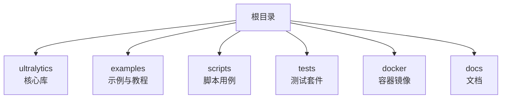
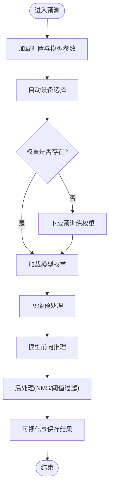
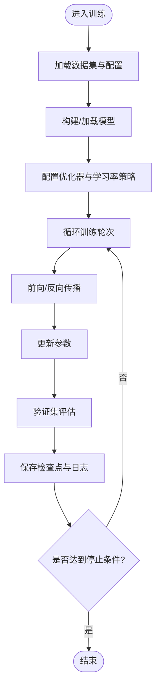
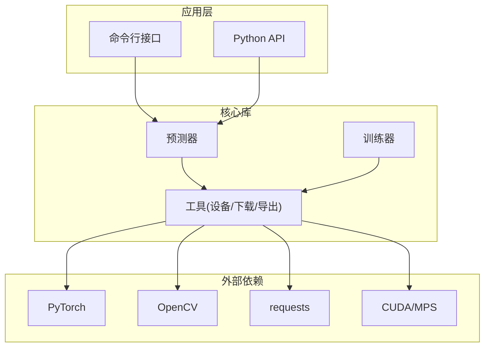

# 快速开始

<cite>
**本文引用的文件**
- [README.md](file://README.md)
- [pyproject.toml](file://pyproject.toml)
- [ultralytics/__init__.py](file://ultralytics/__init__.py)
- [ultralytics/engine/predictor.py](file://ultralytics/engine/predictor.py)
- [ultralytics/engine/trainer.py](file://ultralytics/engine/trainer.py)
- [ultralytics/utils/autodevice.py](file://ultralytics/utils/autodevice.py)
- [ultralytics/utils/downloads.py](file://ultralytics/utils/downloads.py)
- [examples/tutorial.ipynb](file://examples/tutorial.ipynb)
- [examples/object_counting.ipynb](file://examples/object_counting.ipynb)
- [examples/object_tracking.ipynb](file://examples/object_tracking.ipynb)
- [examples/hub.ipynb](file://examples/hub.ipynb)
- [scripts/smoke_test_coco2017.py](file://scripts/smoke_test_coco2017.py)
- [scripts/quick_train_verify.py](file://scripts/quick_train_verify.py)
- [tests/test_cli.py](file://tests/test_cli.py)
- [tests/test_python.py](file://tests/test_python.py)
- [docker/Dockerfile](file://docker/Dockerfile)
</cite>

## 目录
1. [简介](#简介)
2. [项目结构](#项目结构)
3. [核心组件](#核心组件)
4. [架构总览](#架构总览)
5. [详细组件分析](#详细组件分析)
6. [依赖分析](#依赖分析)
7. [性能考虑](#性能考虑)
8. [故障排查指南](#故障排查指南)
9. [结论](#结论)
10. [附录](#附录)

## 简介
本快速开始指南面向首次接触 YOLO-Master-v260720 的用户，目标是在 15 分钟内完成环境准备、依赖安装、第一个推理示例与基础训练任务。你将通过命令行与 Python API 两种方式体验目标检测推理、模型下载与使用，并了解常见安装问题的解决方案与验证步骤。

## 项目结构
仓库采用模块化组织方式：
- ultralytics：核心库，包含模型、引擎（预测、训练、验证）、工具与导出等
- examples：官方示例与教程（Jupyter Notebook）
- scripts：脚本化用例（如冒烟测试、快速训练验证）
- tests：单元测试与集成测试
- docker：容器镜像构建文件
- docs：文档与参考手册



[本节为概览性说明，不直接分析具体文件]

## 核心组件
- 预测器（Predictor）：封装推理流程，负责加载模型、预处理、前向推理与后处理可视化
- 训练器（Trainer）：封装训练流程，负责数据加载、优化器配置、损失计算与日志记录
- 自动设备选择（AutoDevice）：根据运行环境自动选择 CPU/GPU/MPS 等设备
- 模型下载（Downloads）：提供预训练权重与数据集的下载能力
- 入口与注册（__init__）：对外暴露高层 API 与默认配置

关键路径参考：
- 预测器实现：[ultralytics/engine/predictor.py](file://ultralytics/engine/predictor.py)
- 训练器实现：[ultralytics/engine/trainer.py](file://ultralytics/engine/trainer.py)
- 自动设备选择：[ultralytics/utils/autodevice.py](file://ultralytics/utils/autodevice.py)
- 模型下载：[ultralytics/utils/downloads.py](file://ultralytics/utils/downloads.py)
- 包入口与注册：[ultralytics/__init__.py](file://ultralytics/__init__.py)

**章节来源**
- [ultralytics/engine/predictor.py](file://ultralytics/engine/predictor.py)
- [ultralytics/engine/trainer.py](file://ultralytics/engine/trainer.py)
- [ultralytics/utils/autodevice.py](file://ultralytics/utils/autodevice.py)
- [ultralytics/utils/downloads.py](file://ultralytics/utils/downloads.py)
- [ultralytics/__init__.py](file://ultralytics/__init__.py)

## 架构总览
下图展示了从用户调用到模型推理的核心链路，包括设备选择、模型加载、推理执行与结果输出。

```mermaid
sequenceDiagram
participant U as "用户"
participant CLI as "命令行接口"
participant PY as "Python API"
participant P as "预测器(Predictor)"
participant AD as "自动设备(AutoDevice)"
participant DL as "下载(Downloads)"
participant M as "模型"
U->>CLI : "yolo predict ..."
U->>PY : "from ultralytics import YOLO; model = YOLO(...)"
CLI->>P : "初始化并运行预测"
PY->>P : "初始化并运行预测"
P->>AD : "选择设备(CPU/GPU/MPS)"
AD-->>P : "返回设备信息"
P->>DL : "若需要则下载预训练权重"
DL-->>P : "返回本地权重路径"
P->>M : "加载模型权重"
P->>M : "执行推理"
M-->>P : "返回检测结果"
P-->>CLI : "保存/显示结果"
P-->>PY : "返回结果对象"
```

**图表来源**
- [ultralytics/engine/predictor.py](file://ultralytics/engine/predictor.py)
- [ultralytics/utils/autodevice.py](file://ultralytics/utils/autodevice.py)
- [ultralytics/utils/downloads.py](file://ultralytics/utils/downloads.py)

**章节来源**
- [ultralytics/engine/predictor.py](file://ultralytics/engine/predictor.py)
- [ultralytics/utils/autodevice.py](file://ultralytics/utils/autodevice.py)
- [ultralytics/utils/downloads.py](file://ultralytics/utils/downloads.py)

## 详细组件分析

### 从零开始的完整入门流程（15 分钟）
- 环境准备
  - 操作系统：Linux/macOS/Windows
  - Python：建议使用 3.9+（以 pyproject.toml 为准）
  - GPU（可选）：NVIDIA CUDA 驱动与 cuDNN；macOS 支持 MPS
- 安装依赖
  - 推荐通过虚拟环境或 conda 创建独立环境
  - 使用 pip 安装核心包（详见 pyproject.toml 中的依赖声明）
- 验证安装
  - 运行 Python 导入检查：import ultralytics
  - 运行冒烟测试脚本：scripts/smoke_test_coco2017.py
- 第一个推理示例（命令行）
  - 使用 yolo predict 命令对图片/视频进行目标检测推理
  - 可指定模型名称或权重路径，自动下载预训练权重
- 第一个推理示例（Python API）
  - 通过 from ultralytics import YOLO 加载模型
  - 调用 model.predict(...) 执行推理并保存/展示结果
- 基础训练任务
  - 使用 yolo train 命令或 Python API 在小型数据集上进行训练
  - 参考 quick_train_verify.py 与 tutorial.ipynb 的流程

提示：
- 如需离线使用，请提前下载权重与数据集至本地目录
- 在 Windows 上如遇 CUDA 问题，可先使用 CPU 模式验证流程

**章节来源**
- [pyproject.toml](file://pyproject.toml)
- [scripts/smoke_test_coco2017.py](file://scripts/smoke_test_coco2017.py)
- [examples/tutorial.ipynb](file://examples/tutorial.ipynb)
- [examples/object_counting.ipynb](file://examples/object_counting.ipynb)
- [examples/object_tracking.ipynb](file://examples/object_tracking.ipynb)
- [examples/hub.ipynb](file://examples/hub.ipynb)
- [scripts/quick_train_verify.py](file://scripts/quick_train_verify.py)

### 命令行与 Python API 对比示例
- 命令行方式
  - 优点：无需编写代码，适合快速验证与批处理
  - 典型用法：yolo predict / yolo train / yolo val
  - 参考测试用例：tests/test_cli.py
- Python API 方式
  - 优点：灵活可控，便于集成到业务系统
  - 典型用法：from ultralytics import YOLO; model = YOLO(...); results = model.predict(...)
  - 参考测试用例：tests/test_python.py

对比要点：
- 参数传递：命令行通过 --arg=value，Python API 通过关键字参数
- 结果处理：命令行默认保存到 runs/detect，Python API 返回结果对象供进一步处理
- 扩展性：Python API 更易结合自定义预处理/后处理逻辑

**章节来源**
- [tests/test_cli.py](file://tests/test_cli.py)
- [tests/test_python.py](file://tests/test_python.py)

### 推理流程算法图


**图表来源**
- [ultralytics/engine/predictor.py](file://ultralytics/engine/predictor.py)
- [ultralytics/utils/autodevice.py](file://ultralytics/utils/autodevice.py)
- [ultralytics/utils/downloads.py](file://ultralytics/utils/downloads.py)

**章节来源**
- [ultralytics/engine/predictor.py](file://ultralytics/engine/predictor.py)
- [ultralytics/utils/autodevice.py](file://ultralytics/utils/autodevice.py)
- [ultralytics/utils/downloads.py](file://ultralytics/utils/downloads.py)

### 训练流程算法图


**图表来源**
- [ultralytics/engine/trainer.py](file://ultralytics/engine/trainer.py)

**章节来源**
- [ultralytics/engine/trainer.py](file://ultralytics/engine/trainer.py)

## 依赖分析
- 运行时依赖
  - PyTorch：深度学习框架核心
  - OpenCV：图像处理与可视化
  - NumPy/Pandas：数据处理
  - requests：网络请求（用于下载）
- 可选依赖
  - CUDA/cuDNN：GPU 加速
  - MPS：macOS 硬件加速
- 安装建议
  - 使用 pyproject.toml 中声明的版本范围，避免版本冲突
  - 在受限网络环境下，优先离线安装依赖与权重



**图表来源**
- [ultralytics/engine/predictor.py](file://ultralytics/engine/predictor.py)
- [ultralytics/engine/trainer.py](file://ultralytics/engine/trainer.py)
- [ultralytics/utils/autodevice.py](file://ultralytics/utils/autodevice.py)
- [ultralytics/utils/downloads.py](file://ultralytics/utils/downloads.py)
- [pyproject.toml](file://pyproject.toml)

**章节来源**
- [pyproject.toml](file://pyproject.toml)
- [ultralytics/engine/predictor.py](file://ultralytics/engine/predictor.py)
- [ultralytics/engine/trainer.py](file://ultralytics/engine/trainer.py)
- [ultralytics/utils/autodevice.py](file://ultralytics/utils/autodevice.py)
- [ultralytics/utils/downloads.py](file://ultralytics/utils/downloads.py)

## 性能考虑
- 设备选择
  - 优先使用 GPU；macOS 可使用 MPS；无可用 GPU 时回退到 CPU
  - 参考自动设备选择模块的实现细节
- 批量推理
  - 合理设置 batch size，平衡吞吐与显存占用
- 模型格式
  - 导出为 ONNX/TensorRT/OpenVINO 可提升部署性能
- 数据加载
  - 使用多进程数据加载与缓存，减少 I/O 瓶颈

[本节为通用指导，不直接分析具体文件]

## 故障排查指南
- 无法找到 CUDA 或 GPU 不可用
  - 确认已安装匹配的 CUDA/cuDNN 驱动
  - 使用自动设备选择模块查看当前设备状态
  - 临时切换 CPU 模式验证流程
- 网络超时导致权重下载失败
  - 配置代理或使用国内镜像源
  - 手动下载权重到本地目录并指定路径
- 依赖版本冲突
  - 严格遵循 pyproject.toml 的版本约束
  - 使用虚拟环境隔离依赖
- 验证安装
  - 运行冒烟测试脚本与单元测试，确保核心功能正常

**章节来源**
- [ultralytics/utils/autodevice.py](file://ultralytics/utils/autodevice.py)
- [ultralytics/utils/downloads.py](file://ultralytics/utils/downloads.py)
- [pyproject.toml](file://pyproject.toml)
- [scripts/smoke_test_coco2017.py](file://scripts/smoke_test_coco2017.py)
- [tests/test_cli.py](file://tests/test_cli.py)
- [tests/test_python.py](file://tests/test_python.py)

## 结论
通过以上步骤，你可以在 15 分钟内完成 YOLO-Master-v260720 的环境搭建、第一个推理示例与基础训练任务。建议后续深入阅读 examples 与 docs 中的教程，逐步掌握导出、跟踪、量化与部署等高级特性。

[本节为总结性内容，不直接分析具体文件]

## 附录
- 常用命令速查
  - 推理：yolo predict
  - 训练：yolo train
  - 验证：yolo val
  - 导出：yolo export
- 示例资源
  - Jupyter 教程：examples/tutorial.ipynb
  - 计数与跟踪：examples/object_counting.ipynb, examples/object_tracking.ipynb
  - Hub 使用：examples/hub.ipynb
- 容器化部署
  - 参考 docker/Dockerfile 构建镜像，简化环境一致性

**章节来源**
- [examples/tutorial.ipynb](file://examples/tutorial.ipynb)
- [examples/object_counting.ipynb](file://examples/object_counting.ipynb)
- [examples/object_tracking.ipynb](file://examples/object_tracking.ipynb)
- [examples/hub.ipynb](file://examples/hub.ipynb)
- [docker/Dockerfile](file://docker/Dockerfile)