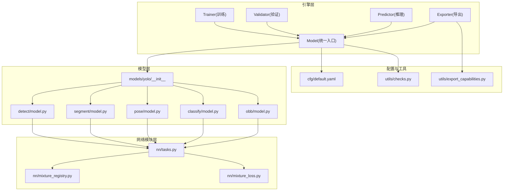
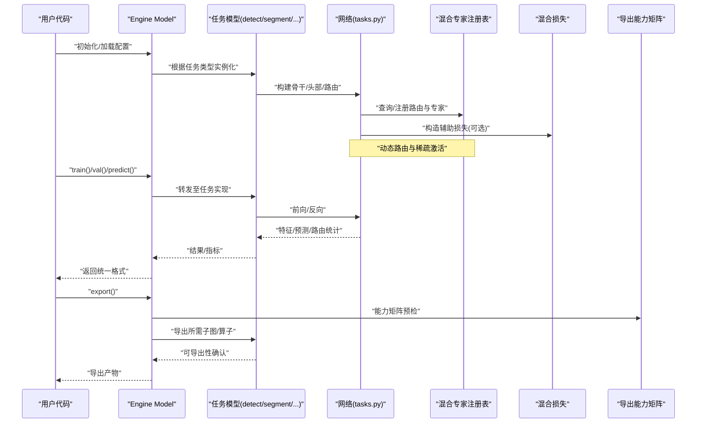
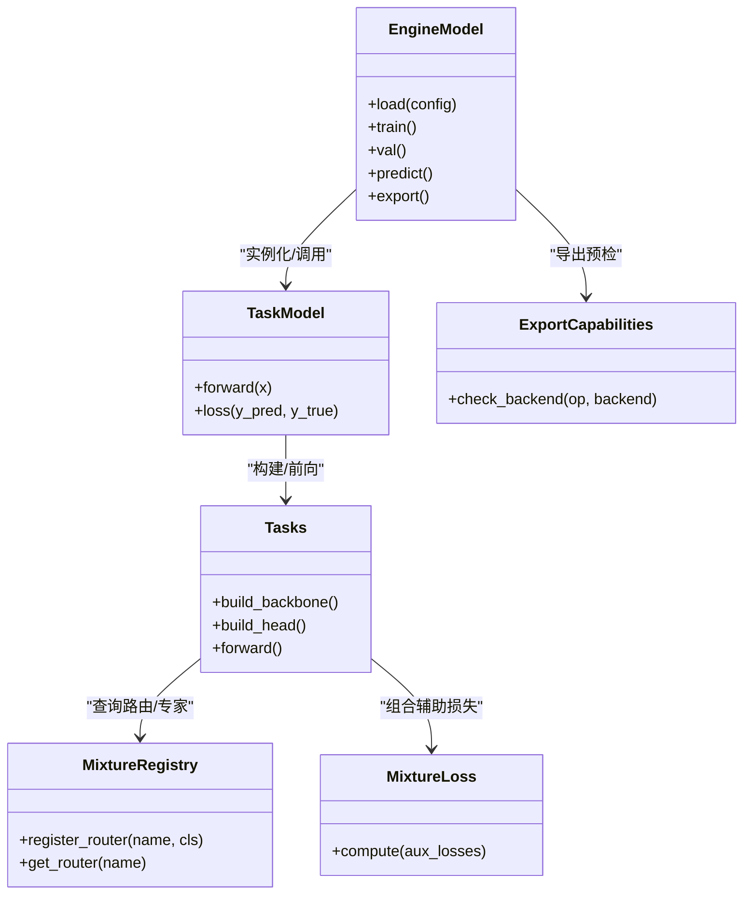

# 架构概览

<cite>
**本文引用的文件**
- [ultralytics/engine/model.py](file://ultralytics/engine/model.py)
- [ultralytics/engine/trainer.py](file://ultralytics/engine/trainer.py)
- [ultralytics/engine/validator.py](file://ultralytics/engine/validator.py)
- [ultralytics/engine/predictor.py](file://ultralytics/engine/predictor.py)
- [ultralytics/engine/exporter.py](file://ultralytics/engine/exporter.py)
- [ultralytics/models/yolo/__init__.py](file://ultralytics/models/yolo/__init__.py)
- [ultralytics/models/yolo/detect/model.py](file://ultralytics/models/yolo/detect/model.py)
- [ultralytics/models/yolo/segment/model.py](file://ultralytics/models/yolo/segment/model.py)
- [ultralytics/models/yolo/pose/model.py](file://ultralytics/models/yolo/pose/model.py)
- [ultralytics/models/yolo/classify/model.py](file://ultralytics/models/yolo/classify/model.py)
- [ultralytics/models/yolo/obb/model.py](file://ultralytics/models/yolo/obb/model.py)
- [ultralytics/nn/tasks.py](file://ultralytics/nn/tasks.py)
- [ultralytics/nn/mixture_registry.py](file://ultralytics/nn/mixture_registry.py)
- [ultralytics/nn/mixture_loss.py](file://ultralytics/nn/mixture_loss.py)
- [ultralytics/cfg/default.yaml](file://ultralytics/cfg/default.yaml)
- [ultralytics/utils/export_capabilities.py](file://ultralytics/utils/export_capabilities.py)
- [ultralytics/utils/checks.py](file://ultralytics/utils/checks.py)
- [tests/test_mixture_config_registry.py](file://tests/test_mixture_config_registry.py)
- [tests/test_export_capability_matrix.py](file://tests/test_export_capability_matrix.py)
</cite>

## 目录
1. [简介](#简介)
2. [项目结构](#项目结构)
3. [核心组件](#核心组件)
4. [架构总览](#架构总览)
5. [详细组件分析](#详细组件分析)
6. [依赖关系分析](#依赖关系分析)
7. [性能考量](#性能考量)
8. [故障排查指南](#故障排查指南)
9. [结论](#结论)
10. [附录](#附录)

## 简介
本文件面向开发者，系统性梳理 YOLO-Master 的整体架构与分层设计。重点说明：
- 引擎层、模型层、网络模块层的职责边界与协作方式
- 核心组件之间的交互关系与数据流向
- 模块化设计与插件机制（任务模型注册、混合专家路由注册、导出能力矩阵）
- 配置管理系统的设计理念与扩展方式
- 关键设计决策与技术选型说明
- 架构图与组件关系图，帮助快速理解整体思路

## 项目结构
YOLO-Master 采用“引擎-模型-网络”三层解耦的目录组织方式：
- ultralytics/engine：训练、验证、推理、导出等运行时引擎
- ultralytics/models：按任务划分的模型封装（检测、分割、姿态、分类、旋转框）
- ultralytics/nn：网络构建、任务抽象、混合专家（MoE/MoA）注册与损失
- ultralytics/cfg：默认配置与数据集/模型配置
- ultralytics/utils：通用工具（导出能力矩阵、检查器、日志等）
- tests：覆盖注册表、导出能力、数值稳定性等关键路径的测试

图示来源
- [ultralytics/engine/model.py](file://ultralytics/engine/model.py)
- [ultralytics/models/yolo/__init__.py](file://ultralytics/models/yolo/__init__.py)
- [ultralytics/models/yolo/detect/model.py](file://ultralytics/models/yolo/detect/model.py)
- [ultralytics/models/yolo/segment/model.py](file://ultralytics/models/yolo/segment/model.py)
- [ultralytics/models/yolo/pose/model.py](file://ultralytics/models/yolo/pose/model.py)
- [ultralytics/models/yolo/classify/model.py](file://ultralytics/models/yolo/classify/model.py)
- [ultralytics/models/yolo/obb/model.py](file://ultralytics/models/yolo/obb/model.py)
- [ultralytics/nn/tasks.py](file://ultralytics/nn/tasks.py)
- [ultralytics/nn/mixture_registry.py](file://ultralytics/nn/mixture_registry.py)
- [ultralytics/nn/mixture_loss.py](file://ultralytics/nn/mixture_loss.py)
- [ultralytics/cfg/default.yaml](file://ultralytics/cfg/default.yaml)
- [ultralytics/utils/export_capabilities.py](file://ultralytics/utils/export_capabilities.py)
- [ultralytics/utils/checks.py](file://ultralytics/utils/checks.py)

章节来源
- [ultralytics/engine/model.py](file://ultralytics/engine/model.py)
- [ultralytics/models/yolo/__init__.py](file://ultralytics/models/yolo/__init__.py)
- [ultralytics/nn/tasks.py](file://ultralytics/nn/tasks.py)
- [ultralytics/cfg/default.yaml](file://ultralytics/cfg/default.yaml)

## 核心组件
- 统一模型入口（Engine Model）
  - 负责加载配置、实例化具体任务模型、管理设备与权重、暴露统一的 train/val/predict/export 接口
  - 作为上层 API 与底层任务模型的适配层，屏蔽任务差异
- 任务模型（Task Models）
  - 针对 detect/segment/pose/classify/obb 等任务提供专用模型封装
  - 通过工厂/注册机制由统一入口按需创建
- 网络与任务抽象（Tasks & Modules）
  - 定义任务级构建流程、头/骨干组合、前向契约
  - 集成混合专家（MoE/MoA）注册表与损失计算，支持动态路由与稀疏激活
- 运行时引擎（Trainer/Validator/Predictor/Exporter）
  - Trainer：训练循环、优化器、EMA、回调、分布式策略
  - Validator：指标计算、评估协议、结果汇总
  - Predictor：推理流水线、后处理、可视化
  - Exporter：多后端导出（ONNX/TensorRT/OpenVINO 等），结合导出能力矩阵进行预检与约束校验
- 配置系统（Config）
  - 以 YAML 为中心，提供默认配置与任务/数据集/超参覆盖
  - 在模型构建与导出阶段被读取并校验

章节来源
- [ultralytics/engine/model.py](file://ultralytics/engine/model.py)
- [ultralytics/engine/trainer.py](file://ultralytics/engine/trainer.py)
- [ultralytics/engine/validator.py](file://ultralytics/engine/validator.py)
- [ultralytics/engine/predictor.py](file://ultralytics/engine/predictor.py)
- [ultralytics/engine/exporter.py](file://ultralytics/engine/exporter.py)
- [ultralytics/models/yolo/__init__.py](file://ultralytics/models/yolo/__init__.py)
- [ultralytics/nn/tasks.py](file://ultralytics/nn/tasks.py)
- [ultralytics/nn/mixture_registry.py](file://ultralytics/nn/mixture_registry.py)
- [ultralytics/nn/mixture_loss.py](file://ultralytics/nn/mixture_loss.py)
- [ultralytics/cfg/default.yaml](file://ultralytics/cfg/default.yaml)

## 架构总览
下图展示从用户调用到具体执行的关键路径，体现“统一入口 → 任务模型 → 网络模块”的数据与控制流。

图示来源
- [ultralytics/engine/model.py](file://ultralytics/engine/model.py)
- [ultralytics/models/yolo/detect/model.py](file://ultralytics/models/yolo/detect/model.py)
- [ultralytics/nn/tasks.py](file://ultralytics/nn/tasks.py)
- [ultralytics/nn/mixture_registry.py](file://ultralytics/nn/mixture_registry.py)
- [ultralytics/nn/mixture_loss.py](file://ultralytics/nn/mixture_loss.py)
- [ultralytics/utils/export_capabilities.py](file://ultralytics/utils/export_capabilities.py)

## 详细组件分析

### 统一模型入口（Engine Model）
- 职责
  - 解析配置、选择任务模型、管理设备与权重、统一对外 API
  - 协调 Trainer/Validator/Predictor/Exporter 的生命周期
- 关键点
  - 基于任务类型或配置文件中的 task 字段分派到对应模型类
  - 对导出流程进行能力预检，避免不支持的后端/算子组合
- 扩展点
  - 新增任务时，仅需在任务注册处添加映射，无需改动上层 API

章节来源
- [ultralytics/engine/model.py](file://ultralytics/engine/model.py)
- [ultralytics/models/yolo/__init__.py](file://ultralytics/models/yolo/__init__.py)

### 任务模型封装（Detect/Segment/Pose/Classify/OBB）
- 职责
  - 为不同视觉任务提供专用模型封装与前/后处理约定
  - 复用 tasks.py 的任务构建逻辑，聚焦任务特有分支与输出
- 关键点
  - 各任务模型继承自统一基类，保持接口一致
  - 在需要时接入 MoE/MoA 路由与辅助损失
- 扩展点
  - 新增任务只需实现最小必要的前向与输出规范，并通过注册表暴露

章节来源
- [ultralytics/models/yolo/detect/model.py](file://ultralytics/models/yolo/detect/model.py)
- [ultralytics/models/yolo/segment/model.py](file://ultralytics/models/yolo/segment/model.py)
- [ultralytics/models/yolo/pose/model.py](file://ultralytics/models/yolo/pose/model.py)
- [ultralytics/models/yolo/classify/model.py](file://ultralytics/models/yolo/classify/model.py)
- [ultralytics/models/yolo/obb/model.py](file://ultralytics/models/yolo/obb/model.py)

### 网络与任务抽象（tasks.py）
- 职责
  - 定义任务级构建流程（骨干、颈部、头部）、前向契约、输出对齐
  - 集成混合专家（MoE/MoA）路由与损失，支撑稀疏激活与可解释性
- 关键点
  - 通过注册表动态加载路由与专家模块
  - 将辅助损失（如路由均衡、专家使用率）与主任务损失组合
- 扩展点
  - 新增路由策略或专家模块，需在注册表中声明并在 tasks 中引用

章节来源
- [ultralytics/nn/tasks.py](file://ultralytics/nn/tasks.py)
- [ultralytics/nn/mixture_registry.py](file://ultralytics/nn/mixture_registry.py)
- [ultralytics/nn/mixture_loss.py](file://ultralytics/nn/mixture_loss.py)

### 运行时引擎（Trainer/Validator/Predictor/Exporter）
- Trainer
  - 训练循环、优化器调度、EMA、回调、分布式通信
- Validator
  - 指标计算、评估协议、结果聚合与报告
- Predictor
  - 推理流水线、NMS/后处理、可视化
- Exporter
  - 多后端导出、能力矩阵预检、导出产物一致性校验

章节来源
- [ultralytics/engine/trainer.py](file://ultralytics/engine/trainer.py)
- [ultralytics/engine/validator.py](file://ultralytics/engine/validator.py)
- [ultralytics/engine/predictor.py](file://ultralytics/engine/predictor.py)
- [ultralytics/engine/exporter.py](file://ultralytics/engine/exporter.py)

### 配置管理系统（YAML + 默认配置）
- 设计理念
  - 以 YAML 为单一事实源，集中管理数据集、模型、超参与导出选项
  - 支持层级覆盖（默认 → 任务 → 用户自定义）
- 扩展方式
  - 新增配置项需同步更新默认模板与校验逻辑
  - 导出相关配置与能力矩阵联动，确保导出可行性

章节来源
- [ultralytics/cfg/default.yaml](file://ultralytics/cfg/default.yaml)
- [ultralytics/utils/export_capabilities.py](file://ultralytics/utils/export_capabilities.py)
- [ultralytics/utils/checks.py](file://ultralytics/utils/checks.py)

### 混合专家（MoE/MoA）与路由注册
- 设计要点
  - 通过注册表统一管理路由与专家模块，支持热插拔
  - 损失侧提供辅助目标，引导路由均衡与专家利用率
- 验证与回归
  - 测试覆盖注册表行为、配置解析、导出兼容性等

章节来源
- [ultralytics/nn/mixture_registry.py](file://ultralytics/nn/mixture_registry.py)
- [ultralytics/nn/mixture_loss.py](file://ultralytics/nn/mixture_loss.py)
- [tests/test_mixture_config_registry.py](file://tests/test_mixture_config_registry.py)
- [tests/test_export_capability_matrix.py](file://tests/test_export_capability_matrix.py)

### 导出能力矩阵与预检
- 作用
  - 维护各后端/算子的能力矩阵，用于导出前的可行性判断
  - 避免运行期失败，提升用户体验与稳定性
- 集成点
  - 在 Exporter 与 Engine Model 的导出流程中调用

章节来源
- [ultralytics/utils/export_capabilities.py](file://ultralytics/utils/export_capabilities.py)
- [ultralytics/engine/exporter.py](file://ultralytics/engine/exporter.py)

## 依赖关系分析
- 耦合与内聚
  - Engine Model 与任务模型之间通过注册表低耦合；任务模型内部高内聚
  - 网络层与任务层通过 tasks.py 契约解耦，便于替换路由/专家
- 外部依赖
  - 导出能力矩阵与后端 SDK 的对接位于 utils/export_capabilities.py
  - 配置与校验位于 cfg 与 utils/checks.py
- 潜在循环依赖
  - 通过注册表与工厂模式避免直接硬编码导入，降低循环风险

图示来源
- [ultralytics/engine/model.py](file://ultralytics/engine/model.py)
- [ultralytics/models/yolo/detect/model.py](file://ultralytics/models/yolo/detect/model.py)
- [ultralytics/nn/tasks.py](file://ultralytics/nn/tasks.py)
- [ultralytics/nn/mixture_registry.py](file://ultralytics/nn/mixture_registry.py)
- [ultralytics/nn/mixture_loss.py](file://ultralytics/nn/mixture_loss.py)
- [ultralytics/utils/export_capabilities.py](file://ultralytics/utils/export_capabilities.py)

章节来源
- [ultralytics/engine/model.py](file://ultralytics/engine/model.py)
- [ultralytics/nn/tasks.py](file://ultralytics/nn/tasks.py)
- [ultralytics/nn/mixture_registry.py](file://ultralytics/nn/mixture_registry.py)
- [ultralytics/utils/export_capabilities.py](file://ultralytics/utils/export_capabilities.py)

## 性能考量
- 稀疏激活与路由
  - 通过 MoE/MoA 路由减少每步计算量，配合辅助损失提升专家利用率均衡性
- 导出优化
  - 借助能力矩阵提前规避不可用算子，减少无效导出尝试
- 训练稳定性
  - EMA、梯度裁剪、AMP 等策略在 Trainer 中集成，保障收敛稳定
- I/O 与批处理
  - 数据加载与批大小自适应在数据管线与引擎中协同优化

[本节为通用指导，不直接分析具体文件]

## 故障排查指南
- 导出失败
  - 检查导出能力矩阵是否支持目标后端与算子组合
  - 参考导出预检错误信息，调整模型结构或后端选项
- 路由/专家异常
  - 核对注册表是否正确注册路由与专家
  - 检查辅助损失权重与路由正则化参数
- 配置不一致
  - 对比默认配置与自定义配置的键名与取值范围
  - 使用检查器定位缺失或非法字段

章节来源
- [ultralytics/utils/export_capabilities.py](file://ultralytics/utils/export_capabilities.py)
- [ultralytics/utils/checks.py](file://ultralytics/utils/checks.py)
- [tests/test_export_capability_matrix.py](file://tests/test_export_capability_matrix.py)
- [tests/test_mixture_config_registry.py](file://tests/test_mixture_config_registry.py)

## 结论
YOLO-Master 通过“引擎-模型-网络”的分层设计与注册表机制，实现了任务可扩展、路由可插拔、导出可验证的体系。统一入口屏蔽了任务差异，任务模型聚焦领域特性，网络层提供通用构建与 MoE/MoA 能力。配置系统与导出能力矩阵共同保障了易用性与稳定性。建议在新任务与新路由开发中遵循现有契约与注册流程，以获得最佳的可维护性与性能收益。

## 附录
- 术语
  - 引擎层：训练/验证/推理/导出的运行时编排
  - 模型层：按任务封装的模型实现
  - 网络模块层：骨干/颈部/头部/路由/损失的通用构建
- 关键设计决策
  - 注册表驱动的任务与路由扩展
  - 导出前置能力校验，避免运行期失败
  - 以 YAML 为中心的层级配置与覆盖

[本节为概念性补充，不直接分析具体文件]