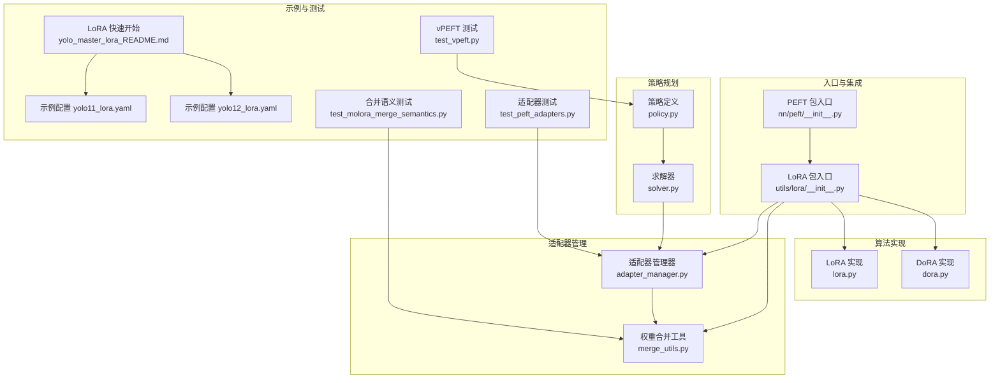
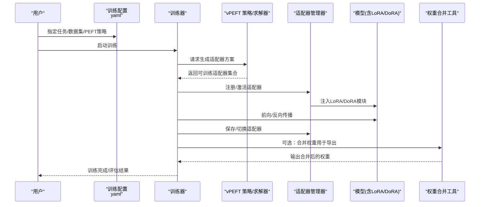
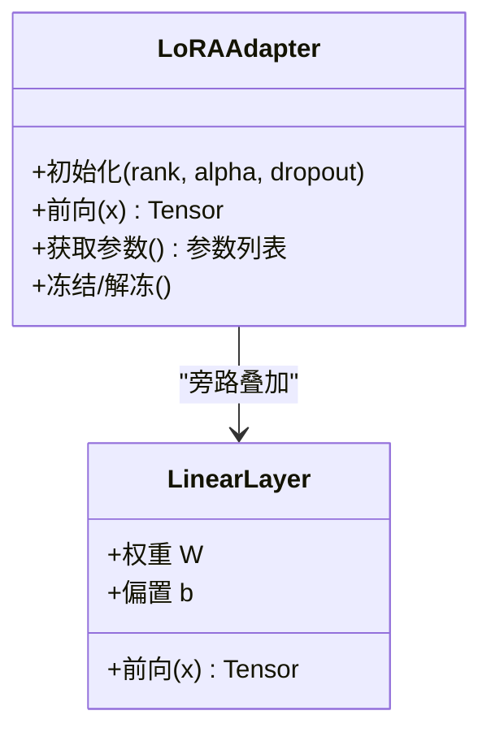
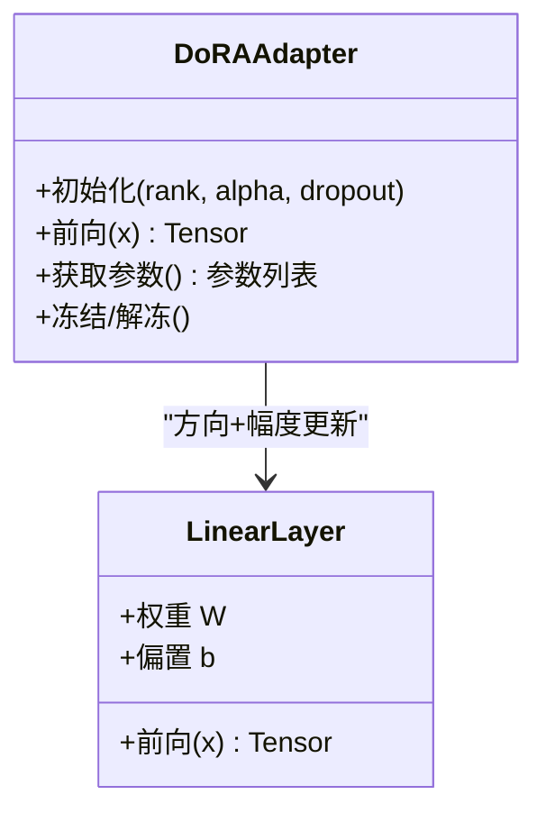
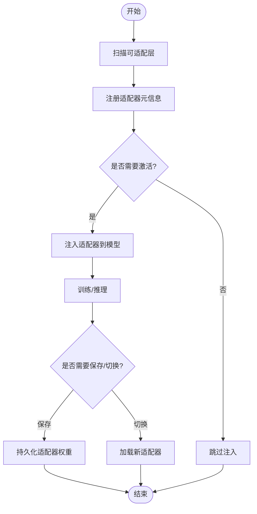
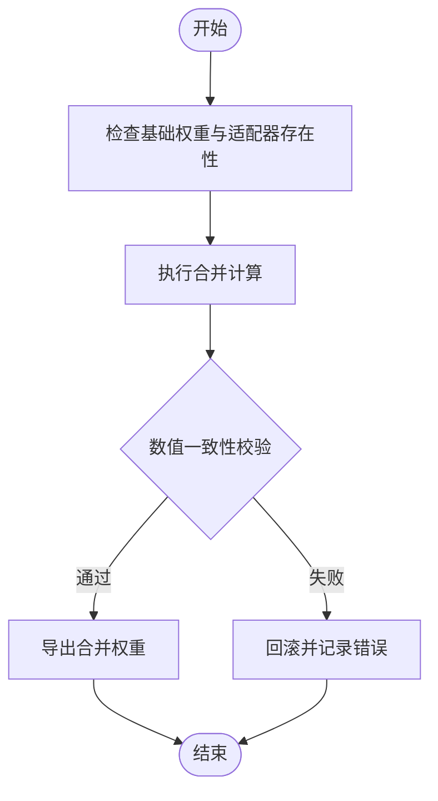
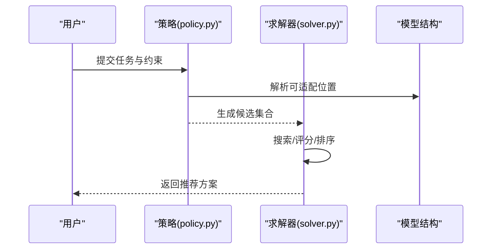
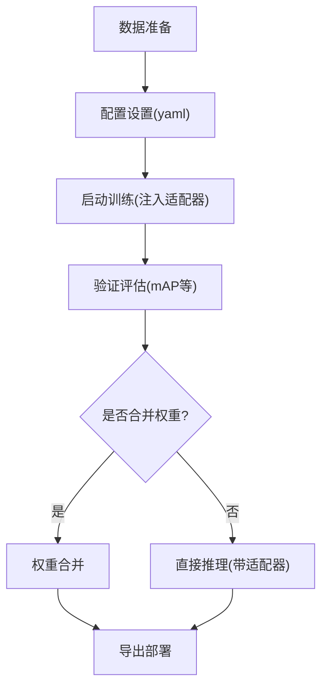
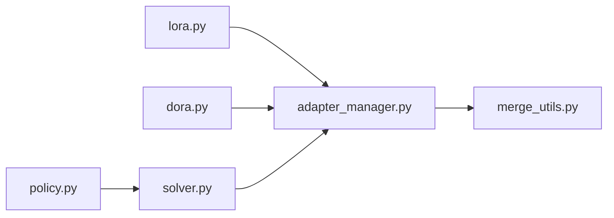

# 参数高效微调

<cite>
**本文引用的文件**
- [ultralytics/nn/peft/__init__.py](file://ultralytics/nn/peft/__init__.py)
- [ultralytics/utils/lora/__init__.py](file://ultralytics/utils/lora/__init__.py)
- [ultralytics/utils/lora/lora.py](file://ultralytics/utils/lora/lora.py)
- [ultralytics/utils/lora/dora.py](file://ultralytics/utils/lora/dora.py)
- [ultralytics/utils/lora/adapter_manager.py](file://ultralytics/utils/lora/adapter_manager.py)
- [ultralytics/utils/lora/merge_utils.py](file://ultralytics/utils/lora/merge_utils.py)
- [ultralytics/vpeft/policy.py](file://ultralytics/vpeft/policy.py)
- [ultralytics/vpeft/solver.py](file://ultralytics/vpeft/solver.py)
- [examples/lora_examples/yolo_master_lora_README.md](file://examples/lora_examples/yolo_master_lora_README.md)
- [examples/lora_examples/yolo11_lora.yaml](file://examples/lora_examples/yolo11_lora.yaml)
- [examples/lora_examples/yolo12_lora.yaml](file://examples/lora_examples/yolo12_lora.yaml)
- [examples/molora/basic_finetune.py](file://examples/molora/basic_finetune.py)
- [scripts/ablation_suite/ablation_peft_coco128.py](file://scripts/ablation_suite/ablation_peft_coco128.py)
- [tests/test_peft_adapters.py](file://tests/test_peft_adapters.py)
- [tests/test_molora_merge_semantics.py](file://tests/test_molora_merge_semantics.py)
- [tests/test_vpeft.py](file://tests/test_vpeft.py)
</cite>

## 目录
1. [简介](#简介)
2. [项目结构](#项目结构)
3. [核心组件](#核心组件)
4. [架构总览](#架构总览)
5. [详细组件分析](#详细组件分析)
6. [依赖关系分析](#依赖关系分析)
7. [性能考量](#性能考量)
8. [故障排查指南](#故障排查指南)
9. [结论](#结论)
10. [附录](#附录)

## 简介
本文件系统性介绍 YOLO-Master 中的参数高效微调（PEFT）能力，重点覆盖 LoRA、DoRA 的原理与实现、适配器管理、权重合并、增量学习等特性。文档提供从数据准备、配置设置、训练到评估的完整流程，并给出不同策略的适用场景、性能对比、最佳实践与常见问题解决方案，辅以实际案例与效果验证路径。

## 项目结构
YOLO-Master 将 PEFT 相关能力拆分为“算法实现”、“适配器管理”、“策略规划”和“示例/测试”四个层次：
- 算法实现层：LoRA、DoRA 的具体算子与模块封装
- 适配器管理层：适配器的注册、选择、加载、卸载与生命周期管理
- 策略规划层：基于任务/模型结构的自动选择与求解器
- 示例与测试：端到端脚本、配置文件与回归用例

图表来源
- [ultralytics/nn/peft/__init__.py](file://ultralytics/nn/peft/__init__.py)
- [ultralytics/utils/lora/__init__.py](file://ultralytics/utils/lora/__init__.py)
- [ultralytics/utils/lora/lora.py](file://ultralytics/utils/lora/lora.py)
- [ultralytics/utils/lora/dora.py](file://ultralytics/utils/lora/dora.py)
- [ultralytics/utils/lora/adapter_manager.py](file://ultralytics/utils/lora/adapter_manager.py)
- [ultralytics/utils/lora/merge_utils.py](file://ultralytics/utils/lora/merge_utils.py)
- [ultralytics/vpeft/policy.py](file://ultralytics/vpeft/policy.py)
- [ultralytics/vpeft/solver.py](file://ultralytics/vpeft/solver.py)
- [examples/lora_examples/yolo_master_lora_README.md](file://examples/lora_examples/yolo_master_lora_README.md)
- [examples/lora_examples/yolo11_lora.yaml](file://examples/lora_examples/yolo11_lora.yaml)
- [examples/lora_examples/yolo12_lora.yaml](file://examples/lora_examples/yolo12_lora.yaml)
- [tests/test_peft_adapters.py](file://tests/test_peft_adapters.py)
- [tests/test_molora_merge_semantics.py](file://tests/test_molora_merge_semantics.py)
- [tests/test_vpeft.py](file://tests/test_vpeft.py)

章节来源
- [ultralytics/nn/peft/__init__.py](file://ultralytics/nn/peft/__init__.py)
- [ultralytics/utils/lora/__init__.py](file://ultralytics/utils/lora/__init__.py)
- [ultralytics/utils/lora/lora.py](file://ultralytics/utils/lora/lora.py)
- [ultralytics/utils/lora/dora.py](file://ultralytics/utils/lora/dora.py)
- [ultralytics/utils/lora/adapter_manager.py](file://ultralytics/utils/lora/adapter_manager.py)
- [ultralytics/utils/lora/merge_utils.py](file://ultralytics/utils/lora/merge_utils.py)
- [ultralytics/vpeft/policy.py](file://ultralytics/vpeft/policy.py)
- [ultralytics/vpeft/solver.py](file://ultralytics/vpeft/solver.py)
- [examples/lora_examples/yolo_master_lora_README.md](file://examples/lora_examples/yolo_master_lora_README.md)
- [examples/lora_examples/yolo11_lora.yaml](file://examples/lora_examples/yolo11_lora.yaml)
- [examples/lora_examples/yolo12_lora.yaml](file://examples/lora_examples/yolo12_lora.yaml)
- [tests/test_peft_adapters.py](file://tests/test_peft_adapters.py)
- [tests/test_molora_merge_semantics.py](file://tests/test_molora_merge_semantics.py)
- [tests/test_vpeft.py](file://tests/test_vpeft.py)

## 核心组件
- LoRA 实现：以低秩矩阵对目标线性层进行旁路更新，显著降低可训练参数量，适合在保持主干冻结的前提下注入领域知识。
- DoRA 实现：在 LoRA 基础上引入方向分解思想，增强更新方向的稳定性与表达能力，适用于需要更强表征能力的下游任务。
- 适配器管理器：负责适配器的注册、激活/停用、切换、持久化与版本控制，支持多任务/多场景下的动态组合。
- 权重合并工具：提供将适配器权重与基础模型权重安全合并的能力，便于导出与部署；同时支持反向解耦以恢复原始权重。
- vPEFT 策略与求解器：根据模型结构与任务约束自动生成可训练的适配器集合，并进行资源与精度权衡的求解。

章节来源
- [ultralytics/utils/lora/lora.py](file://ultralytics/utils/lora/lora.py)
- [ultralytics/utils/lora/dora.py](file://ultralytics/utils/lora/dora.py)
- [ultralytics/utils/lora/adapter_manager.py](file://ultralytics/utils/lora/adapter_manager.py)
- [ultralytics/utils/lora/merge_utils.py](file://ultralytics/utils/lora/merge_utils.py)
- [ultralytics/vpeft/policy.py](file://ultralytics/vpeft/policy.py)
- [ultralytics/vpeft/solver.py](file://ultralytics/vpeft/solver.py)

## 架构总览
下图展示了从用户配置到训练与评估的关键调用链，以及适配器管理与权重合并的交互点。

图表来源
- [examples/lora_examples/yolo11_lora.yaml](file://examples/lora_examples/yolo11_lora.yaml)
- [examples/lora_examples/yolo12_lora.yaml](file://examples/lora_examples/yolo12_lora.yaml)
- [ultralytics/vpeft/policy.py](file://ultralytics/vpeft/policy.py)
- [ultralytics/vpeft/solver.py](file://ultralytics/vpeft/solver.py)
- [ultralytics/utils/lora/adapter_manager.py](file://ultralytics/utils/lora/adapter_manager.py)
- [ultralytics/utils/lora/lora.py](file://ultralytics/utils/lora/lora.py)
- [ultralytics/utils/lora/dora.py](file://ultralytics/utils/lora/dora.py)
- [ultralytics/utils/lora/merge_utils.py](file://ultralytics/utils/lora/merge_utils.py)

## 详细组件分析

### LoRA 组件分析
- 设计要点
  - 通过低秩矩阵近似权重增量，减少显存与计算开销
  - 与主干网络解耦，便于多任务复用与热插拔
  - 支持按层/按模块粒度注入，灵活控制可训练范围
- 关键接口
  - 适配器创建与注册
  - 前向时叠加低秩更新
  - 梯度回传仅作用于低秩参数
- 复杂度与性能
  - 时间复杂度近似为 O(r·d)，r 为秩，d 为维度
  - 空间复杂度显著低于全量微调，利于小样本与边缘设备

图表来源
- [ultralytics/utils/lora/lora.py](file://ultralytics/utils/lora/lora.py)

章节来源
- [ultralytics/utils/lora/lora.py](file://ultralytics/utils/lora/lora.py)

### DoRA 组件分析
- 设计要点
  - 在 LoRA 的基础上引入方向分解，提升更新方向的稳定性与表达力
  - 更适合复杂分布或长尾类别的数据集
- 关键接口
  - 与 LoRA 一致的注册/激活/切换接口
  - 内部包含方向与幅度的双分支更新
- 复杂度与性能
  - 相较 LoRA 略有额外开销，但通常带来更好的收敛性与泛化

图表来源
- [ultralytics/utils/lora/dora.py](file://ultralytics/utils/lora/dora.py)

章节来源
- [ultralytics/utils/lora/dora.py](file://ultralytics/utils/lora/dora.py)

### 适配器管理组件分析
- 功能概览
  - 注册/发现：扫描模型中可插入适配器的位置
  - 激活/停用：按需启用特定适配器，支持多任务并行
  - 切换/组合：在不同场景间快速切换适配器集合
  - 持久化：保存/加载适配器权重，支持版本管理
- 与训练/推理的集成
  - 训练阶段：动态注入与梯度隔离
  - 推理阶段：可选择是否合并权重以提升速度

图表来源
- [ultralytics/utils/lora/adapter_manager.py](file://ultralytics/utils/lora/adapter_manager.py)

章节来源
- [ultralytics/utils/lora/adapter_manager.py](file://ultralytics/utils/lora/adapter_manager.py)

### 权重合并组件分析
- 功能概览
  - 正向合并：将适配器权重与基础模型权重融合，得到可直接部署的模型
  - 反向解耦：从合并权重中恢复基础权重与适配器权重
  - 一致性校验：确保合并前后数值一致，避免部署偏差
- 使用建议
  - 仅在导出/部署前执行合并，训练过程中保持分离以获得更灵活的实验能力

图表来源
- [ultralytics/utils/lora/merge_utils.py](file://ultralytics/utils/lora/merge_utils.py)

章节来源
- [ultralytics/utils/lora/merge_utils.py](file://ultralytics/utils/lora/merge_utils.py)

### vPEFT 策略与求解器
- 策略（Policy）
  - 定义可插入适配器的候选集合与约束条件（如层类型、形状匹配、资源上限）
  - 结合任务需求（精度、延迟、内存）生成策略模板
- 求解器（Solver）
  - 在策略空间内搜索最优适配器组合
  - 考虑训练成本、推理开销与迁移收益的多目标优化
- 典型工作流
  - 输入：模型结构、任务描述、资源预算
  - 输出：适配器集合及其超参数建议

图表来源
- [ultralytics/vpeft/policy.py](file://ultralytics/vpeft/policy.py)
- [ultralytics/vpeft/solver.py](file://ultralytics/vpeft/solver.py)

章节来源
- [ultralytics/vpeft/policy.py](file://ultralytics/vpeft/policy.py)
- [ultralytics/vpeft/solver.py](file://ultralytics/vpeft/solver.py)

### 端到端微调工作流程
- 数据准备
  - 使用 YOLO 标准格式组织图像与标注
  - 针对少样本/长尾场景，建议配合数据增强与采样策略
- 配置设置
  - 在 YAML 中指定任务、数据集、基础模型与 PEFT 策略（LoRA/DoRA、rank、alpha 等）
- 训练过程
  - 启动训练后，系统自动注入适配器，冻结主干，仅训练适配器参数
  - 支持断点续训与适配器版本管理
- 结果评估
  - 使用验证集指标（mAP、召回率等）评估性能
  - 对比不同 rank/alpha 与 LoRA/DoRA 的效果差异
- 部署导出
  - 选择合并权重后进行导出（ONNX/TensorRT 等），或直接使用带适配器的推理路径

图表来源
- [examples/lora_examples/yolo_master_lora_README.md](file://examples/lora_examples/yolo_master_lora_README.md)
- [examples/lora_examples/yolo11_lora.yaml](file://examples/lora_examples/yolo11_lora.yaml)
- [examples/lora_examples/yolo12_lora.yaml](file://examples/lora_examples/yolo12_lora.yaml)

章节来源
- [examples/lora_examples/yolo_master_lora_README.md](file://examples/lora_examples/yolo_master_lora_README.md)
- [examples/lora_examples/yolo11_lora.yaml](file://examples/lora_examples/yolo11_lora.yaml)
- [examples/lora_examples/yolo12_lora.yaml](file://examples/lora_examples/yolo12_lora.yaml)

## 依赖关系分析
- 模块耦合
  - LoRA/DoRA 作为底层算子被适配器管理器统一调度
  - 权重合并工具依赖适配器与基础权重的完整性
  - vPEFT 策略与求解器独立于具体适配器实现，具备可扩展性
- 外部依赖
  - PyTorch 张量与自动微分
  - 训练/验证框架（YOLO 引擎）
- 潜在循环依赖
  - 通过入口包（__init__.py）进行集中导入，避免深层循环引用

图表来源
- [ultralytics/utils/lora/lora.py](file://ultralytics/utils/lora/lora.py)
- [ultralytics/utils/lora/dora.py](file://ultralytics/utils/lora/dora.py)
- [ultralytics/utils/lora/adapter_manager.py](file://ultralytics/utils/lora/adapter_manager.py)
- [ultralytics/utils/lora/merge_utils.py](file://ultralytics/utils/lora/merge_utils.py)
- [ultralytics/vpeft/policy.py](file://ultralytics/vpeft/policy.py)
- [ultralytics/vpeft/solver.py](file://ultralytics/vpeft/solver.py)

章节来源
- [ultralytics/utils/lora/lora.py](file://ultralytics/utils/lora/lora.py)
- [ultralytics/utils/lora/dora.py](file://ultralytics/utils/lora/dora.py)
- [ultralytics/utils/lora/adapter_manager.py](file://ultralytics/utils/lora/adapter_manager.py)
- [ultralytics/utils/lora/merge_utils.py](file://ultralytics/utils/lora/merge_utils.py)
- [ultralytics/vpeft/policy.py](file://ultralytics/vpeft/policy.py)
- [ultralytics/vpeft/solver.py](file://ultralytics/vpeft/solver.py)

## 性能考量
- 训练效率
  - 冻结主干、仅训练低秩参数，显著降低显存占用与训练时长
  - DoRA 相较 LoRA 有轻微额外开销，但在复杂任务上收敛更快
- 推理开销
  - 不合并权重：推理时需叠加适配器计算，增加少量延迟
  - 合并权重：导出后可获得接近全量微调的性能与更低延迟
- 资源预算
  - 通过 rank/alpha 控制可训练参数量与表达能力
  - 使用 vPEFT 策略在精度与资源之间做权衡

[本节为通用指导，无需列出具体文件来源]

## 故障排查指南
- 常见错误
  - 适配器未正确注入：检查注册与激活流程，确认目标层匹配
  - 合并权重不一致：核对合并前后的数值一致性校验日志
  - 训练不稳定：调整 LoRA/DoRA 的 rank/alpha 与学习率，必要时启用梯度裁剪
- 定位方法
  - 使用单元测试验证适配器行为与合并语义
  - 查看训练日志中的可训练参数统计与损失曲线
- 参考用例
  - 适配器行为与生命周期测试
  - 合并语义与数值稳定性测试
  - vPEFT 策略与求解器回归测试

章节来源
- [tests/test_peft_adapters.py](file://tests/test_peft_adapters.py)
- [tests/test_molora_merge_semantics.py](file://tests/test_molora_merge_semantics.py)
- [tests/test_vpeft.py](file://tests/test_vpeft.py)

## 结论
YOLO-Master 的 PEFT 体系以 LoRA/DoRA 为核心，结合统一的适配器管理与权重合并工具，提供了灵活、高效且可部署的微调方案。通过 vPEFT 策略与求解器，可在不同任务与资源约束下自动选择最优适配器组合。实践中建议从小 rank 起步，逐步扩展，并结合验证集指标与部署需求决定是否合并权重。

[本节为总结性内容，无需列出具体文件来源]

## 附录
- 实战案例
  - 基础微调脚本：用于快速上手与复现实验
  - 消融实验：在 COCO128 上进行 LoRA/DoRA 与 rank 的对比
- 参考路径
  - 基础微调脚本：[basic_finetune.py](file://examples/molora/basic_finetune.py)
  - 消融实验脚本：[ablation_peft_coco128.py](file://scripts/ablation_suite/ablation_peft_coco128.py)

章节来源
- [examples/molora/basic_finetune.py](file://examples/molora/basic_finetune.py)
- [scripts/ablation_suite/ablation_peft_coco128.py](file://scripts/ablation_suite/ablation_peft_coco128.py)