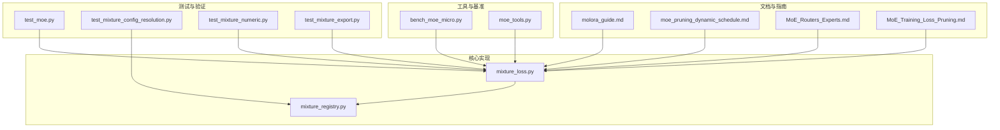
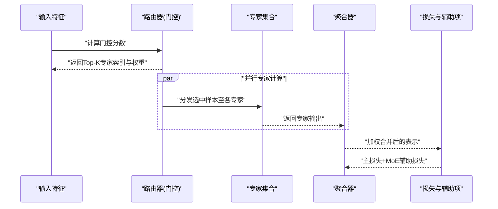
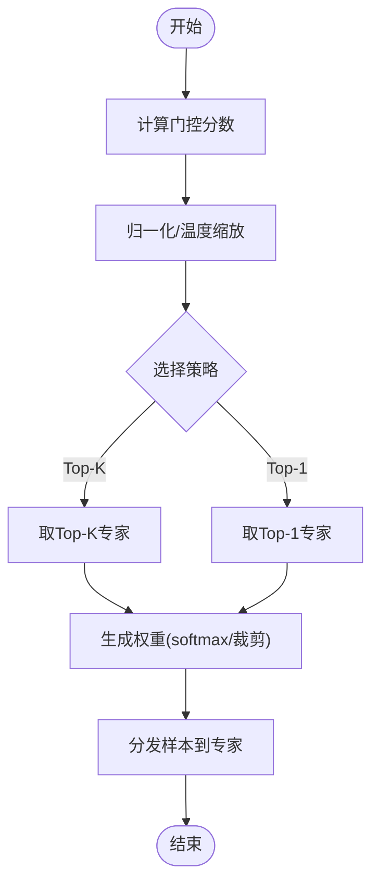
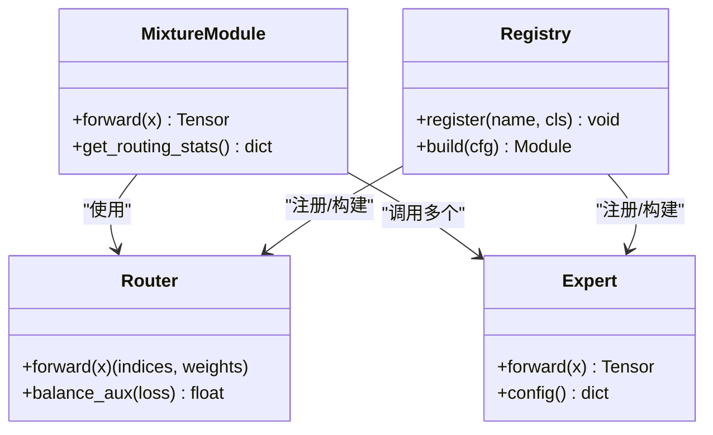
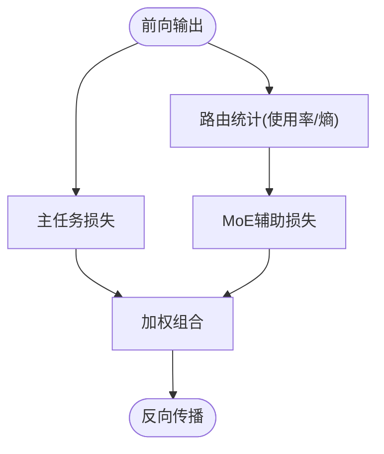
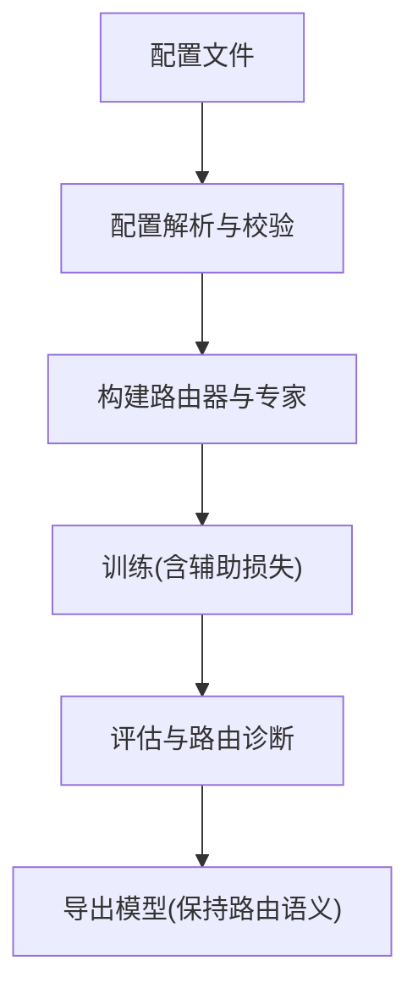
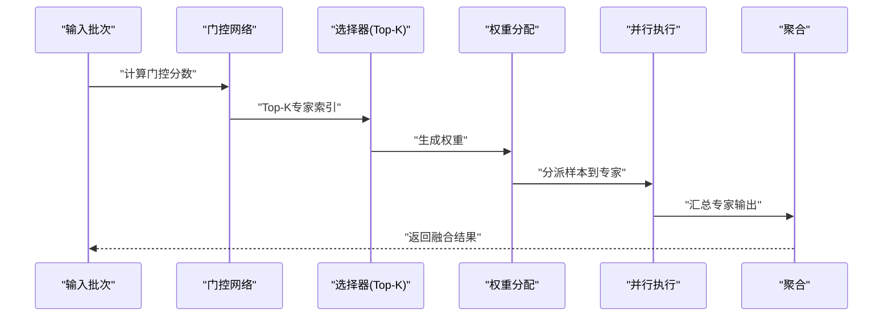
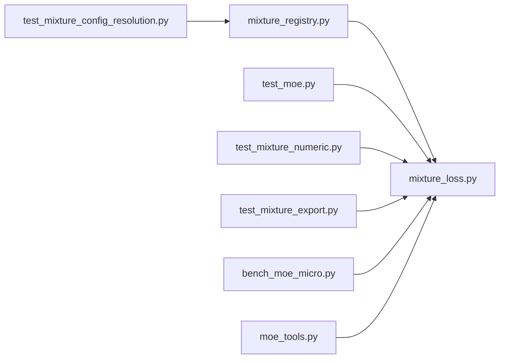

# MoE架构设计

<cite>
**本文引用的文件**
- [mixture_loss.py](file://ultralytics/nn/mixture_loss.py)
- [mixture_registry.py](file://ultralytics/nn/mixture_registry.py)
- [test_moe.py](file://tests/test_moe.py)
- [test_mixture_config_resolution.py](file://tests/test_mixture_config_resolution.py)
- [test_mixture_numeric.py](file://tests/test_mixture_numeric.py)
- [test_mixture_export.py](file://tests/test_mixture_export.py)
- [bench_moe_micro.py](file://scripts/bench_moe_micro.py)
- [moe_tools.py](file://agent/runtime/cli/moe_tools.py)
- [molora_guide.md](file://docs/molora_guide.md)
- [moe_pruning_dynamic_schedule.md](file://docs/moe_pruning_dynamic_schedule.md)
- [MoE_Routers_Experts.md](file://wiki/MoE/MoE_Routers_Experts.md)
- [MoE_Training_Loss_Pruning.md](file://wiki/MoE/MoE_Training_Loss_Pruning.md)
</cite>

## 目录
1. [引言](#引言)
2. [项目结构](#项目结构)
3. [核心组件](#核心组件)
4. [架构总览](#架构总览)
5. [详细组件分析](#详细组件分析)
6. [依赖关系分析](#依赖关系分析)
7. [性能考量](#性能考量)
8. [故障排查指南](#故障排查指南)
9. [结论](#结论)
10. [附录](#附录)

## 引言
本文件聚焦于YOLO-Master中Mixture of Experts（MoE）的核心架构设计与实现要点，围绕以下目标展开：
- 专家网络的模块化结构与注册机制
- 路由器的决策机制与负载均衡策略
- 动态激活与稀疏计算的门控、专家选择与权重分配
- 配置示例与调度策略说明
- 架构图与数据流说明，帮助理解MoE相比传统密集模型的优势与适用场景

## 项目结构
在YOLO-Master中，MoE相关能力主要分布在以下位置：
- 核心模块与损失：ultralytics/nn/mixture_loss.py、ultralytics/nn/mixture_registry.py
- 测试与验证：tests/test_moe.py、tests/test_mixture_*.py
- 基准与工具：scripts/bench_moe_micro.py、agent/runtime/cli/moe_tools.py
- 文档与指南：docs/molora_guide.md、docs/moe_pruning_dynamic_schedule.md、wiki/MoE/*.md

图表来源
- [mixture_loss.py](file://ultralytics/nn/mixture_loss.py)
- [mixture_registry.py](file://ultralytics/nn/mixture_registry.py)
- [test_moe.py](file://tests/test_moe.py)
- [test_mixture_config_resolution.py](file://tests/test_mixture_config_resolution.py)
- [test_mixture_numeric.py](file://tests/test_mixture_numeric.py)
- [test_mixture_export.py](file://tests/test_mixture_export.py)
- [bench_moe_micro.py](file://scripts/bench_moe_micro.py)
- [moe_tools.py](file://agent/runtime/cli/moe_tools.py)
- [molora_guide.md](file://docs/molora_guide.md)
- [moe_pruning_dynamic_schedule.md](file://docs/moe_pruning_dynamic_schedule.md)
- [MoE_Routers_Experts.md](file://wiki/MoE/MoE_Routers_Experts.md)
- [MoE_Training_Loss_Pruning.md](file://wiki/MoE/MoE_Training_Loss_Pruning.md)

章节来源
- [mixture_loss.py](file://ultralytics/nn/mixture_loss.py)
- [mixture_registry.py](file://ultralytics/nn/mixture_registry.py)
- [test_moe.py](file://tests/test_moe.py)
- [test_mixture_config_resolution.py](file://tests/test_mixture_config_resolution.py)
- [test_mixture_numeric.py](file://tests/test_mixture_numeric.py)
- [test_mixture_export.py](file://tests/test_mixture_export.py)
- [bench_moe_micro.py](file://scripts/bench_moe_micro.py)
- [moe_tools.py](file://agent/runtime/cli/moe_tools.py)
- [molora_guide.md](file://docs/molora_guide.md)
- [moe_pruning_dynamic_schedule.md](file://docs/moe_pruning_dynamic_schedule.md)
- [MoE_Routers_Experts.md](file://wiki/MoE/MoE_Routers_Experts.md)
- [MoE_Training_Loss_Pruning.md](file://wiki/MoE/MoE_Training_Loss_Pruning.md)

## 核心组件
- 专家网络（Experts）
  - 以可插拔的模块化形式存在，通过注册表进行统一管理与实例化。
  - 支持按层或按任务挂载不同专家，便于多模态与多任务扩展。
- 路由器（Router/Gating）
  - 负责将输入特征映射到专家选择与权重分配，通常包含门控网络与Top-K选择逻辑。
  - 提供多种路由策略（如Top-K、Top-1），并可与负载均衡辅助项结合。
- 混合聚合（Mixture Aggregation）
  - 对选中的专家输出进行加权求和，得到最终表示。
- 损失与辅助项（Loss & Auxiliaries）
  - 包括主任务损失与MoE相关的辅助损失（如负载均衡、路由熵等）。
- 配置与注册（Config & Registry）
  - 通过配置文件定义专家数量、路由参数、调度策略，并由注册表解析与构建。

章节来源
- [mixture_registry.py](file://ultralytics/nn/mixture_registry.py)
- [mixture_loss.py](file://ultralytics/nn/mixture_loss.py)
- [test_moe.py](file://tests/test_moe.py)
- [test_mixture_config_resolution.py](file://tests/test_mixture_config_resolution.py)
- [test_mixture_numeric.py](file://tests/test_mixture_numeric.py)
- [test_mixture_export.py](file://tests/test_mixture_export.py)

## 架构总览
下图展示了MoE在前向推理与训练过程中的关键数据流：输入特征进入路由器，路由器输出专家索引与权重；被激活的专家并行处理各自子集的特征；最后由聚合器按权重合并结果。

图表来源
- [mixture_loss.py](file://ultralytics/nn/mixture_loss.py)
- [mixture_registry.py](file://ultralytics/nn/mixture_registry.py)
- [test_moe.py](file://tests/test_moe.py)

## 详细组件分析

### 路由器与门控机制
- 门控网络
  - 将输入特征投影为专家得分，常用softmax或top-k softmax生成权重。
  - 支持温度系数、掩码与裁剪策略，控制稀疏度与稳定性。
- 专家选择算法
  - Top-K选择：每个输入仅激活K个专家，保证稀疏性。
  - 可选Top-1或自适应K，根据任务需求调整。
- 负载均衡策略
  - 引入辅助损失鼓励均匀使用专家，避免“热点专家”现象。
  - 常见策略包括容量因子、路由熵惩罚、频率均衡等。

图表来源
- [mixture_loss.py](file://ultralytics/nn/mixture_loss.py)
- [test_moe.py](file://tests/test_moe.py)

章节来源
- [mixture_loss.py](file://ultralytics/nn/mixture_loss.py)
- [test_moe.py](file://tests/test_moe.py)

### 专家网络与模块化结构
- 模块化设计
  - 专家作为独立模块，可通过注册表动态加载与替换。
  - 支持不同维度与结构的专家，适配不同子任务或领域。
- 并行与稀疏执行
  - 仅激活少数专家，减少计算量与内存占用。
  - 借助批内重排与分块，提升GPU利用率。

图表来源
- [mixture_registry.py](file://ultralytics/nn/mixture_registry.py)
- [mixture_loss.py](file://ultralytics/nn/mixture_loss.py)
- [test_moe.py](file://tests/test_moe.py)

章节来源
- [mixture_registry.py](file://ultralytics/nn/mixture_registry.py)
- [mixture_loss.py](file://ultralytics/nn/mixture_loss.py)
- [test_moe.py](file://tests/test_moe.py)

### 损失函数与辅助项
- 主任务损失
  - 与下游任务一致（检测、分割、姿态等）。
- MoE辅助损失
  - 负载均衡：促使各专家使用率趋于均匀。
  - 路由熵：鼓励更确定性的路由，提高稀疏性与效率。
- 组合方式
  - 加权组合主损失与辅助损失，超参可调。

图表来源
- [mixture_loss.py](file://ultralytics/nn/mixture_loss.py)
- [test_mixture_numeric.py](file://tests/test_mixture_numeric.py)

章节来源
- [mixture_loss.py](file://ultralytics/nn/mixture_loss.py)
- [test_mixture_numeric.py](file://tests/test_mixture_numeric.py)

### 配置与调度策略
- 专家数量与类型
  - 通过配置文件指定专家总数、每层专家数与专家类型。
- 路由参数
  - 设置Top-K、温度系数、门控维度与正则化强度。
- 调度策略
  - 静态调度：固定专家容量与路由规则。
  - 动态调度：根据负载与历史使用率调整路由偏好或容量。
- 导出与兼容性
  - 确保路由与专家在导出格式下保持行为一致。

图表来源
- [test_mixture_config_resolution.py](file://tests/test_mixture_config_resolution.py)
- [test_mixture_export.py](file://tests/test_mixture_export.py)
- [molora_guide.md](file://docs/molora_guide.md)
- [moe_pruning_dynamic_schedule.md](file://docs/moe_pruning_dynamic_schedule.md)

章节来源
- [test_mixture_config_resolution.py](file://tests/test_mixture_config_resolution.py)
- [test_mixture_export.py](file://tests/test_mixture_export.py)
- [molora_guide.md](file://docs/molora_guide.md)
- [moe_pruning_dynamic_schedule.md](file://docs/moe_pruning_dynamic_schedule.md)

### 动态激活与稀疏计算
- 门控机制
  - 基于输入特征的实时门控，决定哪些专家参与计算。
- 专家选择算法
  - Top-K选择保证稀疏性，降低计算开销。
- 权重分配策略
  - 软权重用于平滑梯度，硬选择用于极致稀疏。
- 动态调度
  - 根据运行时负载与历史统计，动态调整路由偏好或容量上限。

图表来源
- [moe_tools.py](file://agent/runtime/cli/moe_tools.py)
- [bench_moe_micro.py](file://scripts/bench_moe_micro.py)
- [molora_guide.md](file://docs/molora_guide.md)

章节来源
- [moe_tools.py](file://agent/runtime/cli/moe_tools.py)
- [bench_moe_micro.py](file://scripts/bench_moe_micro.py)
- [molora_guide.md](file://docs/molora_guide.md)

## 依赖关系分析
- 内部依赖
  - mixture_loss.py依赖mixture_registry.py进行模块注册与构建。
  - 测试用例覆盖配置解析、数值稳定性与导出一致性。
- 外部依赖
  - 基于PyTorch张量操作与分布式通信（如需DDP）。
  - 导出流程需兼容ONNX/TensorRT等后端。

图表来源
- [mixture_registry.py](file://ultralytics/nn/mixture_registry.py)
- [mixture_loss.py](file://ultralytics/nn/mixture_loss.py)
- [test_moe.py](file://tests/test_moe.py)
- [test_mixture_config_resolution.py](file://tests/test_mixture_config_resolution.py)
- [test_mixture_numeric.py](file://tests/test_mixture_numeric.py)
- [test_mixture_export.py](file://tests/test_mixture_export.py)
- [bench_moe_micro.py](file://scripts/bench_moe_micro.py)
- [moe_tools.py](file://agent/runtime/cli/moe_tools.py)

章节来源
- [mixture_registry.py](file://ultralytics/nn/mixture_registry.py)
- [mixture_loss.py](file://ultralytics/nn/mixture_loss.py)
- [test_moe.py](file://tests/test_moe.py)
- [test_mixture_config_resolution.py](file://tests/test_mixture_config_resolution.py)
- [test_mixture_numeric.py](file://tests/test_mixture_numeric.py)
- [test_mixture_export.py](file://tests/test_mixture_export.py)
- [bench_moe_micro.py](file://scripts/bench_moe_micro.py)
- [moe_tools.py](file://agent/runtime/cli/moe_tools.py)

## 性能考量
- 稀疏性带来的收益
  - 仅激活部分专家，显著降低FLOPs与显存占用。
- 并行与通信
  - 合理划分专家与批次，减少跨设备通信开销。
- 路由稳定性
  - 温度系数与辅助损失平衡稀疏性与收敛性。
- 导出优化
  - 固化路由路径或采用路由感知合并，提升部署效率。

[本节为通用指导，不直接分析具体文件]

## 故障排查指南
- 路由不稳定或NaN
  - 检查门控分数是否溢出，适当调整温度与裁剪阈值。
  - 确认辅助损失权重与容量因子设置合理。
- 专家使用不均
  - 增强负载均衡辅助项，监控专家使用率分布。
- 导出后行为不一致
  - 验证路由与专家在导出前后的一致性，参考导出测试用例。

章节来源
- [test_mixture_numeric.py](file://tests/test_mixture_numeric.py)
- [test_mixture_export.py](file://tests/test_mixture_export.py)
- [MoE_Training_Loss_Pruning.md](file://wiki/MoE/MoE_Training_Loss_Pruning.md)

## 结论
YOLO-Master的MoE架构通过模块化专家、灵活的路由器与完善的辅助损失，实现了高效的稀疏计算与良好的可扩展性。配合动态调度与导出优化，可在复杂视觉任务中获得优于传统密集模型的性价比表现。建议在实际项目中结合任务特性与资源约束，选择合适的专家数量、路由策略与调度方案，并通过基准与诊断工具持续优化。

[本节为总结性内容，不直接分析具体文件]

## 附录
- 配置示例要点
  - 专家数量：定义全局与每层专家数，支持异构专家类型。
  - 路由参数：Top-K、温度系数、门控维度、正则化强度。
  - 调度策略：静态容量与动态偏好调整，结合使用率统计。
- 参考文档
  - molora_guide.md：Molora与MoE集成指南
  - moe_pruning_dynamic_schedule.md：动态剪枝与调度策略
  - MoE_Routers_Experts.md：路由器与专家的设计说明
  - MoE_Training_Loss_Pruning.md：训练损失与剪枝实践

章节来源
- [molora_guide.md](file://docs/molora_guide.md)
- [moe_pruning_dynamic_schedule.md](file://docs/moe_pruning_dynamic_schedule.md)
- [MoE_Routers_Experts.md](file://wiki/MoE/MoE_Routers_Experts.md)
- [MoE_Training_Loss_Pruning.md](file://wiki/MoE/MoE_Training_Loss_Pruning.md)