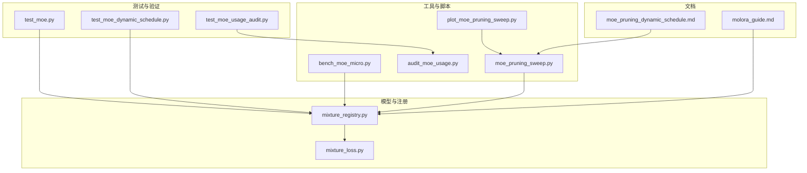
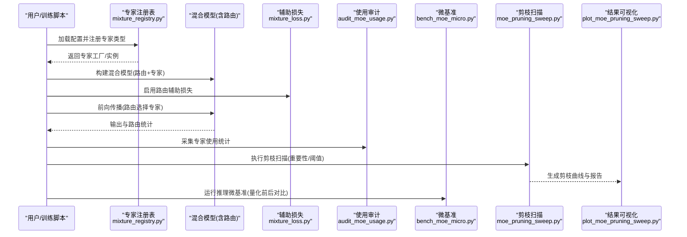
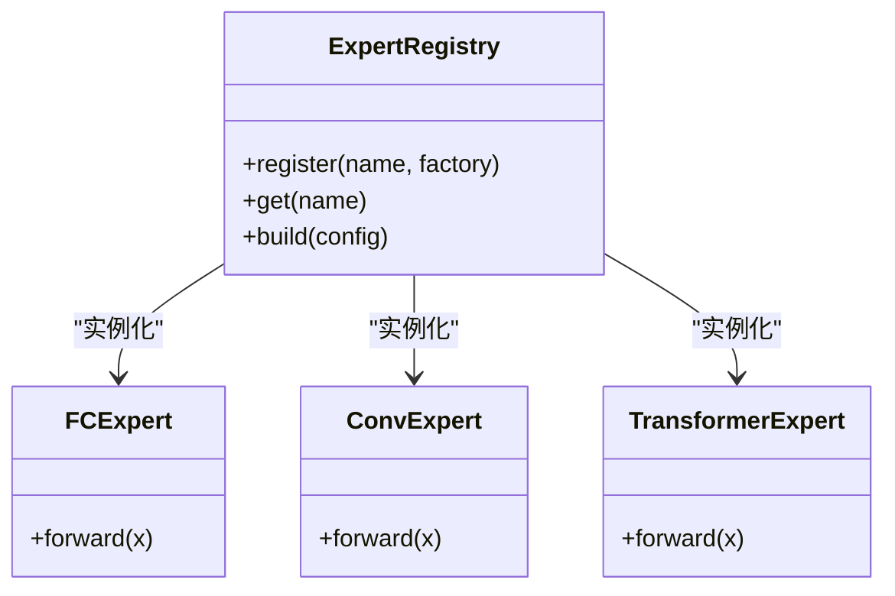
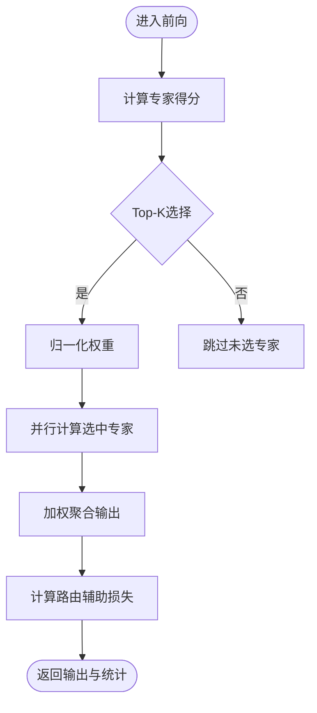
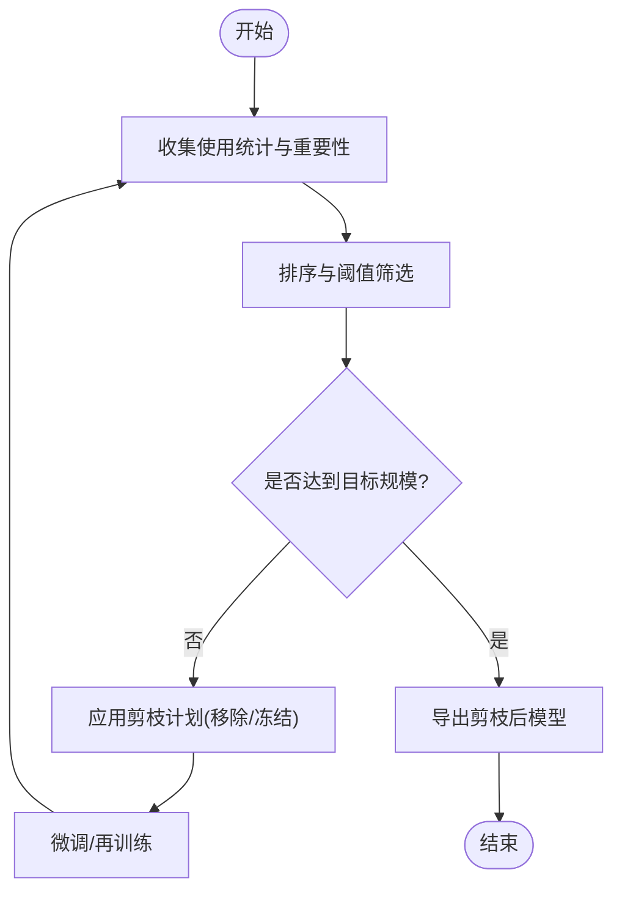
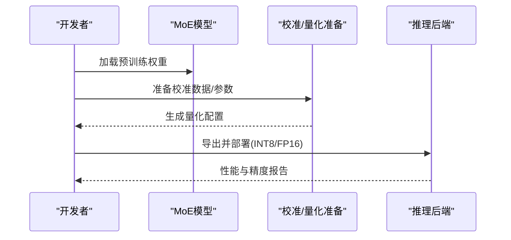
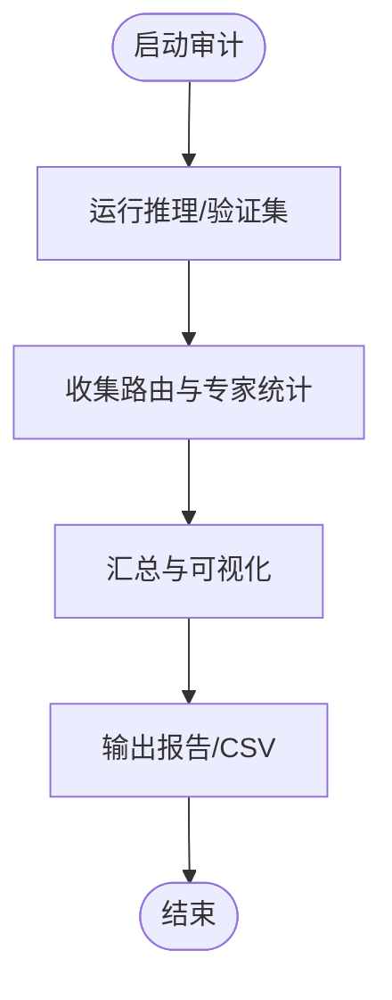
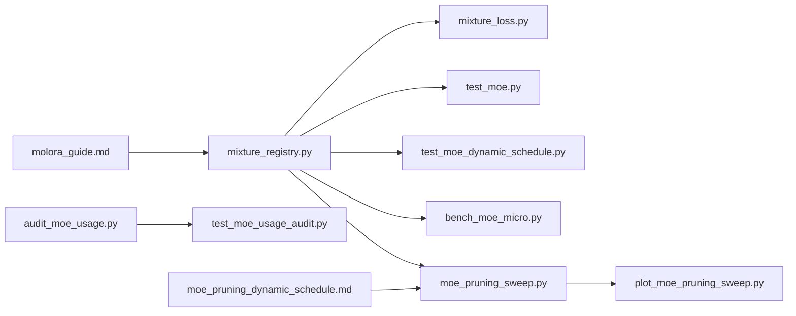

# 专家网络管理

<cite>
**本文引用的文件**
- [mixture_loss.py](file://ultralytics/nn/mixture_loss.py)
- [mixture_registry.py](file://ultralytics/nn/mixture_registry.py)
- [test_moe.py](file://tests/test_moe.py)
- [test_moe_dynamic_schedule.py](file://tests/test_moe_dynamic_schedule.py)
- [test_moe_usage_audit.py](file://tests/test_moe_usage_audit.py)
- [bench_moe_micro.py](file://scripts/bench_moe_micro.py)
- [audit_moe_usage.py](file://scripts/audit_moe_usage.py)
- [moe_pruning_sweep.py](file://scripts/moe_pruning_sweep.py)
- [plot_moe_pruning_sweep.py](file://scripts/plot_moe_pruning_sweep.py)
- [issue52_pruning_results.csv](file://scripts/issue52_pruning_results.csv)
- [issue52_expert_usage_gini.csv](file://scripts/issue52_expert_usage_gini.csv)
- [issue52_per_layer_experts.csv](file://scripts/issue52_per_layer_experts.csv)
- [molora_guide.md](file://docs/molora_guide.md)
- [moe_pruning_dynamic_schedule.md](file://docs/moe_pruning_dynamic_schedule.md)
</cite>

## 目录
1. [简介](#简介)
2. [项目结构](#项目结构)
3. [核心组件](#核心组件)
4. [架构总览](#架构总览)
5. [详细组件分析](#详细组件分析)
6. [依赖关系分析](#依赖关系分析)
7. [性能考量](#性能考量)
8. [故障排查指南](#故障排查指南)
9. [结论](#结论)
10. [附录](#附录)

## 简介
本文件围绕“专家网络（Mixture of Experts, MoE）”的创建、管理与优化机制展开，聚焦以下目标：
- 不同类型专家的实现与选择：全连接专家、卷积专家、Transformer专家。
- 专家剪枝技术：重要性评估、结构化剪枝与渐进式压缩。
- 专家量化技术：INT8与FP16对推理速度与内存占用的影响及实现要点。
- 权重初始化策略、微调方法与迁移学习支持。
- 使用统计分析与性能调优指南。

为便于读者理解，文档在高层概览后逐步深入到代码级实现与测试验证路径，并辅以流程图与时序图说明关键流程。

## 项目结构
本项目中与MoE相关的核心能力分布在如下位置：
- 模型与注册：混合路由与专家注册接口位于 nn 模块下，负责专家类型发现、实例化与生命周期管理。
- 损失与辅助项：混合训练中的路由辅助损失与负载均衡等逻辑集中在 mixture_loss 中。
- 工具与脚本：提供微基准、使用审计、剪枝扫描与可视化脚本，用于评估与调优。
- 文档与计划：包含动态调度剪枝与 MOLORA 相关指南，指导实践与实验设计。

图表来源
- [mixture_registry.py](file://ultralytics/nn/mixture_registry.py)
- [mixture_loss.py](file://ultralytics/nn/mixture_loss.py)
- [test_moe.py](file://tests/test_moe.py)
- [test_moe_dynamic_schedule.py](file://tests/test_moe_dynamic_schedule.py)
- [test_moe_usage_audit.py](file://tests/test_moe_usage_audit.py)
- [bench_moe_micro.py](file://scripts/bench_moe_micro.py)
- [audit_moe_usage.py](file://scripts/audit_moe_usage.py)
- [moe_pruning_sweep.py](file://scripts/moe_pruning_sweep.py)
- [plot_moe_pruning_sweep.py](file://scripts/plot_moe_pruning_sweep.py)
- [molora_guide.md](file://docs/molora_guide.md)
- [moe_pruning_dynamic_schedule.md](file://docs/moe_pruning_dynamic_schedule.md)

章节来源
- [mixture_registry.py](file://ultralytics/nn/mixture_registry.py)
- [mixture_loss.py](file://ultralytics/nn/mixture_loss.py)
- [test_moe.py](file://tests/test_moe.py)
- [test_moe_dynamic_schedule.py](file://tests/test_moe_dynamic_schedule.py)
- [test_moe_usage_audit.py](file://tests/test_moe_usage_audit.py)
- [bench_moe_micro.py](file://scripts/bench_moe_micro.py)
- [audit_moe_usage.py](file://scripts/audit_moe_usage.py)
- [moe_pruning_sweep.py](file://scripts/moe_pruning_sweep.py)
- [plot_moe_pruning_sweep.py](file://scripts/plot_moe_pruning_sweep.py)
- [molora_guide.md](file://docs/molora_guide.md)
- [moe_pruning_dynamic_schedule.md](file://docs/moe_pruning_dynamic_schedule.md)

## 核心组件
- 专家注册表与工厂：集中管理专家类型的注册、查找与实例化，屏蔽不同专家实现的差异，统一对外接口。
- 路由与辅助损失：在训练阶段通过路由辅助损失促进负载均衡与稳定收敛，避免“赢家通吃”。
- 动态调度与剪枝：基于使用统计与重要性指标，动态调整每层专家数量或激活规模，实现渐进式压缩。
- 量化与导出：在推理阶段对专家权重进行精度转换（如INT8/FP16），结合后端加速提升吞吐并降低显存占用。
- 统计与可观测性：收集专家被调用频次、负载分布与路由置信度，支撑诊断与调参。

章节来源
- [mixture_registry.py](file://ultralytics/nn/mixture_registry.py)
- [mixture_loss.py](file://ultralytics/nn/mixture_loss.py)
- [test_moe_dynamic_schedule.py](file://tests/test_moe_dynamic_schedule.py)
- [test_moe_usage_audit.py](file://tests/test_moe_usage_audit.py)

## 架构总览
下图展示了从配置到训练、剪枝、量化的端到端流程，以及各组件之间的交互关系。

图表来源
- [mixture_registry.py](file://ultralytics/nn/mixture_registry.py)
- [mixture_loss.py](file://ultralytics/nn/mixture_loss.py)
- [audit_moe_usage.py](file://scripts/audit_moe_usage.py)
- [bench_moe_micro.py](file://scripts/bench_moe_micro.py)
- [moe_pruning_sweep.py](file://scripts/moe_pruning_sweep.py)
- [plot_moe_pruning_sweep.py](file://scripts/plot_moe_pruning_sweep.py)

## 详细组件分析

### 专家类型与实现（全连接、卷积、Transformer）
- 全连接专家：以线性变换为核心，适合通道维度的特征融合与任务特定映射。
- 卷积专家：在空间维度上提取局部模式，常用于视觉任务的特征增强。
- Transformer专家：引入自注意力或多头注意力机制，擅长建模长程依赖与跨模态交互。

上述三类专家通过统一的注册表接口暴露，外部无需关心具体实现细节，即可按需组合与替换。

图表来源
- [mixture_registry.py](file://ultralytics/nn/mixture_registry.py)

章节来源
- [mixture_registry.py](file://ultralytics/nn/mixture_registry.py)

### 路由与辅助损失
- 路由：根据输入特征计算每个专家的得分，按Top-K选择参与计算的专家集合，并进行加权聚合。
- 辅助损失：在训练阶段加入路由辅助项，鼓励负载均衡与多样性，防止少数专家垄断流量。

图表来源
- [mixture_loss.py](file://ultralytics/nn/mixture_loss.py)

章节来源
- [mixture_loss.py](file://ultralytics/nn/mixture_loss.py)

### 动态调度与渐进式剪枝
- 重要性评估：基于专家使用频率、梯度范数或激活幅度等指标衡量专家贡献。
- 结构化剪枝：按层或按专家粒度移除低重要性单元，保持张量结构的规整性，利于部署。
- 渐进式压缩：在多轮训练中逐步提高剪枝强度，配合再训练恢复精度。

图表来源
- [moe_pruning_sweep.py](file://scripts/moe_pruning_sweep.py)
- [plot_moe_pruning_sweep.py](file://scripts/plot_moe_pruning_sweep.py)
- [moe_pruning_dynamic_schedule.md](file://docs/moe_pruning_dynamic_schedule.md)

章节来源
- [test_moe_dynamic_schedule.py](file://tests/test_moe_dynamic_schedule.py)
- [moe_pruning_sweep.py](file://scripts/moe_pruning_sweep.py)
- [plot_moe_pruning_sweep.py](file://scripts/plot_moe_pruning_sweep.py)
- [moe_pruning_dynamic_schedule.md](file://docs/moe_pruning_dynamic_schedule.md)

### 量化与推理优化（INT8/FP16）
- FP16：减少显存带宽压力，提升吞吐；需关注数值稳定性与溢出问题。
- INT8：进一步压缩权重与激活，显著降低内存与算力需求；需要校准集与量化感知训练（QAT）以获得更好精度。
- 后端集成：结合ONNX/TensorRT/OpenVINO等后端，利用硬件加速算子获得端到端收益。

图表来源
- [bench_moe_micro.py](file://scripts/bench_moe_micro.py)
- [molora_guide.md](file://docs/molora_guide.md)

章节来源
- [bench_moe_micro.py](file://scripts/bench_moe_micro.py)
- [molora_guide.md](file://docs/molora_guide.md)

### 权重初始化、微调与迁移学习
- 初始化策略：针对不同类型专家采用合适的初始化（如Xavier/Kaiming），保证初始激活方差稳定。
- 微调方法：冻结主干或路由，仅训练专家与适配器；或使用LoRA/MOLORA等参数高效微调方案。
- 迁移学习：在不同数据集或任务间复用已训练专家，结合路由重校准快速适配新领域。

章节来源
- [molora_guide.md](file://docs/molora_guide.md)
- [test_moe.py](file://tests/test_moe.py)

### 使用统计分析与诊断
- 统计维度：专家被调用次数、平均权重、Top-K命中率、Gini系数等。
- 诊断用途：识别“冷专家”与“热专家”，指导剪枝与再平衡策略。
- 自动化审计：通过审计脚本批量采集与分析，形成报告与可视化。

图表来源
- [audit_moe_usage.py](file://scripts/audit_moe_usage.py)
- [test_moe_usage_audit.py](file://tests/test_moe_usage_audit.py)

章节来源
- [audit_moe_usage.py](file://scripts/audit_moe_usage.py)
- [test_moe_usage_audit.py](file://tests/test_moe_usage_audit.py)

## 依赖关系分析
- 注册表与损失：注册表负责专家实例化，损失模块在训练时注入路由辅助项，二者共同保障MoE的可训练性与可扩展性。
- 测试与脚本：单元测试覆盖注册、动态调度与使用审计；脚本提供微基准、剪枝扫描与可视化，形成闭环验证。
- 文档与计划：动态调度剪枝与MOLORA指南为工程实践提供方法论与参数建议。

图表来源
- [mixture_registry.py](file://ultralytics/nn/mixture_registry.py)
- [mixture_loss.py](file://ultralytics/nn/mixture_loss.py)
- [test_moe.py](file://tests/test_moe.py)
- [test_moe_dynamic_schedule.py](file://tests/test_moe_dynamic_schedule.py)
- [test_moe_usage_audit.py](file://tests/test_moe_usage_audit.py)
- [bench_moe_micro.py](file://scripts/bench_moe_micro.py)
- [audit_moe_usage.py](file://scripts/audit_moe_usage.py)
- [moe_pruning_sweep.py](file://scripts/moe_pruning_sweep.py)
- [plot_moe_pruning_sweep.py](file://scripts/plot_moe_pruning_sweep.py)
- [molora_guide.md](file://docs/molora_guide.md)
- [moe_pruning_dynamic_schedule.md](file://docs/moe_pruning_dynamic_schedule.md)

章节来源
- [mixture_registry.py](file://ultralytics/nn/mixture_registry.py)
- [mixture_loss.py](file://ultralytics/nn/mixture_loss.py)
- [test_moe.py](file://tests/test_moe.py)
- [test_moe_dynamic_schedule.py](file://tests/test_moe_dynamic_schedule.py)
- [test_moe_usage_audit.py](file://tests/test_moe_usage_audit.py)
- [bench_moe_micro.py](file://scripts/bench_moe_micro.py)
- [audit_moe_usage.py](file://scripts/audit_moe_usage.py)
- [moe_pruning_sweep.py](file://scripts/moe_pruning_sweep.py)
- [plot_moe_pruning_sweep.py](file://scripts/plot_moe_pruning_sweep.py)
- [molora_guide.md](file://docs/molora_guide.md)
- [moe_pruning_dynamic_schedule.md](file://docs/moe_pruning_dynamic_schedule.md)

## 性能考量
- 路由开销：Top-K选择与加权聚合带来额外计算，应控制K值与专家数量，避免瓶颈。
- 并行度：确保专家计算能充分利用GPU并行，必要时分片或流水线化。
- 量化收益：FP16通常无精度损失且提速明显；INT8需校准与可能的QAT，收益取决于后端与硬件。
- 剪枝权衡：渐进式剪枝可在维持精度的同时降低规模，但需足够微调步数与学习率策略。
- 监控与回归：建立微基准与回归测试，跟踪延迟、吞吐与精度变化。

[本节为通用指导，不直接分析具体文件]

## 故障排查指南
- 路由不稳定或NaN：检查辅助损失权重、学习率与数值稳定性；确认路由得分范围与归一化。
- 专家冷/热不均：观察使用统计与Gini系数，适当调整路由温度或辅助损失强度。
- 剪枝后精度下降：降低剪枝强度、增加微调轮次或采用渐进式策略；重新校准量化参数。
- 量化异常：核对校准集代表性、量化范围与后端兼容性；必要时回退至FP16或半精度QAT。
- 导出失败：检查算子支持与图重写规则，确保路由与专家结构兼容目标后端。

章节来源
- [test_moe.py](file://tests/test_moe.py)
- [test_moe_dynamic_schedule.py](file://tests/test_moe_dynamic_schedule.py)
- [test_moe_usage_audit.py](file://tests/test_moe_usage_audit.py)
- [bench_moe_micro.py](file://scripts/bench_moe_micro.py)

## 结论
本项目提供了完整的MoE专家网络管理能力：多类型专家的统一注册与实例化、训练期路由辅助损失、动态调度与渐进式剪枝、量化与推理优化、以及完善的统计与诊断工具链。通过合理配置路由与辅助损失、实施渐进式剪枝与量化，可在保持精度的前提下显著提升效率与可部署性。

[本节为总结性内容，不直接分析具体文件]

## 附录
- 剪枝与使用统计示例数据（来自脚本输出）：
  - [issue52_pruning_results.csv](file://scripts/issue52_pruning_results.csv)
  - [issue52_expert_usage_gini.csv](file://scripts/issue52_expert_usage_gini.csv)
  - [issue52_per_layer_experts.csv](file://scripts/issue52_per_layer_experts.csv)

章节来源
- [issue52_pruning_results.csv](file://scripts/issue52_pruning_results.csv)
- [issue52_expert_usage_gini.csv](file://scripts/issue52_expert_usage_gini.csv)
- [issue52_per_layer_experts.csv](file://scripts/issue52_per_layer_experts.csv)