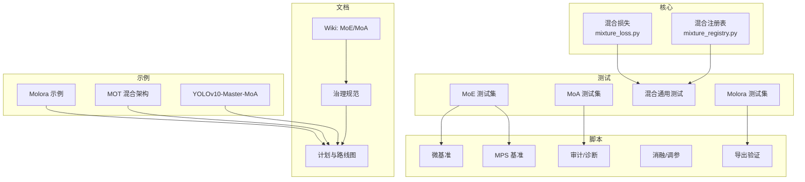
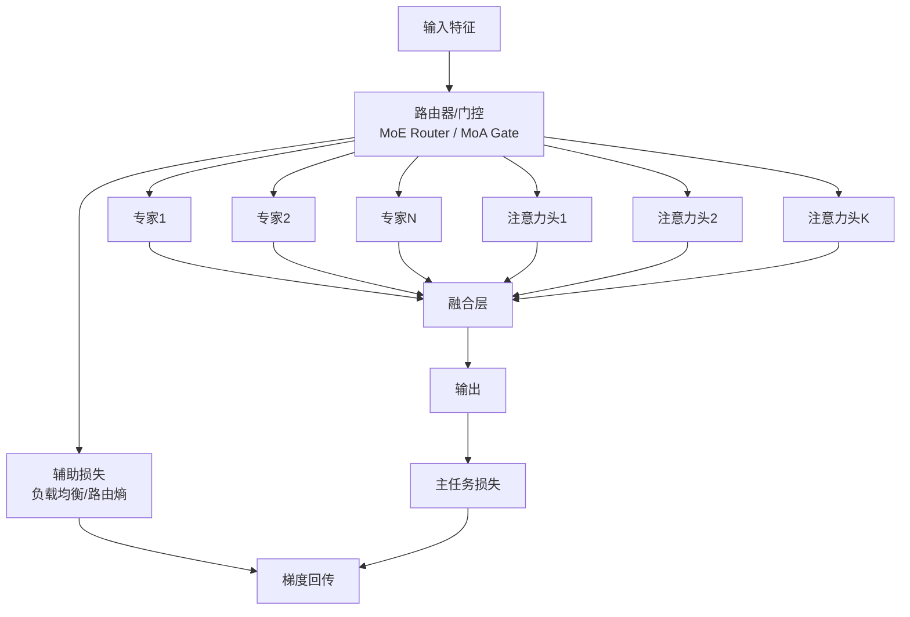
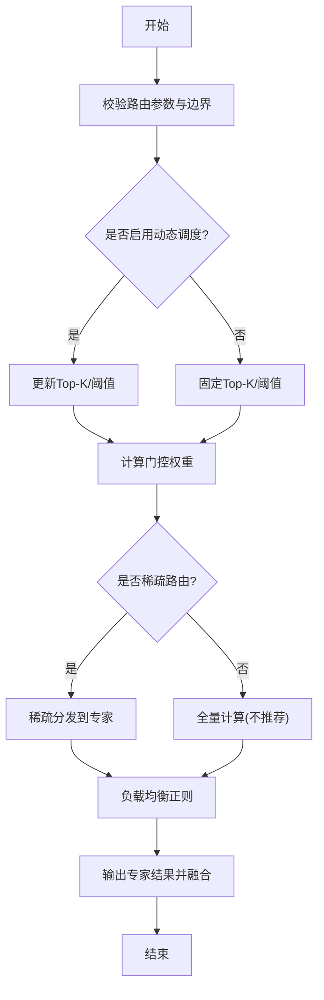
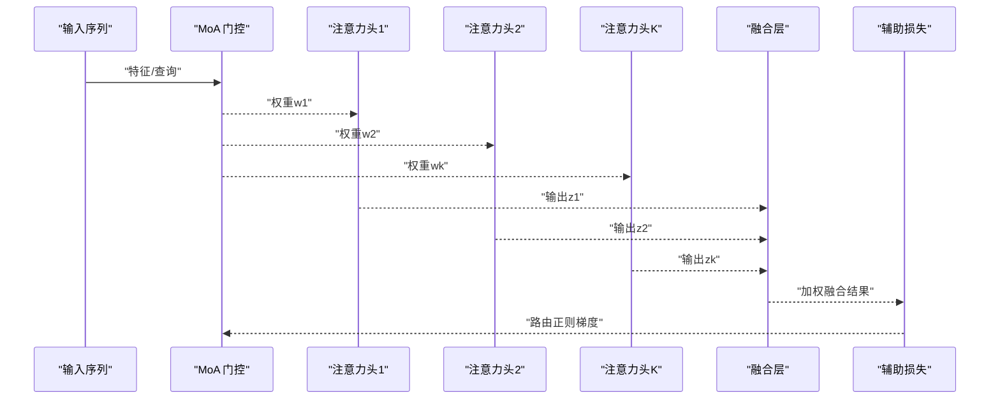
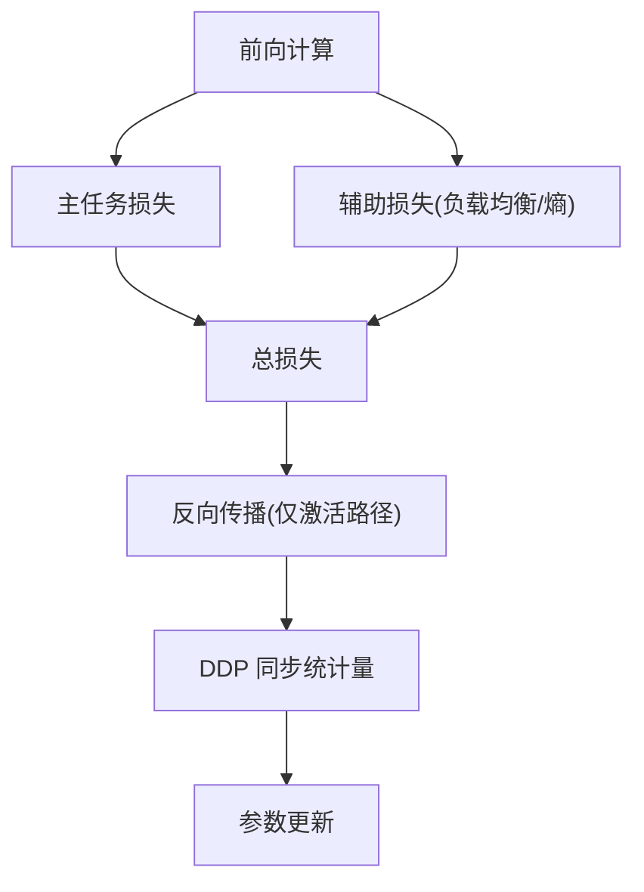
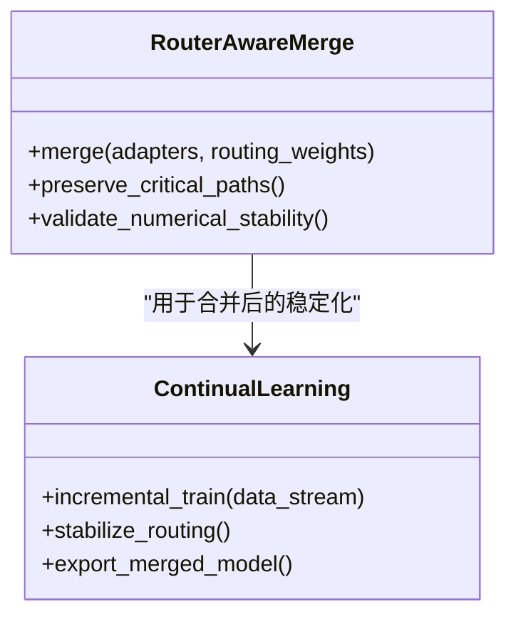
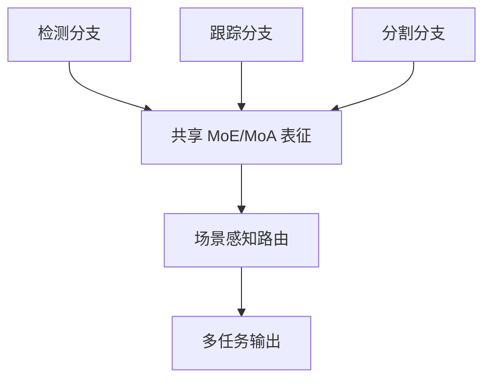
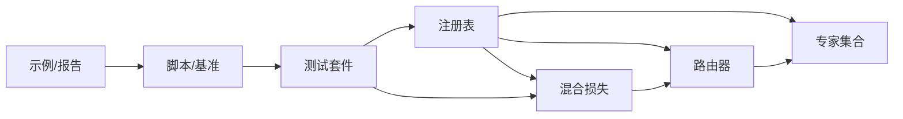

# 多专家混合系统

<cite>
**本文引用的文件**
- [mixture_loss.py](file://ultralytics/nn/mixture_loss.py)
- [mixture_registry.py](file://ultralytics/nn/mixture_registry.py)
- [test_moe.py](file://tests/test_moe.py)
- [test_moa.py](file://tests/test_moa.py)
- [test_mixture_config_resolution.py](file://tests/test_mixture_config_resolution.py)
- [test_mixture_numeric.py](file://tests/test_mixture_numeric.py)
- [test_mixture_export.py](file://tests/test_mixture_export.py)
- [test_mixture_model_registry.py](file://tests/test_mixture_model_registry.py)
- [test_mixture_loss_composition.py](file://tests/test_mixture_loss_composition.py)
- [test_mixture_compile.py](file://tests/test_mixture_compile.py)
- [test_mixture_aux_loss.py](file://tests/test_mixture_aux_loss.py)
- [test_moe_dynamic_schedule.py](file://tests/test_moe_dynamic_schedule.py)
- [test_moe_router_boundaries.py](file://tests/test_moe_router_boundaries.py)
- [test_moe_usage_audit.py](file://tests/test_moe_usage_audit.py)
- [test_moe_ddp_fixes.py](file://tests/test_moe_ddp_fixes.py)
- [test_moe_validation_collectives.py](file://tests/test_moe_validation_collectives.py)
- [test_moe_variant_contract.py](file://tests/test_moe_variant_contract.py)
- [test_molora.py](file://tests/test_molora.py)
- [test_molora_sparse_dispatch.py](file://tests/test_molora_sparse_dispatch.py)
- [test_molora_routing_aware_merge.py](file://tests/test_molora_routing_aware_merge.py)
- [test_molora_dtype.py](file://tests/test_molora_dtype.py)
- [test_molora_merge_semantics.py](file://tests/test_molora_merge_semantics.py)
- [test_molora_supplementary.py](file://tests/test_molora_supplementary.py)
- [test_moa_mot_ssot.py](file://tests/test_moa_mot_ssot.py)
- [test_moa_mot_ddp_math.py](file://tests/test_moa_mot_ddp_math.py)
- [test_moa.py](file://tests/test_moa.py)
- [bench_moe_micro.py](file://scripts/bench_moe_micro.py)
- [bench_moe_mps.py](file://scripts/bench_moe_mps.py)
- [audit_moe_usage.py](file://scripts/audit_moe_usage.py)
- [compare_moa_ablation.py](file://scripts/compare_moa_ablation.py)
- [diagnose_mot_routing.py](file://scripts/diagnose_mot_routing.py)
- [analyze_mot_routing.py](file://scripts/analyze_mot_routing.py)
- [prepare_mot_routing_scenes.py](file://scripts/prepare_mot_routing_scenes.py)
- [run_moe_dynamic_schedule_ablation.py](file://scripts/run_moe_dynamic_schedule_ablation.py)
- [tune_mixture_aux.py](file://scripts/tune_mixture_aux.py)
- [validate_routed_export.py](file://scripts/validate_routed_export.py)
- [moe_pruning_sweep.py](file://scripts/moe_pruning_sweep.py)
- [plot_moe_pruning_sweep.py](file://scripts/plot_moe_pruning_sweep.py)
- [issue52_expert_usage_gini.csv](file://scripts/issue52_expert_usage_gini.csv)
- [issue52_per_layer_experts.csv](file://scripts/issue52_per_layer_experts.csv)
- [issue52_pruning_results.csv](file://scripts/issue52_pruning_results.csv)
- [molora/basic_finetune.py](file://examples/molora/basic_finetune.py)
- [molora/continual_learning.py](file://examples/molora/continual_learning.py)
- [molora/compare_lora_molora.py](file://examples/molora/compare_lora_molora.py)
- [molora/compare_coco128.py](file://examples/molora/compare_coco128.py)
- [molora/compare_coco128_fast.py](file://examples/molora/compare_coco128_fast.py)
- [molora/comparison_report.md](file://examples/molora/comparison_report.md)
- [mot_hybrid_architecture/technical_summary.md](file://examples/mot_hybrid_architecture/technical_summary.md)
- [mot_hybrid_architecture/README.md](file://examples/mot_hybrid_architecture/README.md)
- [mot_hybrid_architecture/run_visdrone_mot_ablation.sh](file://examples/mot_hybrid_architecture/run_visdrone_mot_ablation.sh)
- [mot_hybrid_architecture/plot_mot_results.py](file://examples/mot_hybrid_architecture/plot_mot_results.py)
- [YOLOv10-Master-MoA/README.md](file://examples/YOLOv10-Master-MoA/README.md)
- [YOLOv10-Master-MoA/plot_visdrone_curves.py](file://examples/YOLOv10-Master-MoA/plot_visdrone_curves.py)
- [wiki/MoE/MoE_Routers_Experts.md](file://wiki/MoE/MoE_Routers_Experts.md)
- [wiki/MoE/MoE_Training_Loss_Pruning.md](file://wiki/MoE/MoE_Training_Loss_Pruning.md)
- [wiki/MoE/Mixture_of_Attention.md](file://wiki/MoE/Mixture_of_Attention.md)
- [wiki/MoE/MoE_Diagnostics_Analysis.md](file://wiki/MoE/MoE_Diagnostics_Analysis.md)
- [governance/routing-interpretability.md](file://docs/governance/routing-interpretability.md)
- [governance/moe-class-lifecycle.md](file://docs/governance/moe-class-lifecycle.md)
- [governance/performance-gates.md](file://docs/governance/performance-gates.md)
- [governance/mixture-preservation-manifest.yaml](file://docs/governance/mixture-preservation-manifest.yaml)
- [governance/config-drift-detection.md](file://docs/governance/config-drift-detection.md)
- [plans/moe_aware_peft_plan.md](file://docs/plans/moe_aware_peft_plan.md)
- [plans/mota-hybrid-architecture.md](file://docs/plans/mot-hybrid-architecture.md)
- [plans/molora-routing-aware-merge.md](file://docs/plans/molora-routing-aware-merge.md)
- [plans/mota-scene-aware-router.md](file://docs/plans/mot-scene-aware-router.md)
- [plans/routing-interpreter-toolkit.md](file://docs/plans/routing-interpreter-toolkit.md)
- [plans/standard-benchmark-suite-design.md](file://docs/plans/standard-benchmark-suite-design.md)
- [plans/standard-benchmark-suite.md](file://docs/plans/standard-benchmark-suite.md)
</cite>

## 目录
1. [引言](#引言)
2. [项目结构](#项目结构)
3. [核心组件](#核心组件)
4. [架构总览](#架构总览)
5. [详细组件分析](#详细组件分析)
6. [依赖分析](#依赖分析)
7. [性能考量](#性能考量)
8. [故障排除指南](#故障排除指南)
9. [结论](#结论)
10. [附录](#附录)

## 引言
本文件聚焦于 YOLO-Master 的多专家混合（MoE）与混合注意力（MoA）两大核心机制，系统性解析其路由算法、专家网络设计、负载均衡策略、动态激活技术、注意力混合与路由流程，并给出配置示例、训练指南（损失函数、梯度传播、内存优化）、性能优势与扩展性评估、调试工具与监控指标以及常见问题的排查方法。文档以仓库中的实现与测试为依据，辅以治理文档与计划说明，帮助读者从工程与理论双视角理解与使用该系统。

## 项目结构
围绕 MoE/MoA 的关键代码与资产主要分布在以下位置：
- 核心实现与注册表
  - 混合损失与注册表：[mixture_loss.py](file://ultralytics/nn/mixture_loss.py)、[mixture_registry.py](file://ultralytics/nn/mixture_registry.py)
- 测试套件（覆盖数值稳定性、导出、DDP、动态调度、边界条件等）
  - MoE 相关：[test_moe.py](file://tests/test_moe.py)、[test_moe_dynamic_schedule.py](file://tests/test_moe_dynamic_schedule.py)、[test_moe_router_boundaries.py](file://tests/test_moe_router_boundaries.py)、[test_moe_ddp_fixes.py](file://tests/test_moe_ddp_fixes.py)、[test_moe_validation_collectives.py](file://tests/test_moe_validation_collectives.py)、[test_moe_variant_contract.py](file://tests/test_moe_variant_contract.py)、[test_moe_usage_audit.py](file://tests/test_moe_usage_audit.py)
  - MoA 相关：[test_moa.py](file://tests/test_moa.py)、[test_moa_mot_ssot.py](file://tests/test_moa_mot_ssot.py)、[test_moa_mot_ddp_math.py](file://tests/test_moa_mot_ddp_math.py)
  - 混合通用能力：[test_mixture_config_resolution.py](file://tests/test_mixture_config_resolution.py)、[test_mixture_numeric.py](file://tests/test_mixture_numeric.py)、[test_mixture_export.py](file://tests/test_mixture_export.py)、[test_mixture_model_registry.py](file://tests/test_mixture_model_registry.py)、[test_mixture_loss_composition.py](file://tests/test_mixture_loss_composition.py)、[test_mixture_compile.py](file://tests/test_mixture_compile.py)、[test_mixture_aux_loss.py](file://tests/test_mixture_aux_loss.py)
  - Molora（稀疏路由感知合并）：[test_molora.py](file://tests/test_molora.py)、[test_molora_sparse_dispatch.py](file://tests/test_molora_sparse_dispatch.py)、[test_molora_routing_aware_merge.py](file://tests/test_molora_routing_aware_merge.py)、[test_molora_dtype.py](file://tests/test_molora_dtype.py)、[test_molora_merge_semantics.py](file://tests/test_molora_merge_semantics.py)、[test_molora_supplementary.py](file://tests/test_molora_supplementary.py)
- 脚本与基准
  - 微基准与 MPS 加速：[bench_moe_micro.py](file://scripts/bench_moe_micro.py)、[bench_moe_mps.py](file://scripts/bench_moe_mps.py)
  - 审计与诊断：[audit_moe_usage.py](file://scripts/audit_moe_usage.py)、[diagnose_mot_routing.py](file://scripts/diagnose_mot_routing.py)、[analyze_mot_routing.py](file://scripts/analyze_mot_routing.py)、[prepare_mot_routing_scenes.py](file://scripts/prepare_mot_routing_scenes.py)
  - 消融与调参：[compare_moa_ablation.py](file://scripts/compare_moa_ablation.py)、[run_moe_dynamic_schedule_ablation.py](file://scripts/run_moe_dynamic_schedule_ablation.py)、[tune_mixture_aux.py](file://scripts/tune_mixture_aux.py)、[moe_pruning_sweep.py](file://scripts/moe_pruning_sweep.py)、[plot_moe_pruning_sweep.py](file://scripts/plot_moe_pruning_sweep.py)
  - 导出验证：[validate_routed_export.py](file://scripts/validate_routed_export.py)
  - 统计结果：[issue52_expert_usage_gini.csv](file://scripts/issue52_expert_usage_gini.csv)、[issue52_per_layer_experts.csv](file://scripts/issue52_per_layer_experts.csv)、[issue52_pruning_results.csv](file://scripts/issue52_pruning_results.csv)
- 示例与报告
  - Molora 示例：[examples/molora/*.py](file://examples/molora/)、[examples/molora/comparison_report.md](file://examples/molora/comparison_report.md)
  - MOT 混合架构：[examples/mot_hybrid_architecture/*](file://examples/mot_hybrid_architecture/)
  - YOLOv10-Master-MoA：[examples/YOLOv10-Master-MoA/*](file://examples/YOLOv10-Master-MoA/)
- 文档与治理
  - Wiki：[wiki/MoE/*](file://wiki/MoE/)
  - 治理规范：[docs/governance/*](file://docs/governance/)
  - 计划与路线图：[docs/plans/*](file://docs/plans/)

图表来源
- [mixture_loss.py](file://ultralytics/nn/mixture_loss.py)
- [mixture_registry.py](file://ultralytics/nn/mixture_registry.py)
- [test_moe.py](file://tests/test_moe.py)
- [test_moa.py](file://tests/test_moa.py)
- [test_mixture_config_resolution.py](file://tests/test_mixture_config_resolution.py)
- [test_mixture_numeric.py](file://tests/test_mixture_numeric.py)
- [test_mixture_export.py](file://tests/test_mixture_export.py)
- [test_mixture_model_registry.py](file://tests/test_mixture_model_registry.py)
- [test_mixture_loss_composition.py](file://tests/test_mixture_loss_composition.py)
- [test_mixture_compile.py](file://tests/test_mixture_compile.py)
- [test_mixture_aux_loss.py](file://tests/test_mixture_aux_loss.py)
- [test_molora.py](file://tests/test_molora.py)
- [bench_moe_micro.py](file://scripts/bench_moe_micro.py)
- [bench_moe_mps.py](file://scripts/bench_moe_mps.py)
- [audit_moe_usage.py](file://scripts/audit_moe_usage.py)
- [compare_moa_ablation.py](file://scripts/compare_moa_ablation.py)
- [validate_routed_export.py](file://scripts/validate_routed_export.py)
- [examples/molora/comparison_report.md](file://examples/molora/comparison_report.md)
- [examples/mot_hybrid_architecture/README.md](file://examples/mot_hybrid_architecture/README.md)
- [examples/YOLOv10-Master-MoA/README.md](file://examples/YOLOv10-Master-MoA/README.md)
- [wiki/MoE/Mixture_of_Attention.md](file://wiki/MoE/Mixture_of_Attention.md)
- [docs/governance/routing-interpretability.md](file://docs/governance/routing-interpretability.md)
- [docs/plans/molora-routing-aware-merge.md](file://docs/plans/molora-routing-aware-merge.md)

章节来源
- [mixture_loss.py](file://ultralytics/nn/mixture_loss.py)
- [mixture_registry.py](file://ultralytics/nn/mixture_registry.py)
- [test_moe.py](file://tests/test_moe.py)
- [test_moa.py](file://tests/test_moa.py)
- [test_mixture_config_resolution.py](file://tests/test_mixture_config_resolution.py)
- [test_mixture_numeric.py](file://tests/test_mixture_numeric.py)
- [test_mixture_export.py](file://tests/test_mixture_export.py)
- [test_mixture_model_registry.py](file://tests/test_mixture_model_registry.py)
- [test_mixture_loss_composition.py](file://tests/test_mixture_loss_composition.py)
- [test_mixture_compile.py](file://tests/test_mixture_compile.py)
- [test_mixture_aux_loss.py](file://tests/test_mixture_aux_loss.py)
- [test_molora.py](file://tests/test_molora.py)
- [bench_moe_micro.py](file://scripts/bench_moe_micro.py)
- [bench_moe_mps.py](file://scripts/bench_moe_mps.py)
- [audit_moe_usage.py](file://scripts/audit_moe_usage.py)
- [compare_moa_ablation.py](file://scripts/compare_moa_ablation.py)
- [validate_routed_export.py](file://scripts/validate_routed_export.py)
- [examples/molora/comparison_report.md](file://examples/molora/comparison_report.md)
- [examples/mot_hybrid_architecture/README.md](file://examples/mot_hybrid_architecture/README.md)
- [examples/YOLOv10-Master-MoA/README.md](file://examples/YOLOv10-Master-MoA/README.md)
- [wiki/MoE/Mixture_of_Attention.md](file://wiki/MoE/Mixture_of_Attention.md)
- [docs/governance/routing-interpretability.md](file://docs/governance/routing-interpretability.md)
- [docs/plans/molora-routing-aware-merge.md](file://docs/plans/molora-routing-aware-merge.md)

## 核心组件
- 混合损失模块
  - 负责组合任务主损失与辅助损失（如负载均衡、路由熵、专家使用均衡等），并提供可插拔的权重调度与归一化策略。
  - 参考路径：[mixture_loss.py](file://ultralytics/nn/mixture_loss.py)
- 混合注册表
  - 提供模型/路由/专家/损失的统一注册与解析机制，支持运行时选择与版本兼容。
  - 参考路径：[mixture_registry.py](file://ultralytics/nn/mixture_registry.py)
- 测试与验收
  - 覆盖数值稳定、编译、导出、DDP、动态调度、边界条件、变体契约、Molora 稀疏路由与合并语义等。
  - 参考路径：见“项目结构”中测试清单

章节来源
- [mixture_loss.py](file://ultralytics/nn/mixture_loss.py)
- [mixture_registry.py](file://ultralytics/nn/mixture_registry.py)
- [test_mixture_config_resolution.py](file://tests/test_mixture_config_resolution.py)
- [test_mixture_numeric.py](file://tests/test_mixture_numeric.py)
- [test_mixture_export.py](file://tests/test_mixture_export.py)
- [test_mixture_model_registry.py](file://tests/test_mixture_model_registry.py)
- [test_mixture_loss_composition.py](file://tests/test_mixture_loss_composition.py)
- [test_mixture_compile.py](file://tests/test_mixture_compile.py)
- [test_mixture_aux_loss.py](file://tests/test_mixture_aux_loss.py)

## 架构总览
下图展示 MoE 与 MoA 在 YOLO-Master 中的整体交互关系：输入特征进入路由器，按门控权重选择专家或注意力头；被选中的子模块并行计算后加权融合；辅助损失对路由分布进行正则；训练阶段通过 DDP 同步统计量，推理阶段按需激活以降低延迟与显存占用。

图表来源
- [mixture_loss.py](file://ultralytics/nn/mixture_loss.py)
- [mixture_registry.py](file://ultralytics/nn/mixture_registry.py)
- [wiki/MoE/Mixture_of_Attention.md](file://wiki/MoE/Mixture_of_Attention.md)
- [docs/governance/routing-interpretability.md](file://docs/governance/routing-interpretability.md)

## 详细组件分析

### MoE 路由机制与专家网络
- 路由机制
  - 基于输入特征的软/硬选择策略，结合 Top-K 门控与温度缩放控制稀疏度。
  - 支持动态调度（随训练步数调整 K 值或阈值），提升早期探索与后期收敛效率。
  - 参考路径：[test_moe_dynamic_schedule.py](file://tests/test_moe_dynamic_schedule.py)、[test_moe_router_boundaries.py](file://tests/test_moe_router_boundaries.py)
- 专家网络设计
  - 专家通常为轻量前馈或卷积块，具备独立参数与局部容量，便于并行与裁剪。
  - 支持专家级剪枝与动态激活，减少无效计算。
  - 参考路径：[moe_pruning_sweep.py](file://scripts/moe_pruning_sweep.py)、[plot_moe_pruning_sweep.py](file://scripts/plot_moe_pruning_sweep.py)
- 负载均衡策略
  - 通过辅助损失（如专家使用率方差、Gini 系数、路由熵）抑制热点专家，促进均匀利用。
  - 参考路径：[test_mixture_aux_loss.py](file://tests/test_mixture_aux_loss.py)、[issue52_expert_usage_gini.csv](file://scripts/issue52_expert_usage_gini.csv)
- 动态激活技术
  - 根据场景复杂度或置信度动态切换激活专家数量，兼顾精度与速度。
  - 参考路径：[test_moe_dynamic_schedule.py](file://tests/test_moe_dynamic_schedule.py)、[run_moe_dynamic_schedule_ablation.py](file://scripts/run_moe_dynamic_schedule_ablation.py)

图表来源
- [test_moe_dynamic_schedule.py](file://tests/test_moe_dynamic_schedule.py)
- [test_moe_router_boundaries.py](file://tests/test_moe_router_boundaries.py)
- [test_mixture_aux_loss.py](file://tests/test_mixture_aux_loss.py)
- [moe_pruning_sweep.py](file://scripts/moe_pruning_sweep.py)

章节来源
- [test_moe_dynamic_schedule.py](file://tests/test_moe_dynamic_schedule.py)
- [test_moe_router_boundaries.py](file://tests/test_moe_router_boundaries.py)
- [test_mixture_aux_loss.py](file://tests/test_mixture_aux_loss.py)
- [moe_pruning_sweep.py](file://scripts/moe_pruning_sweep.py)
- [plot_moe_pruning_sweep.py](file://scripts/plot_moe_pruning_sweep.py)
- [run_moe_dynamic_schedule_ablation.py](file://scripts/run_moe_dynamic_schedule_ablation.py)
- [issue52_expert_usage_gini.csv](file://scripts/issue52_expert_usage_gini.csv)

### MoA 注意力混合与路由算法
- 注意力混合机制
  - 将多个注意力头作为“专家”，由门控网络为每个 token/区域分配权重，形成多头混合表示。
  - 参考路径：[wiki/MoE/Mixture_of_Attention.md](file://wiki/MoE/Mixture_of_Attention.md)、[test_moa.py](file://tests/test_moa.py)
- 路由算法
  - 采用与 MoE 相似的门控逻辑，但作用于注意力维度；支持跨任务/跨模态共享路由或专用路由。
  - 参考路径：[test_moa_mot_ssot.py](file://tests/test_moa_mot_ssot.py)、[test_moa_mot_ddp_math.py](file://tests/test_moa_mot_ddp_math.py)
- 单源真相（SSOT）与一致性
  - 确保同一输入在不同分支（检测/跟踪/分割）的路由一致，避免表征漂移。
  - 参考路径：[test_moa_mot_ssot.py](file://tests/test_moa_mot_ssot.py)

图表来源
- [wiki/MoE/Mixture_of_Attention.md](file://wiki/MoE/Mixture_of_Attention.md)
- [test_moa.py](file://tests/test_moa.py)
- [test_moa_mot_ssot.py](file://tests/test_moa_mot_ssot.py)
- [test_moa_mot_ddp_math.py](file://tests/test_moa_mot_ddp_math.py)

章节来源
- [wiki/MoE/Mixture_of_Attention.md](file://wiki/MoE/Mixture_of_Attention.md)
- [test_moa.py](file://tests/test_moa.py)
- [test_moa_mot_ssot.py](file://tests/test_moa_mot_ssot.py)
- [test_moa_mot_ddp_math.py](file://tests/test_moa_mot_ddp_math.py)

### 混合损失设计与梯度传播
- 损失组成
  - 主任务损失（检测/分割/姿态等）+ 辅助损失（负载均衡、路由熵、专家使用率惩罚）。
  - 权重可按阶段或任务自适应调节。
  - 参考路径：[mixture_loss.py](file://ultralytics/nn/mixture_loss.py)、[test_mixture_loss_composition.py](file://tests/test_mixture_loss_composition.py)
- 梯度传播
  - 仅对被激活的专家/注意力头反向传播，降低冗余计算；DDP 下需对齐路由统计量。
  - 参考路径：[test_moe_ddp_fixes.py](file://tests/test_moe_ddp_fixes.py)、[test_moe_validation_collectives.py](file://tests/test_moe_validation_collectives.py)
- 数值稳定性
  - 温度缩放、门控权重截断、NaN/Inf 防护与日志记录。
  - 参考路径：[test_mixture_numeric.py](file://tests/test_mixture_numeric.py)

图表来源
- [mixture_loss.py](file://ultralytics/nn/mixture_loss.py)
- [test_mixture_loss_composition.py](file://tests/test_mixture_loss_composition.py)
- [test_moe_ddp_fixes.py](file://tests/test_moe_ddp_fixes.py)
- [test_moe_validation_collectives.py](file://tests/test_moe_validation_collectives.py)
- [test_mixture_numeric.py](file://tests/test_mixture_numeric.py)

章节来源
- [mixture_loss.py](file://ultralytics/nn/mixture_loss.py)
- [test_mixture_loss_composition.py](file://tests/test_mixture_loss_composition.py)
- [test_moe_ddp_fixes.py](file://tests/test_moe_ddp_fixes.py)
- [test_moe_validation_collectives.py](file://tests/test_moe_validation_collectives.py)
- [test_mixture_numeric.py](file://tests/test_mixture_numeric.py)

### Molora：稀疏路由感知合并与持续学习
- 稀疏路由感知合并
  - 在合并 LoRA/适配器时考虑路由权重，保留关键专家路径，避免性能退化。
  - 参考路径：[test_molora_routing_aware_merge.py](file://tests/test_molora_routing_aware_merge.py)、[docs/plans/molora-routing-aware-merge.md](file://docs/plans/molora-routing-aware-merge.md)
- 持续学习与微调
  - 支持增量数据与领域迁移，保持路由与专家的一致性。
  - 参考路径：[examples/molora/continual_learning.py](file://examples/molora/continual_learning.py)、[examples/molora/basic_finetune.py](file://examples/molora/basic_finetune.py)
- 对比与报告
  - 提供与标准 LoRA 的对比实验与可视化报告。
  - 参考路径：[examples/molora/compare_lora_molora.py](file://examples/molora/compare_lora_molora.py)、[examples/molora/comparison_report.md](file://examples/molora/comparison_report.md)

图表来源
- [test_molora_routing_aware_merge.py](file://tests/test_molora_routing_aware_merge.py)
- [examples/molora/continual_learning.py](file://examples/molora/continual_learning.py)
- [examples/molora/basic_finetune.py](file://examples/molora/basic_finetune.py)
- [examples/molora/compare_lora_molora.py](file://examples/molora/compare_lora_molora.py)
- [examples/molora/comparison_report.md](file://examples/molora/comparison_report.md)
- [docs/plans/molora-routing-aware-merge.md](file://docs/plans/molora-routing-aware-merge.md)

章节来源
- [test_molora_routing_aware_merge.py](file://tests/test_molora_routing_aware_merge.py)
- [examples/molora/continual_learning.py](file://examples/molora/continual_learning.py)
- [examples/molora/basic_finetune.py](file://examples/molora/basic_finetune.py)
- [examples/molora/compare_lora_molora.py](file://examples/molora/compare_lora_molora.py)
- [examples/molora/comparison_report.md](file://examples/molora/comparison_report.md)
- [docs/plans/molora-routing-aware-merge.md](file://docs/plans/molora-routing-aware-merge.md)

### MOT 混合架构与场景感知路由
- 混合架构
  - 将检测、跟踪、分割等多任务共享 MoE/MoA 表征，通过场景感知路由提升跨任务一致性。
  - 参考路径：[examples/mot_hybrid_architecture/README.md](file://examples/mot_hybrid_architecture/README.md)、[examples/mot_hybrid_architecture/technical_summary.md](file://examples/mot_hybrid_architecture/technical_summary.md)
- 场景感知路由
  - 依据场景复杂度或目标密度动态调整路由策略，平衡精度与吞吐。
  - 参考路径：[docs/plans/mot-scene-aware-router.md](file://docs/plans/mot-scene-aware-router.md)、[scripts/prepare_mot_routing_scenes.py](file://scripts/prepare_mot_routing_scenes.py)
- 可视化与评估
  - 提供曲线绘制与结果汇总脚本。
  - 参考路径：[examples/mot_hybrid_architecture/plot_mot_results.py](file://examples/mot_hybrid_architecture/plot_mot_results.py)、[examples/mot_hybrid_architecture/run_visdrone_mot_ablation.sh](file://examples/mot_hybrid_architecture/run_visdrone_mot_ablation.sh)

图表来源
- [examples/mot_hybrid_architecture/README.md](file://examples/mot_hybrid_architecture/README.md)
- [examples/mot_hybrid_architecture/technical_summary.md](file://examples/mot_hybrid_architecture/technical_summary.md)
- [docs/plans/mot-scene-aware-router.md](file://docs/plans/mot-scene-aware-router.md)
- [scripts/prepare_mot_routing_scenes.py](file://scripts/prepare_mot_routing_scenes.py)
- [examples/mot_hybrid_architecture/plot_mot_results.py](file://examples/mot_hybrid_architecture/plot_mot_results.py)
- [examples/mot_hybrid_architecture/run_visdrone_mot_ablation.sh](file://examples/mot_hybrid_architecture/run_visdrone_mot_ablation.sh)

章节来源
- [examples/mot_hybrid_architecture/README.md](file://examples/mot_hybrid_architecture/README.md)
- [examples/mot_hybrid_architecture/technical_summary.md](file://examples/mot_hybrid_architecture/technical_summary.md)
- [docs/plans/mot-scene-aware-router.md](file://docs/plans/mot-scene-aware-router.md)
- [scripts/prepare_mot_routing_scenes.py](file://scripts/prepare_mot_routing_scenes.py)
- [examples/mot_hybrid_architecture/plot_mot_results.py](file://examples/mot_hybrid_architecture/plot_mot_results.py)
- [examples/mot_hybrid_architecture/run_visdrone_mot_ablation.sh](file://examples/mot_hybrid_architecture/run_visdrone_mot_ablation.sh)

### 配置示例与训练指南
- 配置要点
  - 路由 Top-K、温度、负载均衡权重、专家数量与容量、动态调度策略、Molora 合并开关等。
  - 参考路径：[test_mixture_config_resolution.py](file://tests/test_mixture_config_resolution.py)、[mixture_registry.py](file://ultralytics/nn/mixture_registry.py)
- 训练步骤
  - 初始化注册表与模型 → 加载数据集 → 设置损失与辅助项 → 启动训练（DDP）→ 监控路由与专家使用率 → 导出与验证。
  - 参考路径：[test_mixture_model_registry.py](file://tests/test_mixture_model_registry.py)、[test_moe_ddp_fixes.py](file://tests/test_moe_ddp_fixes.py)
- 损失与超参调优
  - 使用调参脚本扫描辅助损失权重与动态调度参数。
  - 参考路径：[tune_mixture_aux.py](file://scripts/tune_mixture_aux.py)、[run_moe_dynamic_schedule_ablation.py](file://scripts/run_moe_dynamic_schedule_ablation.py)

章节来源
- [test_mixture_config_resolution.py](file://tests/test_mixture_config_resolution.py)
- [mixture_registry.py](file://ultralytics/nn/mixture_registry.py)
- [test_mixture_model_registry.py](file://tests/test_mixture_model_registry.py)
- [test_moe_ddp_fixes.py](file://tests/test_moe_ddp_fixes.py)
- [tune_mixture_aux.py](file://scripts/tune_mixture_aux.py)
- [run_moe_dynamic_schedule_ablation.py](file://scripts/run_moe_dynamic_schedule_ablation.py)

### 内存优化与推理加速
- 稀疏激活与剪枝
  - 仅激活必要专家/注意力头，配合剪枝降低显存与计算开销。
  - 参考路径：[moe_pruning_sweep.py](file://scripts/moe_pruning_sweep.py)、[plot_moe_pruning_sweep.py](file://scripts/plot_moe_pruning_sweep.py)
- 编译与后端优化
  - 使用 torch.compile 与 MPS/CUDA 后端优化路径。
  - 参考路径：[test_mixture_compile.py](file://tests/test_mixture_compile.py)、[bench_moe_micro.py](file://scripts/bench_moe_micro.py)、[bench_moe_mps.py](file://scripts/bench_moe_mps.py)
- 导出与部署
  - 验证路由感知的导出一致性，确保推理端行为与训练端一致。
  - 参考路径：[test_mixture_export.py](file://tests/test_mixture_export.py)、[validate_routed_export.py](file://scripts/validate_routed_export.py)

章节来源
- [moe_pruning_sweep.py](file://scripts/moe_pruning_sweep.py)
- [plot_moe_pruning_sweep.py](file://scripts/plot_moe_pruning_sweep.py)
- [test_mixture_compile.py](file://tests/test_mixture_compile.py)
- [bench_moe_micro.py](file://scripts/bench_moe_micro.py)
- [bench_moe_mps.py](file://scripts/bench_moe_mps.py)
- [test_mixture_export.py](file://tests/test_mixture_export.py)
- [validate_routed_export.py](file://scripts/validate_routed_export.py)

## 依赖分析
- 组件耦合
  - 混合损失与注册表为核心依赖，测试与脚本广泛引用；Molora 与 MOT 混合架构在上层应用。
- 外部依赖
  - PyTorch/Distributed、torch.compile、MPS/CUDA 后端、ONNX/TensorRT 等导出工具链。
- 循环依赖
  - 通过注册表解耦路由/专家/损失，避免直接强耦合。

图表来源
- [mixture_registry.py](file://ultralytics/nn/mixture_registry.py)
- [mixture_loss.py](file://ultralytics/nn/mixture_loss.py)
- [test_mixture_model_registry.py](file://tests/test_mixture_model_registry.py)
- [test_mixture_loss_composition.py](file://tests/test_mixture_loss_composition.py)
- [bench_moe_micro.py](file://scripts/bench_moe_micro.py)
- [examples/molora/comparison_report.md](file://examples/molora/comparison_report.md)

章节来源
- [mixture_registry.py](file://ultralytics/nn/mixture_registry.py)
- [mixture_loss.py](file://ultralytics/nn/mixture_loss.py)
- [test_mixture_model_registry.py](file://tests/test_mixture_model_registry.py)
- [test_mixture_loss_composition.py](file://tests/test_mixture_loss_composition.py)
- [bench_moe_micro.py](file://scripts/bench_moe_micro.py)
- [examples/molora/comparison_report.md](file://examples/molora/comparison_report.md)

## 性能考量
- 稀疏性与吞吐
  - 合理设置 Top-K 与温度，最大化稀疏性同时保证精度；动态调度可在不同阶段自动调整。
- 负载均衡与热点抑制
  - 通过辅助损失与审计工具监控专家使用率，避免少数专家过载。
- 编译与后端
  - 使用 torch.compile 与 MPS/CUDA 优化路径，显著降低延迟；注意算子兼容性。
- 导出与部署
  - 路由感知的导出与验证确保线上行为稳定；建议开启最小激活模式。

[本节为通用指导，无需特定文件来源]

## 故障排除指南
- 路由不稳定/NaN
  - 检查温度缩放与门控权重截断；查看数值稳定性测试与日志。
  - 参考路径：[test_mixture_numeric.py](file://tests/test_mixture_numeric.py)
- DDP 同步异常
  - 确认路由统计量的集体通信正确；参考修复用例。
  - 参考路径：[test_moe_ddp_fixes.py](file://tests/test_moe_ddp_fixes.py)、[test_moe_validation_collectives.py](file://tests/test_moe_validation_collectives.py)
- 导出不一致
  - 使用导出验证脚本比对训练与推理端路由行为。
  - 参考路径：[validate_routed_export.py](file://scripts/validate_routed_export.py)、[test_mixture_export.py](file://tests/test_mixture_export.py)
- 专家使用不均
  - 借助审计与统计结果（Gini、每层专家分布）定位问题并调整辅助损失权重。
  - 参考路径：[audit_moe_usage.py](file://scripts/audit_moe_usage.py)、[issue52_expert_usage_gini.csv](file://scripts/issue52_expert_usage_gini.csv)、[issue52_per_layer_experts.csv](file://scripts/issue52_per_layer_experts.csv)
- 路由解释性
  - 使用解释性工具与治理文档分析路由决策。
  - 参考路径：[docs/governance/routing-interpretability.md](file://docs/governance/routing-interpretability.md)

章节来源
- [test_mixture_numeric.py](file://tests/test_mixture_numeric.py)
- [test_moe_ddp_fixes.py](file://tests/test_moe_ddp_fixes.py)
- [test_moe_validation_collectives.py](file://tests/test_moe_validation_collectives.py)
- [validate_routed_export.py](file://scripts/validate_routed_export.py)
- [test_mixture_export.py](file://tests/test_mixture_export.py)
- [audit_moe_usage.py](file://scripts/audit_moe_usage.py)
- [issue52_expert_usage_gini.csv](file://scripts/issue52_expert_usage_gini.csv)
- [issue52_per_layer_experts.csv](file://scripts/issue52_per_layer_experts.csv)
- [docs/governance/routing-interpretability.md](file://docs/governance/routing-interpretability.md)

## 结论
YOLO-Master 的 MoE/MoA 体系通过可插拔的路由与专家/注意力头设计，实现了高可扩展性与灵活的任务适配。借助辅助损失与动态调度，系统在精度、吞吐与资源占用之间取得良好平衡；Molora 与 MOT 混合架构进一步提升了持续学习与多任务一致性。完善的测试、基准与治理文档保障了工程落地与可维护性。

[本节为总结，无需特定文件来源]

## 附录
- 参考文档与计划
  - Wiki：[wiki/MoE/MoE_Routers_Experts.md](file://wiki/MoE/MoE_Routers_Experts.md)、[wiki/MoE/MoE_Training_Loss_Pruning.md](file://wiki/MoE/MoE_Training_Loss_Pruning.md)、[wiki/MoE/MoE_Diagnostics_Analysis.md](file://wiki/MoE/MoE_Diagnostics_Analysis.md)
  - 治理：[docs/governance/moe-class-lifecycle.md](file://docs/governance/moe-class-lifecycle.md)、[docs/governance/performance-gates.md](file://docs/governance/performance-gates.md)、[docs/governance/mixture-preservation-manifest.yaml](file://docs/governance/mixture-preservation-manifest.yaml)、[docs/governance/config-drift-detection.md](file://docs/governance/config-drift-detection.md)
  - 计划：[docs/plans/moe_aware_peft_plan.md](file://docs/plans/moe_aware_peft_plan.md)、[docs/plans/mot-hybrid-architecture.md](file://docs/plans/mot-hybrid-architecture.md)、[docs/plans/routing-interpreter-toolkit.md](file://docs/plans/routing-interpreter-toolkit.md)、[docs/plans/standard-benchmark-suite-design.md](file://docs/plans/standard-benchmark-suite-design.md)、[docs/plans/standard-benchmark-suite.md](file://docs/plans/standard-benchmark-suite.md)
- 示例与报告
  - Molora：[examples/molora/comparison_report.md](file://examples/molora/comparison_report.md)
  - MOT 混合：[examples/mot_hybrid_architecture/README.md](file://examples/mot_hybrid_architecture/README.md)
  - YOLOv10-Master-MoA：[examples/YOLOv10-Master-MoA/README.md](file://examples/YOLOv10-Master-MoA/README.md)

[本节为索引，无需特定文件来源]