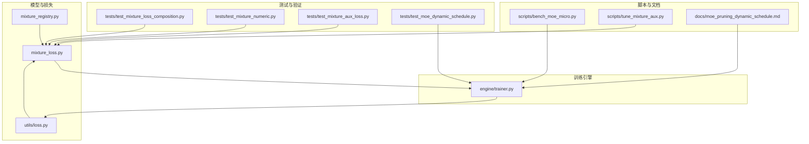
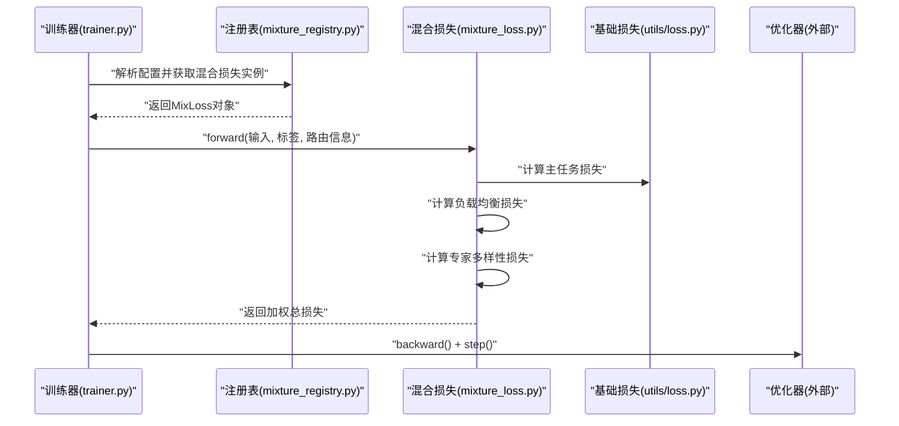
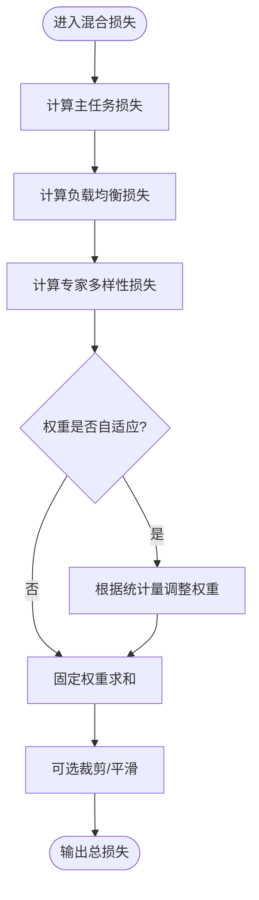
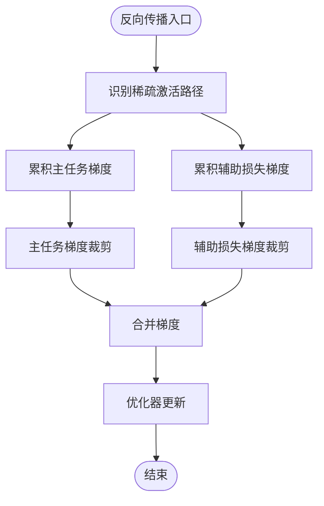

# 混合损失与训练策略

<cite>
**本文引用的文件**
- [mixture_loss.py](file://ultralytics/nn/mixture_loss.py)
- [mixture_registry.py](file://ultralytics/nn/mixture_registry.py)
- [trainer.py](file://ultralytics/engine/trainer.py)
- [loss.py](file://ultralytics/utils/loss.py)
- [test_mixture_loss_composition.py](file://tests/test_mixture_loss_composition.py)
- [test_mixture_numeric.py](file://tests/test_mixture_numeric.py)
- [test_mixture_aux_loss.py](file://tests/test_mixture_aux_loss.py)
- [test_moe_dynamic_schedule.py](file://tests/test_moe_dynamic_schedule.py)
- [bench_moe_micro.py](file://scripts/bench_moe_micro.py)
- [tune_mixture_aux.py](file://scripts/tune_mixture_aux.py)
- [moe_pruning_dynamic_schedule.md](file://docs/moe_pruning_dynamic_schedule.md)
</cite>

## 目录
1. [简介](#简介)
2. [项目结构](#项目结构)
3. [核心组件](#核心组件)
4. [架构总览](#架构总览)
5. [详细组件分析](#详细组件分析)
6. [依赖关系分析](#依赖关系分析)
7. [性能考虑](#性能考虑)
8. [故障排查指南](#故障排查指南)
9. [结论](#结论)
10. [附录](#附录)

## 简介
本文件聚焦于MoE/MoA系统的损失函数设计与训练策略，围绕以下目标展开：
- 解释混合损失函数的数学原理与组合方式（主任务损失、负载均衡损失、专家多样性损失）
- 分析稀疏激活路径中的梯度传播机制（裁剪、数值稳定性、收敛性保证）
- 提供完整的训练配置示例（学习率调度、批次大小、分布式训练）
- 给出训练监控指标、收敛曲线分析与常见问题诊断方法

## 项目结构
与MoE/MoA损失和训练相关的关键代码位于如下位置：
- 损失实现与注册：ultralytics/nn/mixture_loss.py、ultralytics/nn/mixture_registry.py
- 训练循环与优化器集成：ultralytics/engine/trainer.py
- 基础损失工具：ultralytics/utils/loss.py
- 测试与验证：tests/test_mixture_*.py
- 基准与调参脚本：scripts/bench_moe_micro.py、scripts/tune_mixture_aux.py
- 文档与策略说明：docs/moe_pruning_dynamic_schedule.md

图表来源
- [mixture_loss.py](file://ultralytics/nn/mixture_loss.py)
- [mixture_registry.py](file://ultralytics/nn/mixture_registry.py)
- [trainer.py](file://ultralytics/engine/trainer.py)
- [loss.py](file://ultralytics/utils/loss.py)
- [test_mixture_loss_composition.py](file://tests/test_mixture_loss_composition.py)
- [test_mixture_numeric.py](file://tests/test_mixture_numeric.py)
- [test_mixture_aux_loss.py](file://tests/test_mixture_aux_loss.py)
- [test_moe_dynamic_schedule.py](file://tests/test_moe_dynamic_schedule.py)
- [bench_moe_micro.py](file://scripts/bench_moe_micro.py)
- [tune_mixture_aux.py](file://scripts/tune_mixture_aux.py)
- [moe_pruning_dynamic_schedule.md](file://docs/moe_pruning_dynamic_schedule.md)

章节来源
- [mixture_loss.py](file://ultralytics/nn/mixture_loss.py)
- [mixture_registry.py](file://ultralytics/nn/mixture_registry.py)
- [trainer.py](file://ultralytics/engine/trainer.py)
- [loss.py](file://ultralytics/utils/loss.py)
- [test_mixture_loss_composition.py](file://tests/test_mixture_loss_composition.py)
- [test_mixture_numeric.py](file://tests/test_mixture_numeric.py)
- [test_mixture_aux_loss.py](file://tests/test_mixture_aux_loss.py)
- [test_moe_dynamic_schedule.py](file://tests/test_moe_dynamic_schedule.py)
- [bench_moe_micro.py](file://scripts/bench_moe_micro.py)
- [tune_mixture_aux.py](file://scripts/tune_mixture_aux.py)
- [moe_pruning_dynamic_schedule.md](file://docs/moe_pruning_dynamic_schedule.md)

## 核心组件
- 混合损失模块：负责将主任务损失、负载均衡损失与专家多样性损失进行组合，并提供可插拔的注册机制。
- 注册表：集中管理不同混合损失的变体与参数解析，便于在训练配置中动态选择。
- 训练器集成：在训练循环中计算并累加各项损失，执行反向传播与优化器更新，同时处理稀疏路径下的数值稳定与梯度裁剪。
- 辅助脚本与测试：提供微基准、超参搜索与回归测试，确保损失组合与数值行为符合预期。

章节来源
- [mixture_loss.py](file://ultralytics/nn/mixture_loss.py)
- [mixture_registry.py](file://ultralytics/nn/mixture_registry.py)
- [trainer.py](file://ultralytics/engine/trainer.py)
- [loss.py](file://ultralytics/utils/loss.py)

## 架构总览
下图展示了从训练器到损失模块的数据流与控制流，以及各子损失的组合过程。

图表来源
- [trainer.py](file://ultralytics/engine/trainer.py)
- [mixture_registry.py](file://ultralytics/nn/mixture_registry.py)
- [mixture_loss.py](file://ultralytics/nn/mixture_loss.py)
- [loss.py](file://ultralytics/utils/loss.py)

## 详细组件分析

### 混合损失函数设计
- 主任务损失：由基础损失模块提供，针对具体任务（检测、分割等）计算预测与标签之间的差异。
- 负载均衡损失：对专家使用分布施加正则，避免少数专家被过度使用，提升整体吞吐与泛化。
- 专家多样性损失：鼓励不同专家学习互补特征，降低同质化风险。
- 组合方式：采用加权求和形式，权重可通过配置或自适应策略调节；支持按层或全局聚合。

图表来源
- [mixture_loss.py](file://ultralytics/nn/mixture_loss.py)
- [loss.py](file://ultralytics/utils/loss.py)

章节来源
- [mixture_loss.py](file://ultralytics/nn/mixture_loss.py)
- [loss.py](file://ultralytics/utils/loss.py)
- [test_mixture_loss_composition.py](file://tests/test_mixture_loss_composition.py)

### 稀疏激活路径的梯度传播
- 稀疏路由：仅激活Top-K专家，其余专家不参与前向与反向，形成稀疏计算图。
- 梯度裁剪：对主任务与辅助损失的梯度分别进行范数裁剪，防止爆炸。
- 数值稳定性：在softmax/门控概率计算中加入小常数，避免除零或对数溢出；对低使用率专家引入平滑项。
- 收敛性保证：通过负载均衡与多样性损失约束，减少“赢家通吃”现象，提高长期稳定性。

图表来源
- [trainer.py](file://ultralytics/engine/trainer.py)
- [mixture_loss.py](file://ultralytics/nn/mixture_loss.py)

章节来源
- [trainer.py](file://ultralytics/engine/trainer.py)
- [mixture_loss.py](file://ultralytics/nn/mixture_loss.py)
- [test_mixture_numeric.py](file://tests/test_mixture_numeric.py)

### 训练配置示例
- 学习率调度：建议使用余弦退火或阶梯式衰减，配合Warmup阶段提升初期稳定性。
- 批次大小：依据显存与路由开销选择；MoE场景下可适当增大以平衡专家利用率。
- 分布式训练：多卡DDP设置需关注路由统计的全局归约与负载均衡损失的跨设备一致性。
- 权重与开关：可配置负载均衡与多样性损失的权重、Top-K、平滑系数、裁剪阈值等。

章节来源
- [trainer.py](file://ultralytics/engine/trainer.py)
- [mixture_registry.py](file://ultralytics/nn/mixture_registry.py)
- [moe_pruning_dynamic_schedule.md](file://docs/moe_pruning_dynamic_schedule.md)

### 训练监控指标与收敛分析
- 关键指标：
  - 主任务损失与精度
  - 负载均衡损失与专家使用分布（熵、Gini系数）
  - 专家多样性损失与相似度矩阵
  - 梯度范数与时延
- 收敛曲线：
  - 观察主任务损失下降与辅助损失波动是否同步
  - 检查专家使用分布是否趋于均衡
  - 监控梯度范数是否稳定在合理范围
- 可视化建议：
  - 绘制每步总损失、主任务损失、辅助损失分解
  - 绘制专家使用热力图与时间序列
  - 记录并对比不同权重配置的收敛轨迹

章节来源
- [test_mixture_aux_loss.py](file://tests/test_mixture_aux_loss.py)
- [bench_moe_micro.py](file://scripts/bench_moe_micro.py)
- [tune_mixture_aux.py](file://scripts/tune_mixture_aux.py)

### 常见问题诊断
- 损失发散：检查数值稳定性（平滑常数）、梯度裁剪阈值、学习率过大。
- 专家饥饿：提高负载均衡权重、增加Top-K、引入多样性损失。
- 收敛缓慢：调整权重比例、启用Warmup、增大批次或使用更稳健的调度器。
- 分布式不一致：确认路由统计在全局归约时的正确性与一致性。

章节来源
- [test_mixture_numeric.py](file://tests/test_mixture_numeric.py)
- [test_moe_dynamic_schedule.py](file://tests/test_moe_dynamic_schedule.py)
- [moe_pruning_dynamic_schedule.md](file://docs/moe_pruning_dynamic_schedule.md)

## 依赖关系分析
- 耦合与内聚：
  - mixture_loss.py与mixture_registry.py高内聚，职责清晰
  - trainer.py作为编排者，依赖注册表与损失模块，保持松耦合
- 直接依赖：
  - trainer.py → mixture_registry.py → mixture_loss.py → utils/loss.py
- 潜在循环：
  - 注册表仅做工厂与参数解析，不反向依赖损失实现，避免循环
- 外部依赖：
  - 优化器与分布式通信库由训练器统一接入

图表来源
- [trainer.py](file://ultralytics/engine/trainer.py)
- [mixture_registry.py](file://ultralytics/nn/mixture_registry.py)
- [mixture_loss.py](file://ultralytics/nn/mixture_loss.py)
- [loss.py](file://ultralytics/utils/loss.py)

章节来源
- [trainer.py](file://ultralytics/engine/trainer.py)
- [mixture_registry.py](file://ultralytics/nn/mixture_registry.py)
- [mixture_loss.py](file://ultralytics/nn/mixture_loss.py)
- [loss.py](file://ultralytics/utils/loss.py)

## 性能考虑
- 稀疏计算：Top-K路由显著降低FLOPs，但需注意路由开销与内存碎片
- 并行与归约：负载均衡统计需要跨设备归约，应控制通信频率
- 数值稳定：对门控概率与对数操作加入epsilon，避免NaN/Inf
- 批大小与K值：在可用显存范围内增大批次以提升吞吐；K值越大吞吐越高但计算成本上升

[本节为通用指导，无需特定文件引用]

## 故障排查指南
- 定位问题：
  - 使用测试用例复现：test_mixture_loss_composition.py、test_mixture_numeric.py、test_mixture_aux_loss.py
  - 运行微基准：bench_moe_micro.py，检查时延与内存占用
  - 调参探索：tune_mixture_aux.py，扫描权重与K值组合
- 常见症状与对策：
  - NaN/Inf：检查epsilon、裁剪阈值、学习率
  - 专家使用不均：提高负载均衡权重、调整Top-K、引入多样性损失
  - 收敛震荡：降低学习率、启用Warmup、减小辅助损失权重

章节来源
- [test_mixture_loss_composition.py](file://tests/test_mixture_loss_composition.py)
- [test_mixture_numeric.py](file://tests/test_mixture_numeric.py)
- [test_mixture_aux_loss.py](file://tests/test_mixture_aux_loss.py)
- [bench_moe_micro.py](file://scripts/bench_moe_micro.py)
- [tune_mixture_aux.py](file://scripts/tune_mixture_aux.py)

## 结论
本系统通过可插拔的混合损失与注册表机制，将主任务损失、负载均衡损失与专家多样性损失有机组合，并在训练器中完成统一的反向传播与优化。通过合理的数值稳定与梯度裁剪策略，系统在稀疏激活路径下具备良好的稳定性与收敛性。配套的测试与脚本为调试与调参提供了有效支撑。

[本节为总结性内容，无需特定文件引用]

## 附录
- 术语
  - MoE：Mixture of Experts，专家混合模型
  - MoA：Mixture of Attention，注意力混合
  - Top-K：每次激活前K个专家
  - 负载均衡：使专家使用分布趋于均匀的正则项
  - 多样性：促使专家表征差异化的正则项
- 参考文档
  - 动态剪枝与调度策略参见：docs/moe_pruning_dynamic_schedule.md

[本节为补充信息，无需特定文件引用]