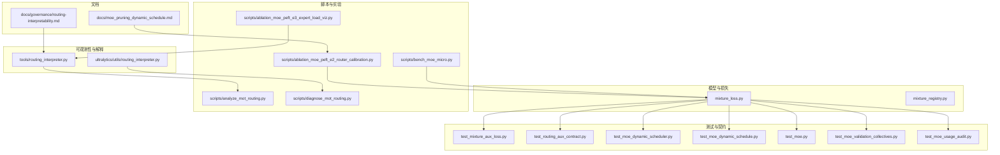
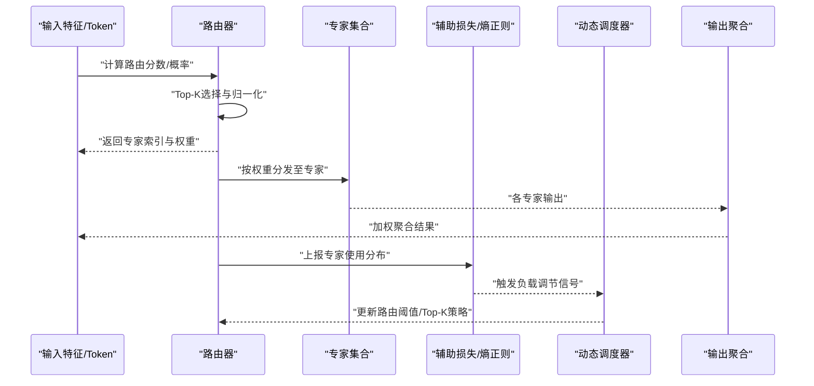
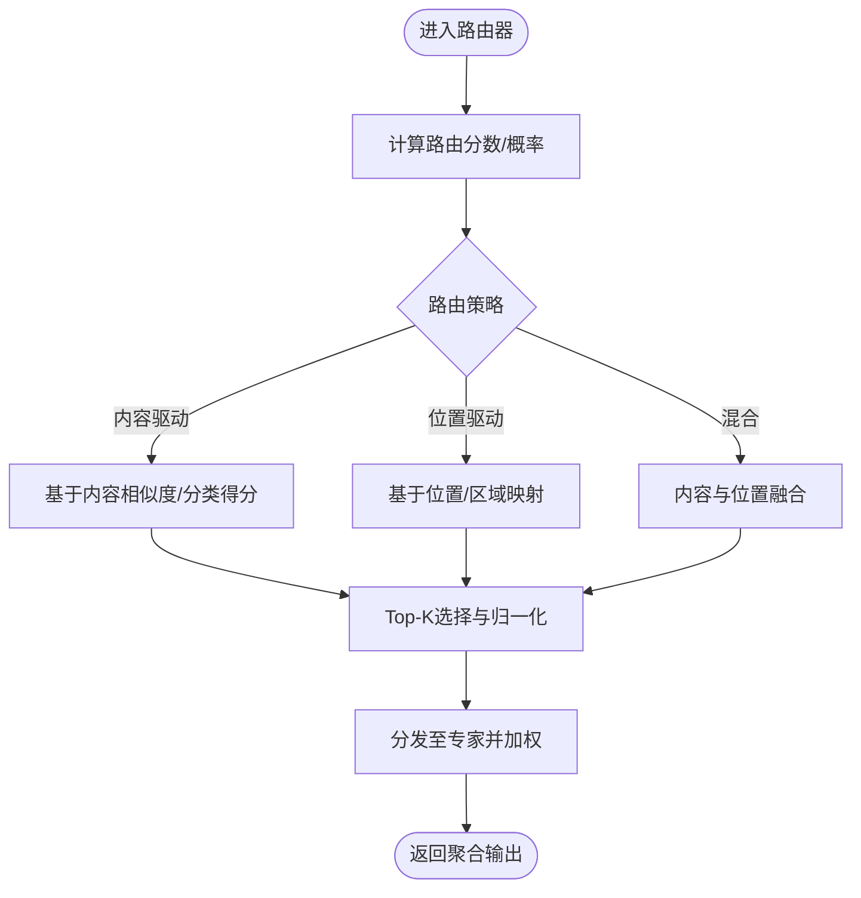
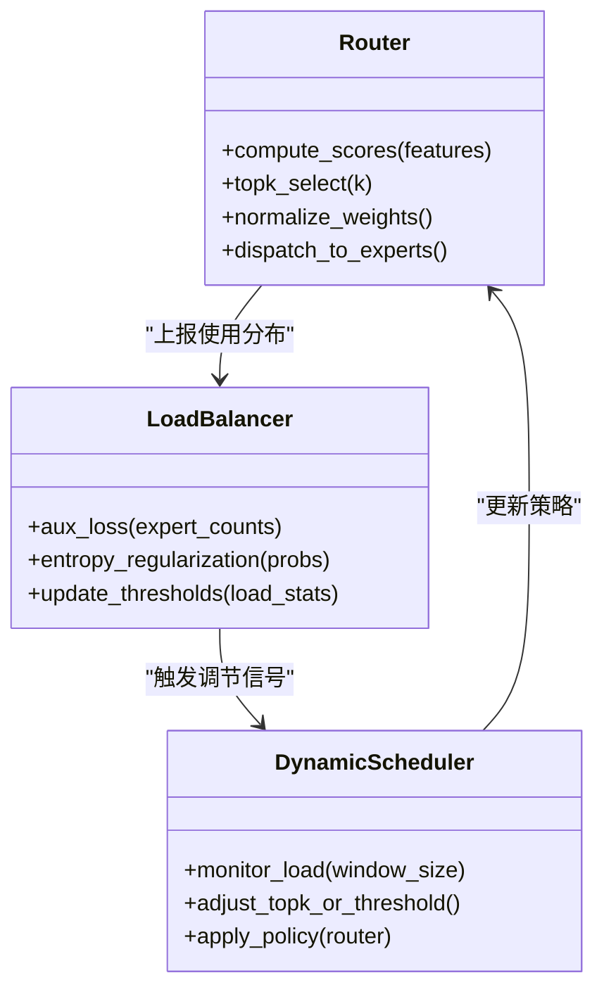
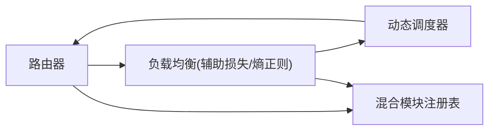
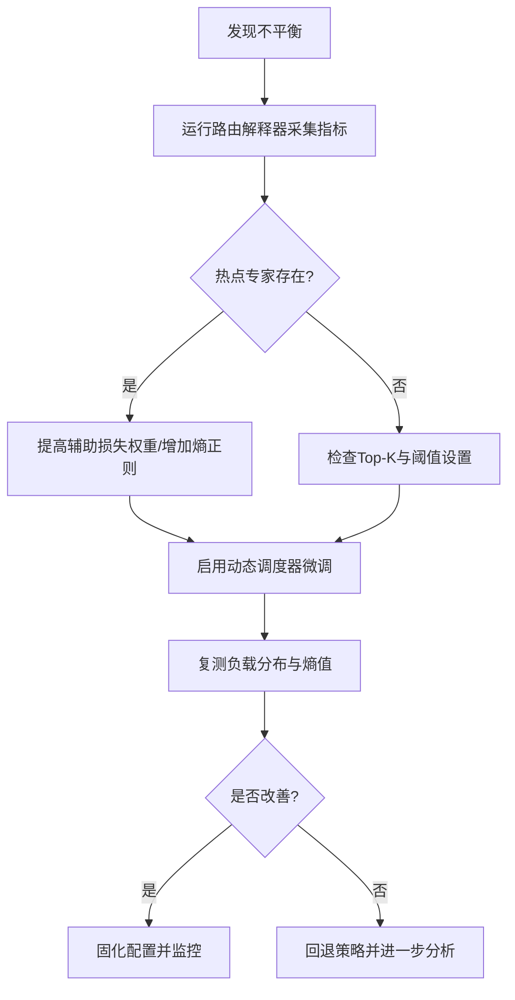

# 路由机制与负载均衡

<cite>
**本文引用的文件**
- [mixture_loss.py](file://ultralytics/nn/mixture_loss.py)
- [mixture_registry.py](file://ultralytics/nn/mixture_registry.py)
- [test_mixture_aux_loss.py](file://tests/test_mixture_aux_loss.py)
- [test_moe_dynamic_scheduler.py](file://tests/test_moe_dynamic_scheduler.py)
- [test_moe_dynamic_schedule.py](file://tests/test_moe_dynamic_schedule.py)
- [test_routing_aux_contract.py](file://tests/test_routing_aux_contract.py)
- [routing_interpreter.py](file://tools/routing_interpreter.py)
- [routing_interpreter.py](file://ultralytics/utils/routing_interpreter.py)
- [analyze_mot_routing.py](file://scripts/analyze_mot_routing.py)
- [diagnose_mot_routing.py](file://scripts/diagnose_mot_routing.py)
- [ablation_moe_peft_e2_router_calibration.py](file://scripts/ablation_moe_peft_e2_router_calibration.py)
- [ablation_moe_peft_e3_expert_load_viz.py](file://scripts/ablation_moe_peft_e3_expert_load_viz.py)
- [bench_moe_micro.py](file://scripts/bench_moe_micro.py)
- [test_moe.py](file://tests/test_moe.py)
- [test_moe_validation_collectives.py](file://tests/test_moe_validation_collectives.py)
- [test_moe_usage_audit.py](file://tests/test_moe_usage_audit.py)
- [moe_pruning_dynamic_schedule.md](file://docs/moe_pruning_dynamic_schedule.md)
- [routing-interpretability.md](file://docs/governance/routing-interpretability.md)
</cite>

## 目录
1. [简介](#简介)
2. [项目结构](#项目结构)
3. [核心组件](#核心组件)
4. [架构总览](#架构总览)
5. [详细组件分析](#详细组件分析)
6. [依赖关系分析](#依赖关系分析)
7. [性能考量](#性能考量)
8. [故障排查指南](#故障排查指南)
9. [结论](#结论)
10. [附录](#附录)

## 简介
本文件聚焦于MoE（Mixture of Experts）系统中的“路由机制”和“负载均衡策略”，围绕路由器工作原理、负载均衡算法（辅助损失函数、熵正则化、动态调度器）、不同路由策略的优缺点与适用场景，以及可视化、监控指标与调试工具的使用进行系统化说明。文档旨在帮助读者快速定位实现位置、理解设计动机并指导配置优化与问题诊断。

## 项目结构
本项目在以下路径中实现了与MoE路由与负载均衡相关的核心能力：
- 模型层与损失计算：ultralytics/nn/mixture_loss.py、ultralytics/nn/mixture_registry.py
- 测试与契约验证：tests/test_mixture_aux_loss.py、tests/test_routing_aux_contract.py、tests/test_moe_dynamic_scheduler.py、tests/test_moe_dynamic_schedule.py、tests/test_moe.py、tests/test_moe_validation_collectives.py、tests/test_moe_usage_audit.py
- 路由解释与可观测性：tools/routing_interpreter.py、ultralytics/utils/routing_interpreter.py
- 脚本与实验：scripts/analyze_mot_routing.py、scripts/diagnose_mot_routing.py、scripts/ablation_moe_peft_e2_router_calibration.py、scripts/ablation_moe_peft_e3_expert_load_viz.py、scripts/bench_moe_micro.py
- 文档与治理：docs/moe_pruning_dynamic_schedule.md、docs/governance/routing-interpretability.md

图表来源
- [mixture_loss.py](file://ultralytics/nn/mixture_loss.py)
- [mixture_registry.py](file://ultralytics/nn/mixture_registry.py)
- [test_mixture_aux_loss.py](file://tests/test_mixture_aux_loss.py)
- [test_routing_aux_contract.py](file://tests/test_routing_aux_contract.py)
- [test_moe_dynamic_scheduler.py](file://tests/test_moe_dynamic_scheduler.py)
- [test_moe_dynamic_schedule.py](file://tests/test_moe_dynamic_schedule.py)
- [test_moe.py](file://tests/test_moe.py)
- [test_moe_validation_collectives.py](file://tests/test_moe_validation_collectives.py)
- [test_moe_usage_audit.py](file://tests/test_moe_usage_audit.py)
- [routing_interpreter.py](file://tools/routing_interpreter.py)
- [routing_interpreter.py](file://ultralytics/utils/routing_interpreter.py)
- [analyze_mot_routing.py](file://scripts/analyze_mot_routing.py)
- [diagnose_mot_routing.py](file://scripts/diagnose_mot_routing.py)
- [ablation_moe_peft_e2_router_calibration.py](file://scripts/ablation_moe_peft_e2_router_calibration.py)
- [ablation_moe_peft_e3_expert_load_viz.py](file://scripts/ablation_moe_peft_e3_expert_load_viz.py)
- [bench_moe_micro.py](file://scripts/bench_moe_micro.py)
- [moe_pruning_dynamic_schedule.md](file://docs/moe_pruning_dynamic_schedule.md)
- [routing-interpretability.md](file://docs/governance/routing-interpretability.md)

章节来源
- [mixture_loss.py](file://ultralytics/nn/mixture_loss.py)
- [mixture_registry.py](file://ultralytics/nn/mixture_registry.py)
- [routing_interpreter.py](file://tools/routing_interpreter.py)
- [routing_interpreter.py](file://ultralytics/utils/routing_interpreter.py)
- [analyze_mot_routing.py](file://scripts/analyze_mot_routing.py)
- [diagnose_mot_routing.py](file://scripts/diagnose_mot_routing.py)
- [ablation_moe_peft_e2_router_calibration.py](file://scripts/ablation_moe_peft_e2_router_calibration.py)
- [ablation_moe_peft_e3_expert_load_viz.py](file://scripts/ablation_moe_peft_e3_expert_load_viz.py)
- [bench_moe_micro.py](file://scripts/bench_moe_micro.py)
- [moe_pruning_dynamic_schedule.md](file://docs/moe_pruning_dynamic_schedule.md)
- [routing-interpretability.md](file://docs/governance/routing-interpretability.md)

## 核心组件
- 路由与专家模块
  - 路由负责将输入token或特征映射到专家集合，支持Top-K选择与权重分配；专家为可独立训练与调度的子网络。
  - 关键接口与契约由测试用例定义，确保路由输出、负载统计与辅助损失的稳定性与一致性。
- 负载均衡与辅助损失
  - 通过辅助损失函数对专家使用分布施加约束，抑制“赢家通吃”现象，促进多专家均衡参与。
  - 熵正则项用于鼓励路由概率分布更均匀，避免过度集中。
- 动态调度器
  - 根据历史负载或实时统计调整路由阈值或Top-K策略，缓解热点专家过载。
- 可观测性与解释
  - 提供路由解释器与可视化脚本，记录专家命中次数、负载分布、熵值等指标，便于诊断不平衡问题。

章节来源
- [test_moe.py](file://tests/test_moe.py)
- [test_moe_validation_collectives.py](file://tests/test_moe_validation_collectives.py)
- [test_moe_usage_audit.py](file://tests/test_moe_usage_audit.py)
- [test_mixture_aux_loss.py](file://tests/test_mixture_aux_loss.py)
- [test_routing_aux_contract.py](file://tests/test_routing_aux_contract.py)
- [test_moe_dynamic_scheduler.py](file://tests/test_moe_dynamic_scheduler.py)
- [test_moe_dynamic_schedule.py](file://tests/test_moe_dynamic_schedule.py)
- [mixture_loss.py](file://ultralytics/nn/mixture_loss.py)
- [mixture_registry.py](file://ultralytics/nn/mixture_registry.py)
- [routing_interpreter.py](file://tools/routing_interpreter.py)
- [routing_interpreter.py](file://ultralytics/utils/routing_interpreter.py)

## 架构总览
下图展示了从输入到路由决策、专家执行与负载均衡反馈的整体流程，包括辅助损失与动态调度器的作用点。

图表来源
- [mixture_loss.py](file://ultralytics/nn/mixture_loss.py)
- [mixture_registry.py](file://ultralytics/nn/mixture_registry.py)
- [test_moe_dynamic_scheduler.py](file://tests/test_moe_dynamic_scheduler.py)
- [test_moe_dynamic_schedule.py](file://tests/test_moe_dynamic_schedule.py)
- [routing_interpreter.py](file://tools/routing_interpreter.py)

## 详细组件分析

### 路由器工作原理
- 基于内容的路由
  - 依据输入特征语义相似度或分类头得分选择专家，适合任务或领域差异明显的场景。
  - 优点：针对性强、收敛快；缺点：易导致局部热点。
- 基于位置的路由
  - 依据序列位置或空间区域固定映射到专家，适合结构化数据或稳定模式。
  - 优点：确定性高、开销低；缺点：灵活性差、难以适应分布漂移。
- 混合路由策略
  - 融合内容与位置信息，结合Top-K与软分配，兼顾灵活性与稳定性。
  - 优点：鲁棒性强；缺点：参数较多、需精细调参。

图表来源
- [routing_interpreter.py](file://tools/routing_interpreter.py)
- [routing_interpreter.py](file://ultralytics/utils/routing_interpreter.py)
- [test_moe.py](file://tests/test_moe.py)

章节来源
- [routing_interpreter.py](file://tools/routing_interpreter.py)
- [routing_interpreter.py](file://ultralytics/utils/routing_interpreter.py)
- [test_moe.py](file://tests/test_moe.py)

### 负载均衡算法
- 辅助损失函数
  - 目标：使专家使用分布接近均匀，降低方差，防止少数专家过载。
  - 实现要点：统计每步专家被选中的频率，构造惩罚项加入总损失。
- 熵正则化
  - 目标：提高路由概率分布的熵，避免过于尖锐的Top-1选择。
  - 实现要点：对路由概率计算负熵作为正则项，平衡探索与利用。
- 动态调度器
  - 目标：根据历史负载或实时指标自适应调整Top-K或阈值，缓解热点。
  - 实现要点：维护滑动窗口统计，当某专家负载超过阈值时提升其“吸引力”或降低其他专家权重。

图表来源
- [mixture_loss.py](file://ultralytics/nn/mixture_loss.py)
- [test_mixture_aux_loss.py](file://tests/test_mixture_aux_loss.py)
- [test_routing_aux_contract.py](file://tests/test_routing_aux_contract.py)
- [test_moe_dynamic_scheduler.py](file://tests/test_moe_dynamic_scheduler.py)
- [test_moe_dynamic_schedule.py](file://tests/test_moe_dynamic_schedule.py)

章节来源
- [mixture_loss.py](file://ultralytics/nn/mixture_loss.py)
- [test_mixture_aux_loss.py](file://tests/test_mixture_aux_loss.py)
- [test_routing_aux_contract.py](file://tests/test_routing_aux_contract.py)
- [test_moe_dynamic_scheduler.py](file://tests/test_moe_dynamic_scheduler.py)
- [test_moe_dynamic_schedule.py](file://tests/test_moe_dynamic_schedule.py)

### 不同路由算法的优缺点与适用场景
- 内容路由
  - 优点：语义匹配精准；缺点：对分布变化敏感。
  - 适用：多任务或多领域混合数据。
- 位置路由
  - 优点：稳定且高效；缺点：缺乏灵活性。
  - 适用：结构化或时序稳定的数据。
- 混合路由
  - 优点：鲁棒性高；缺点：需要更多超参与算力。
  - 适用：复杂场景、长尾分布与动态环境。

章节来源
- [routing_interpreter.py](file://tools/routing_interpreter.py)
- [routing_interpreter.py](file://ultralytics/utils/routing_interpreter.py)
- [test_moe.py](file://tests/test_moe.py)

### 路由配置优化指南
- 超参建议
  - Top-K：小批量或资源受限场景取较小值，大模型或复杂任务适当增大。
  - 辅助损失权重：初始中等强度，随训练逐步衰减以避免过约束。
  - 熵正则系数：控制探索程度，过大可能影响精度，过小无法缓解不平衡。
  - 动态调度窗口：根据数据节奏设置，避免频繁抖动。
- 实践步骤
  - 先启用内容路由+辅助损失，观察专家负载分布；
  - 若出现热点，引入熵正则与动态调度微调；
  - 针对稳定模式场景尝试位置路由或混合路由；
  - 使用解释器与可视化脚本持续监控并迭代。

章节来源
- [moe_pruning_dynamic_schedule.md](file://docs/moe_pruning_dynamic_schedule.md)
- [ablation_moe_peft_e2_router_calibration.py](file://scripts/ablation_moe_peft_e2_router_calibration.py)
- [ablation_moe_peft_e3_expert_load_viz.py](file://scripts/ablation_moe_peft_e3_expert_load_viz.py)

## 依赖关系分析
- 模块耦合
  - 路由器与负载均衡紧密耦合，通过统计与损失反馈形成闭环；
  - 动态调度器依赖负载统计与路由策略接口，具备一定解耦性。
- 外部依赖
  - 分布式校验与审计用例表明系统考虑了跨设备的一致性检查与使用审计。
- 潜在循环依赖
  - 通过明确的接口契约与测试覆盖，降低循环依赖风险。

图表来源
- [mixture_registry.py](file://ultralytics/nn/mixture_registry.py)
- [test_moe_validation_collectives.py](file://tests/test_moe_validation_collectives.py)
- [test_moe_usage_audit.py](file://tests/test_moe_usage_audit.py)

章节来源
- [mixture_registry.py](file://ultralytics/nn/mixture_registry.py)
- [test_moe_validation_collectives.py](file://tests/test_moe_validation_collectives.py)
- [test_moe_usage_audit.py](file://tests/test_moe_usage_audit.py)

## 性能考量
- 路由开销
  - Top-K与归一化在批维度上并行计算，注意内存带宽与算子融合；
  - 大规模专家集合下，建议使用稀疏分发与异步聚合。
- 负载均衡成本
  - 辅助损失与熵正则计算轻量，但需维护全局统计，分布式场景需allreduce同步；
  - 动态调度器应限制更新频率，避免频繁重规划。
- 基准与微基准
  - 使用微基准脚本评估路由与专家调度的端到端延迟与吞吐，定位瓶颈。

章节来源
- [bench_moe_micro.py](file://scripts/bench_moe_micro.py)
- [test_moe.py](file://tests/test_moe.py)

## 故障排查指南
- 常见问题
  - 专家过载：部分专家命中率显著高于平均，其余闲置；
  - 路由不稳定：Top-K频繁切换，负载波动剧烈；
  - 数值异常：路由概率NaN或Inf，导致训练崩溃。
- 诊断步骤
  - 使用路由解释器收集专家命中次数、负载分布与熵值；
  - 借助分析脚本对比不同批次与时间窗口的负载曲线；
  - 检查辅助损失权重与熵正则系数是否合理；
  - 调整动态调度窗口与阈值，观察改善效果。
- 工具与脚本
  - 路由解释器：tools/routing_interpreter.py、ultralytics/utils/routing_interpreter.py
  - 分析与诊断：scripts/analyze_mot_routing.py、scripts/diagnose_mot_routing.py
  - 校准与可视化：scripts/ablation_moe_peft_e2_router_calibration.py、scripts/ablation_moe_peft_e3_expert_load_viz.py

图表来源
- [routing_interpreter.py](file://tools/routing_interpreter.py)
- [routing_interpreter.py](file://ultralytics/utils/routing_interpreter.py)
- [analyze_mot_routing.py](file://scripts/analyze_mot_routing.py)
- [diagnose_mot_routing.py](file://scripts/diagnose_mot_routing.py)
- [ablation_moe_peft_e2_router_calibration.py](file://scripts/ablation_moe_peft_e2_router_calibration.py)
- [ablation_moe_peft_e3_expert_load_viz.py](file://scripts/ablation_moe_peft_e3_expert_load_viz.py)

章节来源
- [routing_interpreter.py](file://tools/routing_interpreter.py)
- [routing_interpreter.py](file://ultralytics/utils/routing_interpreter.py)
- [analyze_mot_routing.py](file://scripts/analyze_mot_routing.py)
- [diagnose_mot_routing.py](file://scripts/diagnose_mot_routing.py)
- [ablation_moe_peft_e2_router_calibration.py](file://scripts/ablation_moe_peft_e2_router_calibration.py)
- [ablation_moe_peft_e3_expert_load_viz.py](file://scripts/ablation_moe_peft_e3_expert_load_viz.py)

## 结论
本项目在MoE路由与负载均衡方面提供了完整的实现与工具链：路由器支持多种策略，负载均衡通过辅助损失与熵正则抑制热点，动态调度器进一步提升鲁棒性。配合路由解释器与可视化脚本，用户可高效诊断与优化路由不平衡问题。建议在复杂场景中优先采用混合路由并结合动态调度，同时以微基准与监控指标持续验证性能与稳定性。

## 附录
- 相关文档
  - 动态调度与剪枝策略：docs/moe_pruning_dynamic_schedule.md
  - 路由可解释性治理规范：docs/governance/routing-interpretability.md

章节来源
- [moe_pruning_dynamic_schedule.md](file://docs/moe_pruning_dynamic_schedule.md)
- [routing-interpretability.md](file://docs/governance/routing-interpretability.md)