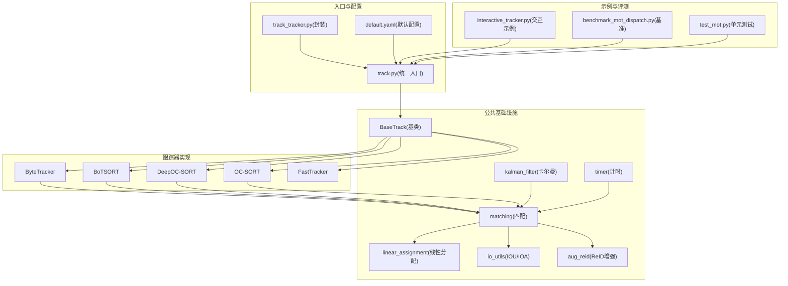
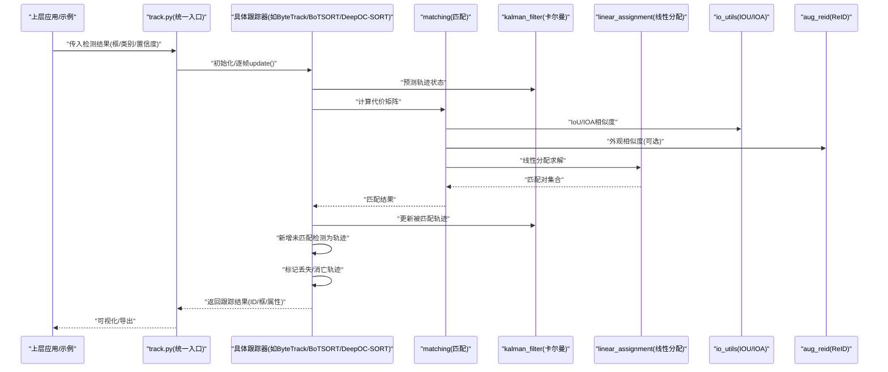
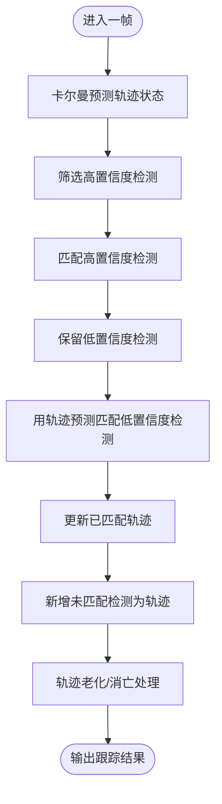
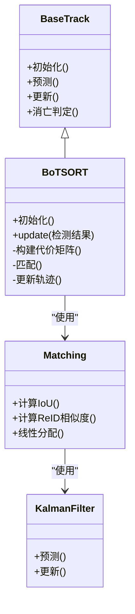
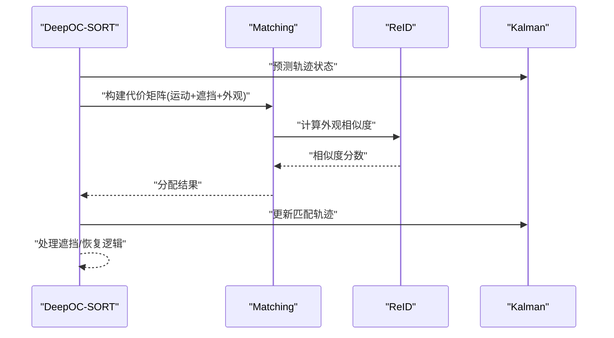
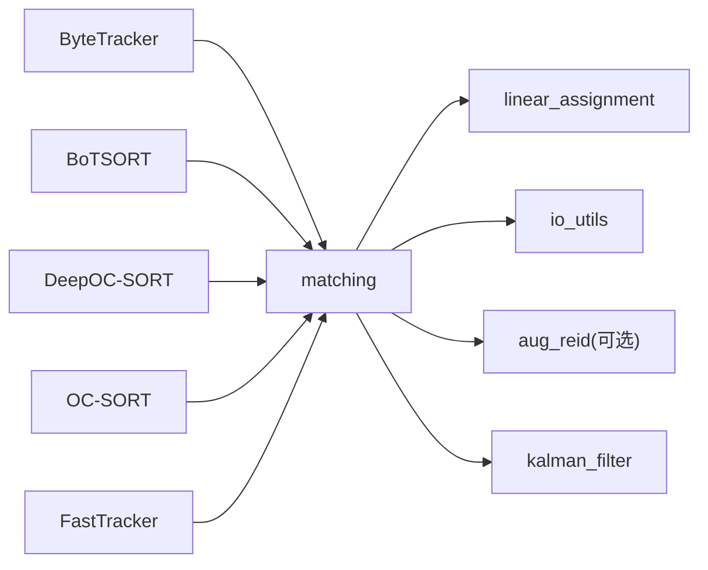

# 多目标跟踪

<cite>
**本文引用的文件**
- [ultralytics/trackers/__init__.py](file://ultralytics/trackers/__init__.py)
- [ultralytics/trackers/basetrack.py](file://ultralytics/trackers/basetrack.py)
- [ultralytics/trackers/byte_tracker.py](file://ultralytics/trackers/byte_tracker.py)
- [ultralytics/trackers/bot_sort.py](file://ultralytics/trackers/bot_sort.py)
- [ultralytics/trackers/deep_oc_sort.py](file://ultralytics/trackers/deep_oc_sort.py)
- [ultralytics/trackers/fast_tracker.py](file://ultralytics/trackers/fast_tracker.py)
- [ultralytics/trackers/oc_sort.py](file://ultralytics/trackers/oc_sort.py)
- [ultralytics/trackers/track.py](file://ultralytics/trackers/track.py)
- [ultralytics/trackers/track_tracker.py](file://ultralytics/trackers/track_tracker.py)
- [ultralytics/trackers/utils/matching.py](file://ultralytics/trackers/utils/matching.py)
- [ultralytics/trackers/utils/kalman_filter.py](file://ultralytics/trackers/utils/kalman_filter.py)
- [ultralytics/trackers/utils/linear_assignment.py](file://ultralytics/trackers/utils/linear_assignment.py)
- [ultralytics/trackers/utils/io_utils.py](file://ultralytics/trackers/utils/io_utils.py)
- [ultralytics/trackers/utils/timer.py](file://ultralytics/trackers/utils/timer.py)
- [ultralytics/trackers/utils/aug_reid.py](file://ultralytics/trackers/utils/aug_reid.py)
- [ultralytics/cfg/trackers/default.yaml](file://ultralytics/cfg/trackers/default.yaml)
- [examples/YOLO-Interactive-Tracking-UI/interactive_tracker.py](file://examples/YOLO-Interactive-Tracking-UI/interactive_tracker.py)
- [benchmarks/benchmark_mot_dispatch.py](file://benchmarks/benchmark_mot_dispatch.py)
- [tests/test_mot.py](file://tests/test_mot.py)
</cite>

## 目录
1. [简介](#简介)
2. [项目结构](#项目结构)
3. [核心组件](#核心组件)
4. [架构总览](#架构总览)
5. [详细组件分析](#详细组件分析)
6. [依赖关系分析](#依赖关系分析)
7. [性能考量](#性能考量)
8. [故障排查指南](#故障排查指南)
9. [结论](#结论)
10. [附录](#附录)

## 简介
本文件系统性介绍 YOLO-Master 的多目标跟踪（MoT）子系统，覆盖 ByteTrack、BoTSORT、DeepOC-SORT 等主流算法的实现要点与差异，阐述 ID 分配策略、重识别技术、轨迹管理与性能优化方法。文档同时给出端到端工作流程（模型集成、参数配置、实时处理、结果可视化）、复杂场景挑战与解决方案，并提供基准测试、调优指南与实际应用案例的参考路径。

## 项目结构
YOLO-Master 的 MoT 子系统位于 ultralytics/trackers 目录，采用“统一接口 + 多实现”的设计：所有跟踪器继承自基类，提供一致的初始化、更新与状态查询接口；匹配、卡尔曼滤波、线性分配、IOU/ID 特征工具等通用能力集中在 utils 子模块中；配置文件集中管理默认参数；示例与基准脚本用于演示与评测。

图表来源
- [ultralytics/trackers/track.py](file://ultralytics/trackers/track.py)
- [ultralytics/trackers/track_tracker.py](file://ultralytics/trackers/track_tracker.py)
- [ultralytics/trackers/basetrack.py](file://ultralytics/trackers/basetrack.py)
- [ultralytics/trackers/byte_tracker.py](file://ultralytics/trackers/byte_tracker.py)
- [ultralytics/trackers/bot_sort.py](file://ultralytics/trackers/bot_sort.py)
- [ultralytics/trackers/deep_oc_sort.py](file://ultralytics/trackers/deep_oc_sort.py)
- [ultralytics/trackers/oc_sort.py](file://ultralytics/trackers/oc_sort.py)
- [ultralytics/trackers/fast_tracker.py](file://ultralytics/trackers/fast_tracker.py)
- [ultralytics/trackers/utils/matching.py](file://ultralytics/trackers/utils/matching.py)
- [ultralytics/trackers/utils/kalman_filter.py](file://ultralytics/trackers/utils/kalman_filter.py)
- [ultralytics/trackers/utils/linear_assignment.py](file://ultralytics/trackers/utils/linear_assignment.py)
- [ultralytics/trackers/utils/io_utils.py](file://ultralytics/trackers/utils/io_utils.py)
- [ultralytics/trackers/utils/timer.py](file://ultralytics/trackers/utils/timer.py)
- [ultralytics/trackers/utils/aug_reid.py](file://ultralytics/trackers/utils/aug_reid.py)
- [ultralytics/cfg/trackers/default.yaml](file://ultralytics/cfg/trackers/default.yaml)
- [examples/YOLO-Interactive-Tracking-UI/interactive_tracker.py](file://examples/YOLO-Interactive-Tracking-UI/interactive_tracker.py)
- [benchmarks/benchmark_mot_dispatch.py](file://benchmarks/benchmark_mot_dispatch.py)
- [tests/test_mot.py](file://tests/test_mot.py)

章节来源
- [ultralytics/trackers/__init__.py](file://ultralytics/trackers/__init__.py)
- [ultralytics/trackers/track.py](file://ultralytics/trackers/track.py)
- [ultralytics/trackers/track_tracker.py](file://ultralytics/trackers/track_tracker.py)
- [ultralytics/cfg/trackers/default.yaml](file://ultralytics/cfg/trackers/default.yaml)

## 核心组件
- 统一跟踪接口与生命周期
  - 通过统一的初始化与逐帧 update 流程，屏蔽不同算法差异，便于在预测管线中无缝替换。
  - 支持可选的重识别特征提取与融合，提升遮挡与长时跟踪稳定性。
- 轨迹对象与状态管理
  - 每个轨迹维护 ID、边界框、速度、置信度、可见性、年龄、缺失计数等元信息，并负责轨迹的创建、延续、消亡判定。
- 匹配与分配
  - 基于 IoU/IOA 的运动相似度与可选 ReID 外观相似度构建代价矩阵，使用线性分配求解最优匹配。
- 运动建模
  - 使用卡尔曼滤波对目标位置与速度进行预测与更新，支撑遮挡恢复与短时插值。
- 计时与可观测性
  - 提供细粒度计时与统计，便于定位瓶颈与评估吞吐/延迟。

章节来源
- [ultralytics/trackers/basetrack.py](file://ultralytics/trackers/basetrack.py)
- [ultralytics/trackers/utils/matching.py](file://ultralytics/trackers/utils/matching.py)
- [ultralytics/trackers/utils/kalman_filter.py](file://ultralytics/trackers/utils/kalman_filter.py)
- [ultralytics/trackers/utils/linear_assignment.py](file://ultralytics/trackers/utils/linear_assignment.py)
- [ultralytics/trackers/utils/timer.py](file://ultralytics/trackers/utils/timer.py)

## 架构总览
下图展示了从检测输出到跟踪输出的完整数据流，以及各跟踪器的选择与调用方式。

图表来源
- [ultralytics/trackers/track.py](file://ultralytics/trackers/track.py)
- [ultralytics/trackers/byte_tracker.py](file://ultralytics/trackers/byte_tracker.py)
- [ultralytics/trackers/bot_sort.py](file://ultralytics/trackers/bot_sort.py)
- [ultralytics/trackers/deep_oc_sort.py](file://ultralytics/trackers/deep_oc_sort.py)
- [ultralytics/trackers/utils/matching.py](file://ultralytics/trackers/utils/matching.py)
- [ultralytics/trackers/utils/kalman_filter.py](file://ultralytics/trackers/utils/kalman_filter.py)
- [ultralytics/trackers/utils/linear_assignment.py](file://ultralytics/trackers/utils/linear_assignment.py)
- [ultralytics/trackers/utils/io_utils.py](file://ultralytics/trackers/utils/io_utils.py)
- [ultralytics/trackers/utils/aug_reid.py](file://ultralytics/trackers/utils/aug_reid.py)

## 详细组件分析

### ByteTrack 实现与特点
- 设计思想
  - 将低置信度检测也纳入跟踪，利用轨迹预测与检测的匹配关系区分真实目标与误检，从而提升召回率与连续性。
- ID 分配策略
  - 先匹配高置信度检测，再尝试用轨迹预测匹配剩余低置信度检测，避免 ID 频繁切换。
- 重识别
  - 可选开启外观特征辅助匹配，但在典型场景中主要依赖运动一致性。
- 轨迹管理
  - 对未匹配轨迹进行老化与消亡判定；对长时间未更新的轨迹进行删除或降级。
- 性能优化
  - 仅对必要轨迹执行卡尔曼更新；合理设置阈值以减少不必要的匹配开销。

图表来源
- [ultralytics/trackers/byte_tracker.py](file://ultralytics/trackers/byte_tracker.py)
- [ultralytics/trackers/utils/matching.py](file://ultralytics/trackers/utils/matching.py)
- [ultralytics/trackers/utils/kalman_filter.py](file://ultralytics/trackers/utils/kalman_filter.py)
- [ultralytics/trackers/utils/linear_assignment.py](file://ultralytics/trackers/utils/linear_assignment.py)

章节来源
- [ultralytics/trackers/byte_tracker.py](file://ultralytics/trackers/byte_tracker.py)
- [ultralytics/trackers/utils/matching.py](file://ultralytics/trackers/utils/matching.py)
- [ultralytics/trackers/utils/kalman_filter.py](file://ultralytics/trackers/utils/kalman_filter.py)
- [ultralytics/trackers/utils/linear_assignment.py](file://ultralytics/trackers/utils/linear_assignment.py)

### BoTSORT 实现与特点
- 设计思想
  - 在 SORT 基础上引入更强的运动模型与外观特征，结合 ReID 提升遮挡与密集场景下的鲁棒性。
- ID 分配策略
  - 联合运动与外观相似度构建代价矩阵，优先保证 ID 稳定与跨遮挡一致。
- 重识别
  - 使用外观嵌入进行相似度计算，支持在线更新外观库以应对外观漂移。
- 轨迹管理
  - 更精细的轨迹生命周期控制，包括遮挡时长、最小可见时长、消亡阈值等。
- 性能优化
  - 按需加载 ReID 模型、缓存外观特征、限制候选轨迹数量以降低计算量。

图表来源
- [ultralytics/trackers/basetrack.py](file://ultralytics/trackers/basetrack.py)
- [ultralytics/trackers/bot_sort.py](file://ultralytics/trackers/bot_sort.py)
- [ultralytics/trackers/utils/matching.py](file://ultralytics/trackers/utils/matching.py)
- [ultralytics/trackers/utils/kalman_filter.py](file://ultralytics/trackers/utils/kalman_filter.py)

章节来源
- [ultralytics/trackers/bot_sort.py](file://ultralytics/trackers/bot_sort.py)
- [ultralytics/trackers/utils/matching.py](file://ultralytics/trackers/utils/matching.py)
- [ultralytics/trackers/utils/aug_reid.py](file://ultralytics/trackers/utils/aug_reid.py)

### DeepOC-SORT 实现与特点
- 设计思想
  - 面向严重遮挡场景，强化遮挡建模与外观判别能力，提高遮挡后重关联成功率。
- ID 分配策略
  - 在匹配阶段引入遮挡感知机制，结合外观与运动双重证据降低误匹配。
- 重识别
  - 深度外观特征与上下文信息融合，支持动态外观库更新。
- 轨迹管理
  - 针对遮挡恢复设置更宽容的匹配窗口与回溯策略。
- 性能优化
  - 选择性启用外观分支、批量化外观推理、近似最近邻检索加速。

图表来源
- [ultralytics/trackers/deep_oc_sort.py](file://ultralytics/trackers/deep_oc_sort.py)
- [ultralytics/trackers/utils/matching.py](file://ultralytics/trackers/utils/matching.py)
- [ultralytics/trackers/utils/aug_reid.py](file://ultralytics/trackers/utils/aug_reid.py)
- [ultralytics/trackers/utils/kalman_filter.py](file://ultralytics/trackers/utils/kalman_filter.py)

章节来源
- [ultralytics/trackers/deep_oc_sort.py](file://ultralytics/trackers/deep_oc_sort.py)
- [ultralytics/trackers/utils/matching.py](file://ultralytics/trackers/utils/matching.py)
- [ultralytics/trackers/utils/aug_reid.py](file://ultralytics/trackers/utils/aug_reid.py)

### OC-SORT 与 FastTracker
- OC-SORT
  - 在 SORT 基础上引入遮挡建模，提升遮挡后的轨迹连续性，适合中等复杂度场景。
- FastTracker
  - 轻量级跟踪器，侧重速度与资源受限环境，牺牲部分精度换取更高吞吐。

章节来源
- [ultralytics/trackers/oc_sort.py](file://ultralytics/trackers/oc_sort.py)
- [ultralytics/trackers/fast_tracker.py](file://ultralytics/trackers/fast_tracker.py)

### 统一入口与封装
- track.py
  - 提供统一的初始化与逐帧更新接口，屏蔽底层跟踪器差异，便于在预测管线中直接调用。
- track_tracker.py
  - 对跟踪器进行二次封装，简化调用方式，适配常见任务需求。

章节来源
- [ultralytics/trackers/track.py](file://ultralytics/trackers/track.py)
- [ultralytics/trackers/track_tracker.py](file://ultralytics/trackers/track_tracker.py)

## 依赖关系分析
- 组件耦合
  - 跟踪器强依赖 matching、kalman_filter、linear_assignment 等基础模块；BoTSORT/DeepOC-SORT 额外依赖 aug_reid。
- 外部依赖
  - 数值计算与矩阵运算由底层张量库提供；可视化和日志由上层应用决定。
- 潜在循环依赖
  - 当前结构清晰分层，未见明显循环依赖风险。

图表来源
- [ultralytics/trackers/byte_tracker.py](file://ultralytics/trackers/byte_tracker.py)
- [ultralytics/trackers/bot_sort.py](file://ultralytics/trackers/bot_sort.py)
- [ultralytics/trackers/deep_oc_sort.py](file://ultralytics/trackers/deep_oc_sort.py)
- [ultralytics/trackers/oc_sort.py](file://ultralytics/trackers/oc_sort.py)
- [ultralytics/trackers/fast_tracker.py](file://ultralytics/trackers/fast_tracker.py)
- [ultralytics/trackers/utils/matching.py](file://ultralytics/trackers/utils/matching.py)
- [ultralytics/trackers/utils/linear_assignment.py](file://ultralytics/trackers/utils/linear_assignment.py)
- [ultralytics/trackers/utils/io_utils.py](file://ultralytics/trackers/utils/io_utils.py)
- [ultralytics/trackers/utils/aug_reid.py](file://ultralytics/trackers/utils/aug_reid.py)
- [ultralytics/trackers/utils/kalman_filter.py](file://ultralytics/trackers/utils/kalman_filter.py)

## 性能考量
- 匹配复杂度
  - 线性分配通常随轨迹数与检测数呈平方级增长，建议限制候选集规模与提前剪枝。
- 外观特征开销
  - ReID 推理成本较高，可按需启用、批量化推理、缓存特征或使用近似检索。
- 卡尔曼更新频率
  - 仅对活跃轨迹进行更新，减少无效计算。
- 内存与缓存
  - 控制轨迹历史长度与外观库大小，避免内存泄漏。
- I/O 与可视化
  - 视频读写与绘图是常见瓶颈，建议使用高效解码与异步渲染。

[本节为通用指导，不直接分析具体文件]

## 故障排查指南
- 常见问题
  - ID 频繁切换：检查匹配阈值、外观相似度权重与轨迹消亡策略。
  - 遮挡后丢失：调整遮挡容忍度、增加外观特征权重、延长最小可见时长。
  - 漏检导致断轨：适当放宽低置信度检测参与匹配的策略（如 ByteTrack）。
  - 性能不足：关闭 ReID、限制候选轨迹、减少可视化开销。
- 诊断手段
  - 使用计时模块定位慢点；打印匹配代价分布；记录轨迹生命周期事件。
- 回归验证
  - 使用单元测试与基准脚本复现实验条件，确保改动不影响关键指标。

章节来源
- [ultralytics/trackers/utils/timer.py](file://ultralytics/trackers/utils/timer.py)
- [tests/test_mot.py](file://tests/test_mot.py)
- [benchmarks/benchmark_mot_dispatch.py](file://benchmarks/benchmark_mot_dispatch.py)

## 结论
YOLO-Master 的 MoT 子系统以统一接口为核心，整合了多种主流跟踪算法，兼顾精度与效率。通过合理的 ID 分配策略、可选的外观重识别、稳健的轨迹管理与细致的性能优化，能够在复杂场景中取得良好表现。用户可根据实际场景选择合适的跟踪器与参数，并结合基准与测试进行持续调优。

[本节为总结性内容，不直接分析具体文件]

## 附录

### 端到端工作流
- 模型集成
  - 在预测管线中获取每帧检测结果，调用统一跟踪接口进行逐帧更新。
- 参数配置
  - 通过默认配置文件统一管理阈值、外观权重、轨迹生命周期等关键参数。
- 实时处理
  - 控制输入帧率、批量推理与可视化渲染，确保端到端延迟满足要求。
- 结果可视化
  - 绘制轨迹、ID 标签、速度向量与遮挡指示，便于人工校验与调试。

章节来源
- [ultralytics/cfg/trackers/default.yaml](file://ultralytics/cfg/trackers/default.yaml)
- [examples/YOLO-Interactive-Tracking-UI/interactive_tracker.py](file://examples/YOLO-Interactive-Tracking-UI/interactive_tracker.py)

### 复杂场景挑战与解决方案
- 密集人群与相互遮挡
  - 使用 BoTSORT/DeepOC-SORT 的外观与遮挡建模；适度放宽匹配阈值；引入时序一致性约束。
- 快速运动与模糊
  - 增强卡尔曼运动模型；提高帧间时间步估计准确性；必要时降低帧率或提升曝光。
- 外观相似与身份混淆
  - 引入更强外观特征；结合上下文与轨迹历史；使用多假设跟踪或回溯修正。
- 资源受限设备
  - 选用 FastTracker；关闭或降采样 ReID；裁剪感兴趣区域；使用更高效的数据通路。

[本节为概念性内容，不直接分析具体文件]

### 基准测试与调优指南
- 基准测试
  - 使用基准脚本在不同数据集与硬件上运行，收集吞吐、延迟与精度指标。
- 调优步骤
  - 先调运动相关阈值，再调外观权重；逐步放宽低置信度匹配；监控轨迹生命周期与 ID 切换次数。
- 回归与对比
  - 固定随机种子与数据顺序；对比不同跟踪器与参数组合；记录关键指标变化。

章节来源
- [benchmarks/benchmark_mot_dispatch.py](file://benchmarks/benchmark_mot_dispatch.py)
- [tests/test_mot.py](file://tests/test_mot.py)

### 实际应用案例
- 交互式跟踪 UI
  - 通过示例程序加载视频/摄像头，实时显示跟踪结果，支持参数热调整与可视化开关。
- 生产部署
  - 结合边缘设备导出与推理后端，优化 I/O 与渲染链路，确保稳定低延迟。

章节来源
- [examples/YOLO-Interactive-Tracking-UI/interactive_tracker.py](file://examples/YOLO-Interactive-Tracking-UI/interactive_tracker.py)