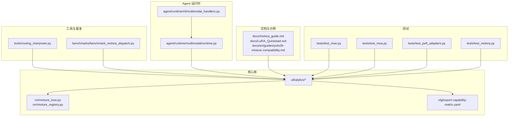
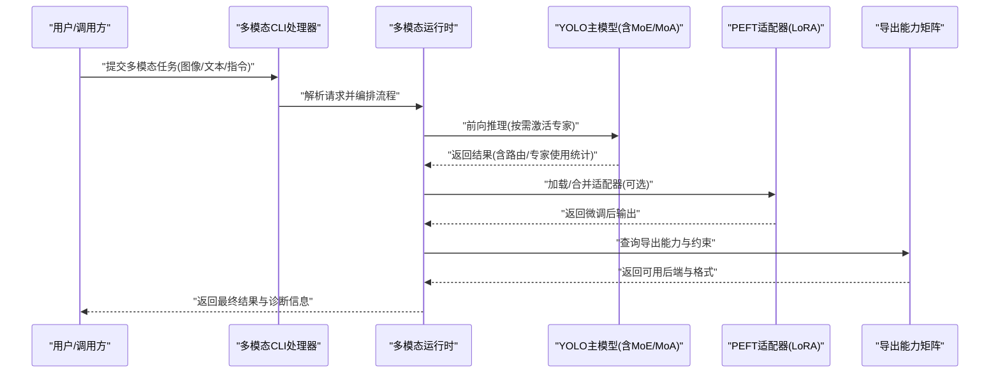
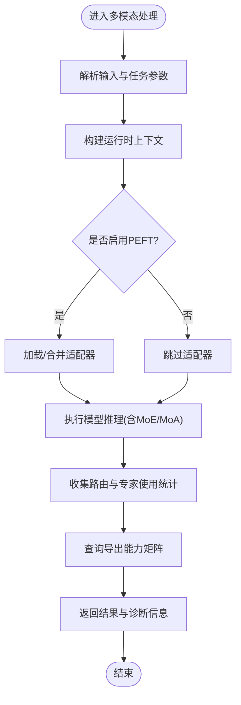
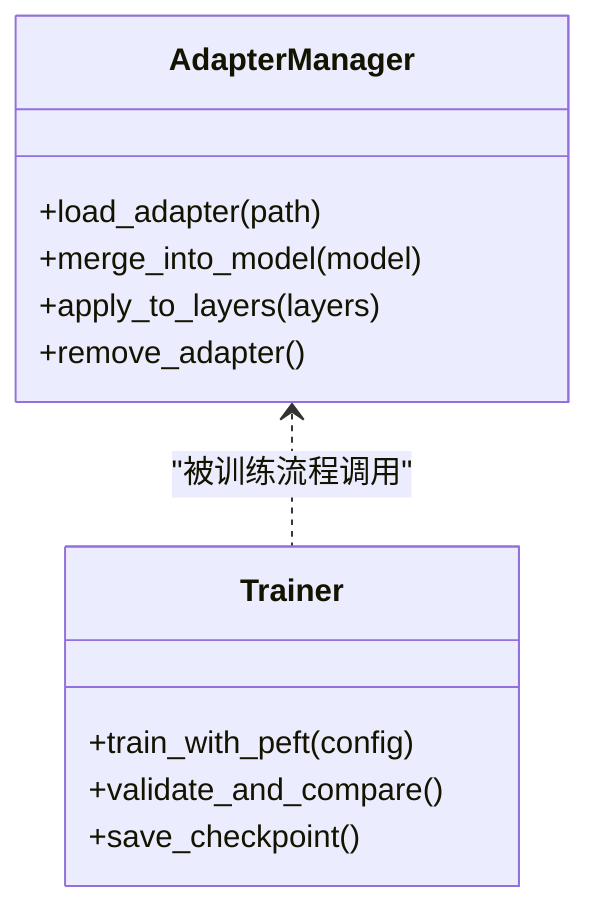
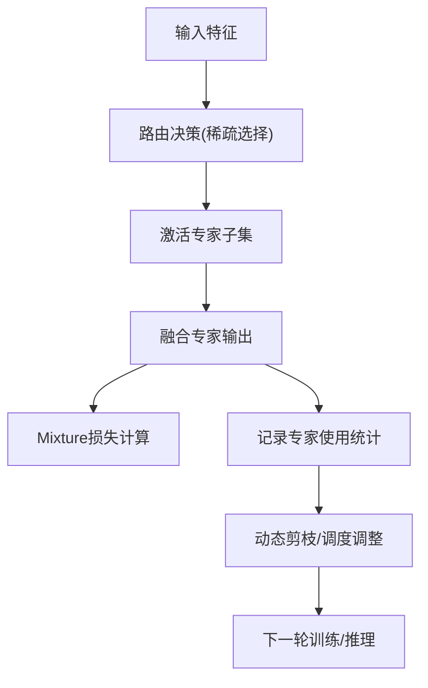
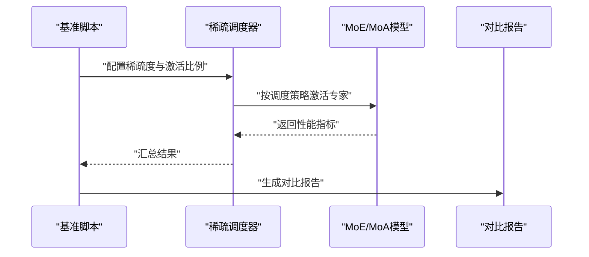
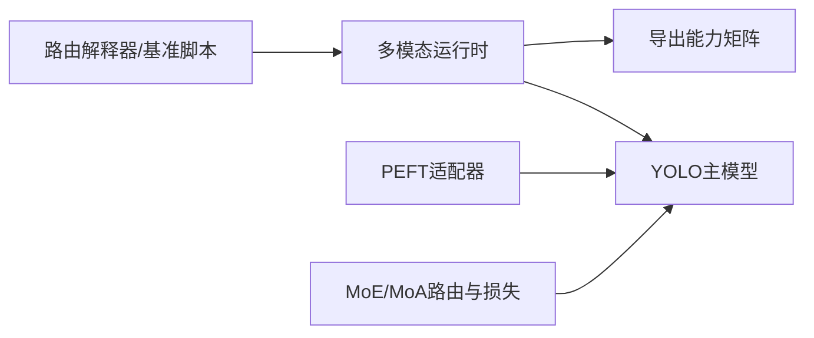

# 核心特性

<cite>
**本文引用的文件**
- [README.md](file://README.md)
- [YOLO-Master-v260721-MoA-MoE-MoT-PEFT-Planner-深度分析-v4.md](file://YOLO-Master-v260721-MoA-MoE-MoT-PEFT-Planner-深度分析-v4.md)
- [molora_guide.md](file://docs/molora_guide.md)
- [LoRA_Quickstart.md](file://docs/LoRA_Quickstart.md)
- [yolo26-mixture-compatibility.md](file://docs/en/guides/yolo26-mixture-compatibility.md)
- [moe_pruning_dynamic_schedule.md](file://docs/moe_pruning_dynamic_schedule.md)
- [routing_interpreter.py](file://tools/routing_interpreter.py)
- [test_moe.py](file://tests/test_moe.py)
- [test_molora.py](file://tests/test_molora.py)
- [test_moa.py](file://tests/test_moa.py)
- [test_peft_adapters.py](file://tests/test_peft_adapters.py)
- [mixture_loss.py](file://ultralytics/nn/mixture_loss.py)
- [mixture_registry.py](file://ultralytics/nn/mixture_registry.py)
- [export-capability-matrix.yaml](file://ultralytics/cfg/export-capability-matrix.yaml)
- [benchmark_molora_dispatch.py](file://benchmarks/benchmark_molora_dispatch.py)
- [compare_open_world_profiles.py](file://agent/runtime/cli/compare_open_world_profiles.py)
- [multimodal_handlers.py](file://agent/runtime/cli/multimodal_handlers.py)
- [runtime.py](file://agent/runtime/multimodal/runtime.py)
</cite>

## 目录
1. [简介](#简介)
2. [项目结构](#项目结构)
3. [核心特性](#核心特性)
4. [架构总览](#架构总览)
5. [详细组件分析](#详细组件分析)
6. [依赖关系分析](#依赖关系分析)
7. [性能考量](#性能考量)
8. [故障排查指南](#故障排查指南)
9. [结论](#结论)
10. [附录](#附录)

## 简介
本文件聚焦于 YOLO-Master-v260720 的核心特性与技术优势，围绕多模态计算机视觉支持、参数高效微调（PEFT）、多专家混合（MoE/MoA）等创新点展开。文档从系统架构、关键模块、数据流与处理逻辑、集成点、错误处理与性能特征等多维度进行系统化说明，并提供特性对比、推荐配置与最佳实践，帮助用户快速选择合适的技术方案并落地应用。

## 项目结构
仓库采用模块化组织方式：
- 模型与训练推理核心位于 ultralytics 子包，包含任务定义、损失函数、导出能力矩阵、Mixture 相关实现等。
- 工具与基准测试位于 tools、benchmarks 目录，提供路由解释器、调度与基准脚本。
- Agent 运行时在 agent 目录下，封装了多模态处理、CLI 入口与评估流程。
- 文档与示例位于 docs、examples，涵盖 LoRA 快速开始、Molora 指南、Yolo26 Mixture 兼容性说明等。
- 测试覆盖 MoE、MoA、PEFT、Molora 等关键路径，确保稳定性与契约一致性。

图表来源
- [mixture_loss.py](file://ultralytics/nn/mixture_loss.py)
- [mixture_registry.py](file://ultralytics/nn/mixture_registry.py)
- [export-capability-matrix.yaml](file://ultralytics/cfg/export-capability-matrix.yaml)
- [routing_interpreter.py](file://tools/routing_interpreter.py)
- [benchmark_molora_dispatch.py](file://benchmarks/benchmark_molora_dispatch.py)
- [multimodal_handlers.py](file://agent/runtime/cli/multimodal_handlers.py)
- [runtime.py](file://agent/runtime/multimodal/runtime.py)
- [molora_guide.md](file://docs/molora_guide.md)
- [LoRA_Quickstart.md](file://docs/LoRA_Quickstart.md)
- [yolo26-mixture-compatibility.md](file://docs/en/guides/yolo26-mixture-compatibility.md)
- [test_moe.py](file://tests/test_moe.py)
- [test_moa.py](file://tests/test_moa.py)
- [test_peft_adapters.py](file://tests/test_peft_adapters.py)
- [test_molora.py](file://tests/test_molora.py)

章节来源
- [README.md](file://README.md)
- [YOLO-Master-v260721-MoA-MoE-MoT-PEFT-Planner-深度分析-v4.md](file://YOLO-Master-v260721-MoA-MoE-MoT-PEFT-Planner-深度分析-v4.md)

## 核心特性
本节概述三大创新特性及其技术原理、应用场景与性能优势。

- 多模态计算机视觉支持
  - 技术要点：统一的多模态运行时与处理器，支持图像、文本等多源输入；通过运行时编排与融合策略，将不同模态的特征对齐与组合，提升开放世界理解与跨模态任务表现。
  - 应用场景：开放世界检测、图文检索、指令跟随的视觉问答、跨模态标注与评测。
  - 性能优势：减少多模型拼接带来的延迟与内存开销；通过统一接口与批处理优化，提高吞吐与可扩展性。
  - 参考实现与入口：多模态 CLI 处理器与运行时编排。

- 参数高效微调（PEFT）
  - 技术要点：以低秩适配（LoRA）为代表的适配器机制，冻结主干网络，仅训练少量可训练参数；结合规划器与验证流程，实现领域迁移与少样本快速适配。
  - 应用场景：垂直领域目标检测、小样本场景、资源受限环境下的快速迭代。
  - 性能优势：显著降低显存占用与训练成本；保持主干泛化能力的同时提升下游任务精度。
  - 参考实现与入口：适配器测试与 LoRA 快速开始文档。

- 多专家混合（MoE/MoA）
  - 技术要点：引入稀疏路由与专家网络，按输入动态激活部分专家；配套路由解释器、动态剪枝与调度策略，平衡精度与计算量；Mixture 损失与注册表管理多专家组合。
  - 应用场景：大规模开放词汇检测、复杂场景下的细粒度识别、长尾类别增强。
  - 性能优势：在相近或更低计算预算下获得更高精度；通过稀疏激活与动态调度，实现弹性算力利用。
  - 参考实现与入口：Mixture 损失与注册表、MoE/MoA 测试、路由解释器与动态剪枝文档。

章节来源
- [multimodal_handlers.py](file://agent/runtime/cli/multimodal_handlers.py)
- [runtime.py](file://agent/runtime/multimodal/runtime.py)
- [LoRA_Quickstart.md](file://docs/LoRA_Quickstart.md)
- [molora_guide.md](file://docs/molora_guide.md)
- [mixture_loss.py](file://ultralytics/nn/mixture_loss.py)
- [mixture_registry.py](file://ultralytics/nn/mixture_registry.py)
- [routing_interpreter.py](file://tools/routing_interpreter.py)
- [moe_pruning_dynamic_schedule.md](file://docs/moe_pruning_dynamic_schedule.md)

## 架构总览
下图展示多模态、PEFT 与 MoE/MoA 在系统中的交互关系与数据流。

图表来源
- [multimodal_handlers.py](file://agent/runtime/cli/multimodal_handlers.py)
- [runtime.py](file://agent/runtime/multimodal/runtime.py)
- [mixture_loss.py](file://ultralytics/nn/mixture_loss.py)
- [mixture_registry.py](file://ultralytics/nn/mixture_registry.py)
- [export-capability-matrix.yaml](file://ultralytics/cfg/export-capability-matrix.yaml)

## 详细组件分析

### 多模态运行时与处理器
- 职责与流程
  - 接收多模态输入，解析任务类型与参数，构建运行时上下文。
  - 协调模型推理、适配器加载与导出能力查询，形成端到端流水线。
  - 收集路由与专家使用统计，便于后续分析与调优。
- 关键实现位置
  - 多模态 CLI 处理器与运行时编排。

图表来源
- [multimodal_handlers.py](file://agent/runtime/cli/multimodal_handlers.py)
- [runtime.py](file://agent/runtime/multimodal/runtime.py)
- [export-capability-matrix.yaml](file://ultralytics/cfg/export-capability-matrix.yaml)

章节来源
- [multimodal_handlers.py](file://agent/runtime/cli/multimodal_handlers.py)
- [runtime.py](file://agent/runtime/multimodal/runtime.py)

### 参数高效微调（PEFT/LoRA）
- 设计要点
  - 冻结主干权重，注入低秩适配器，仅更新少量参数。
  - 提供规划器与验证流程，支持 rank 选择、收敛监控与结果对比。
- 适用场景
  - 垂直领域检测、少样本快速适配、边缘设备部署前的轻量化微调。
- 参考实现与入口
  - 适配器测试与 LoRA 快速开始文档。

图表来源
- [test_peft_adapters.py](file://tests/test_peft_adapters.py)
- [LoRA_Quickstart.md](file://docs/LoRA_Quickstart.md)

章节来源
- [test_peft_adapters.py](file://tests/test_peft_adapters.py)
- [LoRA_Quickstart.md](file://docs/LoRA_Quickstart.md)

### 多专家混合（MoE/MoA）与路由解释
- 设计要点
  - 稀疏路由选择专家，动态激活以降低计算量。
  - 配套路由解释器与动态剪枝策略，平衡精度与效率。
  - Mixture 损失与注册表管理多专家组合与导出能力。
- 适用场景
  - 开放词汇检测、复杂场景细粒度识别、长尾类别增强。
- 参考实现与入口
  - Mixture 损失与注册表、路由解释器、动态剪枝文档、MoE/MoA 测试。

图表来源
- [mixture_loss.py](file://ultralytics/nn/mixture_loss.py)
- [mixture_registry.py](file://ultralytics/nn/mixture_registry.py)
- [routing_interpreter.py](file://tools/routing_interpreter.py)
- [moe_pruning_dynamic_schedule.md](file://docs/moe_pruning_dynamic_schedule.md)
- [test_moe.py](file://tests/test_moe.py)
- [test_moa.py](file://tests/test_moa.py)

章节来源
- [mixture_loss.py](file://ultralytics/nn/mixture_loss.py)
- [mixture_registry.py](file://ultralytics/nn/mixture_registry.py)
- [routing_interpreter.py](file://tools/routing_interpreter.py)
- [moe_pruning_dynamic_schedule.md](file://docs/moe_pruning_dynamic_schedule.md)
- [test_moe.py](file://tests/test_moe.py)
- [test_moa.py](file://tests/test_moa.py)

### Molora 与稀疏调度
- 设计要点
  - 针对 MoE/MoA 的稀疏调度与合并语义，提升训练稳定性与推理效率。
  - 提供基准脚本与对比报告，辅助参数选择与方案评估。
- 适用场景
  - 大规模数据集上的高效训练、边缘侧部署前的压缩与加速。
- 参考实现与入口
  - Molora 指南与基准脚本。

图表来源
- [benchmark_molora_dispatch.py](file://benchmarks/benchmark_molora_dispatch.py)
- [molora_guide.md](file://docs/molora_guide.md)
- [test_molora.py](file://tests/test_molora.py)

章节来源
- [benchmark_molora_dispatch.py](file://benchmarks/benchmark_molora_dispatch.py)
- [molora_guide.md](file://docs/molora_guide.md)
- [test_molora.py](file://tests/test_molora.py)

## 依赖关系分析
- 组件耦合与内聚
  - 多模态运行时与处理器对模型与导出能力矩阵存在直接依赖。
  - PEFT 适配器与训练流程解耦良好，可通过管理器灵活加载与移除。
  - MoE/MoA 的路由与损失模块相对独立，便于替换与扩展。
- 外部依赖与集成点
  - 导出能力矩阵作为统一接口，屏蔽后端差异，便于跨平台部署。
  - 路由解释器与基准脚本为调试与评估提供工具链支撑。

图表来源
- [multimodal_handlers.py](file://agent/runtime/cli/multimodal_handlers.py)
- [runtime.py](file://agent/runtime/multimodal/runtime.py)
- [export-capability-matrix.yaml](file://ultralytics/cfg/export-capability-matrix.yaml)
- [routing_interpreter.py](file://tools/routing_interpreter.py)
- [benchmark_molora_dispatch.py](file://benchmarks/benchmark_molora_dispatch.py)

章节来源
- [export-capability-matrix.yaml](file://ultralytics/cfg/export-capability-matrix.yaml)
- [routing_interpreter.py](file://tools/routing_interpreter.py)
- [benchmark_molora_dispatch.py](file://benchmarks/benchmark_molora_dispatch.py)

## 性能考量
- 多模态推理
  - 建议开启批处理与缓存策略，减少重复计算与 I/O 开销。
  - 根据任务复杂度选择合适的前端预处理分辨率与裁剪策略。
- PEFT 微调
  - 合理设置 LoRA rank 与学习率，避免过拟合与梯度不稳定。
  - 使用验证对比流程监控收敛与泛化效果。
- MoE/MoA 调度
  - 通过动态剪枝与路由阈值调节，控制专家激活比例，平衡精度与延迟。
  - 结合基准脚本进行参数扫描，找到最优稀疏度与激活策略。

[本节为通用指导，不直接分析具体文件]

## 故障排查指南
- 多模态运行时异常
  - 检查输入解析与上下文构建是否正确，确认任务参数与后端能力匹配。
  - 查看路由与专家使用统计，定位异常激活或路由崩溃。
- PEFT 适配器问题
  - 确认适配器路径与版本兼容，避免加载失败或形状不匹配。
  - 使用验证对比流程复现问题，逐步缩小范围。
- MoE/MoA 路由与损失
  - 使用路由解释器分析路由分布与专家负载，发现热点或冷点。
  - 检查 Mixture 损失数值稳定性，必要时调整正则或梯度裁剪。

章节来源
- [compare_open_world_profiles.py](file://agent/runtime/cli/compare_open_world_profiles.py)
- [routing_interpreter.py](file://tools/routing_interpreter.py)
- [mixture_loss.py](file://ultralytics/nn/mixture_loss.py)

## 结论
YOLO-Master-v260720 在多模态支持、PEFT 与 MoE/MoA 方面提供了完整的技术栈与工程化能力。通过统一的运行时、灵活的适配器管理与稀疏路由调度，系统在精度、效率与可扩展性之间取得良好平衡。建议在实际项目中结合基准与诊断工具，选择合适的参数与策略，以实现最佳性能与成本效益。

[本节为总结性内容，不直接分析具体文件]

## 附录
- 特性对比与建议
  - 多模态 vs 单模态：多模态适合开放世界与跨模态任务，但需关注融合策略与延迟。
  - PEFT vs 全量微调：PEFT 成本低、速度快，适合小样本与快速迭代；全量微调适合数据充足且追求极致精度的场景。
  - MoE/MoA vs 稠密模型：MoE/MoA 在相同计算预算下可获得更高精度，但需精细调参与调度。
- 推荐配置与最佳实践
  - 多模态：优先使用统一运行时与导出能力矩阵，简化部署流程。
  - PEFT：从小 rank 起步，逐步增加复杂度，配合验证对比流程。
  - MoE/MoA：使用路由解释器与动态剪枝，定期评估专家使用与性能指标。
- 与其他版本的差异与改进
  - 新增多模态运行时与处理器，提升跨模态任务支持。
  - 完善 PEFT 规划器与验证流程，增强可复现性与易用性。
  - 强化 MoE/MoA 路由与损失模块，提供更丰富的调度与诊断工具。

章节来源
- [YOLO-Master-v260721-MoA-MoE-MoT-PEFT-Planner-深度分析-v4.md](file://YOLO-Master-v260721-MoA-MoE-MoT-PEFT-Planner-深度分析-v4.md)
- [yolo26-mixture-compatibility.md](file://docs/en/guides/yolo26-mixture-compatibility.md)