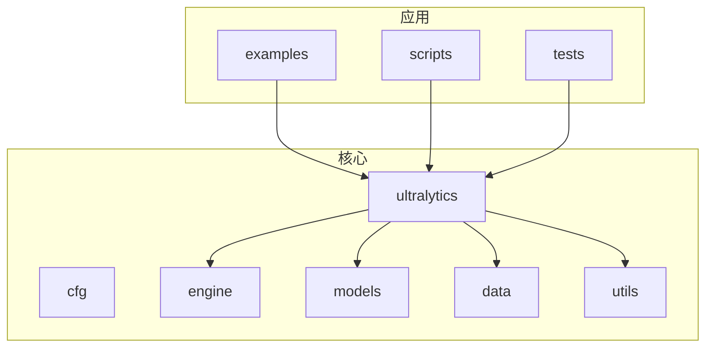
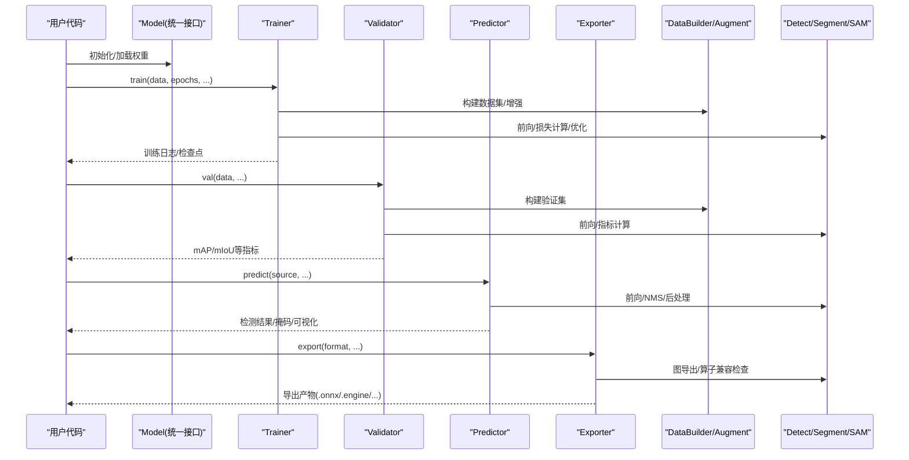
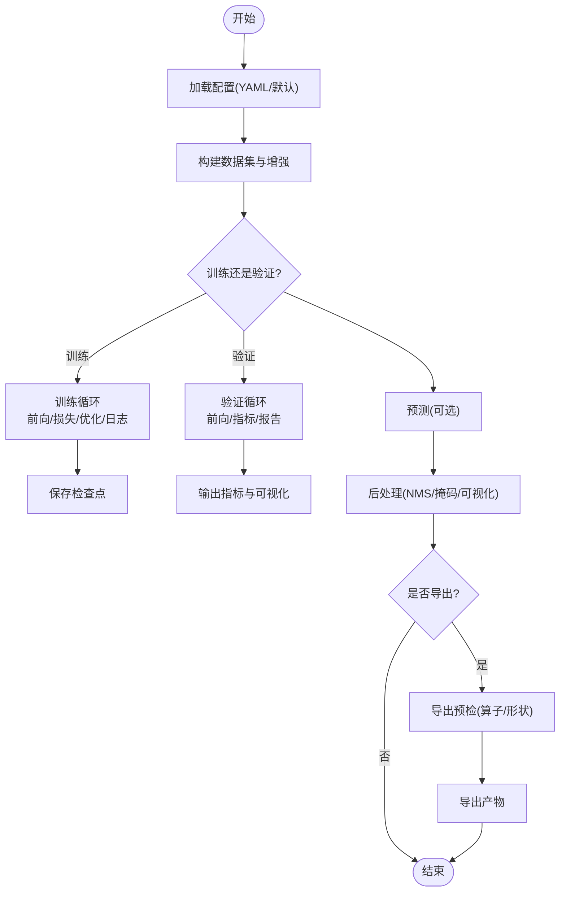
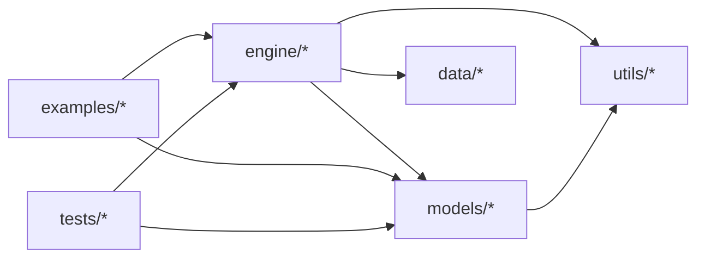

# 目标检测与分割

<cite>
**本文引用的文件**
- [README.md](file://README.md)
- [pyproject.toml](file://pyproject.toml)
- [ultralytics/__init__.py](file://ultralytics/__init__.py)
- [ultralytics/engine/model.py](file://ultralytics/engine/model.py)
- [ultralytics/engine/predictor.py](file://ultralytics/engine/predictor.py)
- [ultralytics/engine/trainer.py](file://ultralytics/engine/trainer.py)
- [ultralytics/engine/validator.py](file://ultralytics/engine/validator.py)
- [ultralytics/engine/exporter.py](file://ultralytics/engine/exporter.py)
- [ultralytics/models/yolo/detect/model.py](file://ultralytics/models/yolo/detect/model.py)
- [ultralytics/models/yolo/segment/model.py](file://ultralytics/models/yolo/segment/model.py)
- [ultralytics/models/sam/model.py](file://ultralytics/models/sam/model.py)
- [ultralytics/models/fastsam/model.py](file://ultralytics/models/fastsam/model.py)
- [ultralytics/cfg/default.yaml](file://ultralytics/cfg/default.yaml)
- [ultralytics/data/build.py](file://ultralytics/data/build.py)
- [ultralytics/data/augment.py](file://ultralytics/data/augment.py)
- [ultralytics/utils/export_capabilities.py](file://ultralytics/utils/export_capabilities.py)
- [examples/YOLOv8-ONNXRuntime-Python/main.py](file://examples/YOLOv8-ONNXRuntime-Python/main.py)
- [examples/YOLOv8-Segmentation-ONNXRuntime-Python/main.py](file://examples/YOLOv8-Segmentation-ONNXRuntime-Python/main.py)
- [examples/YOLO-Master-Cross-Platform-Edge-Deployment/scripts/export_edge_models.py](file://examples/YOLO-Master-Cross-Platform-Edge-Deployment/scripts/export_edge_models.py)
- [examples/YOLO-Master-Edge-Deployment/edge_utils.py](file://examples/YOLO-Master-Edge-Deployment/edge_utils.py)
- [examples/YOLO-Master-Edge-Deployment/cpp/inference.cpp](file://examples/YOLO-Master-Edge-Deployment/cpp/inference.cpp)
- [examples/YOLO11-Triton-CPP/main.cpp](file://examples/YOLO11-Triton-CPP/main.cpp)
- [examples/YOLO11-Triton-CPP/inference.cpp](file://examples/YOLO11-Triton-CPP/inference.cpp)
- [examples/YOLOv8-SAHI-Inference-Video/yolov8_sahi.py](file://examples/YOLOv8-SAHI-Inference-Video/yolov8_sahi.py)
- [examples/YOLOv8-Region-Counter/yolov8_region_counter.py](file://examples/YOLOv8-Region-Counter/yolov8_region_counter.py)
- [scripts/smoke_test_coco2017.py](file://scripts/smoke_test_coco2017.py)
- [tests/test_engine.py](file://tests/test_engine.py)
- [tests/test_export_preflight.py](file://tests/test_export_preflight.py)
- [tests/test_moe.py](file://tests/test_moe.py)
- [tests/test_molora.py](file://tests/test_molora.py)
- [tests/test_peft_adapters.py](file://tests/test_peft_adapters.py)
- [tests/test_mot.py](file://tests/test_mot.py)
- [tests/test_solutions.py](file://tests/test_solutions.py)
</cite>

## 目录
1. [简介](#简介)
2. [项目结构](#项目结构)
3. [核心组件](#核心组件)
4. [架构总览](#架构总览)
5. [详细组件分析](#详细组件分析)
6. [依赖关系分析](#依赖关系分析)
7. [性能考量](#性能考量)
8. [故障排查指南](#故障排查指南)
9. [结论](#结论)
10. [附录](#附录)

## 简介
本文件面向YOLO-Master-v260720的目标检测与实例分割能力，覆盖YOLOv8、YOLOv10、YOLOv11、YOLOv12等检测模型以及SAM系列分割模型的实现原理与使用方法。文档从系统架构、数据流、训练/推理/部署流程、配置调优与性能优化等方面展开，并提供可复现的示例路径与常见问题解决方案，帮助读者快速上手并高效落地。

## 项目结构
仓库采用模块化分层组织：
- ultralytics：核心框架（模型、引擎、数据、工具）
- models：各任务模型实现（yolo/detect、yolo/segment、sam、fastsam等）
- engine：训练、验证、预测、导出等运行时管线
- data：数据集构建、增强与加载
- utils：通用工具（导出能力矩阵、指标、NMS等）
- examples：端到端示例（ONNX/TensorRT/OpenVINO/C++/Triton/SAHI等）
- tests：单元与集成测试
- scripts：脚本化实验与基准
- docs：文档与参考

图表来源
- [ultralytics/__init__.py](file://ultralytics/__init__.py)
- [ultralytics/engine/model.py](file://ultralytics/engine/model.py)
- [ultralytics/models/yolo/detect/model.py](file://ultralytics/models/yolo/detect/model.py)
- [ultralytics/models/yolo/segment/model.py](file://ultralytics/models/yolo/segment/model.py)
- [ultralytics/models/sam/model.py](file://ultralytics/models/sam/model.py)
- [ultralytics/data/build.py](file://ultralytics/data/build.py)
- [ultralytics/utils/export_capabilities.py](file://ultralytics/utils/export_capabilities.py)

章节来源
- [README.md](file://README.md)
- [pyproject.toml](file://pyproject.toml)

## 核心组件
- 统一模型接口：通过高层API封装训练、验证、预测、导出等操作，屏蔽底层差异。
- 任务模型族：
  - YOLO检测：支持多版本（v8/v10/v11/v12），提供分类头或回归头，适配不同精度/速度权衡。
  - YOLO实例分割：在检测基础上增加掩码分支，输出像素级掩码。
  - SAM系列分割：基于提示（点/框/文本）的零样本/少样本分割能力，适合开放世界场景。
- 训练/验证/预测引擎：统一的Trainer/Validator/Predictor生命周期管理，支持分布式、混合精度、回调与日志。
- 数据管道：构建YAML数据集描述、自动解析标注格式、在线增强与批处理。
- 导出与部署：导出为ONNX/TensorRT/OpenVINO/TFLite等，配套C++/Python推理示例与边缘部署脚本。

章节来源
- [ultralytics/engine/model.py](file://ultralytics/engine/model.py)
- [ultralytics/engine/trainer.py](file://ultralytics/engine/trainer.py)
- [ultralytics/engine/validator.py](file://ultralytics/engine/validator.py)
- [ultralytics/engine/predictor.py](file://ultralytics/engine/predictor.py)
- [ultralytics/models/yolo/detect/model.py](file://ultralytics/models/yolo/detect/model.py)
- [ultralytics/models/yolo/segment/model.py](file://ultralytics/models/yolo/segment/model.py)
- [ultralytics/models/sam/model.py](file://ultralytics/models/sam/model.py)
- [ultralytics/data/build.py](file://ultralytics/data/build.py)

## 架构总览
下图展示从用户调用到模型执行与结果输出的关键路径，涵盖训练、验证、预测与导出。

图表来源
- [ultralytics/engine/model.py](file://ultralytics/engine/model.py)
- [ultralytics/engine/trainer.py](file://ultralytics/engine/trainer.py)
- [ultralytics/engine/validator.py](file://ultralytics/engine/validator.py)
- [ultralytics/engine/predictor.py](file://ultralytics/engine/predictor.py)
- [ultralytics/engine/exporter.py](file://ultralytics/engine/exporter.py)
- [ultralytics/models/yolo/detect/model.py](file://ultralytics/models/yolo/detect/model.py)
- [ultralytics/models/yolo/segment/model.py](file://ultralytics/models/yolo/segment/model.py)
- [ultralytics/models/sam/model.py](file://ultralytics/models/sam/model.py)
- [ultralytics/data/build.py](file://ultralytics/data/build.py)

## 详细组件分析

### YOLO检测模型（v8/v10/v11/v12）
- 特点与适用场景
  - v8：成熟稳定，生态完善，适合多数工业场景。
  - v10：强调速度与精度的平衡，适合实时性要求高的场景。
  - v11：在特征融合与头部设计上进一步优化，适合复杂场景与小目标。
  - v12：进一步改进效率与鲁棒性，适合大规模部署与长尾分布。
- 训练要点
  - 使用统一训练接口，指定数据集YAML、超参、设备与分布式策略。
  - 结合数据增强（Mosaic、MixUp、随机仿射等）提升泛化。
- 推理要点
  - 支持图像/视频/摄像头输入；可开启NMS、置信度阈值、类别过滤。
  - 导出为ONNX/TensorRT/OpenVINO以加速部署。
- 性能对比建议
  - 在相同数据集与评测协议下比较mAP@0.5:0.95、FPS、显存占用。
  - 针对小目标/密集场景优先评估召回率与漏检率。

章节来源
- [ultralytics/models/yolo/detect/model.py](file://ultralytics/models/yolo/detect/model.py)
- [ultralytics/data/augment.py](file://ultralytics/data/augment.py)
- [ultralytics/engine/trainer.py](file://ultralytics/engine/trainer.py)
- [ultralytics/engine/predictor.py](file://ultralytics/engine/predictor.py)
- [ultralytics/utils/export_capabilities.py](file://ultralytics/utils/export_capabilities.py)

### YOLO实例分割（Segment）
- 特点与适用场景
  - 在检测基础上输出像素级掩码，适用于需要精确轮廓的场景（如缺陷检测、医学影像）。
- 训练要点
  - 标注需包含掩码（如PNG/COCO JSON），确保类别数一致。
  - 适当调整掩码分支学习率与正则化，避免过拟合。
- 推理要点
  - 输出包含边界框、类别、置信度与掩码；可结合SAHI进行大图分块推理。
- 部署要点
  - 导出时注意掩码后处理算子兼容性；必要时在导出后进行自定义后处理。

章节来源
- [ultralytics/models/yolo/segment/model.py](file://ultralytics/models/yolo/segment/model.py)
- [examples/YOLOv8-Segmentation-ONNXRuntime-Python/main.py](file://examples/YOLOv8-Segmentation-ONNXRuntime-Python/main.py)
- [examples/YOLOv8-SAHI-Inference-Video/yolov8_sahi.py](file://examples/YOLOv8-SAHI-Inference-Video/yolov8_sahi.py)

### SAM系列分割模型（SAM/FastSAM/MobileSAM）
- 特点与适用场景
  - 基于提示（点/框/文本）的零样本/少样本分割，适合开放世界与动态类别。
  - FastSAM侧重速度，MobileSAM侧重移动端部署。
- 训练与微调
  - 通常无需全量训练，可通过提示工程或少量样本微调获得更好效果。
- 推理要点
  - 输入图像+提示生成掩码；可批量提示与交互式选择。
  - 与大模型/视觉语言模型结合，实现“文本提示→分割”的端到端流程。
- 部署要点
  - 导出时需关注提示编码与解码器算子；部分平台需自定义节点。

章节来源
- [ultralytics/models/sam/model.py](file://ultralytics/models/sam/model.py)
- [ultralytics/models/fastsam/model.py](file://ultralytics/models/fastsam/model.py)
- [ultralytics/utils/export_capabilities.py](file://ultralytics/utils/export_capabilities.py)

### 数据与增强
- 数据格式
  - 推荐YOLO格式（每类一个txt，行：class x_center y_center width height），或COCO JSON。
  - YAML中定义路径、类别名、训练/验证划分。
- 增强策略
  - Mosaic、MixUp、随机裁剪/缩放/旋转、色彩抖动、噪声等。
  - 针对小目标/遮挡场景可调整增强强度与概率。
- 构建与加载
  - 通过DataBuilder解析YAML，构建Dataset/Dataloader，支持多进程与缓存。

章节来源
- [ultralytics/data/build.py](file://ultralytics/data/build.py)
- [ultralytics/data/augment.py](file://ultralytics/data/augment.py)
- [ultralytics/cfg/default.yaml](file://ultralytics/cfg/default.yaml)

### 训练/验证/预测/导出流水线
- 训练
  - 设置epochs、batch size、优化器、学习率调度、早停与检查点保存。
  - 监控指标：loss、mAP、PR曲线、混淆矩阵。
- 验证
  - 标准COCO协议或自定义协议；支持多尺度与TTA。
- 预测
  - 支持单图/视频/摄像头；可叠加可视化、计数、区域统计等。
- 导出
  - 一键导出ONNX/TensorRT/OpenVINO/TFLite；导出前进行算子兼容性预检。

图表来源
- [ultralytics/engine/trainer.py](file://ultralytics/engine/trainer.py)
- [ultralytics/engine/validator.py](file://ultralytics/engine/validator.py)
- [ultralytics/engine/predictor.py](file://ultralytics/engine/predictor.py)
- [ultralytics/engine/exporter.py](file://ultralytics/engine/exporter.py)
- [ultralytics/data/build.py](file://ultralytics/data/build.py)
- [ultralytics/utils/export_capabilities.py](file://ultralytics/utils/export_capabilities.py)

## 依赖关系分析
- 模块耦合
  - engine与models解耦良好，通过统一接口交互；data与utils被多处复用。
- 外部依赖
  - PyTorch生态、ONNX Runtime、TensorRT、OpenVINO等。
- 潜在风险
  - 导出阶段算子不兼容；大模型提示编码在特定后端不支持。
  - 多进程数据加载与GPU内存争用。

图表来源
- [ultralytics/engine/model.py](file://ultralytics/engine/model.py)
- [ultralytics/models/yolo/detect/model.py](file://ultralytics/models/yolo/detect/model.py)
- [ultralytics/models/yolo/segment/model.py](file://ultralytics/models/yolo/segment/model.py)
- [ultralytics/models/sam/model.py](file://ultralytics/models/sam/model.py)
- [ultralytics/data/build.py](file://ultralytics/data/build.py)
- [ultralytics/utils/export_capabilities.py](file://ultralytics/utils/export_capabilities.py)

## 性能考量
- 硬件与后端
  - GPU优先；CPU可用OpenVINO/TensorRT CPU后端；移动端考虑TFLite/NCNN。
- 模型规模与精度
  - 根据场景选择s/m/l/x尺寸；权衡mAP与延迟。
- 数据与增强
  - 合理的数据配比与增强强度对收敛与泛化至关重要。
- 导出优化
  - 固定输入形状、启用FP16/INT8量化、算子融合与内核选择。
- 并发与吞吐
  - 批处理、异步I/O、线程池与队列管理提升吞吐。

[本节为通用指导，不直接分析具体文件]

## 故障排查指南
- 训练问题
  - 损失不降/NaN：检查数据标签、学习率、梯度裁剪与数值稳定性。
  - 显存不足：减小batch size、关闭不必要的日志、使用混合精度。
- 推理问题
  - 无结果/低置信度：调整阈值、NMS参数、输入分辨率与增强。
  - 掩码异常：检查导出后处理、掩码通道与类别映射。
- 导出问题
  - 算子不支持：查看导出预检报告，替换或禁用相关算子。
  - 形状不匹配：固定输入尺寸或使用动态形状导出。
- 典型测试与脚本
  - 使用smoke测试与单元测试定位问题范围。
  - 参考示例脚本快速复现实验。

章节来源
- [tests/test_engine.py](file://tests/test_engine.py)
- [tests/test_export_preflight.py](file://tests/test_export_preflight.py)
- [scripts/smoke_test_coco2017.py](file://scripts/smoke_test_coco2017.py)

## 结论
YOLO-Master-v260720提供了统一、可扩展的检测与分割能力，覆盖主流YOLO家族与SAM系列。通过清晰的引擎抽象、完善的导出链路与丰富的示例，能够快速完成从数据准备、训练验证到部署落地的全流程。建议在实际项目中结合业务场景选择合适的模型与后端，并通过系统化调参与导出优化达到最佳性能。

## 附录

### 数据格式与配置要点
- 数据集YAML
  - 定义train/val路径、类别数与名称。
  - 标注格式：YOLO txt或COCO JSON。
- 常用超参
  - epochs、batch size、lr、optimizer、weight decay、mosaic/mixup比例。
- 验证协议
  - COCO mAP@0.5:0.95、PR曲线、混淆矩阵。

章节来源
- [ultralytics/cfg/default.yaml](file://ultralytics/cfg/default.yaml)
- [ultralytics/data/build.py](file://ultralytics/data/build.py)

### 训练/推理/部署示例路径
- ONNX推理（检测）
  - [examples/YOLOv8-ONNXRuntime-Python/main.py](file://examples/YOLOv8-ONNXRuntime-Python/main.py)
- ONNX推理（实例分割）
  - [examples/YOLOv8-Segmentation-ONNXRuntime-Python/main.py](file://examples/YOLOv8-Segmentation-ONNXRuntime-Python/main.py)
- 边缘导出与验证
  - [examples/YOLO-Master-Cross-Platform-Edge-Deployment/scripts/export_edge_models.py](file://examples/YOLO-Master-Cross-Platform-Edge-Deployment/scripts/export_edge_models.py)
  - [examples/YOLO-Master-Edge-Deployment/edge_utils.py](file://examples/YOLO-Master-Edge-Deployment/edge_utils.py)
- C++推理（边缘）
  - [examples/YOLO-Master-Edge-Deployment/cpp/inference.cpp](file://examples/YOLO-Master-Edge-Deployment/cpp/inference.cpp)
- Triton C++推理
  - [examples/YOLO11-Triton-CPP/main.cpp](file://examples/YOLO11-Triton-CPP/main.cpp)
  - [examples/YOLO11-Triton-CPP/inference.cpp](file://examples/YOLO11-Triton-CPP/inference.cpp)
- SAHI大图推理
  - [examples/YOLOv8-SAHI-Inference-Video/yolov8_sahi.py](file://examples/YOLOv8-SAHI-Inference-Video/yolov8_sahi.py)
- 区域计数与应用
  - [examples/YOLOv8-Region-Counter/yolov8_region_counter.py](file://examples/YOLOv8-Region-Counter/yolov8_region_counter.py)

### 常见应用场景与最佳实践
- 工业质检
  - 使用YOLO检测+实例分割，配合高精度相机与稳定光照；导出为TensorRT/ONNX加速。
- 安防与交通
  - 多目标跟踪（BoT-SORT/ByteTrack）+区域计数；视频流批处理与异步I/O。
- 医疗影像
  - SAM提示分割+专家先验；弱监督/半监督微调提升小病灶检出。
- 开放世界
  - SAM/FastSAM结合文本提示；Few-shot微调与检索增强。

[本节为概念性内容，不直接分析具体文件]

### 常见问题与解决方案
- 训练不稳定
  - 降低初始学习率、启用梯度累积、检查数据标签一致性。
- 推理延迟高
  - 缩小输入分辨率、减少类别数、启用INT8量化、合并后处理。
- 导出失败
  - 查看导出预检错误，禁用不支持算子或更新后端版本。
- 掩码质量差
  - 调整分割分支学习率、增加掩码增强、检查类别映射与后处理。

章节来源
- [tests/test_moe.py](file://tests/test_moe.py)
- [tests/test_molora.py](file://tests/test_molora.py)
- [tests/test_peft_adapters.py](file://tests/test_peft_adapters.py)
- [tests/test_mot.py](file://tests/test_mot.py)
- [tests/test_solutions.py](file://tests/test_solutions.py)