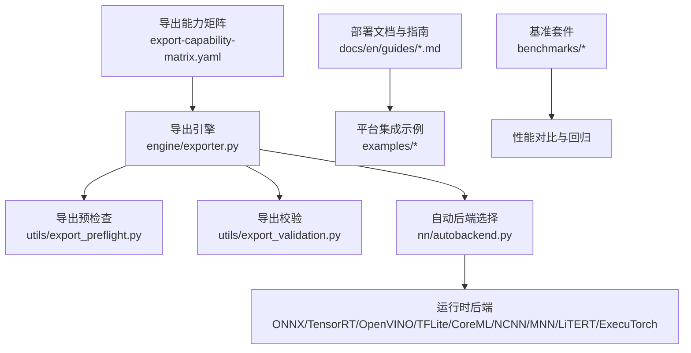
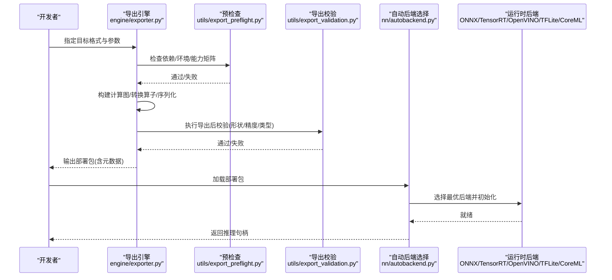
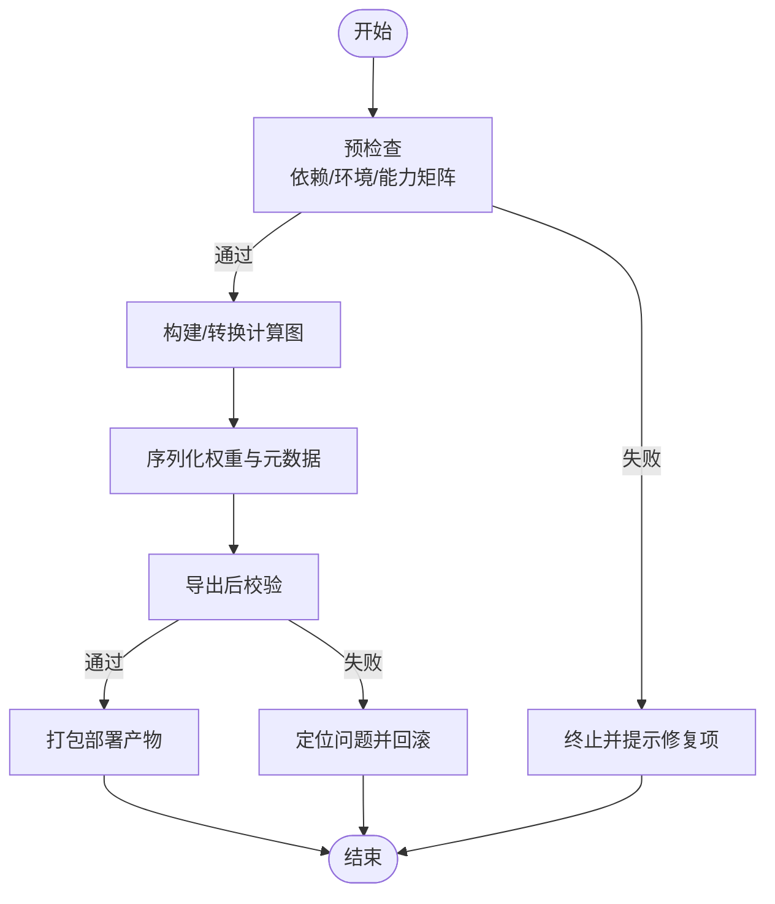
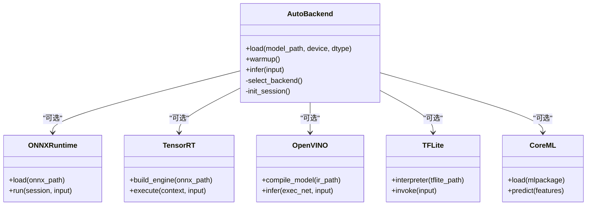
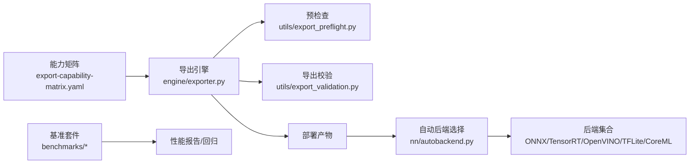

# 跨平台部署

<cite>
**本文引用的文件**
- [README.md](file://README.md)
- [export-capability-matrix.yaml](file://ultralytics/cfg/export-capability-matrix.yaml)
- [exporter.py](file://ultralytics/engine/exporter.py)
- [autobackend.py](file://ultralytics/nn/autobackend.py)
- [export_capabilities.py](file://ultralytics/utils/export_capabilities.py)
- [export_preflight.py](file://ultralytics/utils/export_preflight.py)
- [export_validation.py](file://ultralytics/utils/export_validation.py)
- [benchmark_molora_dispatch.py](file://benchmarks/benchmark_molora_dispatch.py)
- [benchmark_mot_dispatch.py](file://benchmarks/benchmark_mot_dispatch.py)
- [run.py](file://benchmarks/run.py)
- [suite.py](file://benchmarks/suite.py)
- [suites.yaml](file://benchmarks/suites.yaml)
- [Dockerfile](file://docker/Dockerfile)
- [model-deployment-options.md](file://docs/en/guides/model-deployment-options.md)
- [model-deployment-practices.md](file://docs/en/guides/model-deployment-practices.md)
- [onnx.md](file://docs/en/integrations/onnx.md)
- [tensorrt.md](file://docs/en/integrations/tensorrt.md)
- [openvino.md](file://docs/en/integrations/openvino.md)
- [tflite.md](file://docs/en/integrations/tflite.md)
- [coreml.md](file://docs/en/integrations/coreml.md)
- [ncnn.md](file://docs/en/integrations/ncnn.md)
- [mnn.md](file://docs/en/integrations/mnn.md)
- [litert.md](file://docs/en/integrations/litert.md)
- [executorch.md](file://docs/en/integrations/executorch.md)
- [deepstream-nvidia-jetson.md](file://docs/en/guides/deepstream-nvidia-jetson.md)
- [nvidia-jetson.md](file://docs/en/guides/nvidia-jetson.md)
- [raspberry-pi.md](file://docs/en/guides/raspberry-pi.md)
- [coral-edge-tpu-on-raspberry-pi.md](file://docs/en/guides/coral-edge-tpu-on-raspberry-pi.md)
- [dlstreamer-intel.md](file://docs/en/guides/dlstreamer-intel.md)
- [triton-inference-server.md](file://docs/en/guides/triton-inference-server.md)
- [vertex-ai-deployment-with-docker.md](file://docs/en/guides/vertex-ai-deployment-with-docker.md)
- [YOLO-Master-Cross-Platform-Edge-Deployment/README.md](file://examples/YOLO-Master-Cross-Platform-Edge-Deployment/README.md)
- [YOLO-Master-Cross-Platform-Edge-Deployment/TECHNICAL_REPORT.md](file://examples/YOLO-Master-Cross-Platform-Edge-Deployment/TECHNICAL_REPORT.md)
- [YOLOv8-ONNXRuntime-CPP/main.cpp](file://examples/YOLOv8-ONNXRuntime-CPP/main.cpp)
- [YOLOv8-OpenVINO-CPP-Inference/main.cc](file://examples/YOLOv8-OpenVINO-CPP-Inference/main.cc)
- [YOLO-Series-ONNXRuntime-Rust/Cargo.toml](file://examples/YOLO-Series-ONNXRuntime-Rust/Cargo.toml)
- [YOLOv8-ONNXRuntime-Rust/src/lib.rs](file://examples/YOLOv8-ONNXRuntime-Rust/src/lib.rs)
</cite>

## 目录
1. [简介](#简介)
2. [项目结构](#项目结构)
3. [核心组件](#核心组件)
4. [架构总览](#架构总览)
5. [详细组件分析](#详细组件分析)
6. [依赖关系分析](#依赖关系分析)
7. [性能考量](#性能考量)
8. [故障排查指南](#故障排查指南)
9. [结论](#结论)
10. [附录](#附录)

## 简介
本文件聚焦于 YOLO-Master 的跨平台部署能力，系统梳理支持的导出格式（ONNX、TensorRT、OpenVINO、TFLite、CoreML 等），并给出边缘设备（移动端、嵌入式、IoT）部署方案与优化策略。同时提供 C++、Rust 等多语言推理接口使用指引，说明容器化部署、云服务集成与生产环境最佳实践，并总结性能优化技巧、内存管理与资源调度方法，最后展示不同平台的部署案例与性能对比参考。

## 项目结构
围绕“导出—适配—运行”的主线，仓库中与跨平台部署相关的关键位置如下：
- 导出能力矩阵与配置：定义各后端/目标平台的能力覆盖与约束
- 导出引擎与预检查/校验：统一导出入口、前置条件检查与导出后验证
- 自动后端选择：根据模型与运行时环境自动选择最优推理后端
- 文档与示例：多平台部署指南、C++/Rust 推理示例、容器与云服务集成

图表来源
- [export-capability-matrix.yaml:1-200](file://ultralytics/cfg/export-capability-matrix.yaml#L1-L200)
- [exporter.py:1-200](file://ultralytics/engine/exporter.py#L1-L200)
- [export_preflight.py:1-200](file://ultralytics/utils/export_preflight.py#L1-L200)
- [export_validation.py:1-200](file://ultralytics/utils/export_validation.py#L1-L200)
- [autobackend.py:1-200](file://ultralytics/nn/autobackend.py#L1-L200)

章节来源
- [export-capability-matrix.yaml:1-200](file://ultralytics/cfg/export-capability-matrix.yaml#L1-L200)
- [exporter.py:1-200](file://ultralytics/engine/exporter.py#L1-L200)
- [autobackend.py:1-200](file://ultralytics/nn/autobackend.py#L1-L200)

## 核心组件
- 导出能力矩阵：集中描述各任务/模型对导出格式的支持度、限制与推荐场景，便于在 CI/CD 中做能力门禁与兼容性校验。
- 导出引擎：统一的导出入口，负责参数解析、图转换、算子映射、权重序列化与产物打包。
- 预检查与校验：在导出前进行环境与依赖检查，在导出后进行数值一致性、形状与类型校验，降低线上风险。
- 自动后端选择：在推理阶段根据可用库与硬件特性自动选择最优后端（如 TensorRT、OpenVINO、ONNX Runtime、TFLite、CoreML 等）。
- 基准套件：提供跨平台/跨后端的性能回归测试与对比基线，支撑持续优化。

章节来源
- [export-capability-matrix.yaml:1-200](file://ultralytics/cfg/export-capability-matrix.yaml#L1-L200)
- [exporter.py:1-200](file://ultralytics/engine/exporter.py#L1-L200)
- [export_capabilities.py:1-200](file://ultralytics/utils/export_capabilities.py#L1-L200)
- [export_preflight.py:1-200](file://ultralytics/utils/export_preflight.py#L1-L200)
- [export_validation.py:1-200](file://ultralytics/utils/export_validation.py#L1-L200)
- [autobackend.py:1-200](file://ultralytics/nn/autobackend.py#L1-L200)
- [run.py:1-200](file://benchmarks/run.py#L1-L200)
- [suite.py:1-200](file://benchmarks/suite.py#L1-L200)
- [suites.yaml:1-200](file://benchmarks/suites.yaml#L1-L200)

## 架构总览
下图展示了从训练权重到多平台部署产物的端到端流程，以及推理阶段的自动后端选择机制。

图表来源
- [exporter.py:1-200](file://ultralytics/engine/exporter.py#L1-L200)
- [export_preflight.py:1-200](file://ultralytics/utils/export_preflight.py#L1-L200)
- [export_validation.py:1-200](file://ultralytics/utils/export_validation.py#L1-L200)
- [autobackend.py:1-200](file://ultralytics/nn/autobackend.py#L1-L200)

## 详细组件分析

### 导出能力矩阵与兼容性
- 作用：以结构化方式声明各任务/模型对导出格式的支持情况，包括是否支持、限制条件与推荐场景。
- 使用方式：在导出前由预检查模块读取，用于快速判断目标平台可行性；在 CI 中作为能力门禁。
- 典型字段：任务类型、模型规模、导出格式、输入尺寸范围、数据类型、算子覆盖、平台约束等。

章节来源
- [export-capability-matrix.yaml:1-200](file://ultralytics/cfg/export-capability-matrix.yaml#L1-L200)
- [export_capabilities.py:1-200](file://ultralytics/utils/export_capabilities.py#L1-L200)

### 导出引擎与流程
- 统一入口：接收目标格式、输入形状、量化/优化选项等参数，协调预检查、图转换、权重序列化与产物打包。
- 关键步骤：
  - 预检查：依赖库版本、平台能力、能力矩阵匹配
  - 图构建与转换：将 PyTorch 图转换为目标 IR（如 ONNX、TensorRT Engine、OpenVINO IR、TFLite、CoreML）
  - 导出校验：形状/类型/数值一致性校验，确保可移植性
- 产物：包含模型权重、元数据与可选的配置文件，便于下游加载器直接消费。

图表来源
- [exporter.py:1-200](file://ultralytics/engine/exporter.py#L1-L200)
- [export_preflight.py:1-200](file://ultralytics/utils/export_preflight.py#L1-L200)
- [export_validation.py:1-200](file://ultralytics/utils/export_validation.py#L1-L200)

章节来源
- [exporter.py:1-200](file://ultralytics/engine/exporter.py#L1-L200)
- [export_preflight.py:1-200](file://ultralytics/utils/export_preflight.py#L1-L200)
- [export_validation.py:1-200](file://ultralytics/utils/export_validation.py#L1-L200)

### 自动后端选择与运行时
- 目标：在部署端根据可用库与硬件特性自动选择最优后端，屏蔽差异，简化调用。
- 选择依据：已安装的后端库、GPU/加速器可用性、模型格式、输入形状与精度要求。
- 行为：初始化后端会话/引擎、预热、暴露统一推理接口。

图表来源
- [autobackend.py:1-200](file://ultralytics/nn/autobackend.py#L1-L200)

章节来源
- [autobackend.py:1-200](file://ultralytics/nn/autobackend.py#L1-L200)

### 多语言推理接口（C++、Rust）
- C++ 示例：基于 ONNX Runtime 或 OpenVINO 的推理实现，演示如何加载模型、预处理、推理与后处理。
- Rust 示例：基于 ONNX Runtime 的 Rust 绑定，展示如何在 Cargo 项目中引入并调用推理。
- 建议：优先使用统一后端抽象（AutoBackend）封装差异，上层业务仅依赖稳定接口。

章节来源
- [YOLOv8-ONNXRuntime-CPP/main.cpp:1-200](file://examples/YOLOv8-ONNXRuntime-CPP/main.cpp#L1-L200)
- [YOLOv8-OpenVINO-CPP-Inference/main.cc:1-200](file://examples/YOLOv8-OpenVINO-CPP-Inference/main.cc#L1-L200)
- [YOLO-Series-ONNXRuntime-Rust/Cargo.toml:1-200](file://examples/YOLO-Series-ONNXRuntime-Rust/Cargo.toml#L1-L200)
- [YOLOv8-ONNXRuntime-Rust/src/lib.rs:1-200](file://examples/YOLOv8-ONNXRuntime-Rust/src/lib.rs#L1-L200)

### 边缘设备部署方案（移动端、嵌入式、IoT）
- 移动端：TFLite、CoreML、NCNN、MNN、LitERT、ExecuTorch 等后端，结合量化与图优化提升吞吐与降低延迟。
- 嵌入式/NPU：TensorRT（Jetson）、OpenVINO（Intel VPU/iGPU）、DL Streamer（Intel 视频管线）、Edge TPU（Coral）。
- IoT：轻量级后端（ONNX Runtime、NCNN、MNN）配合小模型与低精度推理，满足功耗与体积约束。
- 参考指南：
  - NVIDIA Jetson 与 DeepStream 集成
  - Raspberry Pi 与 Edge TPU 部署
  - Intel DL Streamer 视频流加速
  - 通用部署实践与注意事项

章节来源
- [deepstream-nvidia-jetson.md:1-200](file://docs/en/guides/deepstream-nvidia-jetson.md#L1-L200)
- [nvidia-jetson.md:1-200](file://docs/en/guides/nvidia-jetson.md#L1-L200)
- [raspberry-pi.md:1-200](file://docs/en/guides/raspberry-pi.md#L1-L200)
- [coral-edge-tpu-on-raspberry-pi.md:1-200](file://docs/en/guides/coral-edge-tpu-on-raspberry-pi.md#L1-L200)
- [dlstreamer-intel.md:1-200](file://docs/en/guides/dlstreamer-intel.md#L1-L200)
- [model-deployment-practices.md:1-200](file://docs/en/guides/model-deployment-practices.md#L1-L200)

### 容器化部署与云服务集成
- 容器镜像：提供 Dockerfile 用于构建标准化推理镜像，固化依赖与运行时。
- 云服务：Vertex AI 部署示例，结合容器与云端 GPU/TPU 资源弹性伸缩。
- 推理服务：Triton Inference Server 集成，支持高并发、动态批处理与多模型管理。

章节来源
- [Dockerfile:1-200](file://docker/Dockerfile#L1-L200)
- [vertex-ai-deployment-with-docker.md:1-200](file://docs/en/guides/vertex-ai-deployment-with-docker.md#L1-L200)
- [triton-inference-server.md:1-200](file://docs/en/guides/triton-inference-server.md#L1-L200)

### 性能优化技巧、内存管理与资源调度
- 模型侧：
  - 选择合适的导出格式与量化策略（INT8/FP16）
  - 针对目标平台启用图优化与内核融合
- 运行时侧：
  - 合理设置线程数、批大小与内存池
  - 使用后端专属优化开关（如 TensorRT 优化级别、OpenVINO 模式）
- 工程侧：
  - 预热与懒加载，避免冷启动抖动
  - 监控指标与回归基线，纳入 CI 持续评估

章节来源
- [benchmark_molora_dispatch.py:1-200](file://benchmarks/benchmark_molora_dispatch.py#L1-L200)
- [benchmark_mot_dispatch.py:1-200](file://benchmarks/benchmark_mot_dispatch.py#L1-L200)
- [run.py:1-200](file://benchmarks/run.py#L1-L200)
- [suite.py:1-200](file://benchmarks/suite.py#L1-L200)
- [suites.yaml:1-200](file://benchmarks/suites.yaml#L1-L200)

### 不同平台部署案例与性能对比
- 交叉平台部署示例：涵盖多平台脚本与报告，提供端到端复现路径。
- 性能对比：通过基准套件在不同后端/设备上运行，产出延迟、吞吐与资源占用对比，辅助选型与调优。

章节来源
- [YOLO-Master-Cross-Platform-Edge-Deployment/README.md:1-200](file://examples/YOLO-Master-Cross-Platform-Edge-Deployment/README.md#L1-L200)
- [YOLO-Master-Cross-Platform-Edge-Deployment/TECHNICAL_REPORT.md:1-200](file://examples/YOLO-Master-Cross-Platform-Edge-Deployment/TECHNICAL_REPORT.md#L1-L200)
- [run.py:1-200](file://benchmarks/run.py#L1-L200)
- [suite.py:1-200](file://benchmarks/suite.py#L1-L200)
- [suites.yaml:1-200](file://benchmarks/suites.yaml#L1-L200)

## 依赖关系分析
- 导出链路：导出能力矩阵 → 导出引擎 → 预检查 → 图转换 → 导出校验 → 产物打包
- 推理链路：自动后端选择 → 后端初始化 → 推理执行
- 基准链路：基准套件 → 多后端/多设备运行 → 结果汇总与回归

图表来源
- [export-capability-matrix.yaml:1-200](file://ultralytics/cfg/export-capability-matrix.yaml#L1-L200)
- [exporter.py:1-200](file://ultralytics/engine/exporter.py#L1-L200)
- [export_preflight.py:1-200](file://ultralytics/utils/export_preflight.py#L1-L200)
- [export_validation.py:1-200](file://ultralytics/utils/export_validation.py#L1-L200)
- [autobackend.py:1-200](file://ultralytics/nn/autobackend.py#L1-L200)
- [run.py:1-200](file://benchmarks/run.py#L1-L200)
- [suite.py:1-200](file://benchmarks/suite.py#L1-L200)
- [suites.yaml:1-200](file://benchmarks/suites.yaml#L1-L200)

章节来源
- [export-capability-matrix.yaml:1-200](file://ultralytics/cfg/export-capability-matrix.yaml#L1-L200)
- [exporter.py:1-200](file://ultralytics/engine/exporter.py#L1-L200)
- [autobackend.py:1-200](file://ultralytics/nn/autobackend.py#L1-L200)
- [run.py:1-200](file://benchmarks/run.py#L1-L200)
- [suite.py:1-200](file://benchmarks/suite.py#L1-L200)
- [suites.yaml:1-200](file://benchmarks/suites.yaml#L1-L200)

## 性能考量
- 导出阶段：
  - 选择合适的数据类型与量化策略，平衡精度与速度
  - 利用能力矩阵规避不支持的算子组合
- 推理阶段：
  - 按设备特性调整线程数、批大小与内存池
  - 使用后端专属优化开关（如 TensorRT 优化级别、OpenVINO 模式）
- 持续优化：
  - 建立基准套件与回归基线，纳入 CI
  - 定期更新能力矩阵与兼容性清单

[本节为通用指导，不直接分析具体文件]

## 故障排查指南
- 导出失败常见原因：
  - 依赖缺失或版本不兼容（预检查会提示）
  - 能力矩阵不匹配（目标格式/输入尺寸/数据类型不支持）
  - 导出后校验失败（形状/类型/数值不一致）
- 推理异常常见原因：
  - 后端未正确安装或初始化失败
  - 模型与后端不兼容（如算子不支持）
  - 资源不足（显存/内存/线程数）
- 定位手段：
  - 查看预检查与导出校验日志
  - 使用基准套件复现并缩小范围
  - 切换后端或降级精度进行隔离

章节来源
- [export_preflight.py:1-200](file://ultralytics/utils/export_preflight.py#L1-L200)
- [export_validation.py:1-200](file://ultralytics/utils/export_validation.py#L1-L200)
- [autobackend.py:1-200](file://ultralytics/nn/autobackend.py#L1-L200)
- [run.py:1-200](file://benchmarks/run.py#L1-L200)

## 结论
YOLO-Master 提供了从导出到部署的一体化能力：以能力矩阵驱动兼容性控制，以统一导出引擎保障产物质量，以自动后端选择简化多平台集成。结合丰富的文档与示例，可在移动端、嵌入式与 IoT 等平台高效落地，并通过基准套件与容器化/云服务集成实现生产级交付与持续优化。

[本节为总结，不直接分析具体文件]

## 附录
- 多后端集成文档索引：
  - ONNX：[onnx.md](file://docs/en/integrations/onnx.md)
  - TensorRT：[tensorrt.md](file://docs/en/integrations/tensorrt.md)
  - OpenVINO：[openvino.md](file://docs/en/integrations/openvino.md)
  - TFLite：[tflite.md](file://docs/en/integrations/tflite.md)
  - CoreML：[coreml.md](file://docs/en/integrations/coreml.md)
  - NCNN：[ncnn.md](file://docs/en/integrations/ncnn.md)
  - MNN：[mnn.md](file://docs/en/integrations/mnn.md)
  - LitERT：[litert.md](file://docs/en/integrations/litert.md)
  - ExecuTorch：[executorch.md](file://docs/en/integrations/executorch.md)
- 部署选项与实践：
  - [model-deployment-options.md](file://docs/en/guides/model-deployment-options.md)
  - [model-deployment-practices.md](file://docs/en/guides/model-deployment-practices.md)