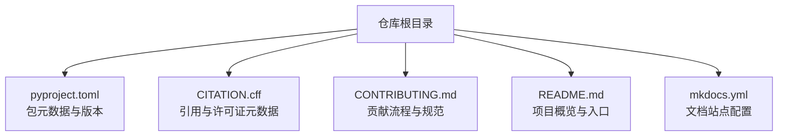
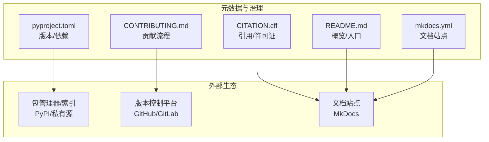
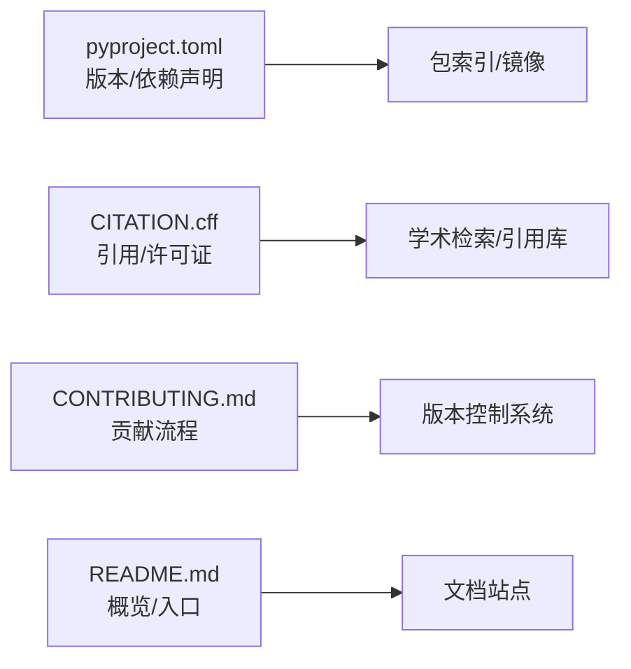

# 版本信息与许可证

<cite>
**本文引用的文件**
- [pyproject.toml](file://pyproject.toml)
- [CITATION.cff](file://CITATION.cff)
- [CONTRIBUTING.md](file://CONTRIBUTING.md)
- [README.md](file://README.md)
- [mkdocs.yml](file://mkdocs.yml)
</cite>

## 目录
1. [简介](#简介)
2. [项目结构](#项目结构)
3. [核心组件](#核心组件)
4. [架构总览](#架构总览)
5. [详细组件分析](#详细组件分析)
6. [依赖分析](#依赖分析)
7. [性能考虑](#性能考虑)
8. [故障排查指南](#故障排查指南)
9. [结论](#结论)
10. [附录](#附录)

## 简介
本章节聚焦于项目的版本信息、开源许可证与使用限制、引用格式与学术引用建议、社区贡献流程与参与方式，以及维护状态与未来发展规划的简要说明。内容基于仓库根目录中的元数据与文档进行整理，便于用户快速了解合规使用与协作方式。

## 项目结构
与“版本信息与许可证”直接相关的顶层文件包括：
- pyproject.toml：Python 包元数据（名称、版本、依赖等）
- CITATION.cff：学术引用元数据（作者、标题、DOI/URL、许可证等）
- CONTRIBUTING.md：贡献指南（提交规范、审查流程、行为准则等）
- README.md：项目概览与常用入口
- mkdocs.yml：文档站点配置（可辅助定位官方文档入口）

**图示来源**
- [pyproject.toml](file://pyproject.toml)
- [CITATION.cff](file://CITATION.cff)
- [CONTRIBUTING.md](file://CONTRIBUTING.md)
- [README.md](file://README.md)
- [mkdocs.yml](file://mkdocs.yml)

**章节来源**
- [pyproject.toml](file://pyproject.toml)
- [CITATION.cff](file://CITATION.cff)
- [CONTRIBUTING.md](file://CONTRIBUTING.md)
- [README.md](file://README.md)
- [mkdocs.yml](file://mkdocs.yml)

## 核心组件
本节汇总与“版本信息与许可证”相关的关键元数据位置与用途：
- 当前版本号与发布历史
  - 包版本：位于 pyproject.toml 的版本字段
  - 发布历史：通常由发行标签或变更日志管理；若仓库未提供独立变更日志，可通过发行标签与提交记录追溯
- 开源许可证条款与使用限制
  - 许可证类型与条款摘要：位于 CITATION.cff 的许可证字段；如仓库另有 LICENSE 文件，请以该文件为准
  - 使用限制：遵循所选许可证的再分发、修改、商标与专利条款
- 引用格式与学术引用建议
  - 标准引用：依据 CITATION.cff 提供的作者、标题、版本、DOI/URL 等信息生成
  - 学术建议：在论文中同时引用软件仓库与具体版本，并附上 DOI 或稳定 URL
- 社区贡献流程与参与方式
  - 贡献流程：参见 CONTRIBUTING.md（分支策略、PR 模板、代码风格、测试要求、审查流程）
  - 行为准则与安全披露：参考帮助文档中的行为准则与安全政策页面
- 维护状态与未来规划
  - 维护状态：通过最近提交频率、问题响应、CI 状态与文档更新情况综合判断
  - 未来规划：关注计划文档与路线图（如 docs/plans 下的规划文件），并结合发行说明跟踪演进

**章节来源**
- [pyproject.toml](file://pyproject.toml)
- [CITATION.cff](file://CITATION.cff)
- [CONTRIBUTING.md](file://CONTRIBUTING.md)
- [README.md](file://README.md)
- [mkdocs.yml](file://mkdocs.yml)

## 架构总览
从“版本信息与许可证”的角度，可将仓库视为由若干元数据与文档构成的轻量治理层，支撑合规使用与协作：

**图示来源**
- [pyproject.toml](file://pyproject.toml)
- [CITATION.cff](file://CITATION.cff)
- [CONTRIBUTING.md](file://CONTRIBUTING.md)
- [README.md](file://README.md)
- [mkdocs.yml](file://mkdocs.yml)

## 详细组件分析

### 版本信息与发布历史
- 当前版本号
  - 查看路径：pyproject.toml 的版本字段
  - 说明：用于包安装、依赖解析与兼容性声明
- 发布历史与升级路径
  - 建议方式：结合发行标签与变更记录（若存在）梳理大版本与小版本的兼容性与破坏性变更
  - 升级建议：优先采用语义化版本策略，按小版本修复与特性增量逐步升级；重大版本升级前评估依赖与 API 变更

**章节来源**
- [pyproject.toml](file://pyproject.toml)

### 开源许可证与使用限制
- 许可证识别
  - 查看路径：CITATION.cff 的许可证字段；如仓库包含 LICENSE 文件，以该文件为准
- 主要条款与限制（通用要点）
  - 许可授予：允许使用、复制、修改与分发
  - 保留声明：需保留版权与许可声明
  - 再分发条件：二进制或源码再分发需满足相应义务
  - 商标与专利：不得暗示背书；专利授权范围依具体许可证而定
  - 免责声明：不提供任何明示或默示担保
- 合规建议
  - 在产品中明确标注使用的组件与版本
  - 对第三方依赖进行许可证扫描与合规审计
  - 如涉及闭源分发，注意 copyleft 类许可证的传染性条款

**章节来源**
- [CITATION.cff](file://CITATION.cff)

### 引用格式与学术引用建议
- 标准引用
  - 依据 CITATION.cff 的作者、标题、版本、DOI/URL 等信息生成 BibTeX 或其他格式的引用条目
- 学术写作建议
  - 在正文与方法部分引用软件仓库与具体版本
  - 在脚注或参考文献中提供 DOI 或稳定链接
  - 如需复现实验，注明构建环境与关键依赖版本

**章节来源**
- [CITATION.cff](file://CITATION.cff)

### 社区贡献流程与参与方式
- 贡献流程
  - 分支策略：通常为 feature/bugfix 分支 + main/master 主干
  - PR 规范：描述变更动机、影响范围、测试覆盖与回滚方案
  - 代码质量：遵循代码风格、静态检查与单元测试要求
  - 审查流程：至少一名维护者审查通过后合并
- 行为准则与安全披露
  - 行为准则：倡导包容、尊重与专业交流
  - 安全漏洞：通过指定渠道私下披露，避免公开细节直至修复
- 参与方式
  - 报告问题：提供最小可复现示例与环境信息
  - 提出改进：先讨论后实现，确保与项目目标一致
  - 文档完善：补充示例、教程与最佳实践

**章节来源**
- [CONTRIBUTING.md](file://CONTRIBUTING.md)

### 维护状态与未来发展规划
- 维护状态评估维度
  - 活跃度：近 3–6 个月的提交频率、Issue 响应时间、CI 通过率
  - 稳定性：回归测试覆盖率、已知问题清单与修复节奏
  - 文档：文档站点是否持续更新（参考 mkdocs.yml 与 docs 目录）
- 未来规划
  - 关注 docs/plans 下的规划文件与里程碑
  - 跟踪发行说明与兼容性矩阵，评估升级风险与收益

**章节来源**
- [mkdocs.yml](file://mkdocs.yml)
- [README.md](file://README.md)

## 依赖分析
从“版本信息与许可证”视角，依赖关系主要体现在包元数据与引用元数据上：

**图示来源**
- [pyproject.toml](file://pyproject.toml)
- [CITATION.cff](file://CITATION.cff)
- [CONTRIBUTING.md](file://CONTRIBUTING.md)
- [README.md](file://README.md)
- [mkdocs.yml](file://mkdocs.yml)

**章节来源**
- [pyproject.toml](file://pyproject.toml)
- [CITATION.cff](file://CITATION.cff)
- [CONTRIBUTING.md](file://CONTRIBUTING.md)
- [README.md](file://README.md)
- [mkdocs.yml](file://mkdocs.yml)

## 性能考虑
本节为通用指导，不涉及具体代码实现。

## 故障排查指南
- 许可证合规问题
  - 现象：产品打包时报错或法务审核不通过
  - 排查：核对 CITATION.cff 与 LICENSE 文件，扫描第三方依赖许可证
- 引用缺失或不完整
  - 现象：论文或报告中缺少必要引用信息
  - 排查：根据 CITATION.cff 补全作者、标题、版本与 DOI/URL
- 贡献被拒或延迟
  - 现象：PR 长时间未审查或被退回
  - 排查：对照 CONTRIBUTING.md 检查分支命名、提交信息与测试覆盖

**章节来源**
- [CITATION.cff](file://CITATION.cff)
- [CONTRIBUTING.md](file://CONTRIBUTING.md)

## 结论
通过集中查阅 pyproject.toml、CITATION.cff、CONTRIBUTING.md、README.md 与 mkdocs.yml，可以快速掌握项目的版本信息、许可证条款、引用格式与社区参与方式。建议在正式发布与学术引用时严格遵循上述元数据，并在升级过程中结合发行说明与兼容性矩阵进行风险评估。

## 附录
- 术语
  - 语义化版本：主版本.次版本.修订号，分别对应破坏性变更、向后兼容的新增功能与问题修复
  - Copyleft：要求衍生作品以相同许可证发布的许可类型
- 参考路径
  - 版本与依赖：pyproject.toml
  - 引用与许可证：CITATION.cff
  - 贡献流程：CONTRIBUTING.md
  - 概览与入口：README.md
  - 文档站点：mkdocs.yml