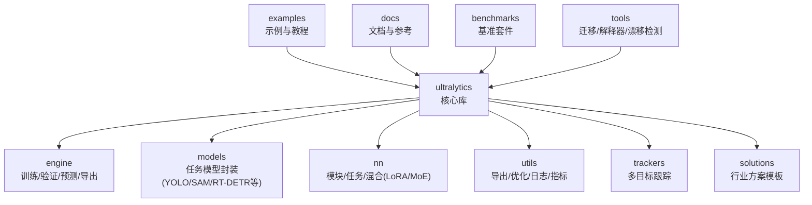
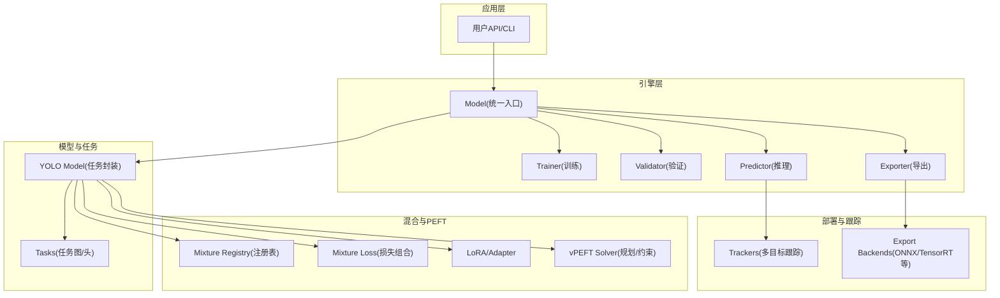
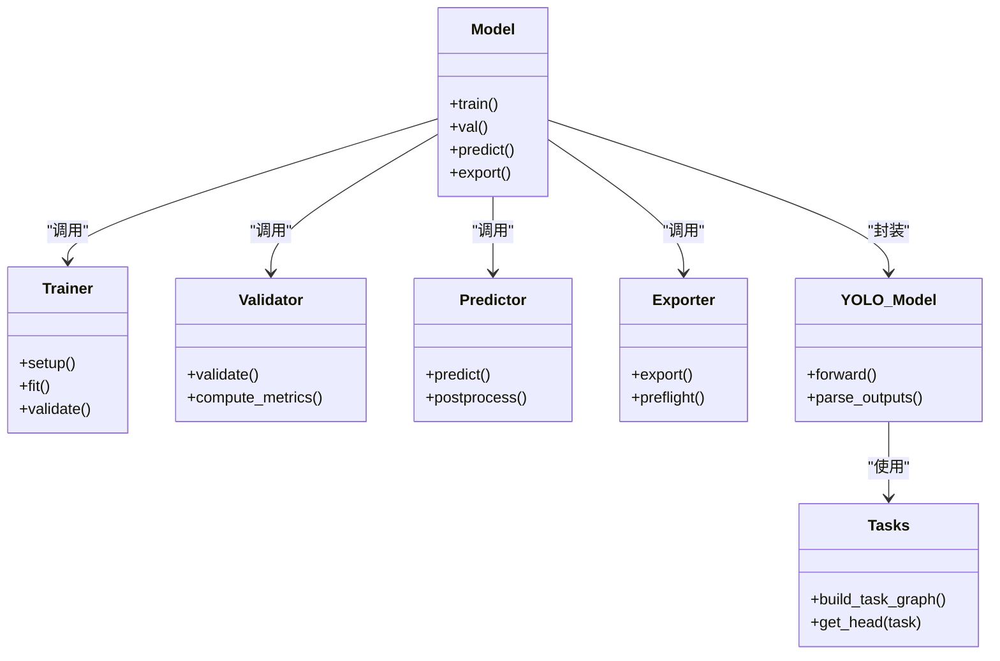
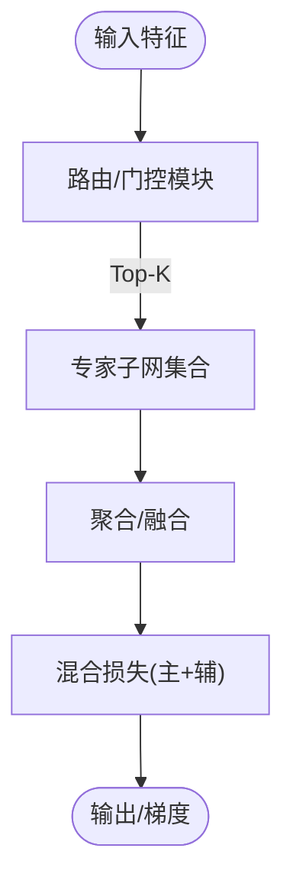
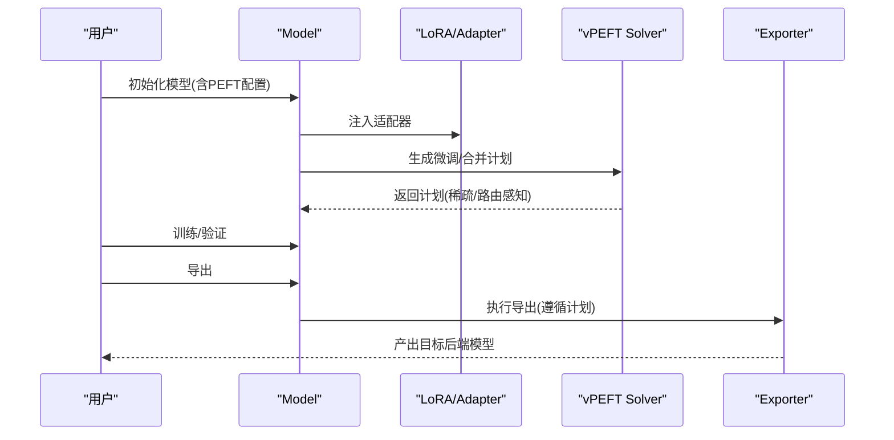
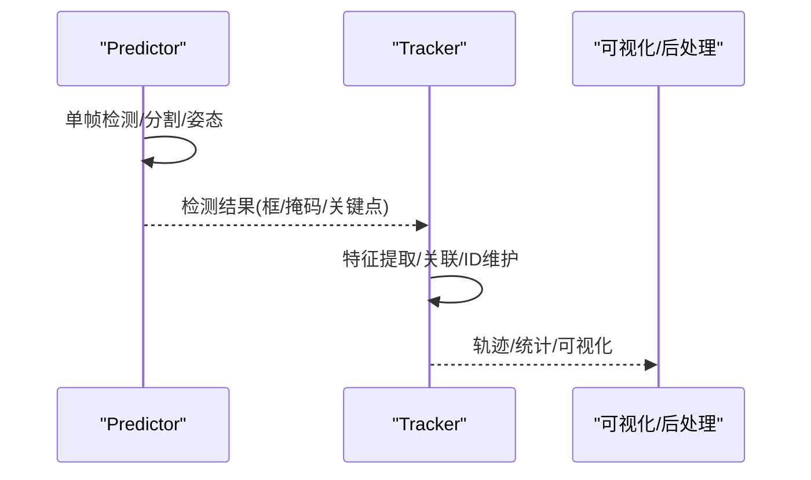
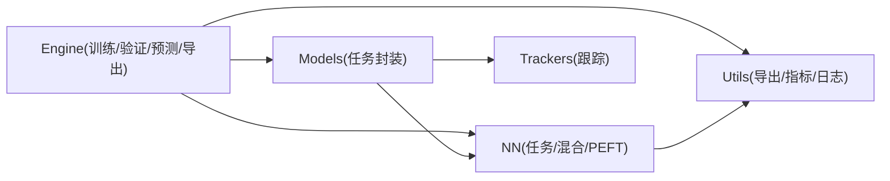

# 项目概述

<cite>
**本文引用的文件**
- [README.md](file://README.md)
- [pyproject.toml](file://pyproject.toml)
- [ultralytics/__init__.py](file://ultralytics/__init__.py)
- [ultralytics/engine/model.py](file://ultralytics/engine/model.py)
- [ultralytics/engine/trainer.py](file://ultralytics/engine/trainer.py)
- [ultralytics/engine/validator.py](file://ultralytics/engine/validator.py)
- [ultralytics/engine/predictor.py](file://ultralytics/engine/predictor.py)
- [ultralytics/engine/exporter.py](file://ultralytics/engine/exporter.py)
- [ultralytics/models/yolo/model.py](file://ultralytics/models/yolo/model.py)
- [ultralytics/nn/tasks.py](file://ultralytics/nn/tasks.py)
- [ultralytics/nn/mixture_registry.py](file://ultralytics/nn/mixture_registry.py)
- [ultralytics/nn/mixture_loss.py](file://ultralytics/nn/mixture_loss.py)
- [ultralytics/utils/lora/__init__.py](file://ultralytics/utils/lora/__init__.py)
- [ultralytics/vpeft/solver.py](file://ultralytics/vpeft/solver.py)
- [ultralytics/trackers/track.py](file://ultralytics/trackers/track.py)
- [examples/YOLOv10-Master-MoA/README.md](file://examples/YOLOv10-Master-MoA/README.md)
- [examples/YOLO-Master-Cross-Platform-Edge-Deployment/README.md](file://examples/YOLO-Master-Cross-Platform-Edge-Deployment/README.md)
- [CONTRIBUTING.md](file://CONTRIBUTING.md)
</cite>

## 目录
1. [简介](#简介)
2. [项目结构](#项目结构)
3. [核心组件](#核心组件)
4. [架构总览](#架构总览)
5. [详细组件分析](#详细组件分析)
6. [依赖关系分析](#依赖关系分析)
7. [性能与扩展性](#性能与扩展性)
8. [故障排查指南](#故障排查指南)
9. [结论](#结论)
10. [附录](#附录)

## 简介
YOLO-Master-v260720 是在 Ultralytics YOLO 生态基础上深度增强的一代通用视觉框架。其核心目标是：在保持易用性与高性能的同时，为多模态、参数高效微调（PEFT）、多专家混合（MoE/MoA）以及生产级部署提供一体化能力。项目面向研究人员与工程团队，覆盖从数据准备、训练、评估、导出到边缘部署的全链路需求。

主要特性与技术优势概览：
- 多任务统一接口：目标检测、实例分割、姿态估计、旋转框检测、语义分割、跟踪等任务共用一致的训练/推理/导出流程。
- 多模态支持：在模型与运行时层引入文本/图像等多模态融合能力，便于开放词汇与跨模态检索等场景。
- 参数高效微调（PEFT）：内置 LoRA 与 vPEFT 规划求解器，支持低秩适配、路由感知合并与稀疏调度，显著降低微调成本并提升可移植性。
- 多专家混合（MoE/MoA）：提供路由注册表、损失组合与动态调度工具链，实现“按需激活”的专家网络，兼顾精度与吞吐。
- 生产就绪：完善的导出矩阵、预检与验证、分布式训练与监控、边缘部署示例与脚本，缩短从实验到上线的路径。

适用人群：
- 研究者：快速验证新算法（如 MoE/MoA、LoRA、路由策略），复用统一基准与评测体系。
- 工程师：端到端流水线（训练→评估→导出→部署），稳定可靠的错误处理与诊断工具。
- 产品与运营：开箱即用的解决方案模板与可视化，加速落地与迭代。

版本与许可：
- 版本号与元信息见项目根配置；许可证与引用信息见根目录说明文件。

章节来源
- [README.md](file://README.md)
- [pyproject.toml](file://pyproject.toml)

## 项目结构
仓库采用模块化分层组织，核心库位于 ultralytics 包下，按职责划分为引擎、模型、神经网络模块、工具与示例等。顶层还包含文档、治理规范、基准套件与迁移工具等。

图示来源
- [ultralytics/engine/model.py](file://ultralytics/engine/model.py)
- [ultralytics/models/yolo/model.py](file://ultralytics/models/yolo/model.py)
- [ultralytics/nn/tasks.py](file://ultralytics/nn/tasks.py)
- [ultralytics/trackers/track.py](file://ultralytics/trackers/track.py)

章节来源
- [ultralytics/__init__.py](file://ultralytics/__init__.py)
- [ultralytics/engine/model.py](file://ultralytics/engine/model.py)
- [ultralytics/models/yolo/model.py](file://ultralytics/models/yolo/model.py)
- [ultralytics/nn/tasks.py](file://ultralytics/nn/tasks.py)
- [ultralytics/trackers/track.py](file://ultralytics/trackers/track.py)

## 核心组件
- 统一模型入口：对外暴露一致的 API，屏蔽任务差异，内部根据任务类型选择对应头与损失。
- 训练/验证/预测/导出管线：以 Engine 为中心，串联数据加载、前向/反向、指标统计与导出。
- 多模态与混合模块：通过注册表管理不同专家/注意力变体，并提供统一的损失组合与路由协议。
- PEFT 与 LoRA：提供适配器注入、路由感知合并与稀疏调度，支持轻量微调与跨平台迁移。
- 多目标跟踪：集成多种跟踪器，提供统一接口与可视化/后处理工具。

章节来源
- [ultralytics/engine/model.py](file://ultralytics/engine/model.py)
- [ultralytics/engine/trainer.py](file://ultralytics/engine/trainer.py)
- [ultralytics/engine/validator.py](file://ultralytics/engine/validator.py)
- [ultralytics/engine/predictor.py](file://ultralytics/engine/predictor.py)
- [ultralytics/engine/exporter.py](file://ultralytics/engine/exporter.py)
- [ultralytics/nn/tasks.py](file://ultralytics/nn/tasks.py)
- [ultralytics/nn/mixture_registry.py](file://ultralytics/nn/mixture_registry.py)
- [ultralytics/nn/mixture_loss.py](file://ultralytics/nn/mixture_loss.py)
- [ultralytics/utils/lora/__init__.py](file://ultralytics/utils/lora/__init__.py)
- [ultralytics/vpeft/solver.py](file://ultralytics/vpeft/solver.py)
- [ultralytics/trackers/track.py](file://ultralytics/trackers/track.py)

## 架构总览
整体架构围绕“统一模型 + 任务头 + 混合/PEFT 插件 + 导出/部署”展开。Engine 负责生命周期编排，Model 负责任务分发，nn.tasks 定义任务图，mixture 子系统提供 MoE/MoA 能力，utils.lora 与 vpeft 提供参数高效微调路径。

图示来源
- [ultralytics/engine/model.py](file://ultralytics/engine/model.py)
- [ultralytics/engine/trainer.py](file://ultralytics/engine/trainer.py)
- [ultralytics/engine/validator.py](file://ultralytics/engine/validator.py)
- [ultralytics/engine/predictor.py](file://ultralytics/engine/predictor.py)
- [ultralytics/engine/exporter.py](file://ultralytics/engine/exporter.py)
- [ultralytics/models/yolo/model.py](file://ultralytics/models/yolo/model.py)
- [ultralytics/nn/tasks.py](file://ultralytics/nn/tasks.py)
- [ultralytics/nn/mixture_registry.py](file://ultralytics/nn/mixture_registry.py)
- [ultralytics/nn/mixture_loss.py](file://ultralytics/nn/mixture_loss.py)
- [ultralytics/utils/lora/__init__.py](file://ultralytics/utils/lora/__init__.py)
- [ultralytics/vpeft/solver.py](file://ultralytics/vpeft/solver.py)
- [ultralytics/trackers/track.py](file://ultralytics/trackers/track.py)

## 详细组件分析

### 统一模型与任务分发
- 统一入口：对外提供一致的初始化、训练、验证、预测与导出接口，内部根据任务类型选择对应的模型与头。
- 任务图：在 nn.tasks 中定义各任务的计算图与输出格式，确保训练/推理/导出的一致性。
- 模型封装：models/yolo/model.py 将具体任务头与骨干网络组装为可插拔的任务模型。

图示来源
- [ultralytics/engine/model.py](file://ultralytics/engine/model.py)
- [ultralytics/engine/trainer.py](file://ultralytics/engine/trainer.py)
- [ultralytics/engine/validator.py](file://ultralytics/engine/validator.py)
- [ultralytics/engine/predictor.py](file://ultralytics/engine/predictor.py)
- [ultralytics/engine/exporter.py](file://ultralytics/engine/exporter.py)
- [ultralytics/models/yolo/model.py](file://ultralytics/models/yolo/model.py)
- [ultralytics/nn/tasks.py](file://ultralytics/nn/tasks.py)

章节来源
- [ultralytics/engine/model.py](file://ultralytics/engine/model.py)
- [ultralytics/models/yolo/model.py](file://ultralytics/models/yolo/model.py)
- [ultralytics/nn/tasks.py](file://ultralytics/nn/tasks.py)

### 多专家混合（MoE/MoA）与路由
- 注册表：nn/mixture_registry.py 提供专家/注意力变体的注册与解析机制，支持动态加载与版本兼容。
- 损失组合：nn/mixture_loss.py 提供多专家输出的加权/门控损失组合，支持辅助损失与路由正则项。
- 路由与调度：结合 vPEFT 与 utils.lora 的稀疏/路由感知策略，实现按需激活与资源控制。

图示来源
- [ultralytics/nn/mixture_registry.py](file://ultralytics/nn/mixture_registry.py)
- [ultralytics/nn/mixture_loss.py](file://ultralytics/nn/mixture_loss.py)
- [ultralytics/vpeft/solver.py](file://ultralytics/vpeft/solver.py)
- [ultralytics/utils/lora/__init__.py](file://ultralytics/utils/lora/__init__.py)

章节来源
- [ultralytics/nn/mixture_registry.py](file://ultralytics/nn/mixture_registry.py)
- [ultralytics/nn/mixture_loss.py](file://ultralytics/nn/mixture_loss.py)
- [ultralytics/vpeft/solver.py](file://ultralytics/vpeft/solver.py)
- [ultralytics/utils/lora/__init__.py](file://ultralytics/utils/lora/__init__.py)

### 参数高效微调（PEFT/LoRA）
- 适配器注入：在骨干或头部插入低秩适配器，冻结主干参数，仅更新少量权重。
- 路由感知合并：在导出阶段考虑路由/稀疏结构，避免冗余计算，保证跨后端一致性。
- 规划求解：vPEFT solver 基于约束与图分析生成最优微调计划，平衡精度、时延与显存。

图示来源
- [ultralytics/utils/lora/__init__.py](file://ultralytics/utils/lora/__init__.py)
- [ultralytics/vpeft/solver.py](file://ultralytics/vpeft/solver.py)
- [ultralytics/engine/exporter.py](file://ultralytics/engine/exporter.py)

章节来源
- [ultralytics/utils/lora/__init__.py](file://ultralytics/utils/lora/__init__.py)
- [ultralytics/vpeft/solver.py](file://ultralytics/vpeft/solver.py)
- [ultralytics/engine/exporter.py](file://ultralytics/engine/exporter.py)

### 多目标跟踪（MOT）
- 统一接口：trackers/track.py 提供跟踪器封装，支持 ByteTrack、BoT-SORT 等主流算法。
- 与推理联动：预测结果可直接接入跟踪器进行轨迹关联与ID维护。
- 可视化与后处理：提供常用可视化与统计工具，便于调试与演示。

图示来源
- [ultralytics/engine/predictor.py](file://ultralytics/engine/predictor.py)
- [ultralytics/trackers/track.py](file://ultralytics/trackers/track.py)

章节来源
- [ultralytics/engine/predictor.py](file://ultralytics/engine/predictor.py)
- [ultralytics/trackers/track.py](file://ultralytics/trackers/track.py)

### 多模态与开放世界
- 多模态融合：在模型与运行时层支持文本/图像联合编码与对齐，便于开放词汇检测与描述生成。
- 提示与分类：结合开放词汇集与提示工程，实现零样本/少样本泛化。
- 示例与报告：examples 与 reports 中包含相关用例与对比报告，便于复现与评估。

章节来源
- [examples/YOLOv10-Master-MoA/README.md](file://examples/YOLOv10-Master-MoA/README.md)

## 依赖关系分析
- 内聚与耦合：Engine 层对模型与任务解耦，通过注册表与协议减少硬编码依赖；mixture 与 PEFT 作为可选插件，按需启用。
- 外部依赖：导出后端（ONNX/TensorRT/OpenVINO 等）通过 exporter 抽象，便于扩展与维护。
- 潜在循环：通过分层与接口隔离避免循环依赖；测试套件覆盖关键契约与兼容性。

图示来源
- [ultralytics/engine/model.py](file://ultralytics/engine/model.py)
- [ultralytics/models/yolo/model.py](file://ultralytics/models/yolo/model.py)
- [ultralytics/nn/tasks.py](file://ultralytics/nn/tasks.py)
- [ultralytics/trackers/track.py](file://ultralytics/trackers/track.py)

章节来源
- [ultralytics/engine/model.py](file://ultralytics/engine/model.py)
- [ultralytics/nn/tasks.py](file://ultralytics/nn/tasks.py)
- [ultralytics/trackers/track.py](file://ultralytics/trackers/track.py)

## 性能与扩展性
- 稀疏与路由：MoE/MoA 的 Top-K 路由与动态调度可降低计算量，提高吞吐；配合 vPEFT 的稀疏计划，在导出阶段进一步剪枝冗余。
- 批量与并行：Engine 支持自动批大小与分布式训练，结合导出后端优化（如 TensorRT）获得更高推理性能。
- 可扩展设计：注册表与协议使新增专家/任务/后端成为“配置优先”的增量式改动，降低侵入性。

[本节为通用指导，不直接分析具体文件]

## 故障排查指南
- 常见训练问题：检查数据路径与标签格式、学习率与批次大小、AMP/精度设置；利用日志与回调定位异常。
- 导出失败：确认后端安装与版本，运行导出预检；必要时回退到 ONNX 中间格式再二次转换。
- 路由/混合不稳定：关注路由正则与辅助损失权重；使用诊断脚本观察专家利用率与门控分布。
- 跟踪漂移：调整关联阈值与外观特征尺度；结合场景先验与重识别特征提升鲁棒性。

章节来源
- [ultralytics/engine/trainer.py](file://ultralytics/engine/trainer.py)
- [ultralytics/engine/exporter.py](file://ultralytics/engine/exporter.py)
- [ultralytics/nn/mixture_loss.py](file://ultralytics/nn/mixture_loss.py)
- [ultralytics/trackers/track.py](file://ultralytics/trackers/track.py)

## 结论
YOLO-Master-v260720 在保持 Ultralytics YOLO 易用性的同时，引入了多模态、PEFT 与 MoE/MoA 等前沿能力，并通过统一的 Engine 与注册表机制实现高内聚、低耦合的可扩展架构。对于研究侧，它提供了丰富的实验基线与工具链；对于工程侧，它覆盖了从训练到部署的完整闭环，有助于快速将创新转化为生产力。

[本节为总结性内容，不直接分析具体文件]

## 附录
- 功能清单（示例）：目标检测、实例分割、姿态估计、旋转框检测、语义分割、多目标跟踪、开放词汇检测、多模态融合、参数高效微调、多专家混合、跨平台导出与边缘部署。
- 适用场景：工业质检、自动驾驶感知、机器人视觉、安防巡检、医疗影像、农业遥感、视频分析等。
- 版本与许可：参见根目录配置文件与说明文件。
- 贡献指南：参见 CONTRIBUTING.md，了解开发流程、代码规范与提交流程。

章节来源
- [CONTRIBUTING.md](file://CONTRIBUTING.md)
- [examples/YOLO-Master-Cross-Platform-Edge-Deployment/README.md](file://examples/YOLO-Master-Cross-Platform-Edge-Deployment/README.md)