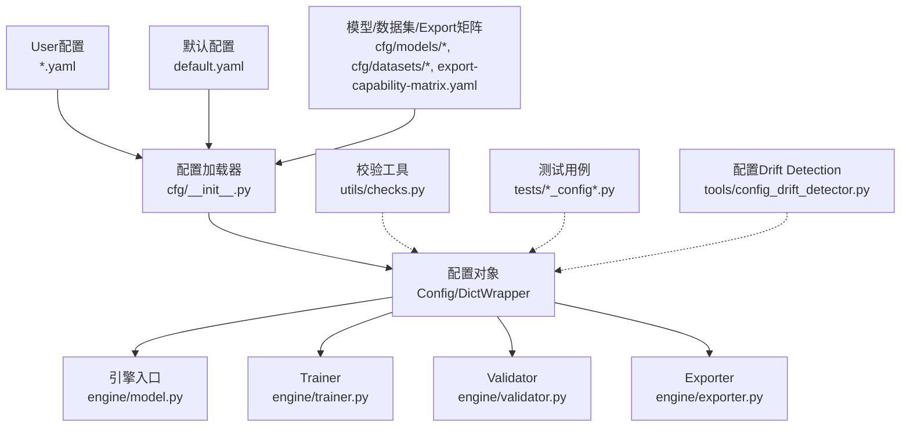
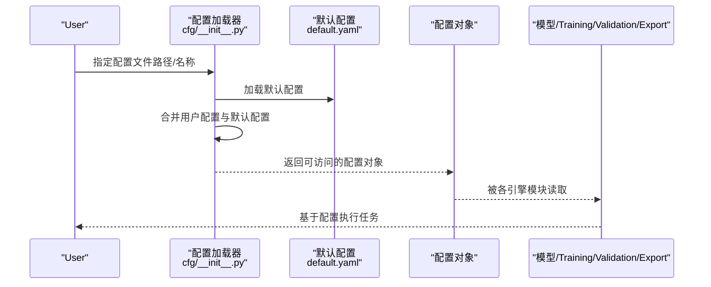
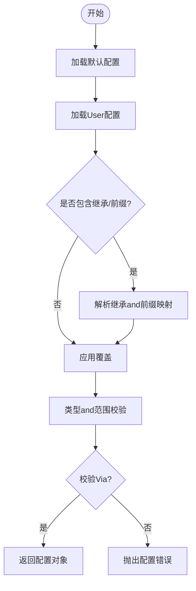
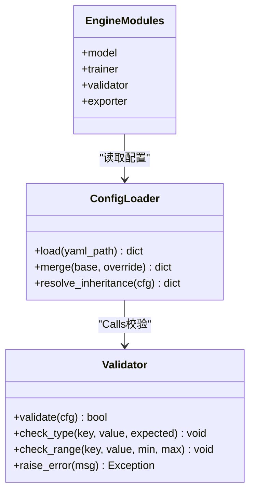
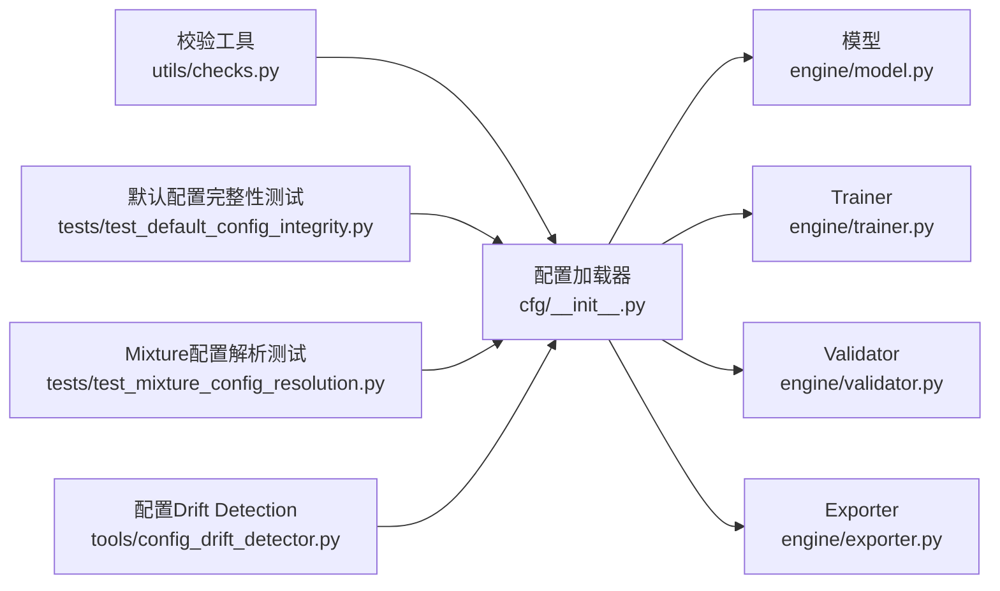

# 配置API

<cite>
**Files Referenced in This Document**
- [ultralytics/cfg/default.yaml](file://ultralytics/cfg/default.yaml)
- [ultralytics/cfg/__init__.py](file://ultralytics/cfg/__init__.py)
- [ultralytics/utils/checks.py](file://ultralytics/utils/checks.py)
- [ultralytics/engine/model.py](file://ultralytics/engine/model.py)
- [ultralytics/engine/trainer.py](file://ultralytics/engine/trainer.py)
- [ultralytics/engine/validator.py](file://ultralytics/engine/validator.py)
- [ultralytics/engine/exporter.py](file://ultralytics/engine/exporter.py)
- [tests/test_default_config_integrity.py](file://tests/test_default_config_integrity.py)
- [tests/test_mixture_config_resolution.py](file://tests/test_mixture_config_resolution.py)
- [tests/test_master_model_configs.py](file://tests/test_master_model_configs.py)
- [tools/config_drift_detector.py](file://tools/config_drift_detector.py)
- [scripts/smoke_test_coco2017.py](file://scripts/smoke_test_coco2017.py)
</cite>

## Table of Contents
1. [Introduction](#Introduction)
2. [Project Structure](#Project Structure)
3. [Core Components](#Core Components)
4. [Architecture Overview](#Architecture Overview)
5. [Detailed Component Analysis](#Detailed Component Analysis)
6. [Dependency Analysis](#Dependency Analysis)
7. [Performance Considerations](#Performance Considerations)
8. [Troubleshooting Guide](#Troubleshooting Guide)
9. [Conclusion](#Conclusion)
10. [Appendix](#Appendix)

## Introduction
本文件targetingYOLO-Master的配置系统API，聚焦Centered on下目标：
- 配置文件结构and语法规范（YAML）and参数继承机制
- 所有配置参数的含义、默认值and有效范围说明方法
- 动态配置更新and运行时修改路径
- 配置文件Validationand错误检查的API
- 配置模板and预设配置的Uses方法
- 多环境配置管理and优先级规则
- 版本兼容性andMigration工具
- 最佳实践and性能调优建议

## Project Structure
配置相关代码主要分布whileCentered on下位置：
- 默认配置and模型/数据集/Exportcapabilities矩阵etc.YAML定义位于 ultralytics/cfg
- 配置加载、合并、覆盖and解析逻辑位于 ultralytics/cfg/__init__.py
- 配置校验and类型检查while ultralytics/utils/checks.py
- 引擎Modules（模型、Training、Validation、Export）while读取andUses配置时触发解析and校验流程
- 测试用例覆盖默认配置完整性、Mixture配置解析、主模型配置一致性etc.
- 工具provides配置Drift Detectioncapabilities

Figure Source
- [ultralytics/cfg/__init__.py](file://ultralytics/cfg/__init__.py)
- [ultralytics/cfg/default.yaml](file://ultralytics/cfg/default.yaml)
- [ultralytics/engine/model.py](file://ultralytics/engine/model.py)
- [ultralytics/engine/trainer.py](file://ultralytics/engine/trainer.py)
- [ultralytics/engine/validator.py](file://ultralytics/engine/validator.py)
- [ultralytics/engine/exporter.py](file://ultralytics/engine/exporter.py)
- [ultralytics/utils/checks.py](file://ultralytics/utils/checks.py)
- [tests/test_default_config_integrity.py](file://tests/test_default_config_integrity.py)
- [tests/test_mixture_config_resolution.py](file://tests/test_mixture_config_resolution.py)
- [tools/config_drift_detector.py](file://tools/config_drift_detector.py)

Section Source
- [ultralytics/cfg/default.yaml](file://ultralytics/cfg/default.yaml)
- [ultralytics/cfg/__init__.py](file://ultralytics/cfg/__init__.py)
- [ultralytics/utils/checks.py](file://ultralytics/utils/checks.py)
- [ultralytics/engine/model.py](file://ultralytics/engine/model.py)
- [ultralytics/engine/trainer.py](file://ultralytics/engine/trainer.py)
- [ultralytics/engine/validator.py](file://ultralytics/engine/validator.py)
- [ultralytics/engine/exporter.py](file://ultralytics/engine/exporter.py)
- [tests/test_default_config_integrity.py](file://tests/test_default_config_integrity.py)
- [tests/test_mixture_config_resolution.py](file://tests/test_mixture_config_resolution.py)
- [tools/config_drift_detector.py](file://tools/config_drift_detector.py)

## Core Components
- 配置加载and合并
  - Supporting从多个YAML源加载并合并for单一配置对象
  - Supporting“继承”语义：Via引用基础配置或键前缀implementing分层覆盖
- 配置对象访问
  - provides字典式and点号属性访问方式
  - Supporting嵌套结构的扁平化访问
- 配置校验
  - 基于类型and范围的校验，失败时抛出明确错误信息
- 引擎集成
  - 模型、Training、Validation、Exportetc.Moduleswhile初始化阶段消费配置对象
- 测试and工具
  - 默认配置完整性测试
  - Mixture配置解析测试
  - 配置Drift Detection工具

Section Source
- [ultralytics/cfg/__init__.py](file://ultralytics/cfg/__init__.py)
- [ultralytics/utils/checks.py](file://ultralytics/utils/checks.py)
- [ultralytics/engine/model.py](file://ultralytics/engine/model.py)
- [ultralytics/engine/trainer.py](file://ultralytics/engine/trainer.py)
- [ultralytics/engine/validator.py](file://ultralytics/engine/validator.py)
- [ultralytics/engine/exporter.py](file://ultralytics/engine/exporter.py)
- [tests/test_default_config_integrity.py](file://tests/test_default_config_integrity.py)
- [tests/test_mixture_config_resolution.py](file://tests/test_mixture_config_resolution.py)

## Architecture Overview
下图展示了配置从YAMLto引擎Uses的端to端流程。

Figure Source
- [ultralytics/cfg/__init__.py](file://ultralytics/cfg/__init__.py)
- [ultralytics/cfg/default.yaml](file://ultralytics/cfg/default.yaml)
- [ultralytics/engine/model.py](file://ultralytics/engine/model.py)
- [ultralytics/engine/trainer.py](file://ultralytics/engine/trainer.py)
- [ultralytics/engine/validator.py](file://ultralytics/engine/validator.py)
- [ultralytics/engine/exporter.py](file://ultralytics/engine/exporter.py)

## Detailed Component Analysis

### 配置加载and合并（YAMLand继承）
- 加载顺序and优先级
  - 默认配置作for基线
  - User显式指定的配置文件覆盖默认项
  - 若存while多个源，后加载的覆盖先加载的同名键
- 继承机制
  - Via“基础配置引用”或“命名空间前缀”implementing分层覆盖
  - 子域配置可仅声明差异项，其余沿用父域
- 合并策略
  - 浅层键直接覆盖
  - 深层字典按键递归合并
  - 列表型字段通常Centered on覆盖for主（具体行for取决于字段语义）

Figure Source
- [ultralytics/cfg/__init__.py](file://ultralytics/cfg/__init__.py)
- [ultralytics/cfg/default.yaml](file://ultralytics/cfg/default.yaml)

Section Source
- [ultralytics/cfg/__init__.py](file://ultralytics/cfg/__init__.py)
- [ultralytics/cfg/default.yaml](file://ultralytics/cfg/default.yaml)

### 配置对象and访问模式
- 访问方式
  - 字典式访问：such as config["key"]
  - 点号属性访问：such as config.key
  - 嵌套访问：such as config.sub.key
- 常见用途
  - 引擎初始化时读取设备、批大小、精度、IO路径etc.
  - Training/Validation/Export流程中按需读取特定子域

Section Source
- [ultralytics/cfg/__init__.py](file://ultralytics/cfg/__init__.py)
- [ultralytics/engine/model.py](file://ultralytics/engine/model.py)
- [ultralytics/engine/trainer.py](file://ultralytics/engine/trainer.py)
- [ultralytics/engine/validator.py](file://ultralytics/engine/validator.py)
- [ultralytics/engine/exporter.py](file://ultralytics/engine/exporter.py)

### 配置校验and错误检查API
- 校验维度
  - 类型检查：确保数值、布尔、字符串、枚举etc.符合预期
  - 范围检查：对超参、尺寸、阈值etc.进行上下界约束
  - 依赖检查：某些键组合必须同时存while或互斥
- 错误处理
  - 校验失败时抛出结构化异常，包含字段名、期望类型/范围and实际值
  - 建议while启动早期进行全量校验，避免运行期不一致

Figure Source
- [ultralytics/cfg/__init__.py](file://ultralytics/cfg/__init__.py)
- [ultralytics/utils/checks.py](file://ultralytics/utils/checks.py)

Section Source
- [ultralytics/utils/checks.py](file://ultralytics/utils/checks.py)
- [tests/test_default_config_integrity.py](file://tests/test_default_config_integrity.py)

### 动态配置更新and运行时修改
- Applicable Scenarios
  - while线Inference服务中调整阈值、NMS参数、Visualization开关etc.
  - Training过程中根据Logging动态调整Learning Rate、早停条件etc.
- 推荐做法
  - Uses配置对象的就地更新接口更新键值
  - 对关键参数变更进行二次校验
  - 将变更持久化至文件或状态存储，便于审计and回滚
- 注意事项
  - 部分参数仅while初始化阶段生效（such as模型结构、后端选择），运行时修改无效
  - 并发环境下需加锁保护配置写入

Section Source
- [ultralytics/cfg/__init__.py](file://ultralytics/cfg/__init__.py)
- [ultralytics/engine/model.py](file://ultralytics/engine/model.py)
- [ultralytics/engine/trainer.py](file://ultralytics/engine/trainer.py)
- [ultralytics/engine/validator.py](file://ultralytics/engine/validator.py)
- [ultralytics/engine/exporter.py](file://ultralytics/engine/exporter.py)

### 配置模板and预设配置
- 模板来源
  - 默认配置provides通用基线
  - 模型/数据集/Exportcapabilities矩阵etc.YAML可作for领域模板
- Uses方法
  - 复制模板并覆盖差异项
  - Via继承/前缀组织多套配置
- 建议
  - for不同Tasks（检测、分割、姿态etc.）维护独立模板
  - for不同环境（开发、测试、生产）维护独立覆盖层

Section Source
- [ultralytics/cfg/default.yaml](file://ultralytics/cfg/default.yaml)
- [ultralytics/cfg/__init__.py](file://ultralytics/cfg/__init__.py)

### 多环境配置管理and优先级规则
- 环境分层
  - 基础层：默认配置
  - 业务层：Tasks/模型/数据集专用配置
  - 环境层：dev/test/prod覆盖
- 优先级（从高to低）
  - 命令行/程序内覆盖 > 环境覆盖 > 业务模板 > 默认配置
- 管理建议
  - Uses环境变量注入敏感信息（such as路径、密钥）
  - whileCI中校验配置一致性

Section Source
- [ultralytics/cfg/__init__.py](file://ultralytics/cfg/__init__.py)
- [ultralytics/cfg/default.yaml](file://ultralytics/cfg/default.yaml)

### 版本兼容性andMigration工具
- 兼容性
  - 新增字段应设置合理默认值，避免破坏旧配置
  - 废弃字段保留向后兼容Tips
- Migration工具
  - provides配置Drift Detection工具，对比当前and基线配置的差异
  - Combining测试用例保障默认配置完整性

Section Source
- [tools/config_drift_detector.py](file://tools/config_drift_detector.py)
- [tests/test_default_config_integrity.py](file://tests/test_default_config_integrity.py)

### 最佳实践and性能调优建议
- 最佳实践
  - 明确区分只读and可写参数，避免运行时误改
  - Uses最小覆盖原则，减少重复配置
  - 对关键参数增加注释and取值范围说明
- 性能调优
  - 批大小、Data Loading线程数、缓存策略etc.对吞吐影响显著
  - Export模式下选择合适的后端andOptimization选项
  - 监控GPU/CPU利用率and内存峰值，定位bottlenecks

Section Source
- [ultralytics/engine/exporter.py](file://ultralytics/engine/exporter.py)
- [ultralytics/engine/trainer.py](file://ultralytics/engine/trainer.py)
- [ultralytics/engine/validator.py](file://ultralytics/engine/validator.py)

## Dependency Analysis
配置系统and引擎Modules之间的依赖关系such as下：

Figure Source
- [ultralytics/cfg/__init__.py](file://ultralytics/cfg/__init__.py)
- [ultralytics/utils/checks.py](file://ultralytics/utils/checks.py)
- [ultralytics/engine/model.py](file://ultralytics/engine/model.py)
- [ultralytics/engine/trainer.py](file://ultralytics/engine/trainer.py)
- [ultralytics/engine/validator.py](file://ultralytics/engine/validator.py)
- [ultralytics/engine/exporter.py](file://ultralytics/engine/exporter.py)
- [tests/test_default_config_integrity.py](file://tests/test_default_config_integrity.py)
- [tests/test_mixture_config_resolution.py](file://tests/test_mixture_config_resolution.py)
- [tools/config_drift_detector.py](file://tools/config_drift_detector.py)

Section Source
- [ultralytics/cfg/__init__.py](file://ultralytics/cfg/__init__.py)
- [ultralytics/utils/checks.py](file://ultralytics/utils/checks.py)
- [ultralytics/engine/model.py](file://ultralytics/engine/model.py)
- [ultralytics/engine/trainer.py](file://ultralytics/engine/trainer.py)
- [ultralytics/engine/validator.py](file://ultralytics/engine/validator.py)
- [ultralytics/engine/exporter.py](file://ultralytics/engine/exporter.py)
- [tests/test_default_config_integrity.py](file://tests/test_default_config_integrity.py)
- [tests/test_mixture_config_resolution.py](file://tests/test_mixture_config_resolution.py)
- [tools/config_drift_detector.py](file://tools/config_drift_detector.py)

## Performance Considerations
- 配置解析开销
  - 大型配置树合并and校验应while启动阶段完成，避免热路径
- 运行时变更
  - 高频变更的参数应设计for轻量级读写，必要时引入缓存
- ExportOptimization
  - Export阶段的配置直接影响模型体积andInference速度，需权衡精度and性能

[This section provides general guidance and does not directly analyze specific files]

## Troubleshooting Guide
- 常见问题
  - 类型不匹配：检查字段类型and默认值定义
  - 范围越界：核对参数上下界and业务需求
  - 缺失依赖键：确认必需键是否存while且非空
- 定位步骤
  - 启用更详细的Logging输出
  - Uses配置Drift Detection工具对比差异
  - 运行默认配置完整性测试andMixture配置解析测试
- Refer to脚本
  - UsesExamples脚本快速复现问题并定位配置来源

Section Source
- [ultralytics/utils/checks.py](file://ultralytics/utils/checks.py)
- [tests/test_default_config_integrity.py](file://tests/test_default_config_integrity.py)
- [tests/test_mixture_config_resolution.py](file://tests/test_mixture_config_resolution.py)
- [scripts/smoke_test_coco2017.py](file://scripts/smoke_test_coco2017.py)

## Conclusion
本配置API围绕“加载-合并-校验-Uses”的主线构建，强调可维护性、可Extensibilityand可观测性。Via模板化and分层覆盖，Combined with严格的校验and测试，可while多环境and多Tasks场景下稳定运行。建议while生产环境中持续Uses配置Drift Detectionand回归测试，确保配置演进的可控and可追溯。

[本节for总结，不直接分析具体文件]

## Appendix
- 常用配置键分类（Examples）
  - 设备and并行：device、batch_size、workers
  - Training超参：lr、epochs、optimizer、loss
  - 数据andIO：data、path、cache、augment
  - Export选项：format、backend、optimize、half
- Refer to文件
  - 默认配置and模板：ultralytics/cfg/default.yaml
  - 配置加载and合并：ultralytics/cfg/__init__.py
  - 校验工具：ultralytics/utils/checks.py
  - 引擎Modules：ultralytics/engine/{model,trainer,validator,exporter}.py
  - 测试and工具：tests/*_config*.py、tools/config_drift_detector.py

Section Source
- [ultralytics/cfg/default.yaml](file://ultralytics/cfg/default.yaml)
- [ultralytics/cfg/__init__.py](file://ultralytics/cfg/__init__.py)
- [ultralytics/utils/checks.py](file://ultralytics/utils/checks.py)
- [ultralytics/engine/model.py](file://ultralytics/engine/model.py)
- [ultralytics/engine/trainer.py](file://ultralytics/engine/trainer.py)
- [ultralytics/engine/validator.py](file://ultralytics/engine/validator.py)
- [ultralytics/engine/exporter.py](file://ultralytics/engine/exporter.py)
- [tests/test_default_config_integrity.py](file://tests/test_default_config_integrity.py)
- [tests/test_mixture_config_resolution.py](file://tests/test_mixture_config_resolution.py)
- [tests/test_master_model_configs.py](file://tests/test_master_model_configs.py)
- [tools/config_drift_detector.py](file://tools/config_drift_detector.py)
- [scripts/smoke_test_coco2017.py](file://scripts/smoke_test_coco2017.py)