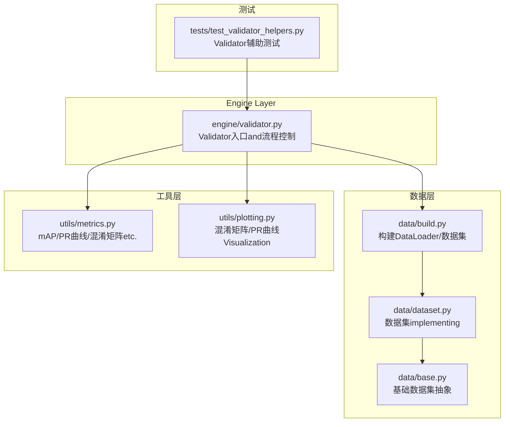
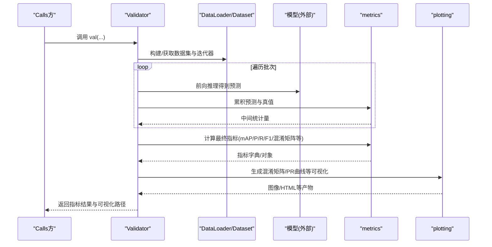
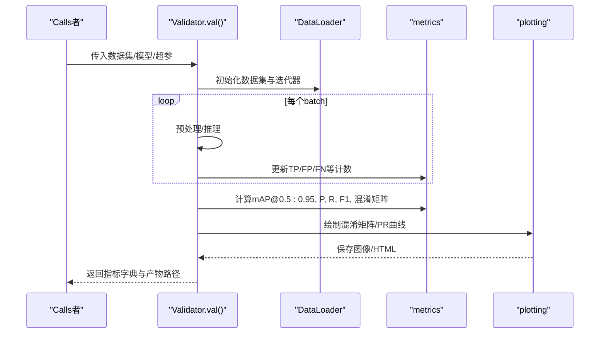
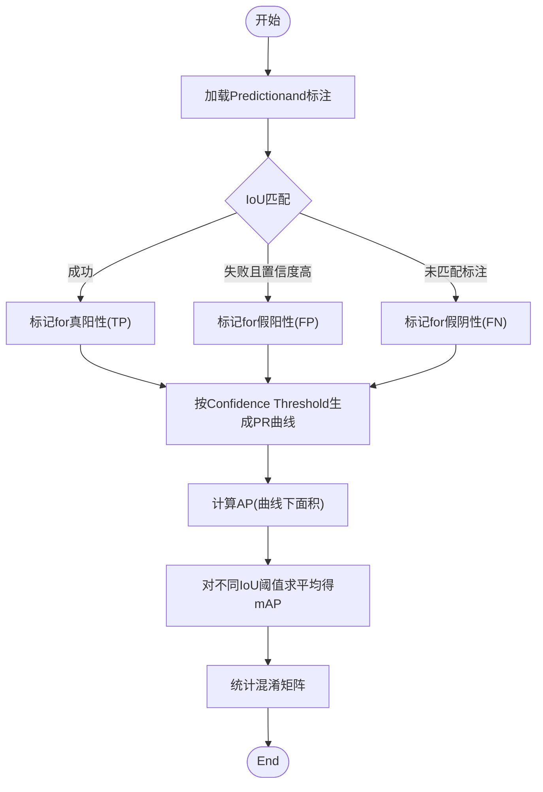
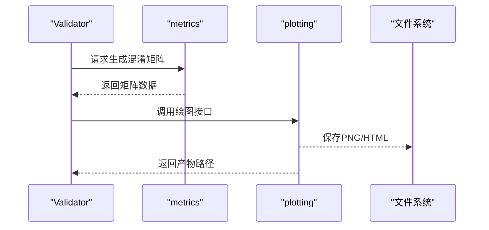
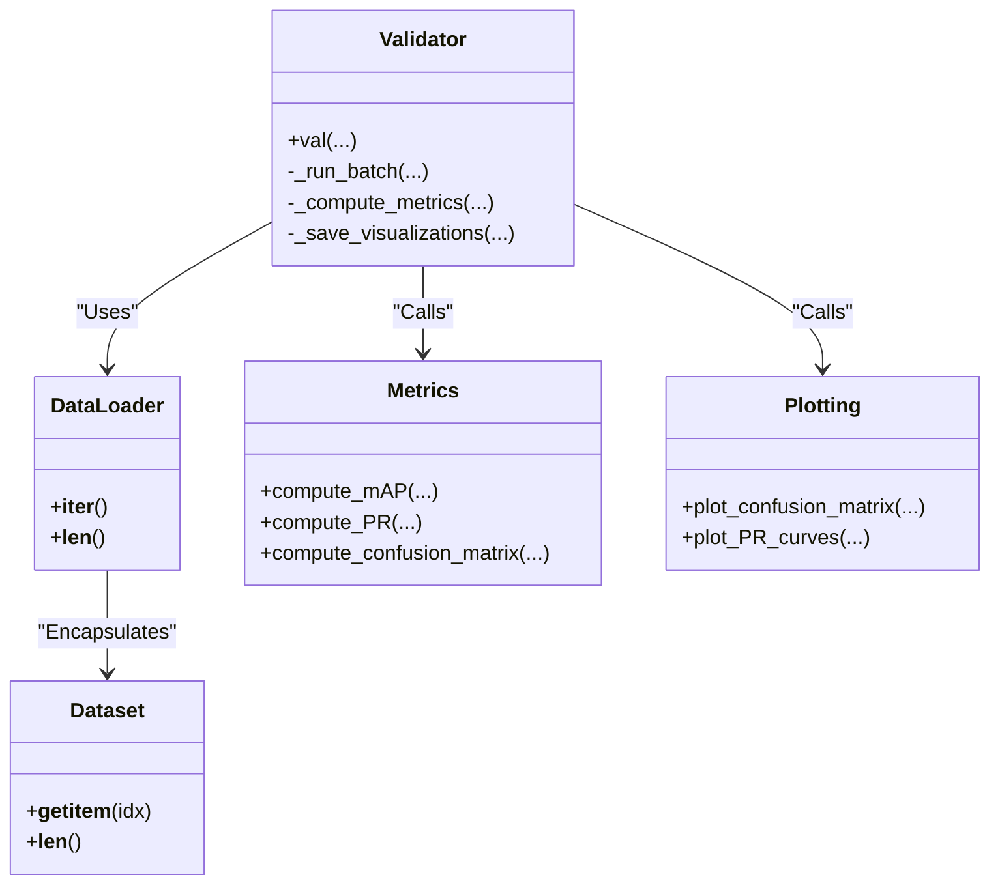

# ValidatorValidatorAPI

<cite>
**Files Referenced in This Document**
- [ultralytics/engine/validator.py](file://ultralytics/engine/validator.py)
- [ultralytics/utils/metrics.py](file://ultralytics/utils/metrics.py)
- [ultralytics/data/build.py](file://ultralytics/data/build.py)
- [ultralytics/data/dataset.py](file://ultralytics/data/dataset.py)
- [ultralytics/data/base.py](file://ultralytics/data/base.py)
- [ultralytics/utils/plotting.py](file://ultralytics/utils/plotting.py)
- [tests/test_validator_helpers.py](file://tests/test_validator_helpers.py)
</cite>

## Table of Contents
1. [Introduction](#Introduction)
2. [Project Structure](#Project Structure)
3. [Core Components](#Core Components)
4. [Architecture Overview](#Architecture Overview)
5. [Detailed Component Analysis](#Detailed Component Analysis)
6. [Dependency Analysis](#Dependency Analysis)
7. [性能考量](#性能考量)
8. [Troubleshooting Guide](#Troubleshooting Guide)
9. [Conclusion](#Conclusion)
10. [Appendix](#Appendix)

## Introduction
本文件for YOLO-Master 的 Validator Validatorprovides完整的 API Documentation，聚焦于Centered on下目标：
- 详细说明 Validator 类的Evaluation流程控制接口，尤其是 val() 方法的参数配置and返回结果。
- 解释数据集加载andValidation循环的管理方式。
- 记录各类EvaluationMetrics（such as mAP、精度、召回率etc.）的统计and计算方法。
- 说明混淆矩阵生成andVisualization输出接口。
- provides自定义EvaluationMetrics的implementing方法and集成路径。
- 展示性能基准测试and结果对比分析的工具接口。
- 指导such as何扩展ValidatorCentered onSupporting新的EvaluationTasksandMetrics。

## Project Structure
Validator 相关代码主要位于 engine 层，Data Loadingwhile data 层，Metrics计算and绘图while utils 层，测试用例while tests 层。下图给出and Validator 相关的核心文件and职责划分。

Figure Source
- [ultralytics/engine/validator.py](file://ultralytics/engine/validator.py)
- [ultralytics/data/build.py](file://ultralytics/data/build.py)
- [ultralytics/data/dataset.py](file://ultralytics/data/dataset.py)
- [ultralytics/data/base.py](file://ultralytics/data/base.py)
- [ultralytics/utils/metrics.py](file://ultralytics/utils/metrics.py)
- [ultralytics/utils/plotting.py](file://ultralytics/utils/plotting.py)
- [tests/test_validator_helpers.py](file://tests/test_validator_helpers.py)

Section Source
- [ultralytics/engine/validator.py](file://ultralytics/engine/validator.py)
- [ultralytics/data/build.py](file://ultralytics/data/build.py)
- [ultralytics/utils/metrics.py](file://ultralytics/utils/metrics.py)
- [ultralytics/utils/plotting.py](file://ultralytics/utils/plotting.py)
- [tests/test_validator_helpers.py](file://tests/test_validator_helpers.py)

## Core Components
- Validator 类
  - 负责Validation流程编排：初始化模型and数据、遍历批次、收集Predictionand标注、CallsMetricsModules计算并汇总结果、保存Visualizationand报告。
  - 关键入口方法：val()，用于执行一次完整的数据集Validation。
- MetricsModules metrics
  - provides mAP、Precision、Recall、F1、混淆矩阵、PR 曲线etc.计算逻辑。
- 数据构建Modules build/dataset/base
  - 负责从配置文件或路径构建 DataLoader、Dataset 实例，管理批处理、采样策略and多进程加载。
- VisualizationModules plotting
  - provides混淆矩阵图、PR 曲线图etc.Export接口。

Section Source
- [ultralytics/engine/validator.py](file://ultralytics/engine/validator.py)
- [ultralytics/utils/metrics.py](file://ultralytics/utils/metrics.py)
- [ultralytics/data/build.py](file://ultralytics/data/build.py)
- [ultralytics/data/dataset.py](file://ultralytics/data/dataset.py)
- [ultralytics/data/base.py](file://ultralytics/data/base.py)
- [ultralytics/utils/plotting.py](file://ultralytics/utils/plotting.py)

## Architecture Overview
下图展示了 Validator while一次Validation过程中的主要交互：Data Loading、Inference、Metrics计算andVisualization输出。

Figure Source
- [ultralytics/engine/validator.py](file://ultralytics/engine/validator.py)
- [ultralytics/utils/metrics.py](file://ultralytics/utils/metrics.py)
- [ultralytics/utils/plotting.py](file://ultralytics/utils/plotting.py)

## Detailed Component Analysis

### Validator 类and val() 方法
- 职责
  - 初始化：Loading Model Weights、设备设置、NMS/Confidence Thresholdetc.超参。
  - Data Preparation：Via数据构建Modules创建 DataLoader，按Tasks类型选择对应 Dataset。
  - Validation循环：逐批Inference，收集Prediction框/掩码/关键点etc.and真实标注，进行匹配and统计。
  - Metrics计算：Calls metrics Modules汇总 PR 曲线、mAP、混淆矩阵etc.。
  - Visualizationand持久化：Export混淆矩阵、PR 曲线、类别级Metrics表格etc.。
- val() 方法要点
  - 输入参数通常包括：数据集路径或配置、模型权重、批量大小、图像尺寸、置信度and IoU 阈值、是否保存Visualization、是否打印Loggingetc.。
  - 返回值通常for包含各MetricsandVisualization路径的结构化结果，便于后续分析and比较。
- 错误处理
  - 对数据缺失、标签格式不合法、IoU 阈值越界etc.情况进行校验andTips。
  - 对 GPU OOM、IO 异常etc.进行捕获and降级策略（such as降低 batch size）。

Section Source
- [ultralytics/engine/validator.py](file://ultralytics/engine/validator.py)

#### Validation流程控制时序

Figure Source
- [ultralytics/engine/validator.py](file://ultralytics/engine/validator.py)
- [ultralytics/utils/metrics.py](file://ultralytics/utils/metrics.py)
- [ultralytics/utils/plotting.py](file://ultralytics/utils/plotting.py)

### 数据集加载andValidation循环管理
- 数据构建
  - Via build Modules根据Tasks类型（检测/分割/姿态etc.）选择相应 Dataset implementing。
  - Supporting多进程Data Loading、缓存、重复Usesetc.Optimization。
- Validation循环
  - 基于 DataLoader 的迭代器进行批处理，避免一次性加载全部数据to内存。
  - Supporting断点续验、进度条、Logging输出。
- 典型配置项
  - 图像尺寸、批量大小、Data Augmentation开关（Validation阶段通常关闭）、线程数、缓存策略etc.。

Section Source
- [ultralytics/data/build.py](file://ultralytics/data/build.py)
- [ultralytics/data/dataset.py](file://ultralytics/data/dataset.py)
- [ultralytics/data/base.py](file://ultralytics/data/base.py)

### EvaluationMetrics统计and计算方法
- 常用Metrics
  - mAP@0.5:0.95、mAP@0.5、mAP@0.75
  - Precision、Recall、F1-Score
  - 类别级Metricsand总体平均
- 计算流程
  - 将Predictionand标注进行 IoU 匹配，统计 TP/FP/FN。
  - 基于不同Confidence Threshold生成 PR 曲线，计算曲线下面积得to AP。
  - 对不同 IoU 阈值求平均得to mAP。
  - 混淆矩阵统计每类的Prediction分布，用于错误分析。
- 输出结构
  - Metrics字典/对象，包含总体and类别级Metrics、PR 曲线数据、混淆矩阵etc.。

Section Source
- [ultralytics/utils/metrics.py](file://ultralytics/utils/metrics.py)

#### Metrics计算流程图

Figure Source
- [ultralytics/utils/metrics.py](file://ultralytics/utils/metrics.py)

### 混淆矩阵生成andVisualization输出
- 生成
  - 基于Validation阶段的分类Predictionand真实标签，统计每类的命中and误判数量。
  - Supporting归一化显示，便于跨类别比较。
- Visualization
  - Export热力图形式的混淆矩阵图片。
  - 可Combining HTML 报告输出，便于归档and分享。
- 集成点
  - Validator whileMetrics计算完成后Calls plotting Modules进行Export。

Section Source
- [ultralytics/utils/metrics.py](file://ultralytics/utils/metrics.py)
- [ultralytics/utils/plotting.py](file://ultralytics/utils/plotting.py)

#### 混淆矩阵Visualization序列

Figure Source
- [ultralytics/utils/plotting.py](file://ultralytics/utils/plotting.py)
- [ultralytics/utils/metrics.py](file://ultralytics/utils/metrics.py)

### 自定义EvaluationMetrics的implementingand集成
- 设计原则
  - 保持and现有Metrics一致的输入输出契约：接收Predictionand标注，返回可聚合的统计量或标量Metrics。
  - Supporting增量式累加，Centered on便while批处理中高效计算。
- 集成步骤
  - whileMetricsModules中注册新Metrics的计算函数。
  - while Validator 的Metrics汇总阶段Calls该函数，并将其结果纳入最终报告。
  - such as需Visualization，provides对应的绘图接口并while Validator 中Calls。
- 注意事项
  - 确保数值稳定性and边界条件处理（such as空Prediction、全零行/列）。
  - and现有 mAP/PR 曲线体系兼容时，注意阈值网格and插值策略的一致性。

Section Source
- [ultralytics/utils/metrics.py](file://ultralytics/utils/metrics.py)
- [ultralytics/engine/validator.py](file://ultralytics/engine/validator.py)

### 性能基准测试and结果对比分析工具接口
- 基准测试
  - Supportingwhile不同硬件/后端上运行Validation，记录吞吐and延迟。
  - 可固定数据集and模型，仅改变超参或后端，进行对照实验。
- 结果对比
  - 将多次Validation的结果Exporting to结构化文件（JSON/CSV），便于横向对比。
  - provides脚本或接口读取历史结果，生成对比图表and摘要。
- 集成建议
  - while Validator 的 val() 返回结构中增加耗时、吞吐etc.元信息。
  - 将对比分析Encapsulatesfor独立工具，复用Metricsand绘图capabilities。

Section Source
- [ultralytics/engine/validator.py](file://ultralytics/engine/validator.py)
- [ultralytics/utils/metrics.py](file://ultralytics/utils/metrics.py)

### 扩展ValidatorCentered onSupporting新Tasksand新Metrics
- 新TasksSupporting
  - while数据构建层新增对应 Dataset implementing，定义Data Loadingand预处理逻辑。
  - while Validator 的Tasks分支中添加新Tasks的Inferenceand匹配逻辑。
- 新MetricsSupporting
  - whileMetricsModules新增计算函数，并while Validator 的汇总阶段注册Calls。
  - 若需要Visualization，新增绘图函数并while Validator 中Calls。
- 测试保障
  - for新TasksandMetrics编写单元测试and端to端测试，覆盖正常and异常路径。

Section Source
- [ultralytics/data/dataset.py](file://ultralytics/data/dataset.py)
- [ultralytics/data/build.py](file://ultralytics/data/build.py)
- [ultralytics/utils/metrics.py](file://ultralytics/utils/metrics.py)
- [ultralytics/engine/validator.py](file://ultralytics/engine/validator.py)

## Dependency Analysis
Validator and数据、Metrics、VisualizationModules之间的依赖such as下：

Figure Source
- [ultralytics/engine/validator.py](file://ultralytics/engine/validator.py)
- [ultralytics/data/build.py](file://ultralytics/data/build.py)
- [ultralytics/data/dataset.py](file://ultralytics/data/dataset.py)
- [ultralytics/utils/metrics.py](file://ultralytics/utils/metrics.py)
- [ultralytics/utils/plotting.py](file://ultralytics/utils/plotting.py)

Section Source
- [ultralytics/engine/validator.py](file://ultralytics/engine/validator.py)
- [ultralytics/data/build.py](file://ultralytics/data/build.py)
- [ultralytics/data/dataset.py](file://ultralytics/data/dataset.py)
- [ultralytics/utils/metrics.py](file://ultralytics/utils/metrics.py)
- [ultralytics/utils/plotting.py](file://ultralytics/utils/plotting.py)

## 性能考量
- Data Loading
  - 启用多进程 DataLoader、预取and缓存，减少 IO bottlenecks。
  - Set appropriately图像尺寸and批量大小，to balance throughput and memory usage。
- Metrics计算
  - 采用增量式统计，避免重复计算；必要时对大规模数据进行分块处理。
- Visualization
  - 仅while需要时生成大图，或Uses低分辨率版本用于快速预览。
- 并行and分布式
  - while多卡环境下，确保Metrics聚合的正确性and一致性，避免竞态条件。

[本节for通用性能建议，无需特定文件引用]

## Troubleshooting Guide
- 常见问题
  - 数据路径错误或标签格式不合法：检查数据集结构and标注规范。
  - 显存不足：降低 batch size 或图像尺寸，关闭不必要的Visualization。
  - Metrics异常（NaN/Inf）：检查Predictionfor空或全零的情况，调整阈值范围。
- 调试手段
  - 开启详细Logging，定位具体批次and样本。
  - Uses最小复现数据集and模型，逐步缩小问题范围。
- Refer to测试
  - 查看Validator辅助测试用例，了解常见边界条件and错误路径的处理方式。

Section Source
- [tests/test_validator_helpers.py](file://tests/test_validator_helpers.py)

## Conclusion
Validator 作for YOLO-Master 的核心Evaluation组件，provides了统一的Validation流程控制、Metrics计算andVisualization输出capabilities。ViaModules化设计，User可Centered on便捷地扩展新Tasksand新Metrics，并Combining基准测试工具进行系统化的性能对比and分析。遵循本Documentation的接口约定and最佳实践，可有效提升Evaluation的可重复性and可维护性。

[本节for总结性内容，无需特定文件引用]

## Appendix
- 术语表
  - mAP：平均精度均值，衡量检测/分割etc.多Tasks综合性能。
  - PR 曲线：Precision-Recall 曲线，反映不同置信度下的精度and召回权衡。
  - 混淆矩阵：按类别统计Predictionand真实标签的交叉分布，用于错误分析。
- Refer to路径
  - Validator主implementing：[ultralytics/engine/validator.py](file://ultralytics/engine/validator.py)
  - Metrics计算：[ultralytics/utils/metrics.py](file://ultralytics/utils/metrics.py)
  - 数据构建：[ultralytics/data/build.py](file://ultralytics/data/build.py)
  - Visualization：[ultralytics/utils/plotting.py](file://ultralytics/utils/plotting.py)
  - 测试用例：[tests/test_validator_helpers.py](file://tests/test_validator_helpers.py)