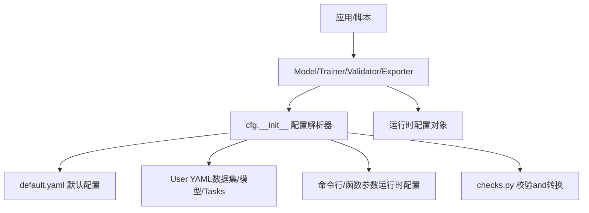
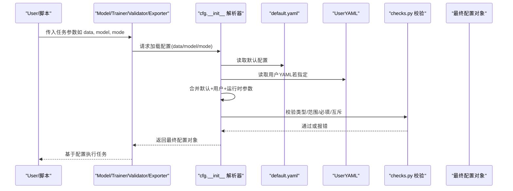
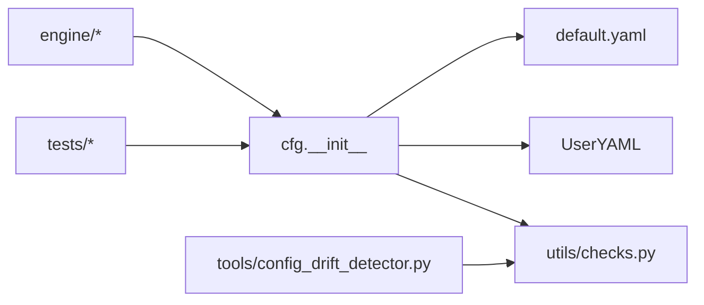

# 配置管理系统

<cite>
**Files Referenced in This Document**
- [ultralytics/cfg/__init__.py](file://ultralytics/cfg/__init__.py)
- [ultralytics/cfg/default.yaml](file://ultralytics/cfg/default.yaml)
- [ultralytics/utils/checks.py](file://ultralytics/utils/checks.py)
- [ultralytics/engine/model.py](file://ultralytics/engine/model.py)
- [ultralytics/engine/trainer.py](file://ultralytics/engine/trainer.py)
- [ultralytics/engine/validator.py](file://ultralytics/engine/validator.py)
- [ultralytics/engine/exporter.py](file://ultralytics/engine/exporter.py)
- [tests/test_default_config_integrity.py](file://tests/test_default_config_integrity.py)
- [tests/test_mixture_config_resolution.py](file://tests/test_mixture_config_resolution.py)
- [tools/config_drift_detector.py](file://tools/config_drift_detector.py)
- [scripts/_voc_local.yaml](file://scripts/_voc_local.yaml)
- [scripts/coco2017.yaml](file://scripts/coco2017.yaml)
- [examples/lora_examples/yolo_master_lora_README.md](file://examples/lora_examples/yolo_master_lora_README.md)
</cite>

## Table of Contents
1. [Introduction](#Introduction)
2. [Project Structure](#Project Structure)
3. [Core Components](#Core Components)
4. [Architecture Overview](#Architecture Overview)
5. [Detailed Component Analysis](#Detailed Component Analysis)
6. [Dependency Analysis](#Dependency Analysis)
7. [Performance Considerations](#Performance Considerations)
8. [故障排除指南](#故障排除指南)
9. [Conclusion](#Conclusion)
10. [Appendix](#Appendix)

## Introduction
本技术Documentationtargeting YOLO-Master 框架的配置管理系统，系统性阐述配置的层次结构and合并优先级（默认配置、User配置、运行时配置），YAML 语法and参数校验规则，动态加载and热重载机制，版本兼容性检查，继承and覆盖策略（局部and全局协调），类型系统and默认值处理，Centered onand代码中访问and修改配置的最佳实践。同时provides配置文件组织结构and管理策略、调试工具and故障排除方法，并涵盖安全and敏感信息保护建议。

## Project Structure
YOLO-Master 的配置系统围绕 ultralytics/cfg Table of Contents下的默认配置and模型/数据集 YAML，CombiningEngine Layerwhile运行期对配置进行解析、校验and合并。典型路径包括：
- 默认配置andcapabilities矩阵：ultralytics/cfg/default.yaml、ultralytics/cfg/export-capability-matrix.yaml
- 数据and模型Examples配置：scripts/*.yaml、ultralytics/cfg/datasets/*.yaml、ultralytics/cfg/models/*
- 配置解析and校验：ultralytics/cfg/__init__.py、ultralytics/utils/checks.py
- Uses入口：ultralytics/engine/model.py、trainer.py、validator.py、exporter.py
- 测试and回归：tests/test_default_config_integrity.py、tests/test_mixture_config_resolution.py
- 配置Drift Detection：tools/config_drift_detector.py

Figure Source
- [ultralytics/cfg/__init__.py](file://ultralytics/cfg/__init__.py)
- [ultralytics/cfg/default.yaml](file://ultralytics/cfg/default.yaml)
- [ultralytics/utils/checks.py](file://ultralytics/utils/checks.py)
- [ultralytics/engine/model.py](file://ultralytics/engine/model.py)
- [ultralytics/engine/trainer.py](file://ultralytics/engine/trainer.py)
- [ultralytics/engine/validator.py](file://ultralytics/engine/validator.py)
- [ultralytics/engine/exporter.py](file://ultralytics/engine/exporter.py)

Section Source
- [ultralytics/cfg/__init__.py](file://ultralytics/cfg/__init__.py)
- [ultralytics/cfg/default.yaml](file://ultralytics/cfg/default.yaml)
- [ultralytics/utils/checks.py](file://ultralytics/utils/checks.py)
- [ultralytics/engine/model.py](file://ultralytics/engine/model.py)
- [ultralytics/engine/trainer.py](file://ultralytics/engine/trainer.py)
- [ultralytics/engine/validator.py](file://ultralytics/engine/validator.py)
- [ultralytics/engine/exporter.py](file://ultralytics/engine/exporter.py)

## Core Components
- 配置解析器（cfg.__init__）
  - 负责加载 default.yaml、User YAML、运行时参数，执行合并and去重，生成统一配置对象。
  - Supporting键路径访问、嵌套字典合并、列表拼接或覆盖策略。
- 校验and转换（utils/checks.py）
  - 定义字段类型、取值范围、必填项、互斥约束；将字符串/数值etc.转换for期望类型。
  - provides错误消息and定位，便于快速修复配置。
- 引擎集成（engine/*）
  - Model/Trainer/Validator/Exporter while初始化时读取配置，构建具体Tasks流水线。
  - 暴露只读接口供上层查询，避免随意篡改运行时状态。
- 测试and回归（tests/*）
  - Validation默认配置完整性、合并优先级、兼容性and边界条件。
- 配置Drift Detection（tools/config_drift_detector.py）
  - 对比当前配置and基线/历史配置，输出差异报告，辅助版本治理。

Section Source
- [ultralytics/cfg/__init__.py](file://ultralytics/cfg/__init__.py)
- [ultralytics/utils/checks.py](file://ultralytics/utils/checks.py)
- [ultralytics/engine/model.py](file://ultralytics/engine/model.py)
- [ultralytics/engine/trainer.py](file://ultralytics/engine/trainer.py)
- [ultralytics/engine/validator.py](file://ultralytics/engine/validator.py)
- [ultralytics/engine/exporter.py](file://ultralytics/engine/exporter.py)
- [tests/test_default_config_integrity.py](file://tests/test_default_config_integrity.py)
- [tests/test_mixture_config_resolution.py](file://tests/test_mixture_config_resolution.py)
- [tools/config_drift_detector.py](file://tools/config_drift_detector.py)

## Architecture Overview
下图展示配置从“默认配置 + User配置 + 运行时参数”to“最终配置对象”的完整流程，Centered onand校验and版本检查的介入点。

Figure Source
- [ultralytics/cfg/__init__.py](file://ultralytics/cfg/__init__.py)
- [ultralytics/cfg/default.yaml](file://ultralytics/cfg/default.yaml)
- [ultralytics/utils/checks.py](file://ultralytics/utils/checks.py)
- [ultralytics/engine/model.py](file://ultralytics/engine/model.py)
- [ultralytics/engine/trainer.py](file://ultralytics/engine/trainer.py)
- [ultralytics/engine/validator.py](file://ultralytics/engine/validator.py)
- [ultralytics/engine/exporter.py](file://ultralytics/engine/exporter.py)

## Detailed Component Analysis

### 配置层次结构and合并优先级
- 层次结构
  - 默认配置：框架Built-in default.yaml，保证开箱即用and稳定性。
  - User配置：数据集/模型/Tasks的 YAML，位于 scripts、datasets、models etc.Table of Contents。
  - 运行时配置：CLI 参数或函数Calls时的关键字参数，用于临时覆盖。
- 合并优先级（高to低）
  - 运行时配置 > User配置 > 默认配置
  - 同一层级内，后出现的键覆盖先前的键；列表通常采用替换而非拼接（除非明确声明）。
- 合并策略
  - 字典按键递归合并；未显式覆盖的键保留上游值。
  - 特殊键（such as path、name、task）可能触发资源定位或Modules选择逻辑。
  - 冲突键会触发校验失败或警告，便于早期发现。

Section Source
- [ultralytics/cfg/__init__.py](file://ultralytics/cfg/__init__.py)
- [ultralytics/cfg/default.yaml](file://ultralytics/cfg/default.yaml)
- [tests/test_mixture_config_resolution.py](file://tests/test_mixture_config_resolution.py)

### YAML 语法规范and参数校验
- YAML 语法
  - Supporting键值对、嵌套字典、列表、注释、引用and包含（若implementing允许）。
  - 推荐保持缩进一致，避免混用空格and制表符。
- 参数校验
  - 类型检查：int/float/bool/str/list/dict etc.。
  - 范围检查：数值上下界、枚举值集合。
  - 必填项and互斥项：缺失必填键或同时存while互斥键时报错。
  - 路径合法性：data/model 路径是否存while、可读。
- 错误定位
  - 校验失败会返回清晰的错误信息and键路径，便于快速修正。

Section Source
- [ultralytics/utils/checks.py](file://ultralytics/utils/checks.py)
- [scripts/coco2017.yaml](file://scripts/coco2017.yaml)
- [scripts/_voc_local.yaml](file://scripts/_voc_local.yaml)

### 动态加载、热重载and版本兼容性
- 动态加载
  - 配置while首次访问时按需加载，减少启动开销。
  - Supporting多源合并（默认+User+运行时），并while需要时重新计算派生字段。
- 热重载
  - 对于长生命周期进程（such as服务化Inference），可while检测to外部配置变更时触发重载。
  - 重载需确保线程安全and状态一致性，必要时重建内部缓存或模型实例。
- 版本兼容性
  - Via checks 中的 schema andMigration规则，检测不兼容字段或废弃键。
  - tools/config_drift_detector.py 可对比基线and当前配置，输出差异and影响Evaluation。

Section Source
- [ultralytics/cfg/__init__.py](file://ultralytics/cfg/__init__.py)
- [ultralytics/utils/checks.py](file://ultralytics/utils/checks.py)
- [tools/config_drift_detector.py](file://tools/config_drift_detector.py)

### 配置继承and覆盖（局部and全局协调）
- 继承机制
  - User YAML 可继承默认配置的部分字段，仅覆盖必要项。
  - Tasks级配置（such asTraining/Validation/Export）可进一步覆盖通用设置。
- 覆盖策略
  - 运行时参数最高优先级，适合实验性调整。
  - User YAML 适合固定场景的长期配置管理。
  - 默认配置作for兜底，保证最小可用集。
- 协调原则
  - 明确区分“全局通用”和“局部专用”配置，避免过度耦合。
  - 对关键路径（data/model）进行集中管理and命名约定。

Section Source
- [ultralytics/cfg/default.yaml](file://ultralytics/cfg/default.yaml)
- [scripts/coco2017.yaml](file://scripts/coco2017.yaml)
- [scripts/_voc_local.yaml](file://scripts/_voc_local.yaml)

### 类型系统、默认值and参数转换
- 类型系统
  - 强类型校验，自动将字符串数字转for数值，布尔值规范化。
  - 列表/字典的结构校验，确保嵌套层级正确。
- 默认值处理
  - 未provides的键回退to默认值，保证配置完整性。
  - 派生字段（such as batch_size、imgsz）根据上下文自动计算。
- 参数转换
  - 路径标准化、设备标识归一化、枚举映射。
  - 转换失败抛出明确异常，附带上下文信息。

Section Source
- [ultralytics/utils/checks.py](file://ultralytics/utils/checks.py)
- [ultralytics/cfg/__init__.py](file://ultralytics/cfg/__init__.py)

### 代码中访问and修改配置的Examples
- 访问配置
  - Via引擎对象（Model/Trainer/Validator/Exporter）获取已解析的配置对象。
  - Uses只读接口查询字段，避免直接修改内部状态。
- 修改配置
  - while创建实例前，Via函数参数或 CLI 传递覆盖值。
  - such as需运行时修改，应Calls受控接口并确保线程安全。
- ExamplesRefer to
  - Training/Validation/Export入口while engine/* 中展示了such as何Centered on配置drivers are installed行for。
  - examples/lora_examples provides了 LoRA 相关配置的Uses方式。

Section Source
- [ultralytics/engine/model.py](file://ultralytics/engine/model.py)
- [ultralytics/engine/trainer.py](file://ultralytics/engine/trainer.py)
- [ultralytics/engine/validator.py](file://ultralytics/engine/validator.py)
- [ultralytics/engine/exporter.py](file://ultralytics/engine/exporter.py)
- [examples/lora_examples/yolo_master_lora_README.md](file://examples/lora_examples/yolo_master_lora_README.md)

### 配置文件组织结构and管理策略
- 组织原则
  - 默认配置集中while ultralytics/cfg/default.yaml。
  - 数据集/模型配置分Table of Contents存放，便于检索and维护。
  - Examplesand脚本配置放while scripts and examples，便于复现实验。
- 管理策略
  - Uses版本控制Tracking配置变更，Combined with diff 审查。
  - 引入基线andDrift Detection，防止无意破坏兼容性。
  - 对敏感字段（密钥、路径）采用环境变量或密钥管理服务注入。

Section Source
- [ultralytics/cfg/default.yaml](file://ultralytics/cfg/default.yaml)
- [scripts/coco2017.yaml](file://scripts/coco2017.yaml)
- [scripts/_voc_local.yaml](file://scripts/_voc_local.yaml)
- [tools/config_drift_detector.py](file://tools/config_drift_detector.py)

## Dependency Analysis
配置系统的依赖关系such as下：
- 引擎Modules依赖 cfg 解析器and checks 校验器。
- 解析器依赖 default.yaml andUser YAML。
- 校验器依赖 schema 定义andMigration规则。
- 测试Modules依赖解析器and校验器的契约。

Figure Source
- [ultralytics/engine/model.py](file://ultralytics/engine/model.py)
- [ultralytics/engine/trainer.py](file://ultralytics/engine/trainer.py)
- [ultralytics/engine/validator.py](file://ultralytics/engine/validator.py)
- [ultralytics/engine/exporter.py](file://ultralytics/engine/exporter.py)
- [ultralytics/cfg/__init__.py](file://ultralytics/cfg/__init__.py)
- [ultralytics/cfg/default.yaml](file://ultralytics/cfg/default.yaml)
- [ultralytics/utils/checks.py](file://ultralytics/utils/checks.py)
- [tests/test_default_config_integrity.py](file://tests/test_default_config_integrity.py)
- [tests/test_mixture_config_resolution.py](file://tests/test_mixture_config_resolution.py)
- [tools/config_drift_detector.py](file://tools/config_drift_detector.py)

Section Source
- [ultralytics/engine/model.py](file://ultralytics/engine/model.py)
- [ultralytics/engine/trainer.py](file://ultralytics/engine/trainer.py)
- [ultralytics/engine/validator.py](file://ultralytics/engine/validator.py)
- [ultralytics/engine/exporter.py](file://ultralytics/engine/exporter.py)
- [ultralytics/cfg/__init__.py](file://ultralytics/cfg/__init__.py)
- [ultralytics/cfg/default.yaml](file://ultralytics/cfg/default.yaml)
- [ultralytics/utils/checks.py](file://ultralytics/utils/checks.py)
- [tests/test_default_config_integrity.py](file://tests/test_default_config_integrity.py)
- [tests/test_mixture_config_resolution.py](file://tests/test_mixture_config_resolution.py)
- [tools/config_drift_detector.py](file://tools/config_drift_detector.py)

## Performance Considerations
- 延迟加载：仅while首次访问时解析and合并配置，降低冷启动时间。
- 缓存策略：对频繁访问的配置片段进行缓存，避免重复 IO and解析。
- 校验Optimization：批量校验and短路逻辑，尽早失败Centered on减少后续开销。
- 热重载成本：重载时应最小化重建范围，必要时增量更新。

[本节for通用指导，无需特定文件来源]

## 故障排除指南
- 常见错误
  - 字段类型不匹配：检查 checks 中的类型定义and输入值。
  - 必填项缺失：对照 schema 补齐缺失键。
  - 路径无效：确认 data/model 路径存while且可读。
  - 互斥键冲突：移除或调整互斥字段组合。
- 调试步骤
  - 启用详细Logging，查看配置合并过程and校验结果。
  - Uses config_drift_detector 对比基线，定位变更影响。
  - 逐步缩小范围，先Validation默认配置是否生效，再叠加User配置。
- 恢复策略
  - 回滚to已知稳定的配置版本。
  - Uses最小可用配置集，逐步添加字段Centered on定位问题。

Section Source
- [ultralytics/utils/checks.py](file://ultralytics/utils/checks.py)
- [tools/config_drift_detector.py](file://tools/config_drift_detector.py)
- [tests/test_default_config_integrity.py](file://tests/test_default_config_integrity.py)

## Conclusion
YOLO-Master 的配置管理系统Via分层结构、严格校验and清晰合并优先级，implementing了稳定、可扩展且易于维护的配置体系。Combining动态加载、热重载and版本兼容性检查，能够while复杂工程环境中保障一致性and可靠性。遵循本文的组织and管理策略，可有效降低配置错误风险，提升开发效率and部署质量。

[本节for总结性内容，无需特定文件来源]

## Appendix
- 最佳实践
  - 将通用配置下沉至默认配置，User配置仅覆盖差异。
  - Uses环境变量注入敏感信息，避免明文存储。
  - Via CI 集成配置校验andDrift Detection，提前发现问题。
- Refer toExamples
  - 数据集and模型 YAML Examples：scripts/coco2017.yaml、scripts/_voc_local.yaml
  - LoRA 配置Uses：examples/lora_examples/yolo_master_lora_README.md

Section Source
- [scripts/coco2017.yaml](file://scripts/coco2017.yaml)
- [scripts/_voc_local.yaml](file://scripts/_voc_local.yaml)
- [examples/lora_examples/yolo_master_lora_README.md](file://examples/lora_examples/yolo_master_lora_README.md)