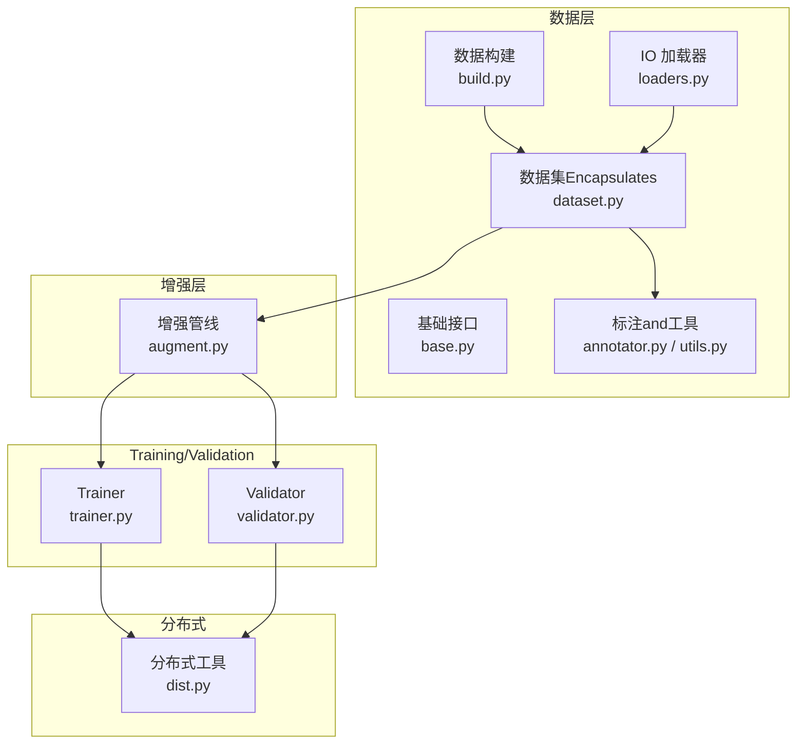
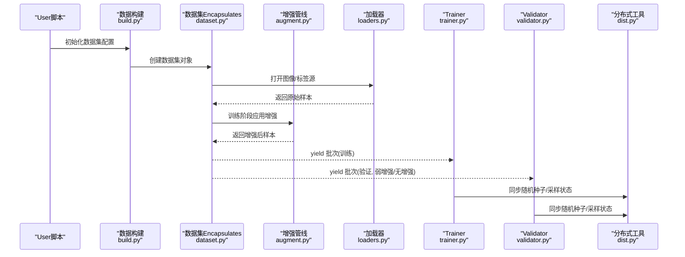
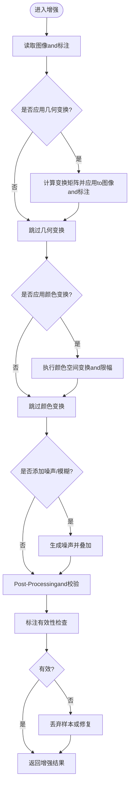
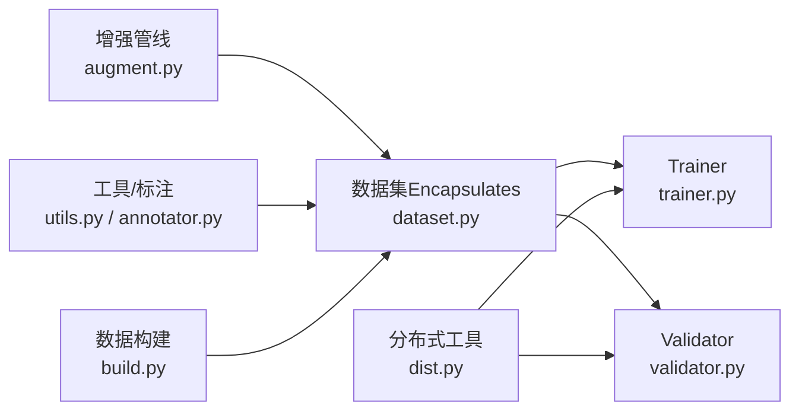

# Data Augmentation扩展

<cite>
**Files Referenced in This Document**
- [ultralytics/data/augment.py](file://ultralytics/data/augment.py)
- [ultralytics/data/dataset.py](file://ultralytics/data/dataset.py)
- [ultralytics/data/build.py](file://ultralytics/data/build.py)
- [ultralytics/data/base.py](file://ultralytics/data/base.py)
- [ultralytics/data/annotator.py](file://ultralytics/data/annotator.py)
- [ultralytics/data/utils.py](file://ultralytics/data/utils.py)
- [ultralytics/data/loaders.py](file://ultralytics/data/loaders.py)
- [ultralytics/engine/trainer.py](file://ultralytics/engine/trainer.py)
- [ultralytics/engine/validator.py](file://ultralytics/engine/validator.py)
- [ultralytics/utils/dist.py](file://ultralytics/utils/dist.py)
- [scripts/coco2017.yaml](file://scripts/coco2017.yaml)
- [scripts/VOC_sub.yaml](file://scripts/VOC_sub.yaml)
- [scripts/convert_voc.py](file://scripts/convert_voc.py)
- [docs/en/guides/yolo-data-augmentation.md](file://docs/en/guides/yolo-data-augmentation.md)
</cite>

## Table of Contents
1. [Introduction](#Introduction)
2. [Project Structure](#Project Structure)
3. [Core Components](#Core Components)
4. [Architecture Overview](#Architecture Overview)
5. [Detailed Component Analysis](#Detailed Component Analysis)
6. [Dependency Analysis](#Dependency Analysis)
7. [Performance Considerations](#Performance Considerations)
8. [Troubleshooting Guide](#Troubleshooting Guide)
9. [Conclusion](#Conclusion)
10. [Appendix](#Appendix)

## Introduction
本指南targeting希望扩展 YOLO Data Augmentation的开发者，覆盖Centered on下目标：
- implementing新的图像增强算法（几何变换、颜色空间变换、噪声添加）
- 扩展Data Pipeline（预处理andPost-Processing集成）
- 批量Data processing最佳实践（Training效率）
- 数据Validationand质量检查方法
- 自定义数据集格式Supporting（COCO、PASCAL VOC etc.转换）
- VisualizationandEvaluation增强效果
- Distributed Training中的数据同步策略

## Project Structure
本项目将Data Loading、增强、校验andTraining/Validation流程解耦，关键路径such as下：
- 数据构建and流水线：负责从磁盘读取样本、应用增强、批量化and多进程加载
- 增强Modules：provides几何、颜色、噪声etc.增强算子，并Supporting组合and概率控制
- 标注and工具：统一标注格式、坐标归一化、Visualization工具
- Training/Validation引擎：whileTraining时启用增强，whileValidation时关闭或弱增强Centered on保证评测一致性
- 分布式通信：while多卡环境下保证数据采样and随机种子的一致性

Figure Source
- [ultralytics/data/build.py](file://ultralytics/data/build.py)
- [ultralytics/data/dataset.py](file://ultralytics/data/dataset.py)
- [ultralytics/data/base.py](file://ultralytics/data/base.py)
- [ultralytics/data/annotator.py](file://ultralytics/data/annotator.py)
- [ultralytics/data/utils.py](file://ultralytics/data/utils.py)
- [ultralytics/data/loaders.py](file://ultralytics/data/loaders.py)
- [ultralytics/data/augment.py](file://ultralytics/data/augment.py)
- [ultralytics/engine/trainer.py](file://ultralytics/engine/trainer.py)
- [ultralytics/engine/validator.py](file://ultralytics/engine/validator.py)
- [ultralytics/utils/dist.py](file://ultralytics/utils/dist.py)

Section Source
- [ultralytics/data/build.py](file://ultralytics/data/build.py)
- [ultralytics/data/dataset.py](file://ultralytics/data/dataset.py)
- [ultralytics/data/augment.py](file://ultralytics/data/augment.py)
- [ultralytics/engine/trainer.py](file://ultralytics/engine/trainer.py)
- [ultralytics/engine/validator.py](file://ultralytics/engine/validator.py)
- [ultralytics/utils/dist.py](file://ultralytics/utils/dist.py)

## Core Components
- 数据构建and加载
  - 负责解析数据集配置、创建 DataLoader、设置多进程and缓存策略
  - 典型入口位于数据构建and数据集Encapsulates文件中
- 增强管线
  - 集中implementing各类增强算子and组合逻辑，Supporting概率、强度、顺序控制
  - whileTraining阶段被Calls，whileValidation阶段通常禁用或降级
- 标注and工具
  - provides统一的标注读写、坐标归一化、边界框/掩码/关键点处理
  - provides绘图andExport工具用于Visualization
- Training/Validation引擎
  - Trainerwhile迭代中拉取增强后的批次；ValidatorUses稳定输入Centered on保障Metrics可比性
- 分布式工具
  - provides进程间通信、随机种子同步、采样均衡etc.capabilities

Section Source
- [ultralytics/data/build.py](file://ultralytics/data/build.py)
- [ultralytics/data/dataset.py](file://ultralytics/data/dataset.py)
- [ultralytics/data/augment.py](file://ultralytics/data/augment.py)
- [ultralytics/data/annotator.py](file://ultralytics/data/annotator.py)
- [ultralytics/data/utils.py](file://ultralytics/data/utils.py)
- [ultralytics/engine/trainer.py](file://ultralytics/engine/trainer.py)
- [ultralytics/engine/validator.py](file://ultralytics/engine/validator.py)

## Architecture Overview
下图展示了从配置toTraining/Validation的端to端数据流，Centered onand增强while其中的位置。

Figure Source
- [ultralytics/data/build.py](file://ultralytics/data/build.py)
- [ultralytics/data/dataset.py](file://ultralytics/data/dataset.py)
- [ultralytics/data/augment.py](file://ultralytics/data/augment.py)
- [ultralytics/data/loaders.py](file://ultralytics/data/loaders.py)
- [ultralytics/engine/trainer.py](file://ultralytics/engine/trainer.py)
- [ultralytics/engine/validator.py](file://ultralytics/engine/validator.py)
- [ultralytics/utils/dist.py](file://ultralytics/utils/dist.py)

## Detailed Component Analysis

### 增强管线设计and扩展点
- 设计要点
  - Modules化：每个增强for独立单元，可自由组合
  - 参数化：Via配置控制概率、强度、范围
  - 类型安全：对图像、边界框、掩码、关键点进行一致变换
  - 可插拔：新增增强只需注册to管线，无需改动核心
- 扩展步骤
  - while增强Modules中定义新增强类，遵循统一的输入输出契约
  - while组合器中按概率and顺序接入
  - whileTraining Configuration中启用该增强，并whileValidation配置中谨慎Uses
- 建议
  - 保持计算开销可控，避免whileValidation阶段引入强随机性
  - 对数值稳定性敏感的操作（such as色彩空间转换）需做边界保护

Section Source
- [ultralytics/data/augment.py](file://ultralytics/data/augment.py)
- [docs/en/guides/yolo-data-augmentation.md](file://docs/en/guides/yolo-data-augmentation.md)

#### 几何变换（Examples：仿射、透视、裁剪、翻转）
- 关注点
  - 坐标系统：像素坐标and归一化坐标的映射
  - 边界框/掩码/关键点的一致性更新
  - 边缘填充and越界处理
- implementing建议
  - 先计算变换矩阵，再批量应用to图像and标注
  - 对极小目标进行阈值过滤，避免无效标注
  - Uses向量化操作提升吞吐

Section Source
- [ultralytics/data/augment.py](file://ultralytics/data/augment.py)
- [ultralytics/data/utils.py](file://ultralytics/data/utils.py)

#### 颜色空间变换（Examples：HSV/HSL 调整、对比度/亮度/饱和度）
- 关注点
  - 通道顺序and数据类型
  - 值域截断and溢出保护
  - and后续归一化的衔接
- implementing建议
  - while浮点域进行变换，最后再转回 uint8
  - 对极端参数做限幅，防止过曝/欠曝

Section Source
- [ultralytics/data/augment.py](file://ultralytics/data/augment.py)
- [ultralytics/data/utils.py](file://ultralytics/data/utils.py)

#### 噪声添加（Examples：高斯噪声、椒盐噪声、模糊）
- 关注点
  - 噪声强度andTasks相关性（检测/分割/姿态）
  - 标注不变性and有效性
- implementing建议
  - 仅whileTraining阶段启用，并provides强度扫描脚本
  - 对极小目标慎用强噪声

Section Source
- [ultralytics/data/augment.py](file://ultralytics/data/augment.py)

#### 增强流程图（通用）

Figure Source
- [ultralytics/data/augment.py](file://ultralytics/data/augment.py)
- [ultralytics/data/utils.py](file://ultralytics/data/utils.py)

### Data Pipeline扩展机制（预处理andPost-Processing）
- 预处理
  - 解码图像、缩放、裁剪、归一化、通道重排
  - 标注解析and坐标归一化
- Post-Processing
  - 标注清洗、去重、无效框过滤
  - 统计信息收集（尺寸分布、类别平衡）
- 集成方式
  - while数据集Encapsulates中插入预处理钩子
  - while增强管线前后插入校验andLogging
  - while DataLoader 层启用多进程and缓存

Section Source
- [ultralytics/data/dataset.py](file://ultralytics/data/dataset.py)
- [ultralytics/data/build.py](file://ultralytics/data/build.py)
- [ultralytics/data/loaders.py](file://ultralytics/data/loaders.py)
- [ultralytics/data/annotator.py](file://ultralytics/data/annotator.py)
- [ultralytics/data/utils.py](file://ultralytics/data/utils.py)

### 批量Data processing最佳实践
- 多进程and缓存
  - Set appropriately workers 数量，避免 IO bottlenecks
  - 开启索引缓存减少重复解析
- 内存and显存
  - 动态批大小and自动批大小策略
  - 预分配缓冲区，减少频繁分配
- 数据打乱and采样
  - 全局打乱and分层采样（类别/尺度）
  - 分布式下确保每进程独立随机序列

Section Source
- [ultralytics/data/build.py](file://ultralytics/data/build.py)
- [ultralytics/data/loaders.py](file://ultralytics/data/loaders.py)
- [ultralytics/utils/dist.py](file://ultralytics/utils/dist.py)

### 数据Validationand质量检查
- 维度and类型检查
  - 图像形状、通道数、数据类型
  - 标注格式、坐标范围、类别 ID 合法性
- 一致性检查
  - 边界框面积/宽高比阈值
  - 掩码and框的对齐度
- Visualization抽检
  - 随机抽样绘制图像and标注，人工复核
- 自动化回归
  - while CI 中运行轻量级校验脚本

Section Source
- [ultralytics/data/annotator.py](file://ultralytics/data/annotator.py)
- [ultralytics/data/utils.py](file://ultralytics/data/utils.py)

### 自定义数据集格式Supporting（COCO、PASCAL VOC）
- COCO
  - 配置文件ExamplesRefer to scripts 下的 YAML
  - 字段包括 images、annotations、categories
- PASCAL VOC
  - provides转换脚本将 VOC 转for YOLO 格式
  - 注意类别映射and路径约定
- 转换流程
  - 解析源格式 -> 统一标注 -> 写入目标Table of Contents -> 生成数据集 YAML

Section Source
- [scripts/coco2017.yaml](file://scripts/coco2017.yaml)
- [scripts/VOC_sub.yaml](file://scripts/VOC_sub.yaml)
- [scripts/convert_voc.py](file://scripts/convert_voc.py)

### Data Augmentation效果的VisualizationandEvaluation
- Visualization
  - 随机抽取若干样本，绘制增强前后对比图
  - 针对边界框、掩码、关键点分别展示
- Evaluation
  - 离线统计：尺寸分布、类别频率、目标密度
  - while线Metrics：Training收敛曲线、mAP 变化（谨慎解读，受多种因素影响）
- 工具链
  - UsesBuilt-in绘图工具或第三方库生成报告

Section Source
- [ultralytics/data/annotator.py](file://ultralytics/data/annotator.py)
- [docs/en/guides/yolo-data-augmentation.md](file://docs/en/guides/yolo-data-augmentation.md)

### Distributed Training中的数据同步策略
- 随机种子同步
  - 所有进程设置相同种子，保证可复现
- 采样均衡
  - 基于全局数据集长度划分样本区间，避免重复或缺失
- 进度andLogging
  - 仅主进程写Logging，其他进程静默
- 通信
  - Uses分布式工具进行必要的状态广播

Section Source
- [ultralytics/utils/dist.py](file://ultralytics/utils/dist.py)
- [ultralytics/engine/trainer.py](file://ultralytics/engine/trainer.py)
- [ultralytics/engine/validator.py](file://ultralytics/engine/validator.py)

## Dependency Analysis
- 组件耦合
  - 数据集Encapsulates依赖增强管线and标注工具
  - Training/Validation引擎依赖数据构建and分布式工具
- External Dependencies
  - 图像处理库（such as OpenCV）、张量框架（PyTorch）
- Potential Cycles
  - 严格分层，避免增强Modules反向依赖Trainer

Figure Source
- [ultralytics/data/augment.py](file://ultralytics/data/augment.py)
- [ultralytics/data/dataset.py](file://ultralytics/data/dataset.py)
- [ultralytics/data/utils.py](file://ultralytics/data/utils.py)
- [ultralytics/data/annotator.py](file://ultralytics/data/annotator.py)
- [ultralytics/data/build.py](file://ultralytics/data/build.py)
- [ultralytics/engine/trainer.py](file://ultralytics/engine/trainer.py)
- [ultralytics/engine/validator.py](file://ultralytics/engine/validator.py)
- [ultralytics/utils/dist.py](file://ultralytics/utils/dist.py)

## Performance Considerations
- IO Optimization
  - 多进程加载、索引缓存、预取队列
- 计算Optimization
  - 向量化增强、避免 Python 循环热点
  - while GPU 上执行部分增强（若框架Supporting）
- 内存管理
  - 复用缓冲区、限制缓存规模
- 批大小调优
  - 根据显存and IO capabilities选择合适批大小

[This section provides general guidance and does not directly analyze specific files]

## Troubleshooting Guide
- 常见问题
  - 标注越界或for空：检查坐标归一化and裁剪逻辑
  - 颜色异常：检查通道顺序and值域截断
  - 多进程崩溃：降低 workers 或关闭缓存定位问题
  - 分布式不一致：确认种子同步and采样区间划分
- 诊断手段
  - 打印中间统计（图像尺寸、标注数量）
  - 保存失败样本andLogging
  - 逐步禁用增强定位问题

Section Source
- [ultralytics/data/augment.py](file://ultralytics/data/augment.py)
- [ultralytics/data/utils.py](file://ultralytics/data/utils.py)
- [ultralytics/data/build.py](file://ultralytics/data/build.py)
- [ultralytics/utils/dist.py](file://ultralytics/utils/dist.py)

## Conclusion
ViaModules化增强管线、严谨的Data Pipelineand分布式策略，可while保证Training效率灵活扩展新的增强算法。建议while开发过程中Combined withVisualizationand自动化校验，确保增强效果and数据质量的可控and可复现。

[本节for总结，不直接分析具体文件]

## Appendix
- 快速上手
  - Refer toDocumentation中的增强指南，了解现有增强项and配置方式
- Refer to配置
  - COCO and VOC 的配置and转换脚本位于 scripts Table of Contents

Section Source
- [docs/en/guides/yolo-data-augmentation.md](file://docs/en/guides/yolo-data-augmentation.md)
- [scripts/coco2017.yaml](file://scripts/coco2017.yaml)
- [scripts/VOC_sub.yaml](file://scripts/VOC_sub.yaml)
- [scripts/convert_voc.py](file://scripts/convert_voc.py)