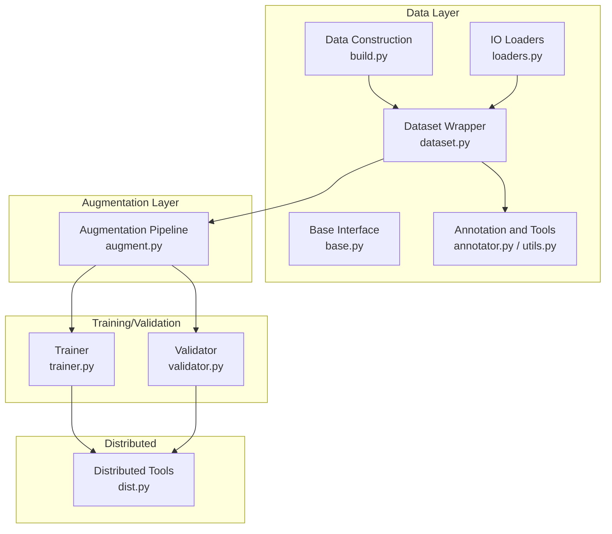
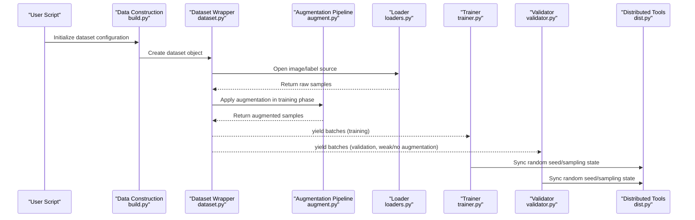
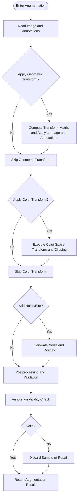
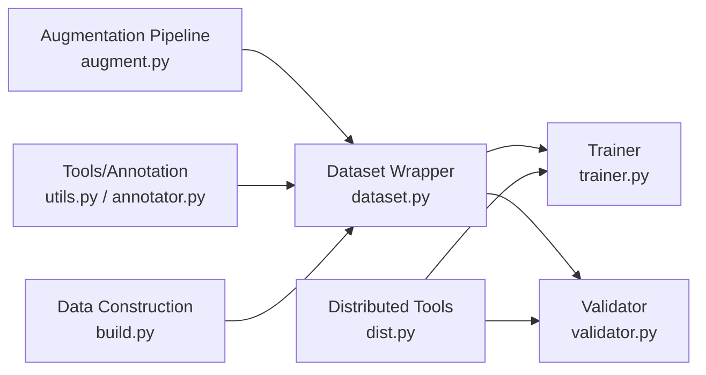

# Data Augmentation Extensions

<cite>
**Files referenced in this document**
- [ultralytics/data/augment.py](file://ultralytics/data/augment.py)
- [ultralytics/data/dataset.py](file://ultralytics/data/dataset.py)
- [ultralytics/data/build.py](file://ultralytics/data/build.py)
- [ultralytics/data/base.py](file://ultralytics/data/base.py)
- [ultralytics/data/annotator.py](file://ultralytics/data/annotator.py)
- [ultralytics/data/utils.py](file://ultralytics/data/utils.py)
- [ultralytics/data/loaders.py](file://ultralytics/data/loaders.py)
- [ultralytics/engine/trainer.py](file://ultralytics/engine/trainer.py)
- [ultralytics/engine/validator.py](file://ultralytics/engine/validator.py)
- [ultralytics/utils/dist.py](file://ultralytics/utils/dist.py)
- [scripts/coco2017.yaml](file://scripts/coco2017.yaml)
- [scripts/VOC_sub.yaml](file://scripts/VOC_sub.yaml)
- [scripts/convert_voc.py](file://scripts/convert_voc.py)
- [docs/en/guides/yolo-data-augmentation.md](file://docs/en/guides/yolo-data-augmentation.md)
</cite>

## Table of Contents
1. [Introduction](#introduction)
2. [Project Structure](#project-structure)
3. [Core Components](#core-components)
4. [Architecture Overview](#architecture-overview)
5. [Detailed Component Analysis](#detailed-component-analysis)
6. [Dependency Analysis](#dependency-analysis)
7. [Performance Considerations](#performance-considerations)
8. [Troubleshooting Guide](#troubleshooting-guide)
9. [Conclusion](#conclusion)
10. [Appendix](#appendix)

## Introduction
This guide is intended for developers who wish to extend YOLO data augmentation, covering the following objectives:
- Implementing new image augmentation algorithms (geometric transforms, color space transforms, noise addition)
- Extending data pipelines (preprocessing and postprocessing integration)
- Batch data processing best practices (training efficiency)
- Data validation and quality checking methods
- Custom dataset format support (COCO, PASCAL VOC, etc. conversion)
- Visualization and evaluation of augmentation effects
- Data synchronization strategies in distributed training

## Project Structure
This project decouples data loading, augmentation, validation, and training/validation flows. Key paths are as follows:
- Data construction and pipeline: Responsible for reading samples from disk, applying augmentation, batching, and multi-process loading
- Augmentation module: Provides geometric, color, noise and other augmentation operators with composition and probability control support
- Annotation and tools: Unified annotation format, coordinate normalization, visualization tools
- Training/validation engine: Enables augmentation during training, disables or uses weak augmentation during validation to ensure evaluation consistency
- Distributed communication: Ensures data sampling and random seed consistency in multi-GPU environments

Diagram sources
- [ultralytics/data/build.py](file://ultralytics/data/build.py)
- [ultralytics/data/dataset.py](file://ultralytics/data/dataset.py)
- [ultralytics/data/base.py](file://ultralytics/data/base.py)
- [ultralytics/data/annotator.py](file://ultralytics/data/annotator.py)
- [ultralytics/data/utils.py](file://ultralytics/data/utils.py)
- [ultralytics/data/loaders.py](file://ultralytics/data/loaders.py)
- [ultralytics/data/augment.py](file://ultralytics/data/augment.py)
- [ultralytics/engine/trainer.py](file://ultralytics/engine/trainer.py)
- [ultralytics/engine/validator.py](file://ultralytics/engine/validator.py)
- [ultralytics/utils/dist.py](file://ultralytics/utils/dist.py)

Section sources
- [ultralytics/data/build.py](file://ultralytics/data/build.py)
- [ultralytics/data/dataset.py](file://ultralytics/data/dataset.py)
- [ultralytics/data/augment.py](file://ultralytics/data/augment.py)
- [ultralytics/engine/trainer.py](file://ultralytics/engine/trainer.py)
- [ultralytics/engine/validator.py](file://ultralytics/engine/validator.py)
- [ultralytics/utils/dist.py](file://ultralytics/utils/dist.py)

## Core Components
- Data Construction and Loading
  - Responsible for parsing dataset configuration, creating DataLoader, setting multi-process and caching strategies
  - Typical entry points are in data construction and dataset wrapper files
- Augmentation Pipeline
  - Centrally implements various augmentation operators and composition logic, supporting probability, intensity, and order control
  - Called during training phase, typically disabled or degraded during validation phase
- Annotation and Tools
  - Provides unified annotation read/write, coordinate normalization, bounding box/mask/keypoint handling
  - Provides drawing and export tools for visualization
- Training/Validation Engine
  - Trainer pulls augmented batches during iteration; validator uses stable input to ensure metric comparability
- Distributed Tools
  - Provides inter-process communication, random seed synchronization, sampling balancing capabilities

Section sources
- [ultralytics/data/build.py](file://ultralytics/data/build.py)
- [ultralytics/data/dataset.py](file://ultralytics/data/dataset.py)
- [ultralytics/data/augment.py](file://ultralytics/data/augment.py)
- [ultralytics/data/annotator.py](file://ultralytics/data/annotator.py)
- [ultralytics/data/utils.py](file://ultralytics/data/utils.py)
- [ultralytics/engine/trainer.py](file://ultralytics/engine/trainer.py)
- [ultralytics/engine/validator.py](file://ultralytics/engine/validator.py)

## Architecture Overview
The following diagram shows the end-to-end data flow from configuration to training/validation, and the position of augmentation within it.

Diagram sources
- [ultralytics/data/build.py](file://ultralytics/data/build.py)
- [ultralytics/data/dataset.py](file://ultralytics/data/dataset.py)
- [ultralytics/data/augment.py](file://ultralytics/data/augment.py)
- [ultralytics/data/loaders.py](file://ultralytics/data/loaders.py)
- [ultralytics/engine/trainer.py](file://ultralytics/engine/trainer.py)
- [ultralytics/engine/validator.py](file://ultralytics/engine/validator.py)
- [ultralytics/utils/dist.py](file://ultralytics/utils/dist.py)

## Detailed Component Analysis

### Augmentation Pipeline Design and Extension Points
- Design key points
  - Modular: Each augmentation is an independent unit, freely composable
  - Parameterized: Control probability, intensity, range via configuration
  - Type-safe: Consistent transforms for images, bounding boxes, masks, keypoints
  - Pluggable: New augmentations only need registration in pipeline, no core changes required
- Extension steps
  - Define new augmentation class in augmentation module, following unified input/output contract
  - Connect in composer by probability and order
  - Enable augmentation in training configuration, use cautiously in validation configuration
- Recommendations
  - Keep computational overhead controllable, avoid introducing strong randomness in validation phase
  - Operations sensitive to numerical stability (e.g., color space conversion) need boundary protection

Section sources
- [ultralytics/data/augment.py](file://ultralytics/data/augment.py)
- [docs/en/guides/yolo-data-augmentation.md](file://docs/en/guides/yolo-data-augmentation.md)

#### Geometric Transforms (Examples: Affine, Perspective, Crop, Flip)
- Focus areas
  - Coordinate systems: Mapping between pixel coordinates and normalized coordinates
  - Consistent updates for bounding boxes/masks/keypoints
  - Edge padding and out-of-bounds handling
- Implementation recommendations
  - Compute transform matrix first, then batch apply to images and annotations
  - Threshold filter extremely small targets to avoid invalid annotations
  - Use vectorized operations to improve throughput

Section sources
- [ultralytics/data/augment.py](file://ultralytics/data/augment.py)
- [ultralytics/data/utils.py](file://ultralytics/data/utils.py)

#### Color Space Transforms (Examples: HSV/HSL Adjustment, Contrast/Brightness/Saturation)
- Focus areas
  - Channel order and data types
  - Value range clipping and overflow protection
  - Connection with subsequent normalization
- Implementation recommendations
  - Perform transforms in floating-point domain, convert back to uint8 at the end
  - Clamp extreme parameters to prevent overexposure/underexposure

Section sources
- [ultralytics/data/augment.py](file://ultralytics/data/augment.py)
- [ultralytics/data/utils.py](file://ultralytics/data/utils.py)

#### Noise Addition (Examples: Gaussian Noise, Salt-and-Pepper Noise, Blur)
- Focus areas
  - Noise intensity and task relevance (detection/segmentation/pose)
  - Annotation invariance and validity
- Implementation recommendations
  - Enable only in training phase, provide intensity sweep scripts
  - Use strong noise cautiously for extremely small targets

Section sources
- [ultralytics/data/augment.py](file://ultralytics/data/augment.py)

#### Augmentation Flowchart (General)

Diagram sources
- [ultralytics/data/augment.py](file://ultralytics/data/augment.py)
- [ultralytics/data/utils.py](file://ultralytics/data/utils.py)

### Data Pipeline Extension Mechanism (Preprocessing and Postprocessing)
- Preprocessing
  - Decode images, resize, crop, normalize, channel reorder
  - Annotation parsing and coordinate normalization
- Postprocessing
  - Annotation cleaning, deduplication, invalid box filtering
  - Statistics collection (size distribution, class balance)
- Integration methods
  - Insert preprocessing hooks in dataset wrapper
  - Insert validation and logging before/after augmentation pipeline
  - Enable multi-process and caching at DataLoader layer

Section sources
- [ultralytics/data/dataset.py](file://ultralytics/data/dataset.py)
- [ultralytics/data/build.py](file://ultralytics/data/build.py)
- [ultralytics/data/loaders.py](file://ultralytics/data/loaders.py)
- [ultralytics/data/annotator.py](file://ultralytics/data/annotator.py)
- [ultralytics/data/utils.py](file://ultralytics/data/utils.py)

### Batch Data Processing Best Practices
- Multi-process and caching
  - Properly set workers count to avoid IO bottlenecks
  - Enable index caching to reduce repeated parsing
- Memory and VRAM
  - Dynamic batch size and auto batch size strategies
  - Pre-allocate buffers to reduce frequent allocation
- Data shuffling and sampling
  - Global shuffling and stratified sampling (class/scale)
  - Ensure independent random sequences per process in distributed settings

Section sources
- [ultralytics/data/build.py](file://ultralytics/data/build.py)
- [ultralytics/data/loaders.py](file://ultralytics/data/loaders.py)
- [ultralytics/utils/dist.py](file://ultralytics/utils/dist.py)

### Data Validation and Quality Checking
- Dimension and type checking
  - Image shape, channel count, data type
  - Annotation format, coordinate range, class ID validity
- Consistency checking
  - Bounding box area/aspect ratio thresholds
  - Mask and box alignment
- Visual spot checking
  - Random sample drawing of images and annotations for manual review
- Automated regression
  - Run lightweight validation scripts in CI

Section sources
- [ultralytics/data/annotator.py](file://ultralytics/data/annotator.py)
- [ultralytics/data/utils.py](file://ultralytics/data/utils.py)

### Custom Dataset Format Support (COCO, PASCAL VOC)
- COCO
  - Configuration file examples reference YAML under scripts
  - Fields include images, annotations, categories
- PASCAL VOC
  - Provide conversion scripts to convert VOC to YOLO format
  - Note class mapping and path conventions
- Conversion flow
  - Parse source format -> unify annotations -> write to target directory -> generate dataset YAML

Section sources
- [scripts/coco2017.yaml](file://scripts/coco2017.yaml)
- [scripts/VOC_sub.yaml](file://scripts/VOC_sub.yaml)
- [scripts/convert_voc.py](file://scripts/convert_voc.py)

### Visualization and Evaluation of Data Augmentation Effects
- Visualization
  - Randomly select samples, draw before/after augmentation comparison images
  - Display separately for bounding boxes, masks, keypoints
- Evaluation
  - Offline statistics: size distribution, class frequency, target density
  - Online metrics: training convergence curves, mAP changes (interpret cautiously, affected by multiple factors)
- Toolchain
  - Use built-in drawing tools or third-party libraries to generate reports

Section sources
- [ultralytics/data/annotator.py](file://ultralytics/data/annotator.py)
- [docs/en/guides/yolo-data-augmentation.md](file://docs/en/guides/yolo-data-augmentation.md)

### Data Synchronization Strategies in Distributed Training
- Random seed synchronization
  - Set same seed for all processes to ensure reproducibility
- Sampling balancing
  - Divide sample ranges based on global dataset length to avoid duplication or missing
- Progress and logging
  - Only main process writes logs, other processes silent
- Communication
  - Use distributed tools for necessary state broadcasts

Section sources
- [ultralytics/utils/dist.py](file://ultralytics/utils/dist.py)
- [ultralytics/engine/trainer.py](file://ultralytics/engine/trainer.py)
- [ultralytics/engine/validator.py](file://ultralytics/engine/validator.py)

## Dependency Analysis
- Component coupling
  - Dataset wrapper depends on augmentation pipeline and annotation tools
  - Training/validation engine depends on data construction and distributed tools
- External dependencies
  - Image processing libraries (e.g., OpenCV), tensor frameworks (PyTorch)
- Potential cycles
  - Strict layering, avoid augmentation module reverse-depending on trainer

Diagram sources
- [ultralytics/data/augment.py](file://ultralytics/data/augment.py)
- [ultralytics/data/dataset.py](file://ultralytics/data/dataset.py)
- [ultralytics/data/utils.py](file://ultralytics/data/utils.py)
- [ultralytics/data/annotator.py](file://ultralytics/data/annotator.py)
- [ultralytics/data/build.py](file://ultralytics/data/build.py)
- [ultralytics/engine/trainer.py](file://ultralytics/engine/trainer.py)
- [ultralytics/engine/validator.py](file://ultralytics/engine/validator.py)
- [ultralytics/utils/dist.py](file://ultralytics/utils/dist.py)

## Performance Considerations
- IO optimization
  - Multi-process loading, index caching, prefetch queues
- Computation optimization
  - Vectorized augmentation, avoid Python loop hotspots
  - Execute some augmentations on GPU (if framework supports)
- Memory management
  - Reuse buffers, limit cache size
- Batch size tuning
  - Select appropriate batch size based on VRAM and IO capability

[This section provides general guidance and does not directly analyze specific files]

## Troubleshooting Guide
- Common issues
  - Annotations out of bounds or empty: Check coordinate normalization and cropping logic
  - Color anomalies: Check channel order and value range clipping
  - Multi-process crashes: Reduce workers or disable caching to locate issue
  - Distributed inconsistency: Confirm seed synchronization and sampling range division
- Diagnostic methods
  - Print intermediate statistics (image size, annotation count)
  - Save failed samples and logs
  - Progressively disable augmentations to locate issue

Section sources
- [ultralytics/data/augment.py](file://ultralytics/data/augment.py)
- [ultralytics/data/utils.py](file://ultralytics/data/utils.py)
- [ultralytics/data/build.py](file://ultralytics/data/build.py)
- [ultralytics/utils/dist.py](file://ultralytics/utils/dist.py)

## Conclusion
Through modular augmentation pipeline, rigorous data pipeline, and distributed strategies, new augmentation algorithms can be flexibly extended while ensuring training efficiency. It is recommended to combine visualization and automated validation during development to ensure augmentation effects and data quality are controllable and reproducible.

[This section is a summary and does not directly analyze specific files]

## Appendix
- Quick start
  - Refer to augmentation guide in documentation to understand existing augmentation items and configuration methods
- Reference configuration
  - COCO and VOC configuration and conversion scripts are located in scripts directory

Section sources
- [docs/en/guides/yolo-data-augmentation.md](file://docs/en/guides/yolo-data-augmentation.md)
- [scripts/coco2017.yaml](file://scripts/coco2017.yaml)
- [scripts/VOC_sub.yaml](file://scripts/VOC_sub.yaml)
- [scripts/convert_voc.py](file://scripts/convert_voc.py)
