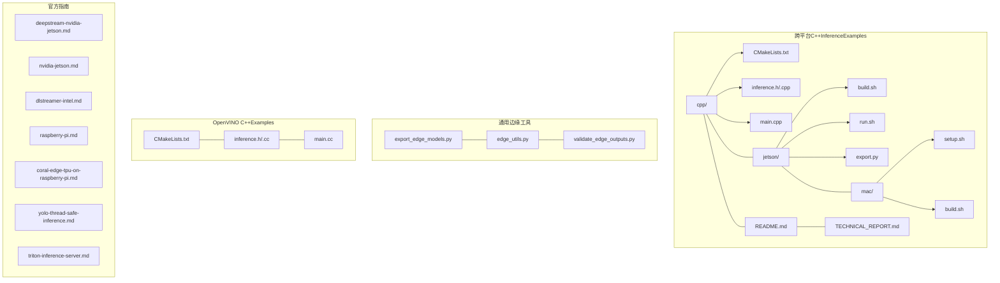
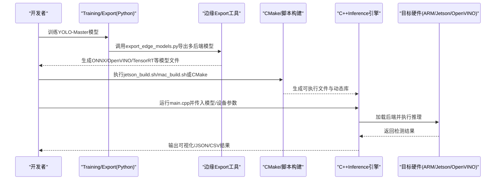
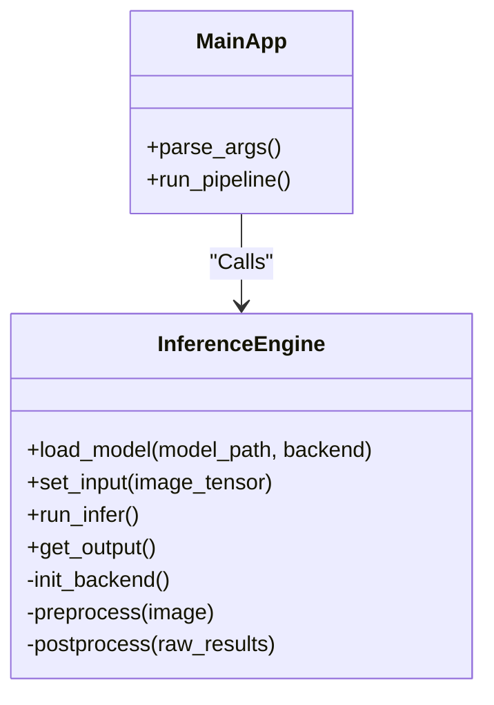
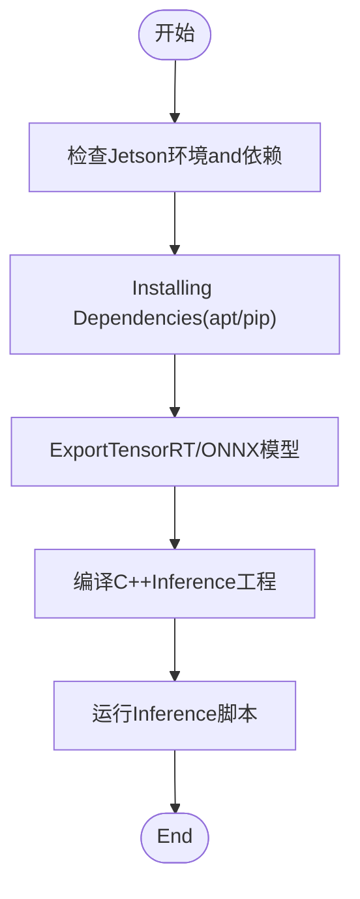
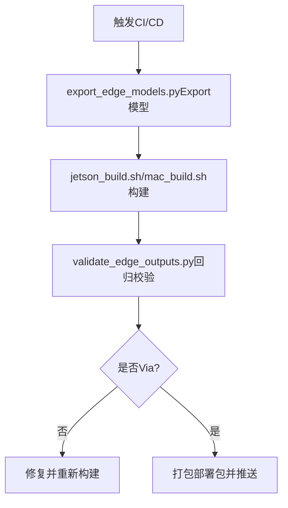

# Edge Device Deployment

<cite>
**Files Referenced in This Document**
- [README.md](file://examples/YOLO-Master-Cross-Platform-Edge-Deployment/README.md)
- [TECHNICAL_REPORT.md](file://examples/YOLO-Master-Cross-Platform-Edge-Deployment/TECHNICAL_REPORT.md)
- [CMakeLists.txt](file://examples/YOLO-Master-Cross-Platform-Edge-Deployment/cpp/CMakeLists.txt)
- [inference.h](file://examples/YOLO-Master-Cross-Platform-Edge-Deployment/cpp/inference.h)
- [inference.cpp](file://examples/YOLO-Master-Cross-Platform-Edge-Deployment/cpp/inference.cpp)
- [main.cpp](file://examples/YOLO-Master-Cross-Platform-Edge-Deployment/cpp/main.cpp)
- [jetson_build.sh](file://examples/YOLO-Master-Cross-Platform-Edge-Deployment/jetson/build.sh)
- [jetson_run.sh](file://examples/YOLO-Master-Cross-Platform-Edge-Deployment/jetson/run.sh)
- [jetson_export.py](file://examples/YOLO-Master-Cross-Platform-Edge-Deployment/jetson/export.py)
- [mac_setup.sh](file://examples/YOLO-Master-Cross-Platform-Edge-Deployment/mac/setup.sh)
- [mac_build.sh](file://examples/YOLO-Master-Cross-Platform-Edge-Deployment/mac/build.sh)
- [export_edge_models.py](file://examples/YOLO-Master-Edge-Deployment/export_edge_models.py)
- [edge_utils.py](file://examples/YOLO-Master-Edge-Deployment/edge_utils.py)
- [validate_edge_outputs.py](file://examples/YOLO-Master-Edge-Deployment/validate_edge_outputs.py)
- [CMakeLists.txt](file://examples/YOLOv8-OpenVINO-CPP-Inference/CMakeLists.txt)
- [inference.cc](file://examples/YOLOv8-OpenVINO-CPP-Inference/inference.cc)
- [inference.h](file://examples/YOLOv8-OpenVINO-CPP-Inference/inference.h)
- [main.cc](file://examples/YOLOv8-OpenVINO-CPP-Inference/main.cc)
- [deepstream-nvidia-jetson.md](file://docs/en/guides/deepstream-nvidia-jetson.md)
- [nvidia-jetson.md](file://docs/en/guides/nvidia-jetson.md)
- [dlstreamer-intel.md](file://docs/en/guides/dlstreamer-intel.md)
- [raspberry-pi.md](file://docs/en/guides/raspberry-pi.md)
- [coral-edge-tpu-on-raspberry-pi.md](file://docs/en/guides/coral-edge-tpu-on-raspberry-pi.md)
- [yolo-thread-safe-inference.md](file://docs/en/guides/yolo-thread-safe-inference.md)
- [triton-inference-server.md](file://docs/en/guides/triton-inference-server.md)
</cite>

## Table of Contents
1. [Introduction](#Introduction)
2. [Project Structure](#Project Structure)
3. [Core Components](#Core Components)
4. [Architecture Overview](#Architecture Overview)
5. [Detailed Component Analysis](#Detailed Component Analysis)
6. [依赖and构建分析](#依赖and构建分析)
7. [性能and内存Optimization](#性能and内存Optimization)
8. [部署脚本and自动化流程](#部署脚本and自动化流程)
9. [基准测试and回归Validation](#基准测试and回归Validation)
10. [故障诊断andLogging收集](#故障诊断andLogging收集)
11. [常见问题and调试技巧](#常见问题and调试技巧)
12. [Conclusion](#Conclusion)

## Introduction
本技术DocumentationtargetingYOLO-Masterwhile边缘设备的C++Inference引擎部署，覆盖跨平台编译、依赖管理、ARM/NVIDIA Jetson/Intel OpenVINOetc.硬件适配方案，Centered onand批处理、缓存策略、异步Inference、资源约束调优、自动化构建and部署脚本、性能基准and回归Validation、故障诊断andLogging收集方法。DocumentationCentered on仓库中provides的Examples工程and指南for依据，确保可复现and可落地。

## Project Structure
仓库中andEdge Deployment相关的核心内容主要分布whileCentered on下位置：
- 跨平台C++InferenceExamplesand说明：examples/YOLO-Master-Cross-Platform-Edge-Deployment
- 通用边缘Exportand校验工具：examples/YOLO-Master-Edge-Deployment
- OpenVINO C++InferenceExamples：examples/YOLOv8-OpenVINO-CPP-Inference
- 官方部署指南（Jetson、DeepStream、DLStreamer、树莓派、Edge TPUetc.）：docs/en/guides

Figure Source
- [CMakeLists.txt](file://examples/YOLO-Master-Cross-Platform-Edge-Deployment/cpp/CMakeLists.txt)
- [inference.h](file://examples/YOLO-Master-Cross-Platform-Edge-Deployment/cpp/inference.h)
- [inference.cpp](file://examples/YOLO-Master-Cross-Platform-Edge-Deployment/cpp/inference.cpp)
- [main.cpp](file://examples/YOLO-Master-Cross-Platform-Edge-Deployment/cpp/main.cpp)
- [jetson_build.sh](file://examples/YOLO-Master-Cross-Platform-Edge-Deployment/jetson/build.sh)
- [jetson_run.sh](file://examples/YOLO-Master-Cross-Platform-Edge-Deployment/jetson/run.sh)
- [jetson_export.py](file://examples/YOLO-Master-Cross-Platform-Edge-Deployment/jetson/export.py)
- [mac_setup.sh](file://examples/YOLO-Master-Cross-Platform-Edge-Deployment/mac/setup.sh)
- [mac_build.sh](file://examples/YOLO-Master-Cross-Platform-Edge-Deployment/mac/build.sh)
- [export_edge_models.py](file://examples/YOLO-Master-Edge-Deployment/export_edge_models.py)
- [edge_utils.py](file://examples/YOLO-Master-Edge-Deployment/edge_utils.py)
- [validate_edge_outputs.py](file://examples/YOLO-Master-Edge-Deployment/validate_edge_outputs.py)
- [CMakeLists.txt](file://examples/YOLOv8-OpenVINO-CPP-Inference/CMakeLists.txt)
- [inference.cc](file://examples/YOLOv8-OpenVINO-CPP-Inference/inference.cc)
- [inference.h](file://examples/YOLOv8-OpenVINO-CPP-Inference/inference.h)
- [main.cc](file://examples/YOLOv8-OpenVINO-CPP-Inference/main.cc)

Section Source
- [README.md](file://examples/YOLO-Master-Cross-Platform-Edge-Deployment/README.md)
- [TECHNICAL_REPORT.md](file://examples/YOLO-Master-Cross-Platform-Edge-Deployment/TECHNICAL_REPORT.md)

## Core Components
- 跨平台C++Inference引擎Encapsulates
  - provides统一的Inference接口，屏蔽后端差异（ONNX Runtime/OpenVINO/TensorRTetc.），Supporting模型加载、预处理、Inference、Post-ProcessingandVisualization输出。
  - 关键文件路径Refer to：[inference.h](file://examples/YOLO-Master-Cross-Platform-Edge-Deployment/cpp/inference.h)、[inference.cpp](file://examples/YOLO-Master-Cross-Platform-Edge-Deployment/cpp/inference.cpp)。
- 入口程序and参数解析
  - main.cpp负责命令行参数解析、Device Selection、模型路径配置、批量and线程控制etc.。
  - 关键文件路径Refer to：[main.cpp](file://examples/YOLO-Master-Cross-Platform-Edge-Deployment/cpp/main.cpp)。
- 构建系统
  - CMakeLists.txt定义跨平台编译选项、依赖库链接、目标产物命名and安装规则。
  - 关键文件路径Refer to：[CMakeLists.txt](file://examples/YOLO-Master-Cross-Platform-Edge-Deployment/cpp/CMakeLists.txt)。
- Jetson专用脚本
  - build.sh/run.sh用于Environment Preparation、依赖安装、交叉编译and运行；export.py用于生成JetsonOptimization的Model Format。
  - 关键文件路径Refer to：[jetson_build.sh](file://examples/YOLO-Master-Cross-Platform-Edge-Deployment/jetson/build.sh)、[jetson_run.sh](file://examples/YOLO-Master-Cross-Platform-Edge-Deployment/jetson/run.sh)、[jetson_export.py](file://examples/YOLO-Master-Cross-Platform-Edge-Deployment/jetson/export.py)。
- macOS专用脚本
  - setup.sh/build.sh用于Homebrew依赖安装and本地构建。
  - 关键文件路径Refer to：[mac_setup.sh](file://examples/YOLO-Master-Cross-Platform-Edge-Deployment/mac/setup.sh)、[mac_build.sh](file://examples/YOLO-Master-Cross-Platform-Edge-Deployment/mac/build.sh)。
- 通用边缘Exportand校验工具
  - export_edge_models.py：统一Export多后端模型（ONNX/OpenVINO/TensorRTetc.）。
  - edge_utils.py：数据预处理/Post-Processing、IOand路径管理etc.通用工具。
  - validate_edge_outputs.py：端to端结果一致性校验and回归基线对比。
  - 关键文件路径Refer to：[export_edge_models.py](file://examples/YOLO-Master-Edge-Deployment/export_edge_models.py)、[edge_utils.py](file://examples/YOLO-Master-Edge-Deployment/edge_utils.py)、[validate_edge_outputs.py](file://examples/YOLO-Master-Edge-Deployment/validate_edge_outputs.py)。
- OpenVINO C++InferenceExamples
  - providesOpenVINO后端的最小implementing，便于理解IR加载、会话创建、输入输出张量绑定and性能调优。
  - 关键文件路径Refer to：[CMakeLists.txt](file://examples/YOLOv8-OpenVINO-CPP-Inference/CMakeLists.txt)、[inference.cc](file://examples/YOLOv8-OpenVINO-CPP-Inference/inference.cc)、[inference.h](file://examples/YOLOv8-OpenVINO-CPP-Inference/inference.h)、[main.cc](file://examples/YOLOv8-OpenVINO-CPP-Inference/main.cc)。

Section Source
- [inference.h](file://examples/YOLO-Master-Cross-Platform-Edge-Deployment/cpp/inference.h)
- [inference.cpp](file://examples/YOLO-Master-Cross-Platform-Edge-Deployment/cpp/inference.cpp)
- [main.cpp](file://examples/YOLO-Master-Cross-Platform-Edge-Deployment/cpp/main.cpp)
- [CMakeLists.txt](file://examples/YOLO-Master-Cross-Platform-Edge-Deployment/cpp/CMakeLists.txt)
- [jetson_build.sh](file://examples/YOLO-Master-Cross-Platform-Edge-Deployment/jetson/build.sh)
- [jetson_run.sh](file://examples/YOLO-Master-Cross-Platform-Edge-Deployment/jetson/run.sh)
- [jetson_export.py](file://examples/YOLO-Master-Cross-Platform-Edge-Deployment/jetson/export.py)
- [mac_setup.sh](file://examples/YOLO-Master-Cross-Platform-Edge-Deployment/mac/setup.sh)
- [mac_build.sh](file://examples/YOLO-Master-Cross-Platform-Edge-Deployment/mac/build.sh)
- [export_edge_models.py](file://examples/YOLO-Master-Edge-Deployment/export_edge_models.py)
- [edge_utils.py](file://examples/YOLO-Master-Edge-Deployment/edge_utils.py)
- [validate_edge_outputs.py](file://examples/YOLO-Master-Edge-Deployment/validate_edge_outputs.py)
- [CMakeLists.txt](file://examples/YOLOv8-OpenVINO-CPP-Inference/CMakeLists.txt)
- [inference.cc](file://examples/YOLOv8-OpenVINO-CPP-Inference/inference.cc)
- [inference.h](file://examples/YOLOv8-OpenVINO-CPP-Inference/inference.h)
- [main.cc](file://examples/YOLOv8-OpenVINO-CPP-Inference/main.cc)

## Architecture Overview
下图展示了从PythonTrainingtoC++边缘Inference的端to端流程，包括Model Export、后端转换、构建and运行阶段。

Figure Source
- [export_edge_models.py](file://examples/YOLO-Master-Edge-Deployment/export_edge_models.py)
- [jetson_build.sh](file://examples/YOLO-Master-Cross-Platform-Edge-Deployment/jetson/build.sh)
- [mac_build.sh](file://examples/YOLO-Master-Cross-Platform-Edge-Deployment/mac/build.sh)
- [CMakeLists.txt](file://examples/YOLO-Master-Cross-Platform-Edge-Deployment/cpp/CMakeLists.txt)
- [main.cpp](file://examples/YOLO-Master-Cross-Platform-Edge-Deployment/cpp/main.cpp)

## Detailed Component Analysis

### 跨平台C++Inference引擎
- 设计要点
  - Unified Interface：对外暴露load_model、set_input、run_infer、get_outputetc.方法，内部根据目标后端初始化不同运行时。
  - 预处理/Post-Processing：图像缩放、归一化、NMS、类别映射etc.逻辑EncapsulateswhileinferenceModules中。
  - 错误处理：对模型加载失败、输入尺寸不匹配、后端不可用etc.情况进行明确报错and回退Tips。
- 复杂度and性能
  - 预处理通常forO(W×H×C)，Post-Processing受检测数量影响，NMS近似O(N^2)但可Via阈值and排序Optimization降低常数项。
  - 建议开启多线程并行预处理and异步InferenceCentered on提升吞吐。
- 依赖关系
  - ViaCMakeLists.txt链接OpenCV、后端SDK（such asOpenVINO、TensorRT）etc.。

Figure Source
- [inference.h](file://examples/YOLO-Master-Cross-Platform-Edge-Deployment/cpp/inference.h)
- [inference.cpp](file://examples/YOLO-Master-Cross-Platform-Edge-Deployment/cpp/inference.cpp)
- [main.cpp](file://examples/YOLO-Master-Cross-Platform-Edge-Deployment/cpp/main.cpp)

Section Source
- [inference.h](file://examples/YOLO-Master-Cross-Platform-Edge-Deployment/cpp/inference.h)
- [inference.cpp](file://examples/YOLO-Master-Cross-Platform-Edge-Deployment/cpp/inference.cpp)
- [main.cpp](file://examples/YOLO-Master-Cross-Platform-Edge-Deployment/cpp/main.cpp)

### Jetson适配and部署
- 构建and运行
  - jetson_build.sh负责Installing Dependencies、设置环境变量、编译C++工程。
  - jetson_run.sh用于启动Inference服务或单帧/视频流Inference。
- Model Export
  - jetson_export.py将PyTorch权重转换forTensorRT/ONNXetc.适合Jetson的格式。
- 注意事项
  - 需确认CUDA/cuDNN版本andTensorRT版本兼容。
  - 针对Jetson的功耗墙and热节流，Set appropriatelybatch sizeand分辨率。

Figure Source
- [jetson_build.sh](file://examples/YOLO-Master-Cross-Platform-Edge-Deployment/jetson/build.sh)
- [jetson_run.sh](file://examples/YOLO-Master-Cross-Platform-Edge-Deployment/jetson/run.sh)
- [jetson_export.py](file://examples/YOLO-Master-Cross-Platform-Edge-Deployment/jetson/export.py)

Section Source
- [jetson_build.sh](file://examples/YOLO-Master-Cross-Platform-Edge-Deployment/jetson/build.sh)
- [jetson_run.sh](file://examples/YOLO-Master-Cross-Platform-Edge-Deployment/jetson/run.sh)
- [jetson_export.py](file://examples/YOLO-Master-Cross-Platform-Edge-Deployment/jetson/export.py)

### macOS本地开发
- setup.sh用于安装OpenCV、CMake、编译器工具链etc.。
- build.sh基于CMake生成Xcode或命令行构建配置并编译。
- 适用于快速迭代and单元测试，不建议直接用于生产部署。

Section Source
- [mac_setup.sh](file://examples/YOLO-Master-Cross-Platform-Edge-Deployment/mac/setup.sh)
- [mac_build.sh](file://examples/YOLO-Master-Cross-Platform-Edge-Deployment/mac/build.sh)

### OpenVINO C++InferenceExamples
- 特点
  - UsesOpenVINO IR模型，SupportingCPU/GPU/iGPU/NPUetc.多设备。
  - provides最小化的Inference流程，便于集成to现有C++应用。
- Applicable Scenarios
  - Intel平台、x86服务器、嵌入式Linux上的轻量部署。

Section Source
- [CMakeLists.txt](file://examples/YOLOv8-OpenVINO-CPP-Inference/CMakeLists.txt)
- [inference.cc](file://examples/YOLOv8-OpenVINO-CPP-Inference/inference.cc)
- [inference.h](file://examples/YOLOv8-OpenVINO-CPP-Inference/inference.h)
- [main.cc](file://examples/YOLOv8-OpenVINO-CPP-Inference/main.cc)

## 依赖and构建分析
- CMake构建系统
  - ViaCMakeLists.txt统一管理源文件、头文件、第三方库and后端SDK。
  - Supporting条件编译（例such as启用/禁用OpenVINO或TensorRT后端）。
- 平台特定脚本
  - Jetson/macOS分别provides一键安装and构建脚本，减少环境差异带来的问题。
- 依赖管理建议
  - Uses容器或虚拟环境隔离依赖。
  - 固定第三方库版本，避免上游变更导致的不兼容。

Section Source
- [CMakeLists.txt](file://examples/YOLO-Master-Cross-Platform-Edge-Deployment/cpp/CMakeLists.txt)
- [jetson_build.sh](file://examples/YOLO-Master-Cross-Platform-Edge-Deployment/jetson/build.sh)
- [mac_setup.sh](file://examples/YOLO-Master-Cross-Platform-Edge-Deployment/mac/setup.sh)

## 性能and内存Optimization
- 批处理
  - while内存允许范围内增大batch size，提升吞吐；注意NMS阶段的计算开销随检测数增长而增加。
- 缓存策略
  - 缓存预处理后的中间特征图或重复Uses的查找表（such as类别映射、锚点信息）。
  - 对静态输入尺寸的场景，预分配张量缓冲区Centered on减少动态分配。
- 异步Inference
  - UsesOpenVINO异步API或TensorRT异步执行，Combining生产者-消费者队列implementing流水线并行。
- 量化and精度权衡
  - whileJetson上UsesFP16/INT8量化，whileOpenVINO上尝试I/OOptimizationandModel Compression。
- 线程安全
  - Refer to线程安全Inference指南，for每个工作线程维护独立的Inference上下文，避免共享状态竞争。

Section Source
- [yolo-thread-safe-inference.md](file://docs/en/guides/yolo-thread-safe-inference.md)

## 部署脚本and自动化流程
- 一键构建and运行
  - Jetson：jetson_build.shandjetson_run.sh完成Environment Preparation、Model Export、编译and运行。
  - macOS：setup.shandbuild.sh完成本地开发and测试。
- Model Export
  - export_edge_models.py统一Export多后端模型，便于CI/CD流水线集成。
- 端to端校验
  - validate_edge_outputs.py用于对比Export前后结果的一致性，保障回归质量。

Figure Source
- [export_edge_models.py](file://examples/YOLO-Master-Edge-Deployment/export_edge_models.py)
- [jetson_build.sh](file://examples/YOLO-Master-Cross-Platform-Edge-Deployment/jetson/build.sh)
- [mac_build.sh](file://examples/YOLO-Master-Cross-Platform-Edge-Deployment/mac/build.sh)
- [validate_edge_outputs.py](file://examples/YOLO-Master-Edge-Deployment/validate_edge_outputs.py)

Section Source
- [jetson_build.sh](file://examples/YOLO-Master-Cross-Platform-Edge-Deployment/jetson/build.sh)
- [jetson_run.sh](file://examples/YOLO-Master-Cross-Platform-Edge-Deployment/jetson/run.sh)
- [export_edge_models.py](file://examples/YOLO-Master-Edge-Deployment/export_edge_models.py)
- [validate_edge_outputs.py](file://examples/YOLO-Master-Edge-Deployment/validate_edge_outputs.py)

## 基准测试and回归Validation
- 基准测试
  - Usesvalidate_edge_outputs.pywhile不同硬件and后端下采集延迟、吞吐and精度Metrics。
  - 记录输入分辨率、batch size、线程数、量化模式etc.元数据，形成可复现实验报告。
- 回归Validation
  - 建立基线结果集，每次变更后自动对比新旧结果，超阈则阻断发布。
  - CombiningCI/CD流水线，对关键用例进行自动化跑批。

Section Source
- [validate_edge_outputs.py](file://examples/YOLO-Master-Edge-Deployment/validate_edge_outputs.py)

## 故障诊断andLogging收集
- 常见错误定位
  - 模型加载失败：检查模型路径、格式and后端兼容性。
  - 输入尺寸不匹配：核对预处理and模型期望尺寸一致。
  - 后端不可用：确认drivers are installedandSDK版本匹配（such asCUDA/TensorRT/OpenVINO）。
- Logging收集
  - whileinferenceModules中增加结构化Logging（时间戳、阶段、耗时、异常堆栈）。
  - 将关键Metrics（FPS、延迟分布、内存占用）写入Logging文件或外部监控系统。
- 调试技巧
  - 逐步关闭Optimization（such as量化、异步）Centered on定位bottlenecks。
  - Uses最小输入样例复现问题，缩小搜索空间。

Section Source
- [inference.h](file://examples/YOLO-Master-Cross-Platform-Edge-Deployment/cpp/inference.h)
- [inference.cpp](file://examples/YOLO-Master-Cross-Platform-Edge-Deployment/cpp/inference.cpp)

## 常见问题and调试技巧
- Jetson部署
  - Refer to官方指南了解DeepStreamandJetPack版本要求，确保drivers are installedandSDK对齐。
  - 若出现显存不足，降低分辨率或batch size，或启用INT8量化。
- OpenVINO部署
  - UsesIR模型并指定正确设备（CPU/GPU/iGPU/NPU），必要时调整并发and批大小。
- 树莓派andEdge TPU
  - 遵循对应指南进行TFLite/Edge TPU模型转换and部署，注意内存限制and外设drivers are installed。
- 线程安全and并发
  - Refer to线程安全Inference指南，避免共享状态导致的竞态条件。
- TritonInference服务
  - such as需高并发and多模型管理，可Refer toTriton部署指南进行服务化改造。

Section Source
- [deepstream-nvidia-jetson.md](file://docs/en/guides/deepstream-nvidia-jetson.md)
- [nvidia-jetson.md](file://docs/en/guides/nvidia-jetson.md)
- [dlstreamer-intel.md](file://docs/en/guides/dlstreamer-intel.md)
- [raspberry-pi.md](file://docs/en/guides/raspberry-pi.md)
- [coral-edge-tpu-on-raspberry-pi.md](file://docs/en/guides/coral-edge-tpu-on-raspberry-pi.md)
- [yolo-thread-safe-inference.md](file://docs/en/guides/yolo-thread-safe-inference.md)
- [triton-inference-server.md](file://docs/en/guides/triton-inference-server.md)

## Conclusion
Via将PythonTrainingandC++边缘Inference解耦，Combined with跨平台构建脚本and统一Export工具，YOLO-Master可whileARM、JetsonandOpenVINOetc.多种平台上高效部署。借助批处理、缓存and异步Inferenceetc.技术，可while资源受限的边缘设备上获得稳定且高性能的实时检测capabilities。完善的基准测试and回归Validation机制，Centered onand系统的故障诊断andLogging收集策略，进一步保障了部署的可维护性and可靠性。