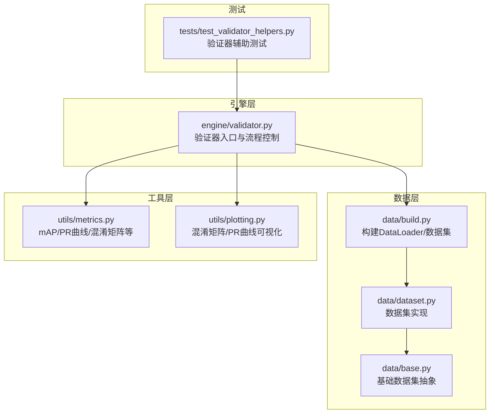
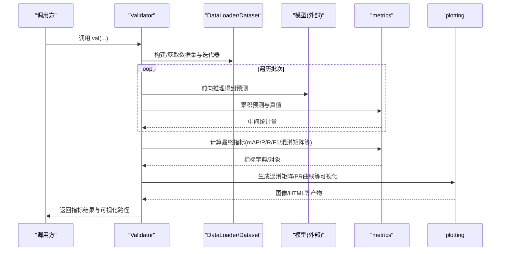
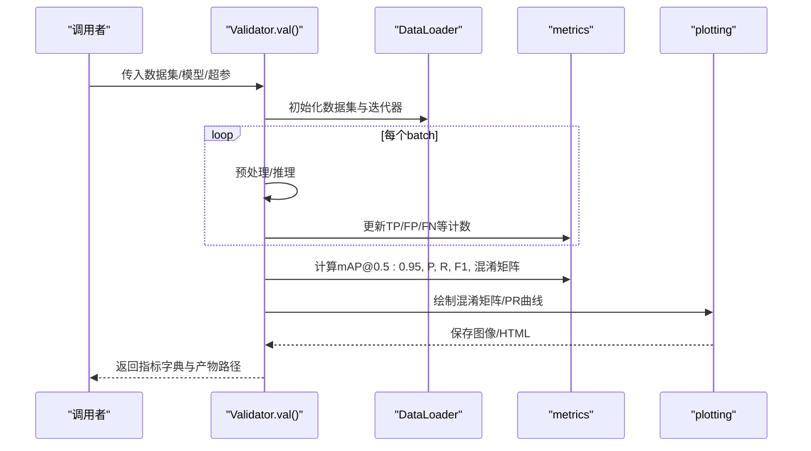
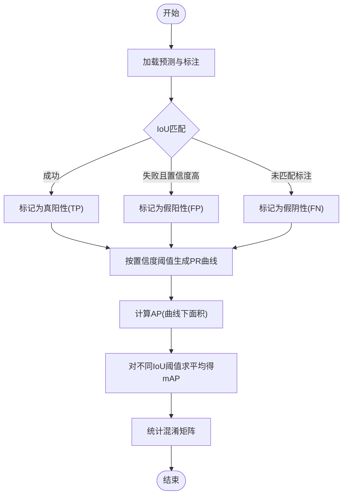
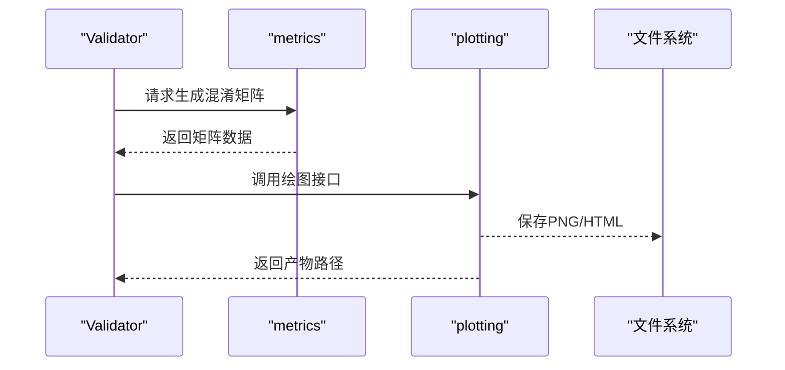
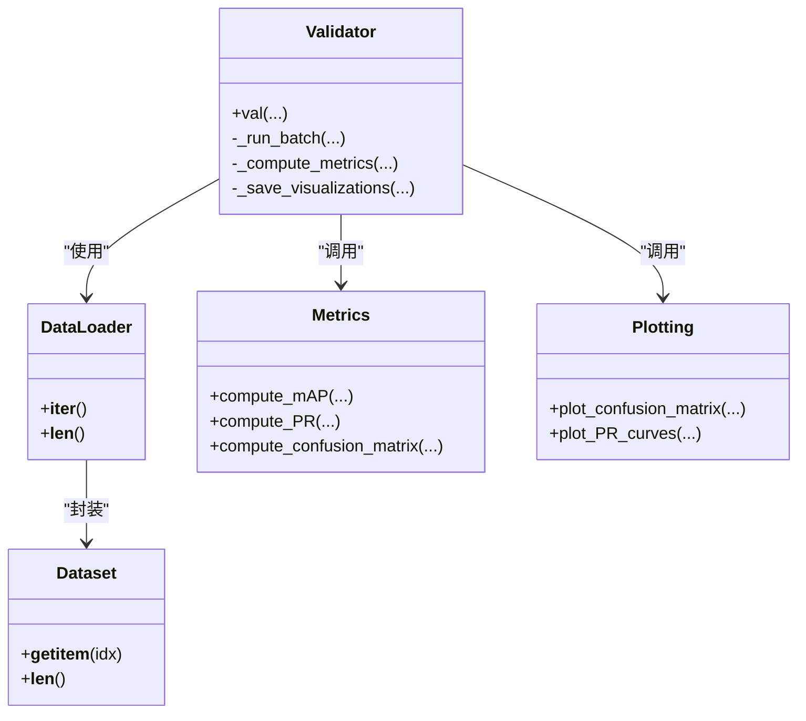

# Validator验证器API

<cite>
**本文引用的文件**
- [ultralytics/engine/validator.py](file://ultralytics/engine/validator.py)
- [ultralytics/utils/metrics.py](file://ultralytics/utils/metrics.py)
- [ultralytics/data/build.py](file://ultralytics/data/build.py)
- [ultralytics/data/dataset.py](file://ultralytics/data/dataset.py)
- [ultralytics/data/base.py](file://ultralytics/data/base.py)
- [ultralytics/utils/plotting.py](file://ultralytics/utils/plotting.py)
- [tests/test_validator_helpers.py](file://tests/test_validator_helpers.py)
</cite>

## 目录
1. [简介](#简介)
2. [项目结构](#项目结构)
3. [核心组件](#核心组件)
4. [架构总览](#架构总览)
5. [详细组件分析](#详细组件分析)
6. [依赖关系分析](#依赖关系分析)
7. [性能考量](#性能考量)
8. [故障排查指南](#故障排查指南)
9. [结论](#结论)
10. [附录](#附录)

## 简介
本文件为 YOLO-Master 的 Validator 验证器提供完整的 API 文档，聚焦于以下目标：
- 详细说明 Validator 类的评估流程控制接口，尤其是 val() 方法的参数配置与返回结果。
- 解释数据集加载与验证循环的管理方式。
- 记录各类评估指标（如 mAP、精度、召回率等）的统计与计算方法。
- 说明混淆矩阵生成与可视化输出接口。
- 提供自定义评估指标的实现方法与集成路径。
- 展示性能基准测试与结果对比分析的工具接口。
- 指导如何扩展验证器以支持新的评估任务与指标。

## 项目结构
Validator 相关代码主要位于 engine 层，数据加载在 data 层，指标计算与绘图在 utils 层，测试用例在 tests 层。下图给出与 Validator 相关的核心文件与职责划分。

图表来源
- [ultralytics/engine/validator.py](file://ultralytics/engine/validator.py)
- [ultralytics/data/build.py](file://ultralytics/data/build.py)
- [ultralytics/data/dataset.py](file://ultralytics/data/dataset.py)
- [ultralytics/data/base.py](file://ultralytics/data/base.py)
- [ultralytics/utils/metrics.py](file://ultralytics/utils/metrics.py)
- [ultralytics/utils/plotting.py](file://ultralytics/utils/plotting.py)
- [tests/test_validator_helpers.py](file://tests/test_validator_helpers.py)

章节来源
- [ultralytics/engine/validator.py](file://ultralytics/engine/validator.py)
- [ultralytics/data/build.py](file://ultralytics/data/build.py)
- [ultralytics/utils/metrics.py](file://ultralytics/utils/metrics.py)
- [ultralytics/utils/plotting.py](file://ultralytics/utils/plotting.py)
- [tests/test_validator_helpers.py](file://tests/test_validator_helpers.py)

## 核心组件
- Validator 类
  - 负责验证流程编排：初始化模型与数据、遍历批次、收集预测与标注、调用指标模块计算并汇总结果、保存可视化与报告。
  - 关键入口方法：val()，用于执行一次完整的数据集验证。
- 指标模块 metrics
  - 提供 mAP、Precision、Recall、F1、混淆矩阵、PR 曲线等计算逻辑。
- 数据构建模块 build/dataset/base
  - 负责从配置文件或路径构建 DataLoader、Dataset 实例，管理批处理、采样策略与多进程加载。
- 可视化模块 plotting
  - 提供混淆矩阵图、PR 曲线图等导出接口。

章节来源
- [ultralytics/engine/validator.py](file://ultralytics/engine/validator.py)
- [ultralytics/utils/metrics.py](file://ultralytics/utils/metrics.py)
- [ultralytics/data/build.py](file://ultralytics/data/build.py)
- [ultralytics/data/dataset.py](file://ultralytics/data/dataset.py)
- [ultralytics/data/base.py](file://ultralytics/data/base.py)
- [ultralytics/utils/plotting.py](file://ultralytics/utils/plotting.py)

## 架构总览
下图展示了 Validator 在一次验证过程中的主要交互：数据加载、推理、指标计算与可视化输出。

图表来源
- [ultralytics/engine/validator.py](file://ultralytics/engine/validator.py)
- [ultralytics/utils/metrics.py](file://ultralytics/utils/metrics.py)
- [ultralytics/utils/plotting.py](file://ultralytics/utils/plotting.py)

## 详细组件分析

### Validator 类与 val() 方法
- 职责
  - 初始化：加载模型权重、设备设置、NMS/置信度阈值等超参。
  - 数据准备：通过数据构建模块创建 DataLoader，按任务类型选择对应 Dataset。
  - 验证循环：逐批推理，收集预测框/掩码/关键点等与真实标注，进行匹配与统计。
  - 指标计算：调用 metrics 模块汇总 PR 曲线、mAP、混淆矩阵等。
  - 可视化与持久化：导出混淆矩阵、PR 曲线、类别级指标表格等。
- val() 方法要点
  - 输入参数通常包括：数据集路径或配置、模型权重、批量大小、图像尺寸、置信度与 IoU 阈值、是否保存可视化、是否打印日志等。
  - 返回值通常为包含各指标与可视化路径的结构化结果，便于后续分析与比较。
- 错误处理
  - 对数据缺失、标签格式不合法、IoU 阈值越界等情况进行校验与提示。
  - 对 GPU OOM、IO 异常等进行捕获与降级策略（如降低 batch size）。

章节来源
- [ultralytics/engine/validator.py](file://ultralytics/engine/validator.py)

#### 验证流程控制时序

图表来源
- [ultralytics/engine/validator.py](file://ultralytics/engine/validator.py)
- [ultralytics/utils/metrics.py](file://ultralytics/utils/metrics.py)
- [ultralytics/utils/plotting.py](file://ultralytics/utils/plotting.py)

### 数据集加载与验证循环管理
- 数据构建
  - 通过 build 模块根据任务类型（检测/分割/姿态等）选择相应 Dataset 实现。
  - 支持多进程数据加载、缓存、重复使用等优化。
- 验证循环
  - 基于 DataLoader 的迭代器进行批处理，避免一次性加载全部数据到内存。
  - 支持断点续验、进度条、日志输出。
- 典型配置项
  - 图像尺寸、批量大小、数据增强开关（验证阶段通常关闭）、线程数、缓存策略等。

章节来源
- [ultralytics/data/build.py](file://ultralytics/data/build.py)
- [ultralytics/data/dataset.py](file://ultralytics/data/dataset.py)
- [ultralytics/data/base.py](file://ultralytics/data/base.py)

### 评估指标统计与计算方法
- 常用指标
  - mAP@0.5:0.95、mAP@0.5、mAP@0.75
  - Precision、Recall、F1-Score
  - 类别级指标与总体平均
- 计算流程
  - 将预测与标注进行 IoU 匹配，统计 TP/FP/FN。
  - 基于不同置信度阈值生成 PR 曲线，计算曲线下面积得到 AP。
  - 对不同 IoU 阈值求平均得到 mAP。
  - 混淆矩阵统计每类的预测分布，用于错误分析。
- 输出结构
  - 指标字典/对象，包含总体与类别级指标、PR 曲线数据、混淆矩阵等。

章节来源
- [ultralytics/utils/metrics.py](file://ultralytics/utils/metrics.py)

#### 指标计算流程图

图表来源
- [ultralytics/utils/metrics.py](file://ultralytics/utils/metrics.py)

### 混淆矩阵生成与可视化输出
- 生成
  - 基于验证阶段的分类预测与真实标签，统计每类的命中与误判数量。
  - 支持归一化显示，便于跨类别比较。
- 可视化
  - 导出热力图形式的混淆矩阵图片。
  - 可结合 HTML 报告输出，便于归档与分享。
- 集成点
  - Validator 在指标计算完成后调用 plotting 模块进行导出。

章节来源
- [ultralytics/utils/metrics.py](file://ultralytics/utils/metrics.py)
- [ultralytics/utils/plotting.py](file://ultralytics/utils/plotting.py)

#### 混淆矩阵可视化序列

图表来源
- [ultralytics/utils/plotting.py](file://ultralytics/utils/plotting.py)
- [ultralytics/utils/metrics.py](file://ultralytics/utils/metrics.py)

### 自定义评估指标的实现与集成
- 设计原则
  - 保持与现有指标一致的输入输出契约：接收预测与标注，返回可聚合的统计量或标量指标。
  - 支持增量式累加，以便在批处理中高效计算。
- 集成步骤
  - 在指标模块中注册新指标的计算函数。
  - 在 Validator 的指标汇总阶段调用该函数，并将其结果纳入最终报告。
  - 如需可视化，提供对应的绘图接口并在 Validator 中调用。
- 注意事项
  - 确保数值稳定性与边界条件处理（如空预测、全零行/列）。
  - 与现有 mAP/PR 曲线体系兼容时，注意阈值网格与插值策略的一致性。

章节来源
- [ultralytics/utils/metrics.py](file://ultralytics/utils/metrics.py)
- [ultralytics/engine/validator.py](file://ultralytics/engine/validator.py)

### 性能基准测试与结果对比分析工具接口
- 基准测试
  - 支持在不同硬件/后端上运行验证，记录吞吐与延迟。
  - 可固定数据集与模型，仅改变超参或后端，进行对照实验。
- 结果对比
  - 将多次验证的结果导出为结构化文件（JSON/CSV），便于横向对比。
  - 提供脚本或接口读取历史结果，生成对比图表与摘要。
- 集成建议
  - 在 Validator 的 val() 返回结构中增加耗时、吞吐等元信息。
  - 将对比分析封装为独立工具，复用指标与绘图能力。

章节来源
- [ultralytics/engine/validator.py](file://ultralytics/engine/validator.py)
- [ultralytics/utils/metrics.py](file://ultralytics/utils/metrics.py)

### 扩展验证器以支持新任务与新指标
- 新任务支持
  - 在数据构建层新增对应 Dataset 实现，定义数据加载与预处理逻辑。
  - 在 Validator 的任务分支中添加新任务的推理与匹配逻辑。
- 新指标支持
  - 在指标模块新增计算函数，并在 Validator 的汇总阶段注册调用。
  - 若需要可视化，新增绘图函数并在 Validator 中调用。
- 测试保障
  - 为新任务与指标编写单元测试与端到端测试，覆盖正常与异常路径。

章节来源
- [ultralytics/data/dataset.py](file://ultralytics/data/dataset.py)
- [ultralytics/data/build.py](file://ultralytics/data/build.py)
- [ultralytics/utils/metrics.py](file://ultralytics/utils/metrics.py)
- [ultralytics/engine/validator.py](file://ultralytics/engine/validator.py)

## 依赖关系分析
Validator 与数据、指标、可视化模块之间的依赖如下：

图表来源
- [ultralytics/engine/validator.py](file://ultralytics/engine/validator.py)
- [ultralytics/data/build.py](file://ultralytics/data/build.py)
- [ultralytics/data/dataset.py](file://ultralytics/data/dataset.py)
- [ultralytics/utils/metrics.py](file://ultralytics/utils/metrics.py)
- [ultralytics/utils/plotting.py](file://ultralytics/utils/plotting.py)

章节来源
- [ultralytics/engine/validator.py](file://ultralytics/engine/validator.py)
- [ultralytics/data/build.py](file://ultralytics/data/build.py)
- [ultralytics/data/dataset.py](file://ultralytics/data/dataset.py)
- [ultralytics/utils/metrics.py](file://ultralytics/utils/metrics.py)
- [ultralytics/utils/plotting.py](file://ultralytics/utils/plotting.py)

## 性能考量
- 数据加载
  - 启用多进程 DataLoader、预取与缓存，减少 IO 瓶颈。
  - 合理设置图像尺寸与批量大小，平衡吞吐与显存占用。
- 指标计算
  - 采用增量式统计，避免重复计算；必要时对大规模数据进行分块处理。
- 可视化
  - 仅在需要时生成大图，或使用低分辨率版本用于快速预览。
- 并行与分布式
  - 在多卡环境下，确保指标聚合的正确性与一致性，避免竞态条件。

[本节为通用性能建议，无需特定文件引用]

## 故障排查指南
- 常见问题
  - 数据路径错误或标签格式不合法：检查数据集结构与标注规范。
  - 显存不足：降低 batch size 或图像尺寸，关闭不必要的可视化。
  - 指标异常（NaN/Inf）：检查预测为空或全零的情况，调整阈值范围。
- 调试手段
  - 开启详细日志，定位具体批次与样本。
  - 使用最小复现数据集与模型，逐步缩小问题范围。
- 参考测试
  - 查看验证器辅助测试用例，了解常见边界条件与错误路径的处理方式。

章节来源
- [tests/test_validator_helpers.py](file://tests/test_validator_helpers.py)

## 结论
Validator 作为 YOLO-Master 的核心评估组件，提供了统一的验证流程控制、指标计算与可视化输出能力。通过模块化设计，用户可以便捷地扩展新任务与新指标，并结合基准测试工具进行系统化的性能对比与分析。遵循本文档的接口约定与最佳实践，可有效提升评估的可重复性与可维护性。

[本节为总结性内容，无需特定文件引用]

## 附录
- 术语表
  - mAP：平均精度均值，衡量检测/分割等多任务综合性能。
  - PR 曲线：Precision-Recall 曲线，反映不同置信度下的精度与召回权衡。
  - 混淆矩阵：按类别统计预测与真实标签的交叉分布，用于错误分析。
- 参考路径
  - 验证器主实现：[ultralytics/engine/validator.py](file://ultralytics/engine/validator.py)
  - 指标计算：[ultralytics/utils/metrics.py](file://ultralytics/utils/metrics.py)
  - 数据构建：[ultralytics/data/build.py](file://ultralytics/data/build.py)
  - 可视化：[ultralytics/utils/plotting.py](file://ultralytics/utils/plotting.py)
  - 测试用例：[tests/test_validator_helpers.py](file://tests/test_validator_helpers.py)