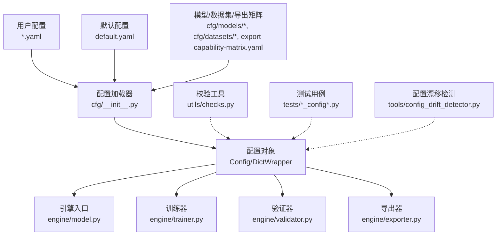
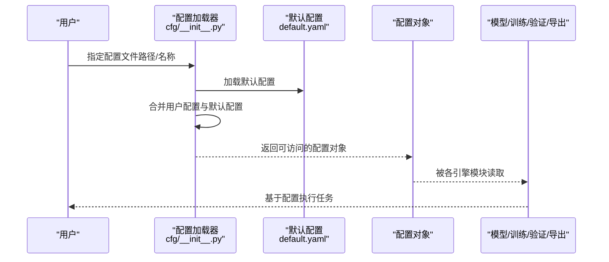
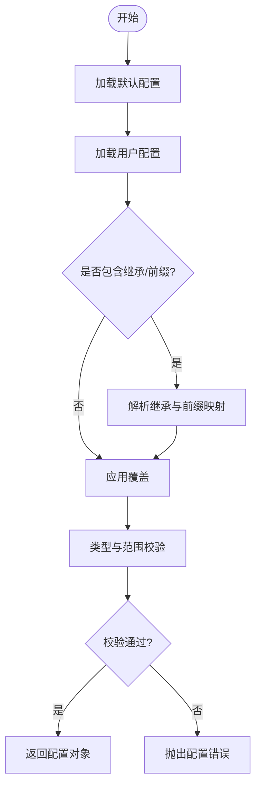
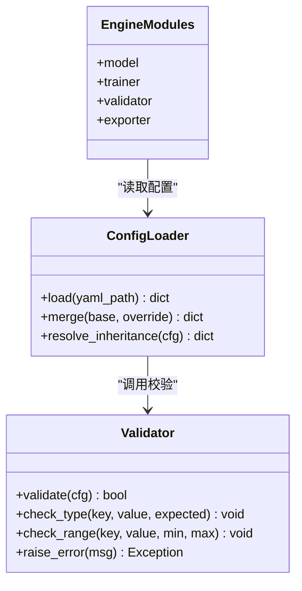
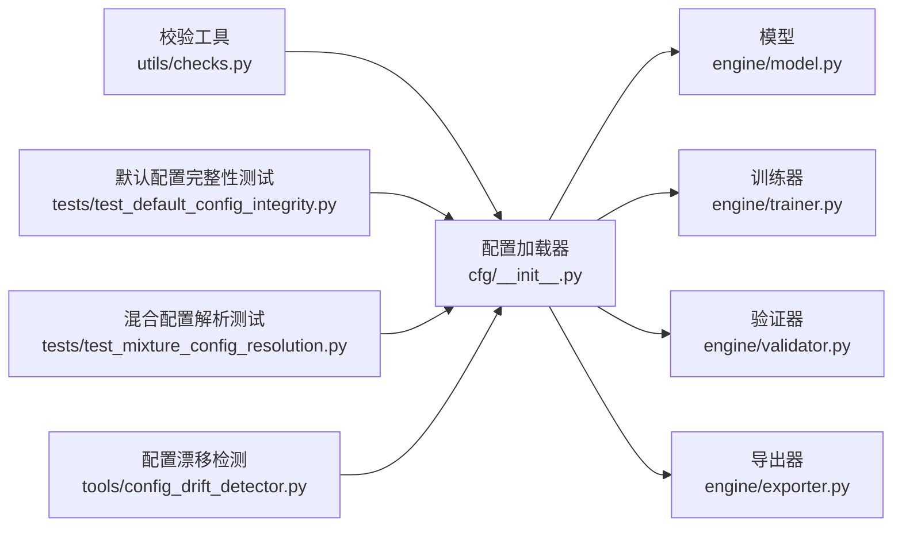

# 配置API

<cite>
**本文引用的文件**
- [ultralytics/cfg/default.yaml](file://ultralytics/cfg/default.yaml)
- [ultralytics/cfg/__init__.py](file://ultralytics/cfg/__init__.py)
- [ultralytics/utils/checks.py](file://ultralytics/utils/checks.py)
- [ultralytics/engine/model.py](file://ultralytics/engine/model.py)
- [ultralytics/engine/trainer.py](file://ultralytics/engine/trainer.py)
- [ultralytics/engine/validator.py](file://ultralytics/engine/validator.py)
- [ultralytics/engine/exporter.py](file://ultralytics/engine/exporter.py)
- [tests/test_default_config_integrity.py](file://tests/test_default_config_integrity.py)
- [tests/test_mixture_config_resolution.py](file://tests/test_mixture_config_resolution.py)
- [tests/test_master_model_configs.py](file://tests/test_master_model_configs.py)
- [tools/config_drift_detector.py](file://tools/config_drift_detector.py)
- [scripts/smoke_test_coco2017.py](file://scripts/smoke_test_coco2017.py)
</cite>

## 目录
1. [简介](#简介)
2. [项目结构](#项目结构)
3. [核心组件](#核心组件)
4. [架构总览](#架构总览)
5. [详细组件分析](#详细组件分析)
6. [依赖分析](#依赖分析)
7. [性能考虑](#性能考虑)
8. [故障排查指南](#故障排查指南)
9. [结论](#结论)
10. [附录](#附录)

## 简介
本文件面向YOLO-Master的配置系统API，聚焦以下目标：
- 配置文件结构与语法规范（YAML）与参数继承机制
- 所有配置参数的含义、默认值与有效范围说明方法
- 动态配置更新与运行时修改路径
- 配置文件验证与错误检查的API
- 配置模板与预设配置的使用方法
- 多环境配置管理与优先级规则
- 版本兼容性与迁移工具
- 最佳实践与性能调优建议

## 项目结构
配置相关代码主要分布在以下位置：
- 默认配置与模型/数据集/导出能力矩阵等YAML定义位于 ultralytics/cfg
- 配置加载、合并、覆盖与解析逻辑位于 ultralytics/cfg/__init__.py
- 配置校验与类型检查在 ultralytics/utils/checks.py
- 引擎模块（模型、训练、验证、导出）在读取与使用配置时触发解析与校验流程
- 测试用例覆盖默认配置完整性、混合配置解析、主模型配置一致性等
- 工具提供配置漂移检测能力

图表来源
- [ultralytics/cfg/__init__.py](file://ultralytics/cfg/__init__.py)
- [ultralytics/cfg/default.yaml](file://ultralytics/cfg/default.yaml)
- [ultralytics/engine/model.py](file://ultralytics/engine/model.py)
- [ultralytics/engine/trainer.py](file://ultralytics/engine/trainer.py)
- [ultralytics/engine/validator.py](file://ultralytics/engine/validator.py)
- [ultralytics/engine/exporter.py](file://ultralytics/engine/exporter.py)
- [ultralytics/utils/checks.py](file://ultralytics/utils/checks.py)
- [tests/test_default_config_integrity.py](file://tests/test_default_config_integrity.py)
- [tests/test_mixture_config_resolution.py](file://tests/test_mixture_config_resolution.py)
- [tools/config_drift_detector.py](file://tools/config_drift_detector.py)

章节来源
- [ultralytics/cfg/default.yaml](file://ultralytics/cfg/default.yaml)
- [ultralytics/cfg/__init__.py](file://ultralytics/cfg/__init__.py)
- [ultralytics/utils/checks.py](file://ultralytics/utils/checks.py)
- [ultralytics/engine/model.py](file://ultralytics/engine/model.py)
- [ultralytics/engine/trainer.py](file://ultralytics/engine/trainer.py)
- [ultralytics/engine/validator.py](file://ultralytics/engine/validator.py)
- [ultralytics/engine/exporter.py](file://ultralytics/engine/exporter.py)
- [tests/test_default_config_integrity.py](file://tests/test_default_config_integrity.py)
- [tests/test_mixture_config_resolution.py](file://tests/test_mixture_config_resolution.py)
- [tools/config_drift_detector.py](file://tools/config_drift_detector.py)

## 核心组件
- 配置加载与合并
  - 支持从多个YAML源加载并合并为单一配置对象
  - 支持“继承”语义：通过引用基础配置或键前缀实现分层覆盖
- 配置对象访问
  - 提供字典式与点号属性访问方式
  - 支持嵌套结构的扁平化访问
- 配置校验
  - 基于类型与范围的校验，失败时抛出明确错误信息
- 引擎集成
  - 模型、训练、验证、导出等模块在初始化阶段消费配置对象
- 测试与工具
  - 默认配置完整性测试
  - 混合配置解析测试
  - 配置漂移检测工具

章节来源
- [ultralytics/cfg/__init__.py](file://ultralytics/cfg/__init__.py)
- [ultralytics/utils/checks.py](file://ultralytics/utils/checks.py)
- [ultralytics/engine/model.py](file://ultralytics/engine/model.py)
- [ultralytics/engine/trainer.py](file://ultralytics/engine/trainer.py)
- [ultralytics/engine/validator.py](file://ultralytics/engine/validator.py)
- [ultralytics/engine/exporter.py](file://ultralytics/engine/exporter.py)
- [tests/test_default_config_integrity.py](file://tests/test_default_config_integrity.py)
- [tests/test_mixture_config_resolution.py](file://tests/test_mixture_config_resolution.py)

## 架构总览
下图展示了配置从YAML到引擎使用的端到端流程。

图表来源
- [ultralytics/cfg/__init__.py](file://ultralytics/cfg/__init__.py)
- [ultralytics/cfg/default.yaml](file://ultralytics/cfg/default.yaml)
- [ultralytics/engine/model.py](file://ultralytics/engine/model.py)
- [ultralytics/engine/trainer.py](file://ultralytics/engine/trainer.py)
- [ultralytics/engine/validator.py](file://ultralytics/engine/validator.py)
- [ultralytics/engine/exporter.py](file://ultralytics/engine/exporter.py)

## 详细组件分析

### 配置加载与合并（YAML与继承）
- 加载顺序与优先级
  - 默认配置作为基线
  - 用户显式指定的配置文件覆盖默认项
  - 若存在多个源，后加载的覆盖先加载的同名键
- 继承机制
  - 通过“基础配置引用”或“命名空间前缀”实现分层覆盖
  - 子域配置可仅声明差异项，其余沿用父域
- 合并策略
  - 浅层键直接覆盖
  - 深层字典按键递归合并
  - 列表型字段通常以覆盖为主（具体行为取决于字段语义）

图表来源
- [ultralytics/cfg/__init__.py](file://ultralytics/cfg/__init__.py)
- [ultralytics/cfg/default.yaml](file://ultralytics/cfg/default.yaml)

章节来源
- [ultralytics/cfg/__init__.py](file://ultralytics/cfg/__init__.py)
- [ultralytics/cfg/default.yaml](file://ultralytics/cfg/default.yaml)

### 配置对象与访问模式
- 访问方式
  - 字典式访问：如 config["key"]
  - 点号属性访问：如 config.key
  - 嵌套访问：如 config.sub.key
- 常见用途
  - 引擎初始化时读取设备、批大小、精度、IO路径等
  - 训练/验证/导出流程中按需读取特定子域

章节来源
- [ultralytics/cfg/__init__.py](file://ultralytics/cfg/__init__.py)
- [ultralytics/engine/model.py](file://ultralytics/engine/model.py)
- [ultralytics/engine/trainer.py](file://ultralytics/engine/trainer.py)
- [ultralytics/engine/validator.py](file://ultralytics/engine/validator.py)
- [ultralytics/engine/exporter.py](file://ultralytics/engine/exporter.py)

### 配置校验与错误检查API
- 校验维度
  - 类型检查：确保数值、布尔、字符串、枚举等符合预期
  - 范围检查：对超参、尺寸、阈值等进行上下界约束
  - 依赖检查：某些键组合必须同时存在或互斥
- 错误处理
  - 校验失败时抛出结构化异常，包含字段名、期望类型/范围与实际值
  - 建议在启动早期进行全量校验，避免运行期不一致

图表来源
- [ultralytics/cfg/__init__.py](file://ultralytics/cfg/__init__.py)
- [ultralytics/utils/checks.py](file://ultralytics/utils/checks.py)

章节来源
- [ultralytics/utils/checks.py](file://ultralytics/utils/checks.py)
- [tests/test_default_config_integrity.py](file://tests/test_default_config_integrity.py)

### 动态配置更新与运行时修改
- 适用场景
  - 在线推理服务中调整阈值、NMS参数、可视化开关等
  - 训练过程中根据日志动态调整学习率、早停条件等
- 推荐做法
  - 使用配置对象的就地更新接口更新键值
  - 对关键参数变更进行二次校验
  - 将变更持久化至文件或状态存储，便于审计与回滚
- 注意事项
  - 部分参数仅在初始化阶段生效（如模型结构、后端选择），运行时修改无效
  - 并发环境下需加锁保护配置写入

章节来源
- [ultralytics/cfg/__init__.py](file://ultralytics/cfg/__init__.py)
- [ultralytics/engine/model.py](file://ultralytics/engine/model.py)
- [ultralytics/engine/trainer.py](file://ultralytics/engine/trainer.py)
- [ultralytics/engine/validator.py](file://ultralytics/engine/validator.py)
- [ultralytics/engine/exporter.py](file://ultralytics/engine/exporter.py)

### 配置模板与预设配置
- 模板来源
  - 默认配置提供通用基线
  - 模型/数据集/导出能力矩阵等YAML可作为领域模板
- 使用方法
  - 复制模板并覆盖差异项
  - 通过继承/前缀组织多套配置
- 建议
  - 为不同任务（检测、分割、姿态等）维护独立模板
  - 为不同环境（开发、测试、生产）维护独立覆盖层

章节来源
- [ultralytics/cfg/default.yaml](file://ultralytics/cfg/default.yaml)
- [ultralytics/cfg/__init__.py](file://ultralytics/cfg/__init__.py)

### 多环境配置管理与优先级规则
- 环境分层
  - 基础层：默认配置
  - 业务层：任务/模型/数据集专用配置
  - 环境层：dev/test/prod覆盖
- 优先级（从高到低）
  - 命令行/程序内覆盖 > 环境覆盖 > 业务模板 > 默认配置
- 管理建议
  - 使用环境变量注入敏感信息（如路径、密钥）
  - 在CI中校验配置一致性

章节来源
- [ultralytics/cfg/__init__.py](file://ultralytics/cfg/__init__.py)
- [ultralytics/cfg/default.yaml](file://ultralytics/cfg/default.yaml)

### 版本兼容性与迁移工具
- 兼容性
  - 新增字段应设置合理默认值，避免破坏旧配置
  - 废弃字段保留向后兼容提示
- 迁移工具
  - 提供配置漂移检测工具，对比当前与基线配置的差异
  - 结合测试用例保障默认配置完整性

章节来源
- [tools/config_drift_detector.py](file://tools/config_drift_detector.py)
- [tests/test_default_config_integrity.py](file://tests/test_default_config_integrity.py)

### 最佳实践与性能调优建议
- 最佳实践
  - 明确区分只读与可写参数，避免运行时误改
  - 使用最小覆盖原则，减少重复配置
  - 对关键参数增加注释与取值范围说明
- 性能调优
  - 批大小、数据加载线程数、缓存策略等对吞吐影响显著
  - 导出模式下选择合适的后端与优化选项
  - 监控GPU/CPU利用率与内存峰值，定位瓶颈

章节来源
- [ultralytics/engine/exporter.py](file://ultralytics/engine/exporter.py)
- [ultralytics/engine/trainer.py](file://ultralytics/engine/trainer.py)
- [ultralytics/engine/validator.py](file://ultralytics/engine/validator.py)

## 依赖分析
配置系统与引擎模块之间的依赖关系如下：

图表来源
- [ultralytics/cfg/__init__.py](file://ultralytics/cfg/__init__.py)
- [ultralytics/utils/checks.py](file://ultralytics/utils/checks.py)
- [ultralytics/engine/model.py](file://ultralytics/engine/model.py)
- [ultralytics/engine/trainer.py](file://ultralytics/engine/trainer.py)
- [ultralytics/engine/validator.py](file://ultralytics/engine/validator.py)
- [ultralytics/engine/exporter.py](file://ultralytics/engine/exporter.py)
- [tests/test_default_config_integrity.py](file://tests/test_default_config_integrity.py)
- [tests/test_mixture_config_resolution.py](file://tests/test_mixture_config_resolution.py)
- [tools/config_drift_detector.py](file://tools/config_drift_detector.py)

章节来源
- [ultralytics/cfg/__init__.py](file://ultralytics/cfg/__init__.py)
- [ultralytics/utils/checks.py](file://ultralytics/utils/checks.py)
- [ultralytics/engine/model.py](file://ultralytics/engine/model.py)
- [ultralytics/engine/trainer.py](file://ultralytics/engine/trainer.py)
- [ultralytics/engine/validator.py](file://ultralytics/engine/validator.py)
- [ultralytics/engine/exporter.py](file://ultralytics/engine/exporter.py)
- [tests/test_default_config_integrity.py](file://tests/test_default_config_integrity.py)
- [tests/test_mixture_config_resolution.py](file://tests/test_mixture_config_resolution.py)
- [tools/config_drift_detector.py](file://tools/config_drift_detector.py)

## 性能考虑
- 配置解析开销
  - 大型配置树合并与校验应在启动阶段完成，避免热路径
- 运行时变更
  - 高频变更的参数应设计为轻量级读写，必要时引入缓存
- 导出优化
  - 导出阶段的配置直接影响模型体积与推理速度，需权衡精度与性能

[本节为通用指导，不直接分析具体文件]

## 故障排查指南
- 常见问题
  - 类型不匹配：检查字段类型与默认值定义
  - 范围越界：核对参数上下界与业务需求
  - 缺失依赖键：确认必需键是否存在且非空
- 定位步骤
  - 启用更详细的日志输出
  - 使用配置漂移检测工具对比差异
  - 运行默认配置完整性测试与混合配置解析测试
- 参考脚本
  - 使用示例脚本快速复现问题并定位配置来源

章节来源
- [ultralytics/utils/checks.py](file://ultralytics/utils/checks.py)
- [tests/test_default_config_integrity.py](file://tests/test_default_config_integrity.py)
- [tests/test_mixture_config_resolution.py](file://tests/test_mixture_config_resolution.py)
- [scripts/smoke_test_coco2017.py](file://scripts/smoke_test_coco2017.py)

## 结论
本配置API围绕“加载-合并-校验-使用”的主线构建，强调可维护性、可扩展性与可观测性。通过模板化与分层覆盖，配合严格的校验与测试，可在多环境与多任务场景下稳定运行。建议在生产环境中持续使用配置漂移检测与回归测试，确保配置演进的可控与可追溯。

[本节为总结，不直接分析具体文件]

## 附录
- 常用配置键分类（示例）
  - 设备与并行：device、batch_size、workers
  - 训练超参：lr、epochs、optimizer、loss
  - 数据与IO：data、path、cache、augment
  - 导出选项：format、backend、optimize、half
- 参考文件
  - 默认配置与模板：ultralytics/cfg/default.yaml
  - 配置加载与合并：ultralytics/cfg/__init__.py
  - 校验工具：ultralytics/utils/checks.py
  - 引擎模块：ultralytics/engine/{model,trainer,validator,exporter}.py
  - 测试与工具：tests/*_config*.py、tools/config_drift_detector.py

章节来源
- [ultralytics/cfg/default.yaml](file://ultralytics/cfg/default.yaml)
- [ultralytics/cfg/__init__.py](file://ultralytics/cfg/__init__.py)
- [ultralytics/utils/checks.py](file://ultralytics/utils/checks.py)
- [ultralytics/engine/model.py](file://ultralytics/engine/model.py)
- [ultralytics/engine/trainer.py](file://ultralytics/engine/trainer.py)
- [ultralytics/engine/validator.py](file://ultralytics/engine/validator.py)
- [ultralytics/engine/exporter.py](file://ultralytics/engine/exporter.py)
- [tests/test_default_config_integrity.py](file://tests/test_default_config_integrity.py)
- [tests/test_mixture_config_resolution.py](file://tests/test_mixture_config_resolution.py)
- [tests/test_master_model_configs.py](file://tests/test_master_model_configs.py)
- [tools/config_drift_detector.py](file://tools/config_drift_detector.py)
- [scripts/smoke_test_coco2017.py](file://scripts/smoke_test_coco2017.py)