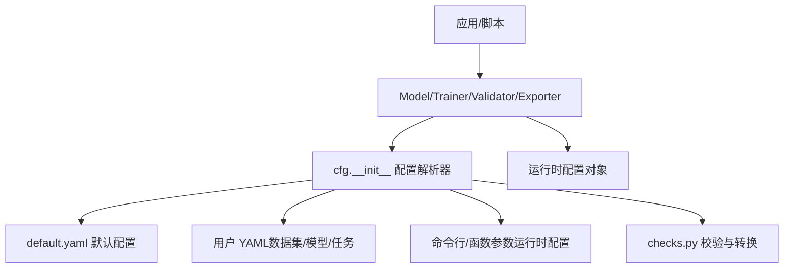
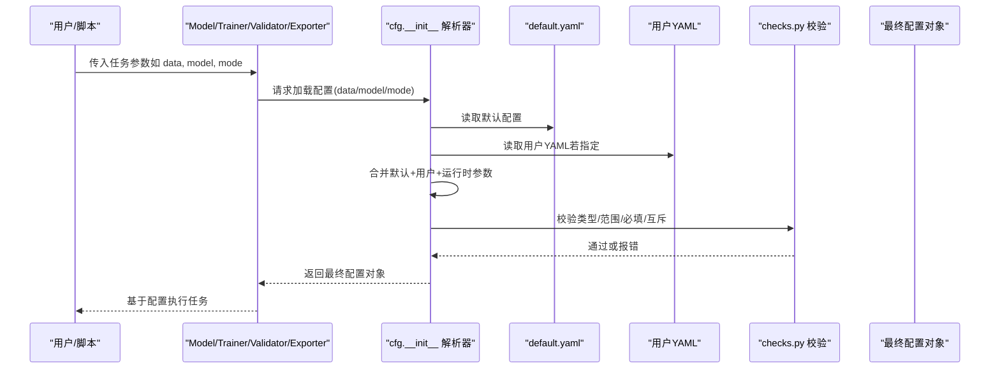
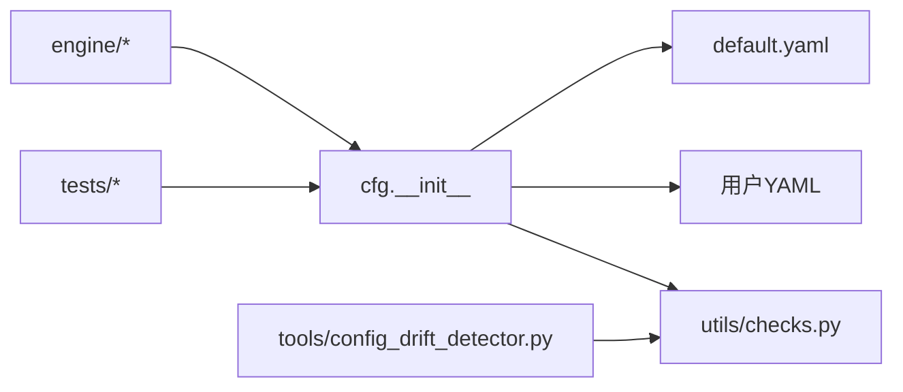

# 配置管理系统

<cite>
**本文引用的文件**
- [ultralytics/cfg/__init__.py](file://ultralytics/cfg/__init__.py)
- [ultralytics/cfg/default.yaml](file://ultralytics/cfg/default.yaml)
- [ultralytics/utils/checks.py](file://ultralytics/utils/checks.py)
- [ultralytics/engine/model.py](file://ultralytics/engine/model.py)
- [ultralytics/engine/trainer.py](file://ultralytics/engine/trainer.py)
- [ultralytics/engine/validator.py](file://ultralytics/engine/validator.py)
- [ultralytics/engine/exporter.py](file://ultralytics/engine/exporter.py)
- [tests/test_default_config_integrity.py](file://tests/test_default_config_integrity.py)
- [tests/test_mixture_config_resolution.py](file://tests/test_mixture_config_resolution.py)
- [tools/config_drift_detector.py](file://tools/config_drift_detector.py)
- [scripts/_voc_local.yaml](file://scripts/_voc_local.yaml)
- [scripts/coco2017.yaml](file://scripts/coco2017.yaml)
- [examples/lora_examples/yolo_master_lora_README.md](file://examples/lora_examples/yolo_master_lora_README.md)
</cite>

## 目录
1. [简介](#简介)
2. [项目结构](#项目结构)
3. [核心组件](#核心组件)
4. [架构总览](#架构总览)
5. [详细组件分析](#详细组件分析)
6. [依赖关系分析](#依赖关系分析)
7. [性能考虑](#性能考虑)
8. [故障排除指南](#故障排除指南)
9. [结论](#结论)
10. [附录](#附录)

## 简介
本技术文档面向 YOLO-Master 框架的配置管理系统，系统性阐述配置的层次结构与合并优先级（默认配置、用户配置、运行时配置），YAML 语法与参数校验规则，动态加载与热重载机制，版本兼容性检查，继承与覆盖策略（局部与全局协调），类型系统与默认值处理，以及代码中访问与修改配置的最佳实践。同时提供配置文件组织结构与管理策略、调试工具与故障排除方法，并涵盖安全与敏感信息保护建议。

## 项目结构
YOLO-Master 的配置系统围绕 ultralytics/cfg 目录下的默认配置与模型/数据集 YAML，结合引擎层在运行期对配置进行解析、校验与合并。典型路径包括：
- 默认配置与能力矩阵：ultralytics/cfg/default.yaml、ultralytics/cfg/export-capability-matrix.yaml
- 数据与模型示例配置：scripts/*.yaml、ultralytics/cfg/datasets/*.yaml、ultralytics/cfg/models/*
- 配置解析与校验：ultralytics/cfg/__init__.py、ultralytics/utils/checks.py
- 使用入口：ultralytics/engine/model.py、trainer.py、validator.py、exporter.py
- 测试与回归：tests/test_default_config_integrity.py、tests/test_mixture_config_resolution.py
- 配置漂移检测：tools/config_drift_detector.py

图表来源
- [ultralytics/cfg/__init__.py](file://ultralytics/cfg/__init__.py)
- [ultralytics/cfg/default.yaml](file://ultralytics/cfg/default.yaml)
- [ultralytics/utils/checks.py](file://ultralytics/utils/checks.py)
- [ultralytics/engine/model.py](file://ultralytics/engine/model.py)
- [ultralytics/engine/trainer.py](file://ultralytics/engine/trainer.py)
- [ultralytics/engine/validator.py](file://ultralytics/engine/validator.py)
- [ultralytics/engine/exporter.py](file://ultralytics/engine/exporter.py)

章节来源
- [ultralytics/cfg/__init__.py](file://ultralytics/cfg/__init__.py)
- [ultralytics/cfg/default.yaml](file://ultralytics/cfg/default.yaml)
- [ultralytics/utils/checks.py](file://ultralytics/utils/checks.py)
- [ultralytics/engine/model.py](file://ultralytics/engine/model.py)
- [ultralytics/engine/trainer.py](file://ultralytics/engine/trainer.py)
- [ultralytics/engine/validator.py](file://ultralytics/engine/validator.py)
- [ultralytics/engine/exporter.py](file://ultralytics/engine/exporter.py)

## 核心组件
- 配置解析器（cfg.__init__）
  - 负责加载 default.yaml、用户 YAML、运行时参数，执行合并与去重，生成统一配置对象。
  - 支持键路径访问、嵌套字典合并、列表拼接或覆盖策略。
- 校验与转换（utils/checks.py）
  - 定义字段类型、取值范围、必填项、互斥约束；将字符串/数值等转换为期望类型。
  - 提供错误消息与定位，便于快速修复配置。
- 引擎集成（engine/*）
  - Model/Trainer/Validator/Exporter 在初始化时读取配置，构建具体任务流水线。
  - 暴露只读接口供上层查询，避免随意篡改运行时状态。
- 测试与回归（tests/*）
  - 验证默认配置完整性、合并优先级、兼容性与边界条件。
- 配置漂移检测（tools/config_drift_detector.py）
  - 对比当前配置与基线/历史配置，输出差异报告，辅助版本治理。

章节来源
- [ultralytics/cfg/__init__.py](file://ultralytics/cfg/__init__.py)
- [ultralytics/utils/checks.py](file://ultralytics/utils/checks.py)
- [ultralytics/engine/model.py](file://ultralytics/engine/model.py)
- [ultralytics/engine/trainer.py](file://ultralytics/engine/trainer.py)
- [ultralytics/engine/validator.py](file://ultralytics/engine/validator.py)
- [ultralytics/engine/exporter.py](file://ultralytics/engine/exporter.py)
- [tests/test_default_config_integrity.py](file://tests/test_default_config_integrity.py)
- [tests/test_mixture_config_resolution.py](file://tests/test_mixture_config_resolution.py)
- [tools/config_drift_detector.py](file://tools/config_drift_detector.py)

## 架构总览
下图展示配置从“默认配置 + 用户配置 + 运行时参数”到“最终配置对象”的完整流程，以及校验与版本检查的介入点。

图表来源
- [ultralytics/cfg/__init__.py](file://ultralytics/cfg/__init__.py)
- [ultralytics/cfg/default.yaml](file://ultralytics/cfg/default.yaml)
- [ultralytics/utils/checks.py](file://ultralytics/utils/checks.py)
- [ultralytics/engine/model.py](file://ultralytics/engine/model.py)
- [ultralytics/engine/trainer.py](file://ultralytics/engine/trainer.py)
- [ultralytics/engine/validator.py](file://ultralytics/engine/validator.py)
- [ultralytics/engine/exporter.py](file://ultralytics/engine/exporter.py)

## 详细组件分析

### 配置层次结构与合并优先级
- 层次结构
  - 默认配置：框架内置 default.yaml，保证开箱即用与稳定性。
  - 用户配置：数据集/模型/任务的 YAML，位于 scripts、datasets、models 等目录。
  - 运行时配置：CLI 参数或函数调用时的关键字参数，用于临时覆盖。
- 合并优先级（高到低）
  - 运行时配置 > 用户配置 > 默认配置
  - 同一层级内，后出现的键覆盖先前的键；列表通常采用替换而非拼接（除非明确声明）。
- 合并策略
  - 字典按键递归合并；未显式覆盖的键保留上游值。
  - 特殊键（如 path、name、task）可能触发资源定位或模块选择逻辑。
  - 冲突键会触发校验失败或警告，便于早期发现。

章节来源
- [ultralytics/cfg/__init__.py](file://ultralytics/cfg/__init__.py)
- [ultralytics/cfg/default.yaml](file://ultralytics/cfg/default.yaml)
- [tests/test_mixture_config_resolution.py](file://tests/test_mixture_config_resolution.py)

### YAML 语法规范与参数校验
- YAML 语法
  - 支持键值对、嵌套字典、列表、注释、引用与包含（若实现允许）。
  - 推荐保持缩进一致，避免混用空格与制表符。
- 参数校验
  - 类型检查：int/float/bool/str/list/dict 等。
  - 范围检查：数值上下界、枚举值集合。
  - 必填项与互斥项：缺失必填键或同时存在互斥键时报错。
  - 路径合法性：data/model 路径是否存在、可读。
- 错误定位
  - 校验失败会返回清晰的错误信息与键路径，便于快速修正。

章节来源
- [ultralytics/utils/checks.py](file://ultralytics/utils/checks.py)
- [scripts/coco2017.yaml](file://scripts/coco2017.yaml)
- [scripts/_voc_local.yaml](file://scripts/_voc_local.yaml)

### 动态加载、热重载与版本兼容性
- 动态加载
  - 配置在首次访问时按需加载，减少启动开销。
  - 支持多源合并（默认+用户+运行时），并在需要时重新计算派生字段。
- 热重载
  - 对于长生命周期进程（如服务化推理），可在检测到外部配置变更时触发重载。
  - 重载需确保线程安全与状态一致性，必要时重建内部缓存或模型实例。
- 版本兼容性
  - 通过 checks 中的 schema 与迁移规则，检测不兼容字段或废弃键。
  - tools/config_drift_detector.py 可对比基线与当前配置，输出差异与影响评估。

章节来源
- [ultralytics/cfg/__init__.py](file://ultralytics/cfg/__init__.py)
- [ultralytics/utils/checks.py](file://ultralytics/utils/checks.py)
- [tools/config_drift_detector.py](file://tools/config_drift_detector.py)

### 配置继承与覆盖（局部与全局协调）
- 继承机制
  - 用户 YAML 可继承默认配置的部分字段，仅覆盖必要项。
  - 任务级配置（如训练/验证/导出）可进一步覆盖通用设置。
- 覆盖策略
  - 运行时参数最高优先级，适合实验性调整。
  - 用户 YAML 适合固定场景的长期配置管理。
  - 默认配置作为兜底，保证最小可用集。
- 协调原则
  - 明确区分“全局通用”和“局部专用”配置，避免过度耦合。
  - 对关键路径（data/model）进行集中管理与命名约定。

章节来源
- [ultralytics/cfg/default.yaml](file://ultralytics/cfg/default.yaml)
- [scripts/coco2017.yaml](file://scripts/coco2017.yaml)
- [scripts/_voc_local.yaml](file://scripts/_voc_local.yaml)

### 类型系统、默认值与参数转换
- 类型系统
  - 强类型校验，自动将字符串数字转为数值，布尔值规范化。
  - 列表/字典的结构校验，确保嵌套层级正确。
- 默认值处理
  - 未提供的键回退到默认值，保证配置完整性。
  - 派生字段（如 batch_size、imgsz）根据上下文自动计算。
- 参数转换
  - 路径标准化、设备标识归一化、枚举映射。
  - 转换失败抛出明确异常，附带上下文信息。

章节来源
- [ultralytics/utils/checks.py](file://ultralytics/utils/checks.py)
- [ultralytics/cfg/__init__.py](file://ultralytics/cfg/__init__.py)

### 代码中访问与修改配置的示例
- 访问配置
  - 通过引擎对象（Model/Trainer/Validator/Exporter）获取已解析的配置对象。
  - 使用只读接口查询字段，避免直接修改内部状态。
- 修改配置
  - 在创建实例前，通过函数参数或 CLI 传递覆盖值。
  - 如需运行时修改，应调用受控接口并确保线程安全。
- 示例参考
  - 训练/验证/导出入口在 engine/* 中展示了如何以配置驱动行为。
  - examples/lora_examples 提供了 LoRA 相关配置的使用方式。

章节来源
- [ultralytics/engine/model.py](file://ultralytics/engine/model.py)
- [ultralytics/engine/trainer.py](file://ultralytics/engine/trainer.py)
- [ultralytics/engine/validator.py](file://ultralytics/engine/validator.py)
- [ultralytics/engine/exporter.py](file://ultralytics/engine/exporter.py)
- [examples/lora_examples/yolo_master_lora_README.md](file://examples/lora_examples/yolo_master_lora_README.md)

### 配置文件组织结构与管理策略
- 组织原则
  - 默认配置集中在 ultralytics/cfg/default.yaml。
  - 数据集/模型配置分目录存放，便于检索与维护。
  - 示例与脚本配置放在 scripts 与 examples，便于复现实验。
- 管理策略
  - 使用版本控制跟踪配置变更，配合 diff 审查。
  - 引入基线与漂移检测，防止无意破坏兼容性。
  - 对敏感字段（密钥、路径）采用环境变量或密钥管理服务注入。

章节来源
- [ultralytics/cfg/default.yaml](file://ultralytics/cfg/default.yaml)
- [scripts/coco2017.yaml](file://scripts/coco2017.yaml)
- [scripts/_voc_local.yaml](file://scripts/_voc_local.yaml)
- [tools/config_drift_detector.py](file://tools/config_drift_detector.py)

## 依赖关系分析
配置系统的依赖关系如下：
- 引擎模块依赖 cfg 解析器与 checks 校验器。
- 解析器依赖 default.yaml 与用户 YAML。
- 校验器依赖 schema 定义与迁移规则。
- 测试模块依赖解析器与校验器的契约。

图表来源
- [ultralytics/engine/model.py](file://ultralytics/engine/model.py)
- [ultralytics/engine/trainer.py](file://ultralytics/engine/trainer.py)
- [ultralytics/engine/validator.py](file://ultralytics/engine/validator.py)
- [ultralytics/engine/exporter.py](file://ultralytics/engine/exporter.py)
- [ultralytics/cfg/__init__.py](file://ultralytics/cfg/__init__.py)
- [ultralytics/cfg/default.yaml](file://ultralytics/cfg/default.yaml)
- [ultralytics/utils/checks.py](file://ultralytics/utils/checks.py)
- [tests/test_default_config_integrity.py](file://tests/test_default_config_integrity.py)
- [tests/test_mixture_config_resolution.py](file://tests/test_mixture_config_resolution.py)
- [tools/config_drift_detector.py](file://tools/config_drift_detector.py)

章节来源
- [ultralytics/engine/model.py](file://ultralytics/engine/model.py)
- [ultralytics/engine/trainer.py](file://ultralytics/engine/trainer.py)
- [ultralytics/engine/validator.py](file://ultralytics/engine/validator.py)
- [ultralytics/engine/exporter.py](file://ultralytics/engine/exporter.py)
- [ultralytics/cfg/__init__.py](file://ultralytics/cfg/__init__.py)
- [ultralytics/cfg/default.yaml](file://ultralytics/cfg/default.yaml)
- [ultralytics/utils/checks.py](file://ultralytics/utils/checks.py)
- [tests/test_default_config_integrity.py](file://tests/test_default_config_integrity.py)
- [tests/test_mixture_config_resolution.py](file://tests/test_mixture_config_resolution.py)
- [tools/config_drift_detector.py](file://tools/config_drift_detector.py)

## 性能考虑
- 延迟加载：仅在首次访问时解析与合并配置，降低冷启动时间。
- 缓存策略：对频繁访问的配置片段进行缓存，避免重复 IO 与解析。
- 校验优化：批量校验与短路逻辑，尽早失败以减少后续开销。
- 热重载成本：重载时应最小化重建范围，必要时增量更新。

[本节为通用指导，无需特定文件来源]

## 故障排除指南
- 常见错误
  - 字段类型不匹配：检查 checks 中的类型定义与输入值。
  - 必填项缺失：对照 schema 补齐缺失键。
  - 路径无效：确认 data/model 路径存在且可读。
  - 互斥键冲突：移除或调整互斥字段组合。
- 调试步骤
  - 启用详细日志，查看配置合并过程与校验结果。
  - 使用 config_drift_detector 对比基线，定位变更影响。
  - 逐步缩小范围，先验证默认配置是否生效，再叠加用户配置。
- 恢复策略
  - 回滚到已知稳定的配置版本。
  - 使用最小可用配置集，逐步添加字段以定位问题。

章节来源
- [ultralytics/utils/checks.py](file://ultralytics/utils/checks.py)
- [tools/config_drift_detector.py](file://tools/config_drift_detector.py)
- [tests/test_default_config_integrity.py](file://tests/test_default_config_integrity.py)

## 结论
YOLO-Master 的配置管理系统通过分层结构、严格校验与清晰合并优先级，实现了稳定、可扩展且易于维护的配置体系。结合动态加载、热重载与版本兼容性检查，能够在复杂工程环境中保障一致性与可靠性。遵循本文的组织与管理策略，可有效降低配置错误风险，提升开发效率与部署质量。

[本节为总结性内容，无需特定文件来源]

## 附录
- 最佳实践
  - 将通用配置下沉至默认配置，用户配置仅覆盖差异。
  - 使用环境变量注入敏感信息，避免明文存储。
  - 通过 CI 集成配置校验与漂移检测，提前发现问题。
- 参考示例
  - 数据集与模型 YAML 示例：scripts/coco2017.yaml、scripts/_voc_local.yaml
  - LoRA 配置使用：examples/lora_examples/yolo_master_lora_README.md

章节来源
- [scripts/coco2017.yaml](file://scripts/coco2017.yaml)
- [scripts/_voc_local.yaml](file://scripts/_voc_local.yaml)
- [examples/lora_examples/yolo_master_lora_README.md](file://examples/lora_examples/yolo_master_lora_README.md)