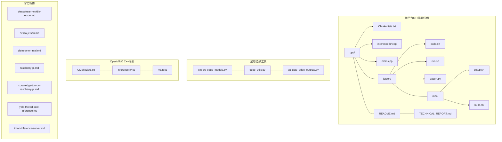
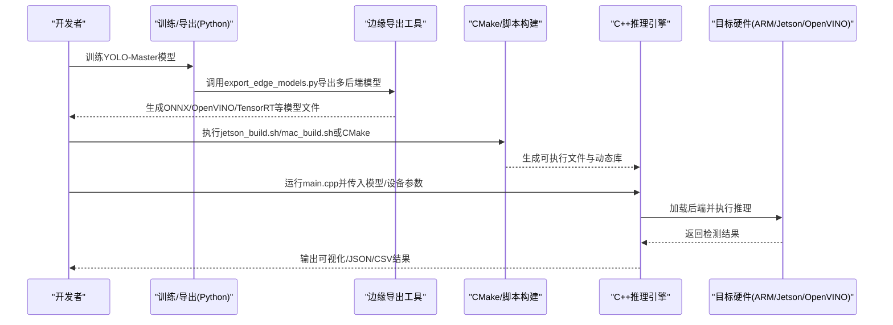
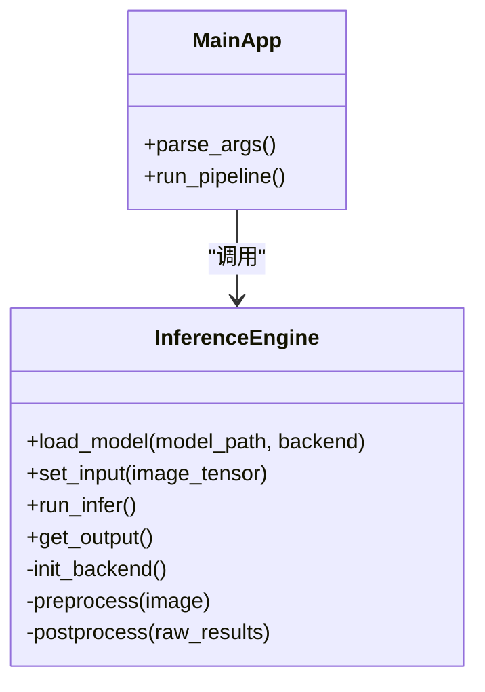
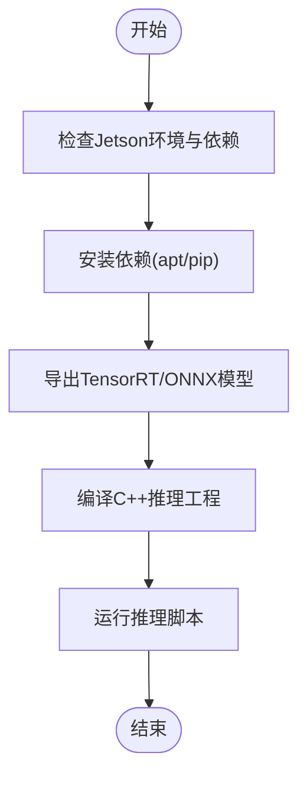
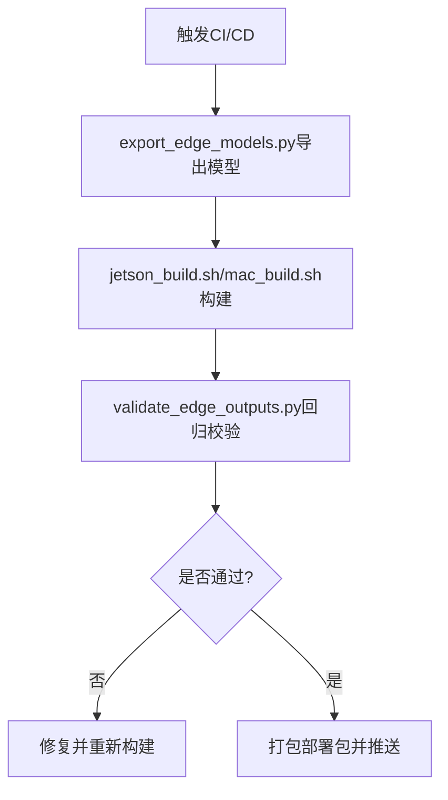

# 边缘设备部署

<cite>
**本文引用的文件**
- [README.md](file://examples/YOLO-Master-Cross-Platform-Edge-Deployment/README.md)
- [TECHNICAL_REPORT.md](file://examples/YOLO-Master-Cross-Platform-Edge-Deployment/TECHNICAL_REPORT.md)
- [CMakeLists.txt](file://examples/YOLO-Master-Cross-Platform-Edge-Deployment/cpp/CMakeLists.txt)
- [inference.h](file://examples/YOLO-Master-Cross-Platform-Edge-Deployment/cpp/inference.h)
- [inference.cpp](file://examples/YOLO-Master-Cross-Platform-Edge-Deployment/cpp/inference.cpp)
- [main.cpp](file://examples/YOLO-Master-Cross-Platform-Edge-Deployment/cpp/main.cpp)
- [jetson_build.sh](file://examples/YOLO-Master-Cross-Platform-Edge-Deployment/jetson/build.sh)
- [jetson_run.sh](file://examples/YOLO-Master-Cross-Platform-Edge-Deployment/jetson/run.sh)
- [jetson_export.py](file://examples/YOLO-Master-Cross-Platform-Edge-Deployment/jetson/export.py)
- [mac_setup.sh](file://examples/YOLO-Master-Cross-Platform-Edge-Deployment/mac/setup.sh)
- [mac_build.sh](file://examples/YOLO-Master-Cross-Platform-Edge-Deployment/mac/build.sh)
- [export_edge_models.py](file://examples/YOLO-Master-Edge-Deployment/export_edge_models.py)
- [edge_utils.py](file://examples/YOLO-Master-Edge-Deployment/edge_utils.py)
- [validate_edge_outputs.py](file://examples/YOLO-Master-Edge-Deployment/validate_edge_outputs.py)
- [CMakeLists.txt](file://examples/YOLOv8-OpenVINO-CPP-Inference/CMakeLists.txt)
- [inference.cc](file://examples/YOLOv8-OpenVINO-CPP-Inference/inference.cc)
- [inference.h](file://examples/YOLOv8-OpenVINO-CPP-Inference/inference.h)
- [main.cc](file://examples/YOLOv8-OpenVINO-CPP-Inference/main.cc)
- [deepstream-nvidia-jetson.md](file://docs/en/guides/deepstream-nvidia-jetson.md)
- [nvidia-jetson.md](file://docs/en/guides/nvidia-jetson.md)
- [dlstreamer-intel.md](file://docs/en/guides/dlstreamer-intel.md)
- [raspberry-pi.md](file://docs/en/guides/raspberry-pi.md)
- [coral-edge-tpu-on-raspberry-pi.md](file://docs/en/guides/coral-edge-tpu-on-raspberry-pi.md)
- [yolo-thread-safe-inference.md](file://docs/en/guides/yolo-thread-safe-inference.md)
- [triton-inference-server.md](file://docs/en/guides/triton-inference-server.md)
</cite>

## 目录
1. [简介](#简介)
2. [项目结构](#项目结构)
3. [核心组件](#核心组件)
4. [架构总览](#架构总览)
5. [详细组件分析](#详细组件分析)
6. [依赖与构建分析](#依赖与构建分析)
7. [性能与内存优化](#性能与内存优化)
8. [部署脚本与自动化流程](#部署脚本与自动化流程)
9. [基准测试与回归验证](#基准测试与回归验证)
10. [故障诊断与日志收集](#故障诊断与日志收集)
11. [常见问题与调试技巧](#常见问题与调试技巧)
12. [结论](#结论)

## 简介
本技术文档面向YOLO-Master在边缘设备的C++推理引擎部署，覆盖跨平台编译、依赖管理、ARM/NVIDIA Jetson/Intel OpenVINO等硬件适配方案，以及批处理、缓存策略、异步推理、资源约束调优、自动化构建与部署脚本、性能基准与回归验证、故障诊断与日志收集方法。文档以仓库中提供的示例工程与指南为依据，确保可复现与可落地。

## 项目结构
仓库中与边缘部署相关的核心内容主要分布在以下位置：
- 跨平台C++推理示例与说明：examples/YOLO-Master-Cross-Platform-Edge-Deployment
- 通用边缘导出与校验工具：examples/YOLO-Master-Edge-Deployment
- OpenVINO C++推理示例：examples/YOLOv8-OpenVINO-CPP-Inference
- 官方部署指南（Jetson、DeepStream、DLStreamer、树莓派、Edge TPU等）：docs/en/guides

图表来源
- [CMakeLists.txt](file://examples/YOLO-Master-Cross-Platform-Edge-Deployment/cpp/CMakeLists.txt)
- [inference.h](file://examples/YOLO-Master-Cross-Platform-Edge-Deployment/cpp/inference.h)
- [inference.cpp](file://examples/YOLO-Master-Cross-Platform-Edge-Deployment/cpp/inference.cpp)
- [main.cpp](file://examples/YOLO-Master-Cross-Platform-Edge-Deployment/cpp/main.cpp)
- [jetson_build.sh](file://examples/YOLO-Master-Cross-Platform-Edge-Deployment/jetson/build.sh)
- [jetson_run.sh](file://examples/YOLO-Master-Cross-Platform-Edge-Deployment/jetson/run.sh)
- [jetson_export.py](file://examples/YOLO-Master-Cross-Platform-Edge-Deployment/jetson/export.py)
- [mac_setup.sh](file://examples/YOLO-Master-Cross-Platform-Edge-Deployment/mac/setup.sh)
- [mac_build.sh](file://examples/YOLO-Master-Cross-Platform-Edge-Deployment/mac/build.sh)
- [export_edge_models.py](file://examples/YOLO-Master-Edge-Deployment/export_edge_models.py)
- [edge_utils.py](file://examples/YOLO-Master-Edge-Deployment/edge_utils.py)
- [validate_edge_outputs.py](file://examples/YOLO-Master-Edge-Deployment/validate_edge_outputs.py)
- [CMakeLists.txt](file://examples/YOLOv8-OpenVINO-CPP-Inference/CMakeLists.txt)
- [inference.cc](file://examples/YOLOv8-OpenVINO-CPP-Inference/inference.cc)
- [inference.h](file://examples/YOLOv8-OpenVINO-CPP-Inference/inference.h)
- [main.cc](file://examples/YOLOv8-OpenVINO-CPP-Inference/main.cc)

章节来源
- [README.md](file://examples/YOLO-Master-Cross-Platform-Edge-Deployment/README.md)
- [TECHNICAL_REPORT.md](file://examples/YOLO-Master-Cross-Platform-Edge-Deployment/TECHNICAL_REPORT.md)

## 核心组件
- 跨平台C++推理引擎封装
  - 提供统一的推理接口，屏蔽后端差异（ONNX Runtime/OpenVINO/TensorRT等），支持模型加载、预处理、推理、后处理与可视化输出。
  - 关键文件路径参考：[inference.h](file://examples/YOLO-Master-Cross-Platform-Edge-Deployment/cpp/inference.h)、[inference.cpp](file://examples/YOLO-Master-Cross-Platform-Edge-Deployment/cpp/inference.cpp)。
- 入口程序与参数解析
  - main.cpp负责命令行参数解析、设备选择、模型路径配置、批量与线程控制等。
  - 关键文件路径参考：[main.cpp](file://examples/YOLO-Master-Cross-Platform-Edge-Deployment/cpp/main.cpp)。
- 构建系统
  - CMakeLists.txt定义跨平台编译选项、依赖库链接、目标产物命名与安装规则。
  - 关键文件路径参考：[CMakeLists.txt](file://examples/YOLO-Master-Cross-Platform-Edge-Deployment/cpp/CMakeLists.txt)。
- Jetson专用脚本
  - build.sh/run.sh用于环境准备、依赖安装、交叉编译与运行；export.py用于生成Jetson优化的模型格式。
  - 关键文件路径参考：[jetson_build.sh](file://examples/YOLO-Master-Cross-Platform-Edge-Deployment/jetson/build.sh)、[jetson_run.sh](file://examples/YOLO-Master-Cross-Platform-Edge-Deployment/jetson/run.sh)、[jetson_export.py](file://examples/YOLO-Master-Cross-Platform-Edge-Deployment/jetson/export.py)。
- macOS专用脚本
  - setup.sh/build.sh用于Homebrew依赖安装与本地构建。
  - 关键文件路径参考：[mac_setup.sh](file://examples/YOLO-Master-Cross-Platform-Edge-Deployment/mac/setup.sh)、[mac_build.sh](file://examples/YOLO-Master-Cross-Platform-Edge-Deployment/mac/build.sh)。
- 通用边缘导出与校验工具
  - export_edge_models.py：统一导出多后端模型（ONNX/OpenVINO/TensorRT等）。
  - edge_utils.py：数据预处理/后处理、IO与路径管理等通用工具。
  - validate_edge_outputs.py：端到端结果一致性校验与回归基线对比。
  - 关键文件路径参考：[export_edge_models.py](file://examples/YOLO-Master-Edge-Deployment/export_edge_models.py)、[edge_utils.py](file://examples/YOLO-Master-Edge-Deployment/edge_utils.py)、[validate_edge_outputs.py](file://examples/YOLO-Master-Edge-Deployment/validate_edge_outputs.py)。
- OpenVINO C++推理示例
  - 提供OpenVINO后端的最小实现，便于理解IR加载、会话创建、输入输出张量绑定与性能调优。
  - 关键文件路径参考：[CMakeLists.txt](file://examples/YOLOv8-OpenVINO-CPP-Inference/CMakeLists.txt)、[inference.cc](file://examples/YOLOv8-OpenVINO-CPP-Inference/inference.cc)、[inference.h](file://examples/YOLOv8-OpenVINO-CPP-Inference/inference.h)、[main.cc](file://examples/YOLOv8-OpenVINO-CPP-Inference/main.cc)。

章节来源
- [inference.h](file://examples/YOLO-Master-Cross-Platform-Edge-Deployment/cpp/inference.h)
- [inference.cpp](file://examples/YOLO-Master-Cross-Platform-Edge-Deployment/cpp/inference.cpp)
- [main.cpp](file://examples/YOLO-Master-Cross-Platform-Edge-Deployment/cpp/main.cpp)
- [CMakeLists.txt](file://examples/YOLO-Master-Cross-Platform-Edge-Deployment/cpp/CMakeLists.txt)
- [jetson_build.sh](file://examples/YOLO-Master-Cross-Platform-Edge-Deployment/jetson/build.sh)
- [jetson_run.sh](file://examples/YOLO-Master-Cross-Platform-Edge-Deployment/jetson/run.sh)
- [jetson_export.py](file://examples/YOLO-Master-Cross-Platform-Edge-Deployment/jetson/export.py)
- [mac_setup.sh](file://examples/YOLO-Master-Cross-Platform-Edge-Deployment/mac/setup.sh)
- [mac_build.sh](file://examples/YOLO-Master-Cross-Platform-Edge-Deployment/mac/build.sh)
- [export_edge_models.py](file://examples/YOLO-Master-Edge-Deployment/export_edge_models.py)
- [edge_utils.py](file://examples/YOLO-Master-Edge-Deployment/edge_utils.py)
- [validate_edge_outputs.py](file://examples/YOLO-Master-Edge-Deployment/validate_edge_outputs.py)
- [CMakeLists.txt](file://examples/YOLOv8-OpenVINO-CPP-Inference/CMakeLists.txt)
- [inference.cc](file://examples/YOLOv8-OpenVINO-CPP-Inference/inference.cc)
- [inference.h](file://examples/YOLOv8-OpenVINO-CPP-Inference/inference.h)
- [main.cc](file://examples/YOLOv8-OpenVINO-CPP-Inference/main.cc)

## 架构总览
下图展示了从Python训练到C++边缘推理的端到端流程，包括模型导出、后端转换、构建与运行阶段。

图表来源
- [export_edge_models.py](file://examples/YOLO-Master-Edge-Deployment/export_edge_models.py)
- [jetson_build.sh](file://examples/YOLO-Master-Cross-Platform-Edge-Deployment/jetson/build.sh)
- [mac_build.sh](file://examples/YOLO-Master-Cross-Platform-Edge-Deployment/mac/build.sh)
- [CMakeLists.txt](file://examples/YOLO-Master-Cross-Platform-Edge-Deployment/cpp/CMakeLists.txt)
- [main.cpp](file://examples/YOLO-Master-Cross-Platform-Edge-Deployment/cpp/main.cpp)

## 详细组件分析

### 跨平台C++推理引擎
- 设计要点
  - 统一接口：对外暴露load_model、set_input、run_infer、get_output等方法，内部根据目标后端初始化不同运行时。
  - 预处理/后处理：图像缩放、归一化、NMS、类别映射等逻辑封装在inference模块中。
  - 错误处理：对模型加载失败、输入尺寸不匹配、后端不可用等情况进行明确报错与回退提示。
- 复杂度与性能
  - 预处理通常为O(W×H×C)，后处理受检测数量影响，NMS近似O(N^2)但可通过阈值与排序优化降低常数项。
  - 建议开启多线程并行预处理与异步推理以提升吞吐。
- 依赖关系
  - 通过CMakeLists.txt链接OpenCV、后端SDK（如OpenVINO、TensorRT）等。

图表来源
- [inference.h](file://examples/YOLO-Master-Cross-Platform-Edge-Deployment/cpp/inference.h)
- [inference.cpp](file://examples/YOLO-Master-Cross-Platform-Edge-Deployment/cpp/inference.cpp)
- [main.cpp](file://examples/YOLO-Master-Cross-Platform-Edge-Deployment/cpp/main.cpp)

章节来源
- [inference.h](file://examples/YOLO-Master-Cross-Platform-Edge-Deployment/cpp/inference.h)
- [inference.cpp](file://examples/YOLO-Master-Cross-Platform-Edge-Deployment/cpp/inference.cpp)
- [main.cpp](file://examples/YOLO-Master-Cross-Platform-Edge-Deployment/cpp/main.cpp)

### Jetson适配与部署
- 构建与运行
  - jetson_build.sh负责安装依赖、设置环境变量、编译C++工程。
  - jetson_run.sh用于启动推理服务或单帧/视频流推理。
- 模型导出
  - jetson_export.py将PyTorch权重转换为TensorRT/ONNX等适合Jetson的格式。
- 注意事项
  - 需确认CUDA/cuDNN版本与TensorRT版本兼容。
  - 针对Jetson的功耗墙与热节流，合理设置batch size与分辨率。

图表来源
- [jetson_build.sh](file://examples/YOLO-Master-Cross-Platform-Edge-Deployment/jetson/build.sh)
- [jetson_run.sh](file://examples/YOLO-Master-Cross-Platform-Edge-Deployment/jetson/run.sh)
- [jetson_export.py](file://examples/YOLO-Master-Cross-Platform-Edge-Deployment/jetson/export.py)

章节来源
- [jetson_build.sh](file://examples/YOLO-Master-Cross-Platform-Edge-Deployment/jetson/build.sh)
- [jetson_run.sh](file://examples/YOLO-Master-Cross-Platform-Edge-Deployment/jetson/run.sh)
- [jetson_export.py](file://examples/YOLO-Master-Cross-Platform-Edge-Deployment/jetson/export.py)

### macOS本地开发
- setup.sh用于安装OpenCV、CMake、编译器工具链等。
- build.sh基于CMake生成Xcode或命令行构建配置并编译。
- 适用于快速迭代与单元测试，不建议直接用于生产部署。

章节来源
- [mac_setup.sh](file://examples/YOLO-Master-Cross-Platform-Edge-Deployment/mac/setup.sh)
- [mac_build.sh](file://examples/YOLO-Master-Cross-Platform-Edge-Deployment/mac/build.sh)

### OpenVINO C++推理示例
- 特点
  - 使用OpenVINO IR模型，支持CPU/GPU/iGPU/NPU等多设备。
  - 提供最小化的推理流程，便于集成到现有C++应用。
- 适用场景
  - Intel平台、x86服务器、嵌入式Linux上的轻量部署。

章节来源
- [CMakeLists.txt](file://examples/YOLOv8-OpenVINO-CPP-Inference/CMakeLists.txt)
- [inference.cc](file://examples/YOLOv8-OpenVINO-CPP-Inference/inference.cc)
- [inference.h](file://examples/YOLOv8-OpenVINO-CPP-Inference/inference.h)
- [main.cc](file://examples/YOLOv8-OpenVINO-CPP-Inference/main.cc)

## 依赖与构建分析
- CMake构建系统
  - 通过CMakeLists.txt统一管理源文件、头文件、第三方库与后端SDK。
  - 支持条件编译（例如启用/禁用OpenVINO或TensorRT后端）。
- 平台特定脚本
  - Jetson/macOS分别提供一键安装与构建脚本，减少环境差异带来的问题。
- 依赖管理建议
  - 使用容器或虚拟环境隔离依赖。
  - 固定第三方库版本，避免上游变更导致的不兼容。

章节来源
- [CMakeLists.txt](file://examples/YOLO-Master-Cross-Platform-Edge-Deployment/cpp/CMakeLists.txt)
- [jetson_build.sh](file://examples/YOLO-Master-Cross-Platform-Edge-Deployment/jetson/build.sh)
- [mac_setup.sh](file://examples/YOLO-Master-Cross-Platform-Edge-Deployment/mac/setup.sh)

## 性能与内存优化
- 批处理
  - 在内存允许范围内增大batch size，提升吞吐；注意NMS阶段的计算开销随检测数增长而增加。
- 缓存策略
  - 缓存预处理后的中间特征图或重复使用的查找表（如类别映射、锚点信息）。
  - 对静态输入尺寸的场景，预分配张量缓冲区以减少动态分配。
- 异步推理
  - 使用OpenVINO异步API或TensorRT异步执行，结合生产者-消费者队列实现流水线并行。
- 量化与精度权衡
  - 在Jetson上使用FP16/INT8量化，在OpenVINO上尝试I/O优化与模型压缩。
- 线程安全
  - 参考线程安全推理指南，为每个工作线程维护独立的推理上下文，避免共享状态竞争。

章节来源
- [yolo-thread-safe-inference.md](file://docs/en/guides/yolo-thread-safe-inference.md)

## 部署脚本与自动化流程
- 一键构建与运行
  - Jetson：jetson_build.sh与jetson_run.sh完成环境准备、模型导出、编译与运行。
  - macOS：setup.sh与build.sh完成本地开发与测试。
- 模型导出
  - export_edge_models.py统一导出多后端模型，便于CI/CD流水线集成。
- 端到端校验
  - validate_edge_outputs.py用于对比导出前后结果的一致性，保障回归质量。

图表来源
- [export_edge_models.py](file://examples/YOLO-Master-Edge-Deployment/export_edge_models.py)
- [jetson_build.sh](file://examples/YOLO-Master-Cross-Platform-Edge-Deployment/jetson/build.sh)
- [mac_build.sh](file://examples/YOLO-Master-Cross-Platform-Edge-Deployment/mac/build.sh)
- [validate_edge_outputs.py](file://examples/YOLO-Master-Edge-Deployment/validate_edge_outputs.py)

章节来源
- [jetson_build.sh](file://examples/YOLO-Master-Cross-Platform-Edge-Deployment/jetson/build.sh)
- [jetson_run.sh](file://examples/YOLO-Master-Cross-Platform-Edge-Deployment/jetson/run.sh)
- [export_edge_models.py](file://examples/YOLO-Master-Edge-Deployment/export_edge_models.py)
- [validate_edge_outputs.py](file://examples/YOLO-Master-Edge-Deployment/validate_edge_outputs.py)

## 基准测试与回归验证
- 基准测试
  - 使用validate_edge_outputs.py在不同硬件与后端下采集延迟、吞吐与精度指标。
  - 记录输入分辨率、batch size、线程数、量化模式等元数据，形成可复现实验报告。
- 回归验证
  - 建立基线结果集，每次变更后自动对比新旧结果，超阈则阻断发布。
  - 结合CI/CD流水线，对关键用例进行自动化跑批。

章节来源
- [validate_edge_outputs.py](file://examples/YOLO-Master-Edge-Deployment/validate_edge_outputs.py)

## 故障诊断与日志收集
- 常见错误定位
  - 模型加载失败：检查模型路径、格式与后端兼容性。
  - 输入尺寸不匹配：核对预处理与模型期望尺寸一致。
  - 后端不可用：确认驱动与SDK版本匹配（如CUDA/TensorRT/OpenVINO）。
- 日志收集
  - 在inference模块中增加结构化日志（时间戳、阶段、耗时、异常堆栈）。
  - 将关键指标（FPS、延迟分布、内存占用）写入日志文件或外部监控系统。
- 调试技巧
  - 逐步关闭优化（如量化、异步）以定位瓶颈。
  - 使用最小输入样例复现问题，缩小搜索空间。

章节来源
- [inference.h](file://examples/YOLO-Master-Cross-Platform-Edge-Deployment/cpp/inference.h)
- [inference.cpp](file://examples/YOLO-Master-Cross-Platform-Edge-Deployment/cpp/inference.cpp)

## 常见问题与调试技巧
- Jetson部署
  - 参考官方指南了解DeepStream与JetPack版本要求，确保驱动与SDK对齐。
  - 若出现显存不足，降低分辨率或batch size，或启用INT8量化。
- OpenVINO部署
  - 使用IR模型并指定正确设备（CPU/GPU/iGPU/NPU），必要时调整并发与批大小。
- 树莓派与Edge TPU
  - 遵循对应指南进行TFLite/Edge TPU模型转换与部署，注意内存限制与外设驱动。
- 线程安全与并发
  - 参考线程安全推理指南，避免共享状态导致的竞态条件。
- Triton推理服务
  - 如需高并发与多模型管理，可参考Triton部署指南进行服务化改造。

章节来源
- [deepstream-nvidia-jetson.md](file://docs/en/guides/deepstream-nvidia-jetson.md)
- [nvidia-jetson.md](file://docs/en/guides/nvidia-jetson.md)
- [dlstreamer-intel.md](file://docs/en/guides/dlstreamer-intel.md)
- [raspberry-pi.md](file://docs/en/guides/raspberry-pi.md)
- [coral-edge-tpu-on-raspberry-pi.md](file://docs/en/guides/coral-edge-tpu-on-raspberry-pi.md)
- [yolo-thread-safe-inference.md](file://docs/en/guides/yolo-thread-safe-inference.md)
- [triton-inference-server.md](file://docs/en/guides/triton-inference-server.md)

## 结论
通过将Python训练与C++边缘推理解耦，配合跨平台构建脚本与统一导出工具，YOLO-Master可在ARM、Jetson与OpenVINO等多种平台上高效部署。借助批处理、缓存与异步推理等技术，可在资源受限的边缘设备上获得稳定且高性能的实时检测能力。完善的基准测试与回归验证机制，以及系统的故障诊断与日志收集策略，进一步保障了部署的可维护性与可靠性。