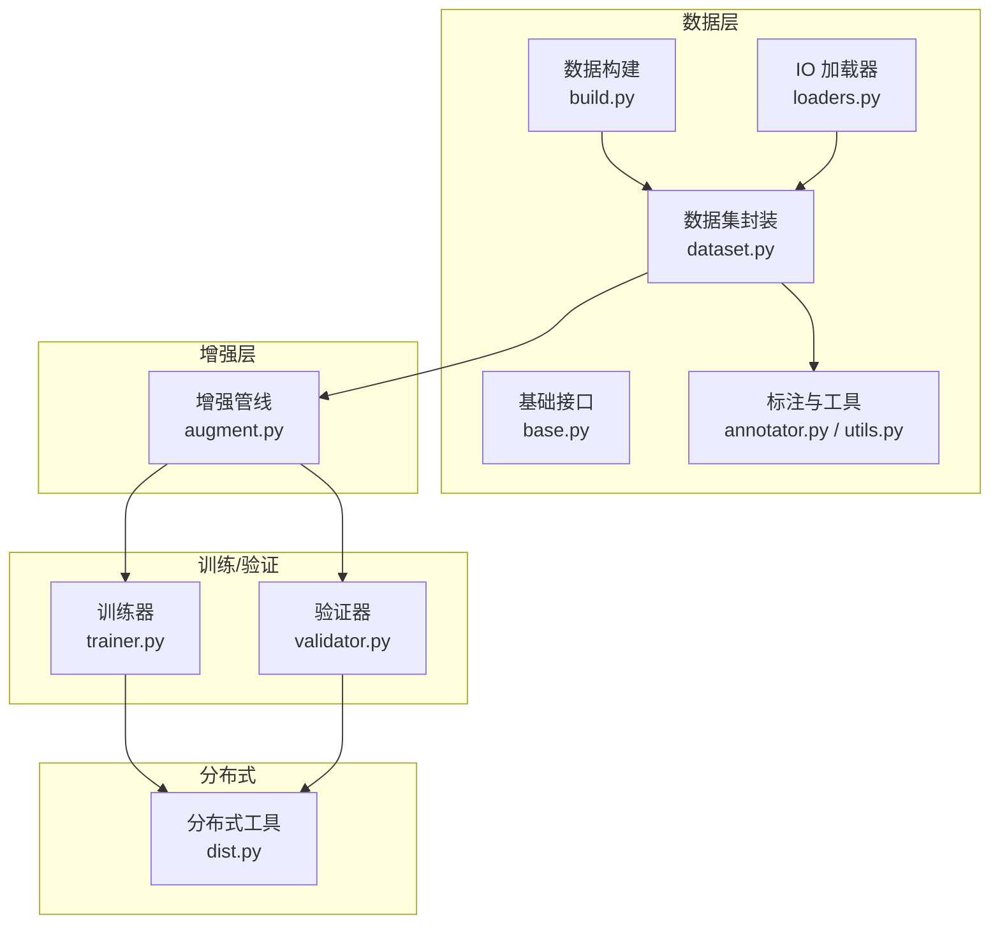
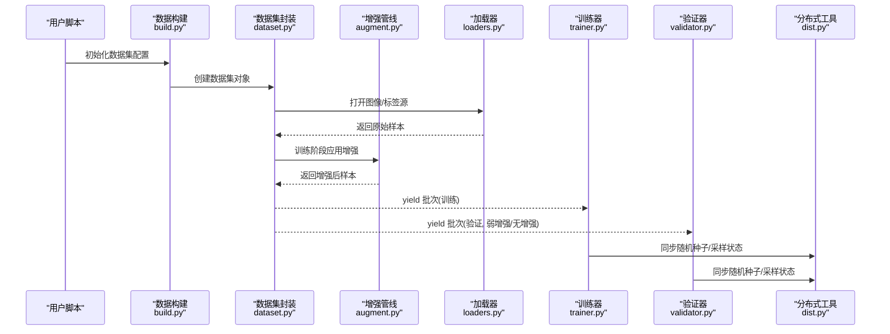
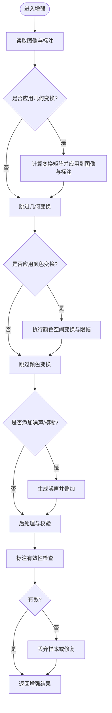
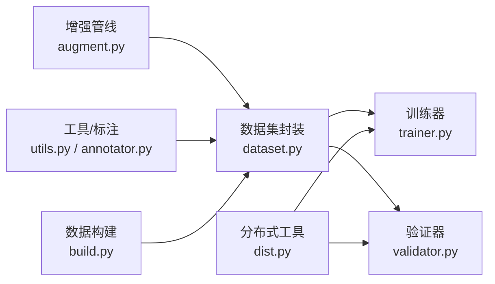

# 数据增强扩展

<cite>
**本文引用的文件**
- [ultralytics/data/augment.py](file://ultralytics/data/augment.py)
- [ultralytics/data/dataset.py](file://ultralytics/data/dataset.py)
- [ultralytics/data/build.py](file://ultralytics/data/build.py)
- [ultralytics/data/base.py](file://ultralytics/data/base.py)
- [ultralytics/data/annotator.py](file://ultralytics/data/annotator.py)
- [ultralytics/data/utils.py](file://ultralytics/data/utils.py)
- [ultralytics/data/loaders.py](file://ultralytics/data/loaders.py)
- [ultralytics/engine/trainer.py](file://ultralytics/engine/trainer.py)
- [ultralytics/engine/validator.py](file://ultralytics/engine/validator.py)
- [ultralytics/utils/dist.py](file://ultralytics/utils/dist.py)
- [scripts/coco2017.yaml](file://scripts/coco2017.yaml)
- [scripts/VOC_sub.yaml](file://scripts/VOC_sub.yaml)
- [scripts/convert_voc.py](file://scripts/convert_voc.py)
- [docs/en/guides/yolo-data-augmentation.md](file://docs/en/guides/yolo-data-augmentation.md)
</cite>

## 目录
1. [简介](#简介)
2. [项目结构](#项目结构)
3. [核心组件](#核心组件)
4. [架构总览](#架构总览)
5. [详细组件分析](#详细组件分析)
6. [依赖关系分析](#依赖关系分析)
7. [性能考虑](#性能考虑)
8. [故障排查指南](#故障排查指南)
9. [结论](#结论)
10. [附录](#附录)

## 简介
本指南面向希望扩展 YOLO 数据增强的开发者，覆盖以下目标：
- 实现新的图像增强算法（几何变换、颜色空间变换、噪声添加）
- 扩展数据管道（预处理与后处理集成）
- 批量数据处理最佳实践（训练效率）
- 数据验证与质量检查方法
- 自定义数据集格式支持（COCO、PASCAL VOC 等转换）
- 可视化与评估增强效果
- 分布式训练中的数据同步策略

## 项目结构
本项目将数据加载、增强、校验与训练/验证流程解耦，关键路径如下：
- 数据构建与流水线：负责从磁盘读取样本、应用增强、批量化与多进程加载
- 增强模块：提供几何、颜色、噪声等增强算子，并支持组合与概率控制
- 标注与工具：统一标注格式、坐标归一化、可视化工具
- 训练/验证引擎：在训练时启用增强，在验证时关闭或弱增强以保证评测一致性
- 分布式通信：在多卡环境下保证数据采样与随机种子的一致性

图表来源
- [ultralytics/data/build.py](file://ultralytics/data/build.py)
- [ultralytics/data/dataset.py](file://ultralytics/data/dataset.py)
- [ultralytics/data/base.py](file://ultralytics/data/base.py)
- [ultralytics/data/annotator.py](file://ultralytics/data/annotator.py)
- [ultralytics/data/utils.py](file://ultralytics/data/utils.py)
- [ultralytics/data/loaders.py](file://ultralytics/data/loaders.py)
- [ultralytics/data/augment.py](file://ultralytics/data/augment.py)
- [ultralytics/engine/trainer.py](file://ultralytics/engine/trainer.py)
- [ultralytics/engine/validator.py](file://ultralytics/engine/validator.py)
- [ultralytics/utils/dist.py](file://ultralytics/utils/dist.py)

章节来源
- [ultralytics/data/build.py](file://ultralytics/data/build.py)
- [ultralytics/data/dataset.py](file://ultralytics/data/dataset.py)
- [ultralytics/data/augment.py](file://ultralytics/data/augment.py)
- [ultralytics/engine/trainer.py](file://ultralytics/engine/trainer.py)
- [ultralytics/engine/validator.py](file://ultralytics/engine/validator.py)
- [ultralytics/utils/dist.py](file://ultralytics/utils/dist.py)

## 核心组件
- 数据构建与加载
  - 负责解析数据集配置、创建 DataLoader、设置多进程与缓存策略
  - 典型入口位于数据构建与数据集封装文件中
- 增强管线
  - 集中实现各类增强算子与组合逻辑，支持概率、强度、顺序控制
  - 在训练阶段被调用，在验证阶段通常禁用或降级
- 标注与工具
  - 提供统一的标注读写、坐标归一化、边界框/掩码/关键点处理
  - 提供绘图与导出工具用于可视化
- 训练/验证引擎
  - 训练器在迭代中拉取增强后的批次；验证器使用稳定输入以保障指标可比性
- 分布式工具
  - 提供进程间通信、随机种子同步、采样均衡等能力

章节来源
- [ultralytics/data/build.py](file://ultralytics/data/build.py)
- [ultralytics/data/dataset.py](file://ultralytics/data/dataset.py)
- [ultralytics/data/augment.py](file://ultralytics/data/augment.py)
- [ultralytics/data/annotator.py](file://ultralytics/data/annotator.py)
- [ultralytics/data/utils.py](file://ultralytics/data/utils.py)
- [ultralytics/engine/trainer.py](file://ultralytics/engine/trainer.py)
- [ultralytics/engine/validator.py](file://ultralytics/engine/validator.py)

## 架构总览
下图展示了从配置到训练/验证的端到端数据流，以及增强在其中的位置。

图表来源
- [ultralytics/data/build.py](file://ultralytics/data/build.py)
- [ultralytics/data/dataset.py](file://ultralytics/data/dataset.py)
- [ultralytics/data/augment.py](file://ultralytics/data/augment.py)
- [ultralytics/data/loaders.py](file://ultralytics/data/loaders.py)
- [ultralytics/engine/trainer.py](file://ultralytics/engine/trainer.py)
- [ultralytics/engine/validator.py](file://ultralytics/engine/validator.py)
- [ultralytics/utils/dist.py](file://ultralytics/utils/dist.py)

## 详细组件分析

### 增强管线设计与扩展点
- 设计要点
  - 模块化：每个增强为独立单元，可自由组合
  - 参数化：通过配置控制概率、强度、范围
  - 类型安全：对图像、边界框、掩码、关键点进行一致变换
  - 可插拔：新增增强只需注册到管线，无需改动核心
- 扩展步骤
  - 在增强模块中定义新增强类，遵循统一的输入输出契约
  - 在组合器中按概率与顺序接入
  - 在训练配置中启用该增强，并在验证配置中谨慎使用
- 建议
  - 保持计算开销可控，避免在验证阶段引入强随机性
  - 对数值稳定性敏感的操作（如色彩空间转换）需做边界保护

章节来源
- [ultralytics/data/augment.py](file://ultralytics/data/augment.py)
- [docs/en/guides/yolo-data-augmentation.md](file://docs/en/guides/yolo-data-augmentation.md)

#### 几何变换（示例：仿射、透视、裁剪、翻转）
- 关注点
  - 坐标系统：像素坐标与归一化坐标的映射
  - 边界框/掩码/关键点的一致性更新
  - 边缘填充与越界处理
- 实现建议
  - 先计算变换矩阵，再批量应用到图像与标注
  - 对极小目标进行阈值过滤，避免无效标注
  - 使用向量化操作提升吞吐

章节来源
- [ultralytics/data/augment.py](file://ultralytics/data/augment.py)
- [ultralytics/data/utils.py](file://ultralytics/data/utils.py)

#### 颜色空间变换（示例：HSV/HSL 调整、对比度/亮度/饱和度）
- 关注点
  - 通道顺序与数据类型
  - 值域截断与溢出保护
  - 与后续归一化的衔接
- 实现建议
  - 在浮点域进行变换，最后再转回 uint8
  - 对极端参数做限幅，防止过曝/欠曝

章节来源
- [ultralytics/data/augment.py](file://ultralytics/data/augment.py)
- [ultralytics/data/utils.py](file://ultralytics/data/utils.py)

#### 噪声添加（示例：高斯噪声、椒盐噪声、模糊）
- 关注点
  - 噪声强度与任务相关性（检测/分割/姿态）
  - 标注不变性与有效性
- 实现建议
  - 仅在训练阶段启用，并提供强度扫描脚本
  - 对极小目标慎用强噪声

章节来源
- [ultralytics/data/augment.py](file://ultralytics/data/augment.py)

#### 增强流程图（通用）

图表来源
- [ultralytics/data/augment.py](file://ultralytics/data/augment.py)
- [ultralytics/data/utils.py](file://ultralytics/data/utils.py)

### 数据管道扩展机制（预处理与后处理）
- 预处理
  - 解码图像、缩放、裁剪、归一化、通道重排
  - 标注解析与坐标归一化
- 后处理
  - 标注清洗、去重、无效框过滤
  - 统计信息收集（尺寸分布、类别平衡）
- 集成方式
  - 在数据集封装中插入预处理钩子
  - 在增强管线前后插入校验与日志记录
  - 在 DataLoader 层启用多进程与缓存

章节来源
- [ultralytics/data/dataset.py](file://ultralytics/data/dataset.py)
- [ultralytics/data/build.py](file://ultralytics/data/build.py)
- [ultralytics/data/loaders.py](file://ultralytics/data/loaders.py)
- [ultralytics/data/annotator.py](file://ultralytics/data/annotator.py)
- [ultralytics/data/utils.py](file://ultralytics/data/utils.py)

### 批量数据处理最佳实践
- 多进程与缓存
  - 合理设置 workers 数量，避免 IO 瓶颈
  - 开启索引缓存减少重复解析
- 内存与显存
  - 动态批大小与自动批大小策略
  - 预分配缓冲区，减少频繁分配
- 数据打乱与采样
  - 全局打乱与分层采样（类别/尺度）
  - 分布式下确保每进程独立随机序列

章节来源
- [ultralytics/data/build.py](file://ultralytics/data/build.py)
- [ultralytics/data/loaders.py](file://ultralytics/data/loaders.py)
- [ultralytics/utils/dist.py](file://ultralytics/utils/dist.py)

### 数据验证与质量检查
- 维度与类型检查
  - 图像形状、通道数、数据类型
  - 标注格式、坐标范围、类别 ID 合法性
- 一致性检查
  - 边界框面积/宽高比阈值
  - 掩码与框的对齐度
- 可视化抽检
  - 随机抽样绘制图像与标注，人工复核
- 自动化回归
  - 在 CI 中运行轻量级校验脚本

章节来源
- [ultralytics/data/annotator.py](file://ultralytics/data/annotator.py)
- [ultralytics/data/utils.py](file://ultralytics/data/utils.py)

### 自定义数据集格式支持（COCO、PASCAL VOC）
- COCO
  - 配置文件示例参考 scripts 下的 YAML
  - 字段包括 images、annotations、categories
- PASCAL VOC
  - 提供转换脚本将 VOC 转为 YOLO 格式
  - 注意类别映射与路径约定
- 转换流程
  - 解析源格式 -> 统一标注 -> 写入目标目录 -> 生成数据集 YAML

章节来源
- [scripts/coco2017.yaml](file://scripts/coco2017.yaml)
- [scripts/VOC_sub.yaml](file://scripts/VOC_sub.yaml)
- [scripts/convert_voc.py](file://scripts/convert_voc.py)

### 数据增强效果的可视化与评估
- 可视化
  - 随机抽取若干样本，绘制增强前后对比图
  - 针对边界框、掩码、关键点分别展示
- 评估
  - 离线统计：尺寸分布、类别频率、目标密度
  - 在线指标：训练收敛曲线、mAP 变化（谨慎解读，受多种因素影响）
- 工具链
  - 使用内置绘图工具或第三方库生成报告

章节来源
- [ultralytics/data/annotator.py](file://ultralytics/data/annotator.py)
- [docs/en/guides/yolo-data-augmentation.md](file://docs/en/guides/yolo-data-augmentation.md)

### 分布式训练中的数据同步策略
- 随机种子同步
  - 所有进程设置相同种子，保证可复现
- 采样均衡
  - 基于全局数据集长度划分样本区间，避免重复或缺失
- 进度与日志
  - 仅主进程写日志，其他进程静默
- 通信
  - 使用分布式工具进行必要的状态广播

章节来源
- [ultralytics/utils/dist.py](file://ultralytics/utils/dist.py)
- [ultralytics/engine/trainer.py](file://ultralytics/engine/trainer.py)
- [ultralytics/engine/validator.py](file://ultralytics/engine/validator.py)

## 依赖关系分析
- 组件耦合
  - 数据集封装依赖增强管线与标注工具
  - 训练/验证引擎依赖数据构建与分布式工具
- 外部依赖
  - 图像处理库（如 OpenCV）、张量框架（PyTorch）
- 潜在循环
  - 严格分层，避免增强模块反向依赖训练器

图表来源
- [ultralytics/data/augment.py](file://ultralytics/data/augment.py)
- [ultralytics/data/dataset.py](file://ultralytics/data/dataset.py)
- [ultralytics/data/utils.py](file://ultralytics/data/utils.py)
- [ultralytics/data/annotator.py](file://ultralytics/data/annotator.py)
- [ultralytics/data/build.py](file://ultralytics/data/build.py)
- [ultralytics/engine/trainer.py](file://ultralytics/engine/trainer.py)
- [ultralytics/engine/validator.py](file://ultralytics/engine/validator.py)
- [ultralytics/utils/dist.py](file://ultralytics/utils/dist.py)

## 性能考虑
- IO 优化
  - 多进程加载、索引缓存、预取队列
- 计算优化
  - 向量化增强、避免 Python 循环热点
  - 在 GPU 上执行部分增强（若框架支持）
- 内存管理
  - 复用缓冲区、限制缓存规模
- 批大小调优
  - 根据显存与 IO 能力选择合适批大小

[本节为通用指导，不直接分析具体文件]

## 故障排查指南
- 常见问题
  - 标注越界或为空：检查坐标归一化与裁剪逻辑
  - 颜色异常：检查通道顺序与值域截断
  - 多进程崩溃：降低 workers 或关闭缓存定位问题
  - 分布式不一致：确认种子同步与采样区间划分
- 诊断手段
  - 打印中间统计（图像尺寸、标注数量）
  - 保存失败样本与日志
  - 逐步禁用增强定位问题

章节来源
- [ultralytics/data/augment.py](file://ultralytics/data/augment.py)
- [ultralytics/data/utils.py](file://ultralytics/data/utils.py)
- [ultralytics/data/build.py](file://ultralytics/data/build.py)
- [ultralytics/utils/dist.py](file://ultralytics/utils/dist.py)

## 结论
通过模块化增强管线、严谨的数据管道与分布式策略，可在保证训练效率的同时灵活扩展新的增强算法。建议在开发过程中配合可视化与自动化校验，确保增强效果与数据质量的可控与可复现。

[本节为总结，不直接分析具体文件]

## 附录
- 快速上手
  - 参考文档中的增强指南，了解现有增强项与配置方式
- 参考配置
  - COCO 与 VOC 的配置与转换脚本位于 scripts 目录

章节来源
- [docs/en/guides/yolo-data-augmentation.md](file://docs/en/guides/yolo-data-augmentation.md)
- [scripts/coco2017.yaml](file://scripts/coco2017.yaml)
- [scripts/VOC_sub.yaml](file://scripts/VOC_sub.yaml)
- [scripts/convert_voc.py](file://scripts/convert_voc.py)